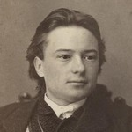

# Eugen Edmund Erbe

Brother of [Olga Caroline Erbe](olga-caroline-erbe.md) and the best-documented **public figure** in the Hermann–Emilie Erbe household: a **Baltic German jurist** who served on **Tallinn / Reval** city government and appears in **Wikipedia**, **BBLD**, and **Wikidata** under the extended form **Eugen Edmund Eduard Erbe**. He is **not** on the direct Stump descent line, but he anchors the family in **Reval civic life** and appears by name in the **[Estonian Biographical Center Stump report](../sources/estonian-biographical-center-stump-report-2005.md)** as a **law-student godparent** at Arthur Roger Stump’s **1871** baptism.

## Life

- **5 November 1847** — Born **Reval (Tallinn)** per **[BBLD](https://bbld.de/GND1173663347)** and the merged MyHeritage / Geni vitals (tree id under **Evidence**). **[German Wikipedia](https://de.wikipedia.org/wiki/Eugen_Edmund_Erbe)** once gave **17 November**; treat **5 November** as the lexicon date unless a **parish image** says otherwise.
- **Education** — **[de.wikipedia](https://de.wikipedia.org/wiki/Eugen_Edmund_Erbe)** / **BBLD**: governor’s gymnasium **Reval 1858–1866**; law **Dorpat (Tartu) 1866–1871**; **Cand. jur. 1872**.
- **Legal career (Reval)** — **BBLD** lines: **1871–73** *Manngerichts-Auskultant*; **1872–89** *Oberlandgerichts- u. Magistrats-Advokat*; **1873–78** secretary of the **Wierland–Jerwen Manngericht**; **1878–87** secretary of the **Niedergericht** and **See- und Frachtgericht**; **1880** board (**Verwaltungsglied**) of the **Revaler Handelsbank**; **1887–89** councilor (**Ratsherr**), president of the Niedergericht and See- und Frachtgericht; **1889** **Syndikus** of the city council (often glossed **city attorney** / **sündik** in Estonian sources).
- **Municipal politics** — **Stadtverordneter** **1878–1901** and again from **1905**; **Stadtrat** **1883–1906**; **stellvertretender Stadthaupt** (**deputy city head**) **1897–1901**; in **1905** temporarily carried the **Stadthaupt** functions. **[English Wikipedia](https://en.wikipedia.org/wiki/Eugen_Edmund_Eduard_Erbe)** narrows one acting-head window to **December 1905 – May 1906** (between **Erast Hiatsintov** and **Voldemar Lender**) — still secondary until matched to **council minutes** or **Reval press**.
- **Church** — **Präses** of the **St. Olai** (St. Olaf’s) church convention per **BBLD** / Wikipedia.
- **2 November 1879** — Marriage in **Reval** to **Marie von Landesen** (**BBLD**; working tree gives **Maria Agnes Elisabeth**). Her father **Carl Friedrich von Landesen** (1802–1883) was a **Tallinn city councilor** (**raehärra**) **1856–1878** per **[et.wikipedia](https://et.wikipedia.org/wiki/Carl_Friedrich_Landesen)** and **[BBLD GND1229738681](https://bbld.de/GND1229738681)**. **Marie** appears as godmother **“Mrs Marie Erbe née von Landesen”** in the **[EBC Stump report](../sources/estonian-biographical-center-stump-report-2005.md)** (Étienne’s **1880** baptism).
- **22 January 1908** — Died **Reval**; **BBLD** *Nachweise* cite **Revalsche Zeitung** / **Revaler Beobachter** **1908** Nr. **19** obituary line.

## Family

- Parents: [Hermann Eberhard Erbe](hermann-eberhard-erbe.md); [Emilie Ida Eylandt](emilie-ida-eylandt.md).
- Sister (vault page): [Olga Caroline Erbe](olga-caroline-erbe.md). Other siblings on the same parental union in the working tree until each has a register-backed page.
- Wife: **Maria Agnes Elisabeth** / **Marie** **Erbe** née **von Landesen** (**BBLD**; working tree agrees).
- Son (no vault page yet): **Eugen Karl Eberhard Erbe** (1897–1965) — **[BBLD GND1213595010](https://bbld.de/GND1213595010)** (lawyer, **Baltenregiment**, later **Heidelberg**); see [erbe-baltic-german-web-references.md](../sources/erbe-baltic-german-web-references.md).

**Europe-only context:** [Stump / Stumpf — Thurgau parishes to Tallinn and the Baltic German Erbe line](../stories/stump-thurgau-tallinn-baltic-line.md) §4.

## Evidence

- **Tree id:** **I505** — parental union **F140** — vitals, occupation, marriage, **Korporatsioon "Estonia"** / portrait note with **RA.EE Fotis** pointer.
- **Web:** [Erbe / Eylandt — Baltic German line (web references)](../sources/erbe-baltic-german-web-references.md) — [BBLD GND1173663347](https://bbld.de/GND1173663347), [German Wikipedia](https://de.wikipedia.org/wiki/Eugen_Edmund_Erbe), [English Wikipedia](https://en.wikipedia.org/wiki/Eugen_Edmund_Eduard_Erbe), [Estonian Wikipedia](https://et.wikipedia.org/wiki/Eugen_Erbe_(s%C3%BCndik)), [List of mayors of Tallinn](https://en.wikipedia.org/wiki/List_of_mayors_of_Tallinn), [Wikidata Q12362430](https://www.wikidata.org/wiki/Q12362430), [Wikimedia Commons](https://commons.wikimedia.org/wiki/Category:Eugen_Edmund_Erbe).
- **Local corpus (mirrors):** [bbld-erbe-eugen-edmund-eduard-gnd1173663347](../sources/corpus/bbld-erbe-eugen-edmund-eduard-gnd1173663347/extracted.web.md) · [de / en / et Wikipedia extracts](../sources/erbe-baltic-german-web-references.md#local-corpus-offline-mirrors) · [**Revalsche Zeitung** 23 Jan 1908 nr. 19 PDF](../sources/corpus/digar-revalsche-zeitung-1908-01-23-nr19-static/original.pdf) · **Obituary (full text):** [German transcription](../sources/corpus/digar-revalsche-zeitung-1908-01-23-nr19-static/transcription-eugen-erbe-nekrolog-1908-01-23.de.md) · [English translation](../sources/corpus/digar-revalsche-zeitung-1908-01-23-nr19-static/translation-eugen-erbe-nekrolog-1908-01-23.en.md) · [page 2 JPEG](../sources/corpus/digar-revalsche-zeitung-1908-01-23-nr19-static/pages-jpeg/page-02-of-04.jpg) · [bundle notes](../sources/corpus/digar-revalsche-zeitung-1908-01-23-nr19-static/reference.md) · [RA.EE Fotis viewer snapshot](../sources/corpus/raee-fotis-eugen-erbe-portrait-record/extracted.web.md) · [Wikidata Q12362430 digest](../sources/corpus/wikidata-eugen-erbe-q12362430/extracted.web.md) · [Wikidata entity JSON](../sources/corpus/wikidata-eugen-erbe-q12362430/entity.json).
- **Parish context (nephews/niece):** [estonian-biographical-center-stump-report-2005.md](../sources/estonian-biographical-center-stump-report-2005.md) — **Eugen Erbe** as godparent **1871**; **Marie Erbe** née **von Landesen** **1880**.

## Open questions

- **Birth register** — confirm **5 November 1847** in **Tallinn Dome** (or relevant Lutheran book) to close the **17 November** variant in some web mirrors.
- **Acting Stadthaupt** — English Wikipedia’s **Dec 1905 – May 1906** window vs other temporary assignments in **BBLD**; tie down with **Reval city council** records or **Revalsche Zeitung** / **Revaler Beobachter**.
- **Portrait** — Local copy at `media/images/portraits/eugen-edmund-erbe-portrait-c1870.png`. A public-domain version (c. 1870, anonymous photographer, sourced from tallinn.ee) is on [Wikimedia Commons](https://commons.wikimedia.org/wiki/File:Erbe.jpg). The MyHeritage note also links **RA.EE Fotis**.
