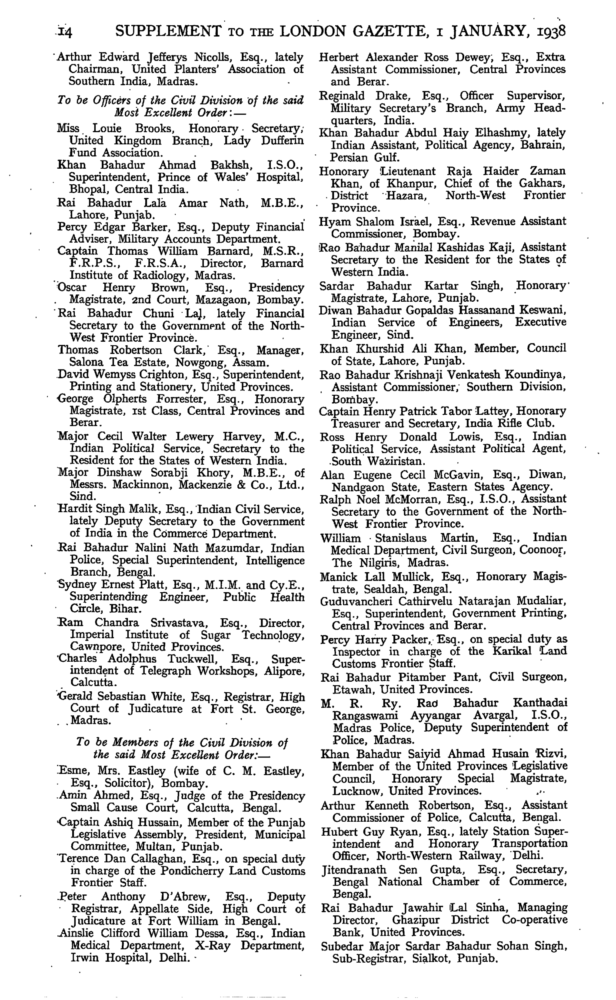

# Gerald Sebastian White

**O.B.E.; Solicitor and Registrar of the High Court of Madras** (c. 1929–1937); born **12 February 1878 at Jubbulpore** while his parents [William O'Byrne White](william-obyrne-white.md) and [Catherine Mary Roche](catherine-mary-roche.md) were stationed there with the **2nd Battalion, Royal Scots**. The family's India connection spans two generations — William's AMD career (1865–1885) through Gerald's Madras legal career — with Maureen born in Madras 1919 representing the third generation. Father of [Maureen Catherine Finbarr White](maureen-catherine-finbarr-white.md).

## Life

### Birth at Jubbulpore (1878)

Gerald was born **12 February 1878** at **Jabalpur (Jubbulpore)**, Central Provinces — christened **17 February 1878**, same place. His parents [William O'Byrne White](william-obyrne-white.md) and [Catherine Mary Roche](catherine-mary-roche.md) were **both at the station**: the birth notice reads *"Feb. 12, at Jubbulpore, **wife of** Surg.-Major W. O'Byrne White, son"* ([*Homeward Mail*, 11 March 1878](../sources/corpus/1878-homeward-mail-obyrne-white-gerald-birth-jubbulpore/transcription.md); *Cork Weekly Herald*, 16 March 1878). Catherine had married William in **Bombay in 1869** and had already borne other children at Jubbulpore (1873, 1875).

William was **regimental surgeon** to the **2nd Battalion, Royal Scots**, brigade headquarters at Jubbulpore. He had been promoted **Surgeon-Major** eleven months earlier, **31 March 1877** ([Monthly Army List, May 1877](../sources/corpus/1877-monthly-army-list-obyrne-white-surgeon-major/transcription.md)). The battalion had reached Jubbulpore **1 March 1877** ([*Regimental Records of the Royal Scots*](../sources/corpus/1878-1880-royal-scots-records-2nd-bn-afghan-detention-jubbulpore/transcription.md); [FIBIS — Jubbulpore](../sources/fibis-jubbulpore.md)). Gerald's birth was during **normal garrison posting** — eight months **before** the Viceroy ordered the Royal Scots **detained in India** (21 October 1878) when the Second Anglo-Afghan War cancelled their homeward embarkation. The family stayed in India while William served until **1885 retirement** to Tralee.

### Madras career and later life

- **March 1906** — Admitted as a **Solicitor of the High Court of Madras**, having previously been a practising Solicitor in the Supreme Court of Ireland and Manager of the firm of **Messrs. Haggard and Co., Solicitors**. [Madras Weekly Mail, 29 March 1906](../sources/corpus/1906-madras-weekly-mail-gerald-white-new-solicitor/transcription.md).
- **May 1907** — Commissioned **Second-Lieutenant, Madras Volunteer Guards**, gazetted as "Gerald Sebastian White, gentleman." [Civil & Military Gazette, 14 May 1907](../sources/corpus/1907-civil-military-gazette-gerald-white-volunteer-guards/transcription.md).
- **by 1919** — Established in **Madras**; daughter Maureen born there June 1919.
- **c. 1929–1937** — **Registrar, High Court of Madras**, under Chief Justice **Sir H.O.C. Beasley** (Chief Justice 1929–1937, knighted 1930). Listed in the printed court directory as "Registrar — G. S. White." See [sources/madras-high-court-directory.md](../sources/madras-high-court-directory.md) and [sources/wikipedia-owen-beasley.md](../sources/wikipedia-owen-beasley.md).
- **1 Jan 1938** — Appointed **Officer of the Order of the British Empire (OBE)**, Civil Division, in the New Year Honours, as "Registrar, High Court of Judicature at Fort St. George, Madras." [London Gazette supplement, 1 January 1938](../media/docs/London%20Gazette%201%20Jan%201938%20Gerald%20Sebastian%20White%20OBE%20New%20Year%20Honours.pdf); the same honour was reported in the *[Solicitors' Journal](../sources/corpus/1938-solicitors-journal-gerald-white-obe/transcription.md)*, 8 January 1938.

- **after 1947** — Returned to England; settled at 6 Sheen Gate Gardens, London SW14.
- **24 Mar 1953** — Died **Wandsworth** (civil registration district), London, aged 75. Funeral East Sheen Cemetery, SW14, 31 March 1953.

## Career

Gerald's obituary identifies him as **"Solicitor and former Registrar of the High Court of Madras."** The two roles are distinct:

- **Solicitor** — qualified in Ireland, where he was a practising Solicitor in the Supreme Court of Ireland and Manager of the firm of **Messrs. Haggard and Co., Solicitors** before emigrating. Admitted to the High Court of Madras in March 1906.
- **Madras Volunteer Guards** — commissioned Second-Lieutenant in May 1907, a territorial force for European civilians in the Presidency.
- **Registrar of the High Court** — the senior administrative law officer of the court, responsible for case management and court records, ranking directly below the judges. High-status appointment requiring legal expertise and institutional continuity. The **1938 O.B.E.** recognised that tenure; both the *London Gazette* and the *[Solicitors' Journal](../sources/corpus/1938-solicitors-journal-gerald-white-obe/transcription.md)* name him in full as **Gerald Sebastian White, Esq., Registrar, High Court of Judicature at Fort St. George, Madras**.

This represents a coherent second-generation pattern: where his father William used the meritocratic medical corps as the entry into imperial service — commission recorded in the [1865 Monthly Army List](../sources/corpus/1865-monthly-army-list-obyrne-white-commission/transcription.md), Surgeon-Major promotion in the [1877 list](../sources/corpus/1877-monthly-army-list-obyrne-white-surgeon-major/transcription.md) — Gerald used the colonial bar.

## Family

- Father: [William O'Byrne White](william-obyrne-white.md) (Lt Col AMD, Carlow/Tralee).
- Mother: [Catherine Mary Roche](catherine-mary-roche.md) (Dublin; married Bombay 1869).
- Wife: [Mary O'Shea](mary-oshea.md) (Monkstown, Cork).
- Children: [Maureen Catherine Finbarr White](maureen-catherine-finbarr-white.md) (born Madras 1919) and siblings per **F8** in the working tree.

## Evidence

### Birth and India childhood

- **Internet Archive facsimiles** — [README](../media/docs/internet-archive/obyrne-white/README.md).
- [Homeward Mail, 11 Mar 1878 — birth at Jubbulpore](../sources/corpus/1878-homeward-mail-obyrne-white-gerald-birth-jubbulpore/transcription.md) — "Feb. 12, at Jubbulpore, wife of Surg.-Major W. O'Byrne White, son"; also *Cork Weekly Herald*, 16 March 1878.
- [Monthly Army List, May 1877 — William O'Byrne White, Surgeon-Major](../sources/corpus/1877-monthly-army-list-obyrne-white-surgeon-major/transcription.md) · [scan](../media/docs/internet-archive/obyrne-white/monthly-army-list-1877-may-p1014-obyrne-white-surgeon-major.png).
- [*Regimental Records of the Royal Scots* — 2nd Bn at Jubbulpore from 1 Mar 1877](../sources/corpus/1878-1880-royal-scots-records-2nd-bn-afghan-detention-jubbulpore/transcription.md) · [source card](../sources/1878-1880-royal-scots-records-2nd-bn-afghan-detention-jubbulpore.md) · [p580](../media/docs/internet-archive/obyrne-white/records-royal-scots-2nd-bn-jubbulpore-afghan-detention-p580.png).
- [FIBIwiki — Jubbulpore station context](../sources/fibis-jubbulpore.md).
- Parents: [William O'Byrne White](william-obyrne-white.md) · [Catherine Mary Roche](catherine-mary-roche.md).

### Madras career and death

- [Madras High Court directory — Registrar G. S. White](../sources/madras-high-court-directory.md) · [scan](../media/docs/Madras%20High%20Court%20directory%20Registrar%20Gerald%20S%20White%20judiciary%20officers%20~1930s.png)
- [Obituary notices March 1953](../sources/gerald-white-obituary-1953.md) · [clipping 1](../media/docs/Gerald%20Sebastian%20White%20obituary%201953%20newspaper%20clipping%20on%20lined%20card.png) · [clipping 2](../media/docs/Gerald%20Sebastian%20White%20obituary%20notice%20March%201953%20Times%20clipping%20on%20card.jpg)
- [FamilySearch death registration Q1 1953 Wandsworth, age 75](../media/docs/FamilySearch%20Gerald%20S%20White%20death%20registration%20Q1%201953%20Wandsworth%20London%20age%2075.jpg)
- [National Probate Calendar 1953](../media/docs/National%20Probate%20Calendar%201953%20pages%20302-303%20surname%20White.png)
- [Madras Weekly Mail, 29 March 1906 — "A New Solicitor"](../sources/corpus/1906-madras-weekly-mail-gerald-white-new-solicitor/transcription.md) — admission as Solicitor of the High Court; previously with Haggard and Co., Solicitors, Ireland.
- [Civil & Military Gazette, 14 May 1907 — Madras Volunteer Guards](../sources/corpus/1907-civil-military-gazette-gerald-white-volunteer-guards/transcription.md) — gazetted Second-Lieutenant; full name "Gerald Sebastian White, gentleman."
- [London Gazette — New Year Honours 1938, O.B.E.](../sources/london-gazette-1938-white-obe.md) · [scan](../media/docs/London%20Gazette%201%20Jan%201938%20Gerald%20Sebastian%20White%20OBE%20New%20Year%20Honours.pdf) — supplement to London Gazette, issue 34469, 31 December 1937 (published 1 January 1938): "Gerald Sebastian White, Esq., Registrar, High Court of Judicature at Fort St. George, Madras" — Officer of the Civil Division of the Most Excellent Order of the British Empire.
- **Internet Archive — *Solicitors' Journal*, 8 Jan 1938** — legal-press corroboration of O.B.E.; full name and Madras Registrar title ([source](../sources/1938-solicitors-journal-gerald-white-obe.md) · [transcription](../sources/corpus/1938-solicitors-journal-gerald-white-obe/transcription.md) · [scan](../media/docs/internet-archive/obyrne-white/solicitors-journal-1938-01-08-gerald-white-obe-p19.png)).
- [White and Stump families, Geneva, c. 1953](../media/docs/White%20and%20Stump%20families%20Geneva%20c1953.jpg) — Gerald centre of the back row with May, Robert and Molly Stump, and grandchildren. Source: Charlie Ginnane photocopy via Barbara Cantwell.
- **Tree id:** **I12**
## Open questions

- Exact dates of Registrar tenure within the Beasley window (1929–1937); whether Gerald continued under successor Leach (1937–).
- Younger **White** siblings under union **F67** in the working tree — short pages when civil or army records surface.
- Law Society solicitor admission roll entry (SRA archive, London).
- Full text of the 1906 Madras Weekly Mail article (only OCR snippet available from FMP search).
- Haggard and Co. — identity and Dublin/London office of the firm where Gerald trained.
