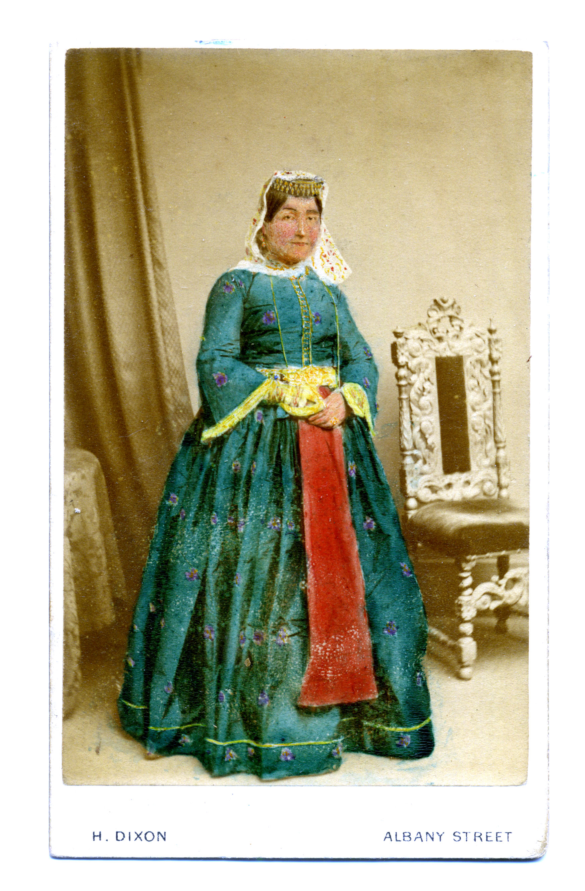
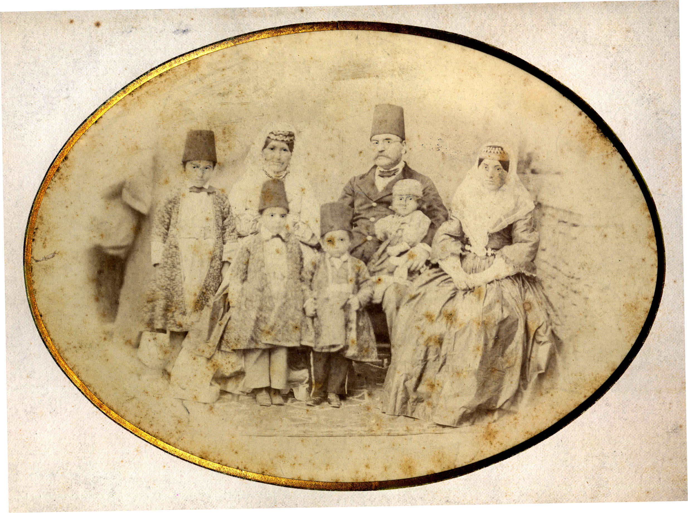
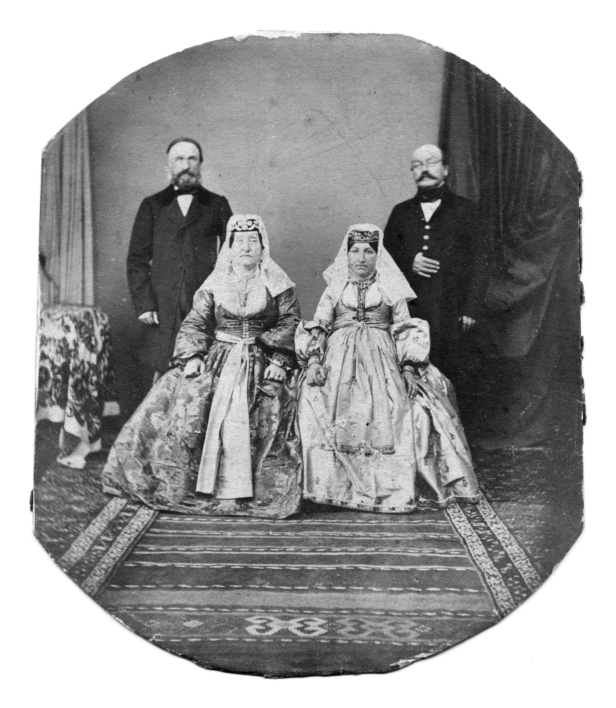
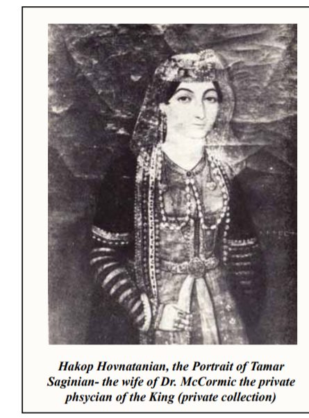

# Tamar Saginian

**Tamar Daoudian** / **Tamar DAOUDIAN** on Cormick genealogical charts — patronymic from **Daoud Khan**, same woman called **Tamara Khanum** in [Armen Saginian’s 2022 memoir](../sources/corpus/armen-saginian-2022-thank-you-america-gorgin-descendants-tamar-chapter/transcription.md) (**McCormick** spelling) and **Tamar Saginian** in portrait and interview material. **Marriage to Dr. William Cormick** (same as **William McCormick** in that memoir) and **m. 1850 Tabriz** are **firm**; **father Daoud Khan** for both her and [Anna](anna-saginian.md) follows **Anna’s 1880 testimony** and is **reinforced** by the **Daoudian** patronymic on the stored Cormick chart ([reference](../sources/corpus/cormick-family-tree-chart-william-tamar-daoudian/reference.md)).

Sister of [Anna Saginian](anna-saginian.md). She is **not** on the strict [ancestor coverage list](ancestor-coverage-list.md) but is **Tier B priority collateral**: the same **Saginian** network that produced Anna’s Burgess marriage also produced a direct tie to **Qajar court medicine** through Tamar’s marriage to [Dr. William Cormick](william-cormick.md).

## Life

- Daughter of [Daoud Khan Saginian](daoud-khan-saginian.md) per Anna’s 1880 interview and **Tamar DAOUDIAN** patronymic on the [Cormick family tree chart](../sources/corpus/cormick-family-tree-chart-william-tamar-daoudian/transcription.md). Connections BMC material names **Tamar Daoudian** in the same sense — parallel to Anna’s **Seguinoff** in the NYPL appendix; not a separate Persian *laqab*.
- **m. 1850 Tabriz** to **Dr. William Cormick** per chart transcript; marriage aligns with Uffindell / mission references elsewhere in the vault.
- Marriage to **William Cormick** places her inside the household of a **royal physician** (Mohammad Shah; then crown prince **Naser al-Din Shah**) — parallel to Anna’s diplomatic-merchant circle rather than competing with it.

Use Tamar’s branch when explaining **why two independent source types** (NYPL Burgess papers vs Cormick / Báb historiography) both orbit the **Saginian** surname.

## Family

- Father: [Daoud Khan Saginian](daoud-khan-saginian.md).
- Sister: [Anna Saginian](anna-saginian.md).
- Husband: [Dr. William Cormick](william-cormick.md).

## Portraits

- **Photograph — carte-de-visite in Armenian dress** (hand-coloured; photographer H. Dixon, Albany Street, London), captioned "Another, colorised, portrait of Tamar" on the Connections BMC family blog. A photographic likeness distinct from the Hovnatanian painting below.
 
- **Cormick–Saginian family group, c. 1867** — Tamar with her husband [Dr William Cormick](william-cormick.md) (in fez) and children.
 
- **Cormick–Saginian two couples** — William with Tamar (seated right); same gallery as William's page.
 
- **Hakop Hovnatanian, *Portrait of Tamar Saginian*** (private collection) — oil painting by the renowned Armenian court painter, reproduced in Navasargian (2012). Caption: *"the wife of Dr. McCormic the private physician of the King."* The same Navasargian volume’s **generalizing prose** (p. 173 area) wrongly names Tamar’s husband **Tovmas Tovmasean**; the **portrait captions on the facing plates** correctly name **Dr. McCormic / Cormick** — treat **Tovmasean** as authorial conflation in running text, not a second spouse. [part 2 ingest text](../sources/corpus/navasargian-2012-armenians-iran-djulfa-part2/extracted.pdf.md) (lines ~2380 vs ~2420–2424).
 

Photographs above: Connections BMC family blog (high-resolution scans) — see [media/docs/cormick-saginian/CREDITS.md](../media/docs/cormick-saginian/CREDITS.md).

## Evidence

- **Cormick family tree chart** — **William** (bold, **b. 1819 Tabriz**, **d. 1877 London**) **m. 1850 Tabriz** **Tamar DAOUDIAN** (bold, **c. 1830 Persia**, **d. 1899 London**); eleven children charted: [source card](../sources/cormick-family-tree-chart-william-tamar-daoudian.md) · [reference](../sources/corpus/cormick-family-tree-chart-william-tamar-daoudian/reference.md) · [transcription](../sources/corpus/cormick-family-tree-chart-william-tamar-daoudian/transcription.md) · [PNG facsimile](../media/docs/cormick-family-tree-chart-william-tamar-daoudian.png). **DAOUDIAN** patronymic supports **Daoud** as father — **independent** of Armen Saginian’s mistaken placement of **Tamara Khanum** under **Gorgin Khan**; **McCormick** in the memoir = **Cormick** on chart and in rest of vault.
- **Armen Saginian (2022)** — *Thank You, America & Americans* (family memoir, Xlibris): **[Gorgin descendants / Tamara Khanum spread](../sources/corpus/armen-saginian-2022-thank-you-america-gorgin-descendants-tamar-chapter/reference.md)** · [full transcription](../sources/corpus/armen-saginian-2022-thank-you-america-gorgin-descendants-tamar-chapter/transcription.md) · [facsimile PNG](../media/docs/armen-saginian-2022-thank-you-america-gorgin-descendants-tamar-spread.png). Names **Tamara Khanum** as daughter of **Gorgin Khan** and **Elizabeth Khanum**, married to **Dr. William McCormick** — **correct on the marriage**, **wrong on parentage** vs Anna 1880 and vs **Daoudian** on chart; kept as oral-history source. **Antecedent** narrative: [**Who Was My Father** spread](../sources/corpus/armen-saginian-2022-thank-you-america-who-was-my-father-chapter/reference.md). Memoir hub: [armen-saginian-2022-thank-you-america-dawood-khan-chapter.md](../sources/armen-saginian-2022-thank-you-america-dawood-khan-chapter.md).
- [Persian-language portrait / attribution research](../sources/persia-tamar-saginian-portrait-persian-research.md) — PDF + **extract:** [ingest text](../sources/corpus/persia-tamar-saginian-portrait-persian-research/extracted.pdf.md) · [memo](../research/iran-qajar/tamar-saginian-portrait-persian-research.md) — does not confirm museum attribution.
- [Cormick / Saginian interview](../sources/connectionsbmc-saginian-interview.md) — source record under `sources/corpus/connectionsbmc-saginian-interview/`.
- [Wikipedia — William Cormick](../sources/wikipedia-william-cormick.md) (orientation only; prefer PDF source record).
- [NYPL Burgess appendix — Anna interview (1880)](../sources/nypl-burgess-appendix-anna-interview.md) · [full record](../sources/corpus/nypl-burgess-appendix-anna-interview/) — Anna names Tamar directly as youngest sister and Dr. Cormick’s widow.
- [ویلیام کورمیک — ویکی‌پدیای فارسی](https://fa.wikipedia.org/wiki/%D9%88%DB%8C%D9%84%DB%8C%D8%A7%D9%85_%DA%A9%D9%88%D8%B1%D9%85%DB%8C%DA%A9) — secondary Persian-language article naming **تامار** as Cormick’s wife and as younger sister of Edward Burgess’s Armenian wife (Momen / Iranica in references).
- **Visual:** [Cormick–Saginian photograph gallery](../media/docs/cormick-saginian/) · [CREDITS](../media/docs/cormick-saginian/CREDITS.md); Henderson album [unknown couple](../media/albums/henderson/Tamar%20and%20William%20Cormick%20plus%20unknown%20couple.jpg).

## Related narrative

- [stories/saginian-burgess-bottin-stump.md](../stories/saginian-burgess-bottin-stump.md) — Tamar / Cormick subset

## Discrepancy: daughter or granddaughter of Daoud Khan?

Anna’s 1880 interview unambiguously names Tamar as her youngest **sister** — both daughters of Daoud Khan. The **Cormick family tree chart** in the vault names her **Tamar DAOUDIAN**, i.e. **patronymic Daoud** — consistent with that testimony ([chart reference](../sources/corpus/cormick-family-tree-chart-william-tamar-daoudian/reference.md)). **Armen Saginian’s 2022 memoir** places **Tamara Khanum** on **Gorgin Khan** and **Elizabeth Khanum**’s child list — verbatim in [gorgin-descendants **transcription**](../sources/corpus/armen-saginian-2022-thank-you-america-gorgin-descendants-tamar-chapter/transcription.md). That **genealogical scaffold** is **rejected** for the tree; the **marriage** line (**William McCormick** / **William Cormick**) **matches** the chart and the rest of the vault. Yaghoubian (2014) does not mention Tamar. **Working conclusion:** Tamar was **Daoud Khan’s daughter**; Armen’s chapter likely **misassigned** her generation or **confused** a **Tamara** in Gorgin’s line with Anna’s sister.

**McCormick** (memoir, Hovnatanian “McCormic”) vs **Cormick** (chart, most English sources) = **same husband**.

## Open questions

- Independent documentary mention of **Tamar** outside interview-derived genealogy (Persian or Armenian archive).
- Whether Tamar had children with Dr. Cormick (not mentioned in Anna’s interview).
- Exact death date of Dr. Cormick (he had died before March 1880).
