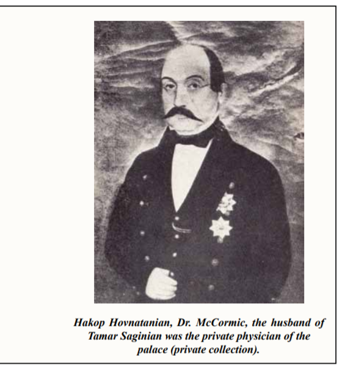

# Dr. William Cormick

Irish-Armenian physician born in **Tabriz**; **Tier B priority collateral** (not on the strict [ancestor coverage list](ancestor-coverage-list.md)) but central to **Qajar court history** and to **Bábí-era** eyewitness literature. Husband of [Tamar Saginian](tamar-saginian.md), linking the Saginian sisters to **both** diplomacy/mercantile sources (Anna → Burgess) and **royal medicine** (Tamar → Cormick).

## Life

Anna Saginian’s 1880 interview (NYPL appendix) confirms the Cormick family’s origins directly:

> “Dr. Cormick’s father came to Persia to be on the medical staff of the Shah. He married an Armenian lady, and Dr. C. was born in Tabriz.”

- Born in **Tabriz** to an **Irish father** (royal physician to the Shah) and an **Armenian mother** — making him a product of both traditions.
- **Physician to Mohammad Shah Qajar**.
- **Personal physician to Crown Prince Naser al-Din Shah** (later Shah).
- **Treated Edward Burgess** during his final illness: when Anna and Edward made the three-month journey from Tehran to Tabriz (Edward’s disease had settled in his spine and limbs), Cormick rode out eight days from Tabriz with Anna’s father and uncles to meet them, then attended Edward in Tabriz until his death six weeks later.
- **Dead by March 1880** — Anna’s interview refers to Tamar as “the widow of Dr. Cormick.”
- Role in **modernization of medicine** in Persia; proximity to **Bábí** events (treat secondary religious literature with normal source criticism).

## Family

- Wife: [Tamar Saginian](tamar-saginian.md).

## Portraits

- **Hakop Hovnatanian, *Dr. McCormic*** (private collection) — oil painting by the Armenian court painter who also painted Tamar and the Qajar royals. Caption: *"the husband of Tamar Saginian was the private physician of the palace."*
  

## Evidence

- [Cormick / Saginian interview](../sources/connectionsbmc-saginian-interview.md).
- [Wikipedia — William Cormick](../sources/wikipedia-william-cormick.md).
- PDFs (research shelf):
  - [John & William Cormick — executive summary (source landscape)](../media/publications/persia-iran/cormick-john-william-research-executive-summary.pdf) — **extract:** [corpus/cormick-john-william-research-executive-summary/extracted.pdf.md](../sources/corpus/cormick-john-william-research-executive-summary/extracted.pdf.md) · [source card](../sources/cormick-john-william-research-executive-summary.md) · [memo](../research/iran-qajar/cormick-john-william-source-landscape.md)
  - [Dr William Cormick – Connections](../media/publications/persia-iran/Dr%20William%20Cormick%20%E2%80%93%20Connections.pdf) — **extract:** [corpus/william-cormick-connections/extracted.pdf.md](../sources/corpus/william-cormick-connections/extracted.pdf.md)
  - [Dr. Cormick — The man who met the Báb – Connections](../media/publications/persia-iran/Dr.%20Cormick_%20The%20man%20who%20met%20the%20B%C3%A1b%20%E2%80%93%20Connections.pdf) — **extract:** [corpus/cormick-man-who-met-bab-connections/extracted.pdf.md](../sources/corpus/cormick-man-who-met-bab-connections/extracted.pdf.md) · [part 2 (PDF)](../media/publications/persia-iran/Dr.%20Cormick_%20The%20man%20who%20met%20the%20B%C3%A1b%20%E2%80%93%20Connections%202.pdf) — **extract:** [corpus/cormick-man-who-met-bab-connections-2/extracted.pdf.md](../sources/corpus/cormick-man-who-met-bab-connections-2/extracted.pdf.md)
  - [William Cormick.pdf](../media/publications/persia-iran/William%20Cormick.pdf) — **extract:** [corpus/william-cormick-monograph-pdf/extracted.pdf.md](../sources/corpus/william-cormick-monograph-pdf/extracted.pdf.md)
  - [Medical Times and Gazette vol 2 July–December 1878](../media/publications/persia-iran/Medical%20Times%20and%20Gazette%20vol%202%20July-December%201878%20Internet%20Archive.pdf) — **extract:** [corpus/medical-times-gazette-1878-vol2-july-december/extracted.pdf.md](../sources/corpus/medical-times-gazette-1878-vol2-july-december/extracted.pdf.md) *(ingest may still be running for very large file)*

- [NYPL Burgess appendix — Anna interview (1880)](../sources/nypl-burgess-appendix-anna-interview.md) · [corpus](../sources/corpus/nypl-burgess-appendix-anna-interview/) — Anna confirms his birth in Tabriz, father’s role as Shah’s physician, his attendance at Edward’s deathbed.
- **Group portrait (modern reproduction):** the *Connections* articles carry a figure captioned *William and Tamar and family, c. 1867* (see machine extract e.g. [part 1 bundle](../sources/corpus/cormick-man-who-met-bab-connections/extracted.pdf.md)). A loose scan in `media/images/loose/` may be the same plate: [William and Tamar and Unknown 2.jpg](../media/images/loose/William%20and%20Tamar%20and%20Unknown%202.jpg) — compare cropping and provenance before citing as unique evidence.
- [Tamar and William Cormick plus unknown couple](../media/albums/henderson/Tamar%20and%20William%20Cormick%20plus%20unknown%20couple.jpg).

## Related narrative

- [stories/saginian-burgess-bottin-stump.md](../stories/saginian-burgess-bottin-stump.md) — Tamar / Cormick subset

## Open questions

- Spot-check *Medical Times* extract once generation finishes (90 MB volume). Corpus hub: [sources/corpus/README.md](../sources/corpus/README.md). Batch re-ingest: `scripts/batch_pdf_extract.py`.
