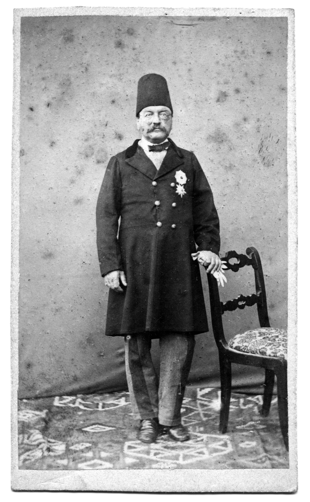
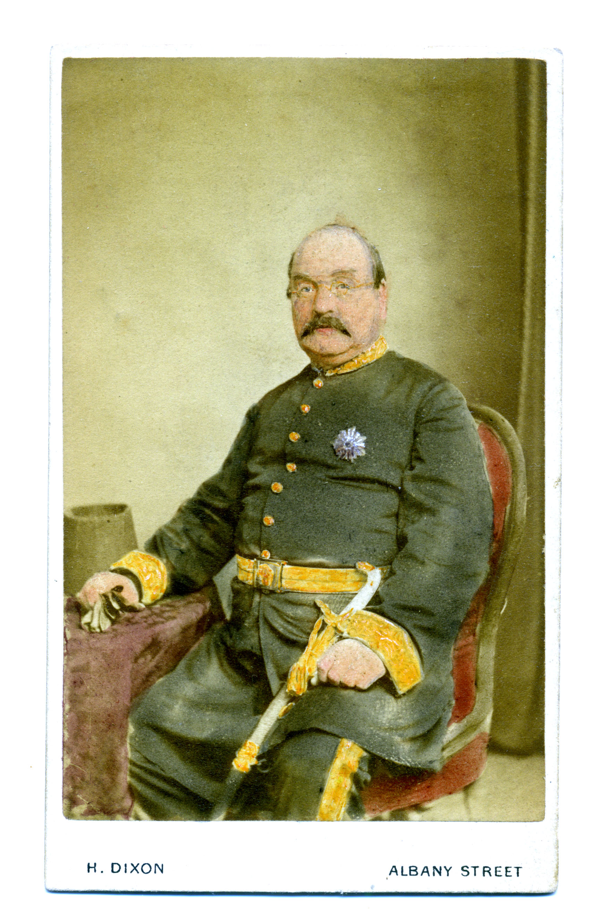
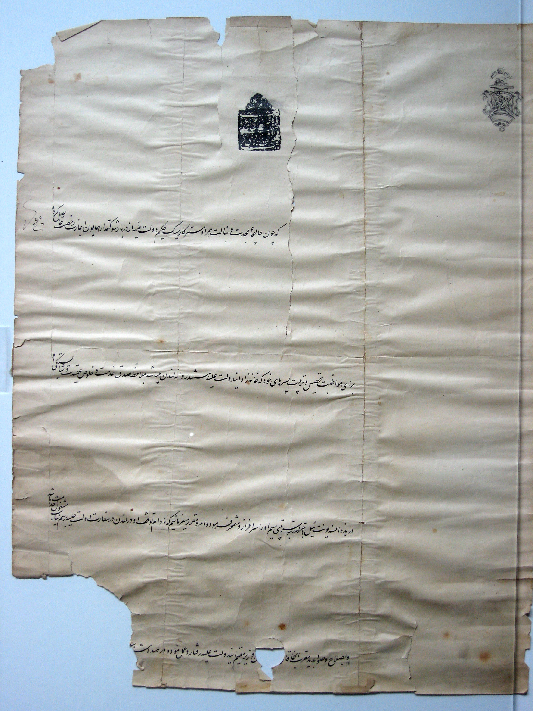
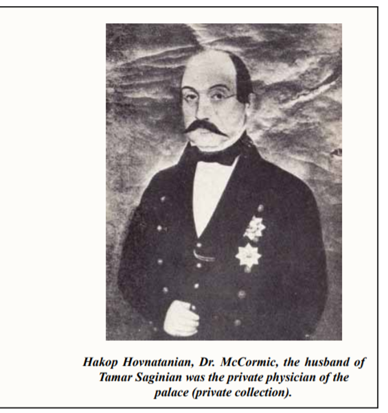

# Dr. William Cormick

Irish-Armenian physician born in **Tabriz**; **Tier B priority collateral** (not on the strict [ancestor coverage list](ancestor-coverage-list.md)) but central to **Qajar court history** and to **Bábí-era** eyewitness literature. Husband of [Tamar Saginian](tamar-saginian.md), linking the Saginian sisters to **both** diplomacy/mercantile sources (Anna → Burgess) and **royal medicine** (Tamar → Cormick).

## Life

Anna Saginian’s 1880 interview (NYPL appendix) confirms the Cormick family’s origins directly:

> “Dr. Cormick’s father came to Persia to be on the medical staff of the Shah. He married an Armenian lady, and Dr. C. was born in Tabriz.”

- Born in **Tabriz** to an **Irish father** (royal physician to the Shah) and an **Armenian mother** — making him a product of both traditions.
- **Physician to Mohammad Shah Qajar**.
- **Personal physician to Crown Prince Naser al-Din Shah** (later Shah).
- **Treated Edward Burgess** during his final illness: when Anna and Edward made the three-month journey from Tehran to Tabriz (Edward’s disease had settled in his spine and limbs), Cormick rode out eight days from Tabriz with Anna’s father and uncles to meet them, then attended Edward in Tabriz until his death six weeks later.
- **Dead by March 1880** — Anna’s interview refers to Tamar as “the widow of Dr. Cormick.”
- Role in **modernization of medicine** in Persia; proximity to **Bábí** events (treat secondary religious literature with normal source criticism).

## Family

- Wife: [Tamar Saginian](tamar-saginian.md).

## Portraits

- **Photograph (fez and royal decoration)** — the most widely reproduced likeness, traced by researcher Vincent Flannery and first published in *The Old Kilkenny Review* (1996): Cormick standing in a Persian *kolāh* with a royal decoration on his chest. High-resolution scan via the Connections BMC family blog.
 
- **Carte-de-visite, court dress** (hand-coloured; photographer H. Dixon, Albany Street, London) — captioned "Dr William Cormick" on the family blog; seated in decorated dress with sword and star.
 
- **Cormick–Saginian family group, c. 1867** — William in fez with [Tamar Saginian](tamar-saginian.md) and children.
 
- **Cormick–Saginian two couples** — William with Tamar (seated right) and two standing men; Armenian court dress. Blog caption: *"William with his wife, Tamar (at right)"*.
 
- **Royal firman** — front of the firman issued to Dr Cormick (Persian script; Connections BMC gallery).
 
- **Hakop Hovnatanian, *Dr. McCormic*** (private collection) — oil painting by the Armenian court painter who also painted Tamar and the Qajar royals. Caption: *"the husband of Tamar Saginian was the private physician of the palace."*
 

All photographs above: Connections BMC family blog; provenance and the Kensal Green / Tabriz burial discrepancy in [media/docs/cormick-saginian/CREDITS.md](../media/docs/cormick-saginian/CREDITS.md).

## Evidence

- **Cormick family tree chart** — **William** × **Tamar DAOUDIAN**, **m. 1850 Tabriz**; William **b. 1819 Tabriz** (chart) vs **1822** / `birthDateAlt` **1819-07-19** in structured tree — reconcile from primary register when possible: [source card](../sources/cormick-family-tree-chart-william-tamar-daoudian.md) · [reference](../sources/corpus/cormick-family-tree-chart-william-tamar-daoudian/reference.md) · [PNG](../media/docs/cormick-family-tree-chart-william-tamar-daoudian.png).
- [Cormick / Saginian interview](../sources/connectionsbmc-saginian-interview.md).
- [Wikipedia — William Cormick](../sources/wikipedia-william-cormick.md).
- PDFs (research shelf):
 - [John & William Cormick — executive summary (source landscape)](../media/publications/persia-iran/cormick-john-william-research-executive-summary.pdf) — **extract:** [ingest text](../sources/corpus/cormick-john-william-research-executive-summary/extracted.pdf.md) · [source card](../sources/cormick-john-william-research-executive-summary.md) · [memo](../research/iran-qajar/cormick-john-william-source-landscape.md)
 - [Dr William Cormick – Connections](../media/publications/persia-iran/Dr%20William%20Cormick%20%E2%80%93%20Connections.pdf) — **extract:** [ingest text](../sources/corpus/william-cormick-connections/extracted.pdf.md)
 - [Dr. Cormick — The man who met the Báb – Connections](../media/publications/persia-iran/Dr.%20Cormick_%20The%20man%20who%20met%20the%20B%C3%A1b%20%E2%80%93%20Connections.pdf) — **extract:** [ingest text](../sources/corpus/cormick-man-who-met-bab-connections/extracted.pdf.md) · [part 2 (PDF)](../media/publications/persia-iran/Dr.%20Cormick_%20The%20man%20who%20met%20the%20B%C3%A1b%20%E2%80%93%20Connections%202.pdf) — **extract:** [ingest text](../sources/corpus/cormick-man-who-met-bab-connections-2/extracted.pdf.md)
 - [William Cormick.pdf](../media/publications/persia-iran/William%20Cormick.pdf) — **extract:** [ingest text](../sources/corpus/william-cormick-monograph-pdf/extracted.pdf.md)
 - [Medical Times and Gazette vol 2 July–December 1878](../media/publications/persia-iran/Medical%20Times%20and%20Gazette%20vol%202%20July-December%201878%20Internet%20Archive.pdf) — **extract:** [ingest text](../sources/corpus/medical-times-gazette-1878-vol2-july-december/extracted.pdf.md)

- **Vicky Uffindell**, *The Cormick family in Persia*, vol. 2 (British Library photocopy excerpts; machine OCR via ingest — treat as provisional): [Tabriz — marriage, consular & Burgess context](../sources/corpus/uffindell-cormick-persia-v2-family-friends-1850s/reference.md) · [Eastwick, cemetery, epidemics](../sources/corpus/uffindell-cormick-persia-v2-epidemics-tabriz-eastwick/reference.md) · [London — death & estate 1877–78](../sources/corpus/uffindell-cormick-persia-v2-london-life-william/reference.md) · [son George — medical education](../sources/corpus/uffindell-cormick-persia-v2-george-medical-education/reference.md). Scholarship hub: [persia-modern-scholarship-corpus-cluster.md](../sources/persia-modern-scholarship-corpus-cluster.md).

- [NYPL Burgess appendix — Anna interview (1880)](../sources/nypl-burgess-appendix-anna-interview.md) · [full record](../sources/corpus/nypl-burgess-appendix-anna-interview/) — Anna confirms his birth in Tabriz, father's role as Shah's physician, his attendance at Edward's deathbed.
- **Photograph gallery (high-resolution):** [media/docs/cormick-saginian/](../media/docs/cormick-saginian/) · [CREDITS](../media/docs/cormick-saginian/CREDITS.md) — Connections BMC blog extracts (`manmet1`–`manmet7`).
- [Tamar and William Cormick plus unknown couple](../media/albums/henderson/Tamar%20and%20William%20Cormick%20plus%20unknown%20couple.jpg) — Henderson album scan; compare with [two-couples group](../media/docs/cormick-saginian/william-cormick-tamar-saginian-two-couples-group.jpg).
- [Unidentified elderly woman](../media/docs/cormick-saginian/cormick-saginian-elderly-woman-unidentified.jpg) — Connections BMC gallery (`manmet7`); sitter not named in blog captions; may be a Cormick–Saginian relation.

### British Newspaper Archive (FindMyPast)

- [British Press, 27 September 1810 — "Mission to Persia"](../sources/corpus/1810-british-press-mission-to-persia-cormick/transcription.md) — "Mr. Cormick, Surgeon to the Caroni" listed among the personnel of the British diplomatic mission to Persia. This is **John Cormick**, William's father, and the earliest press evidence of the family's arrival in Persia.
- [Morning Post, 13 November 1848 — "The New Shah of Persia"](../sources/corpus/1848-morning-post-new-shah-persia-cormick-tabriz/transcription.md) — London reprint of intelligence from Tabriz: Nasir al-Din Shah appoints **Dr. Cormick** as **King's Physician at Tehran**, alongside Burgess (dragoman), Consolani, and others — formal named office in the British press. [Page scan](../media/docs/1848-morning-post-new-shah-persia-burgess-dragoman.png).
- [Globe, 13 October 1875 — "The Shah of Persia's Physician"](../sources/corpus/1875-globe-william-cormick-shah-physician/transcription.md) — "The Queen has granted unto William Cormick, Esq., doctor in medicine, who is actually employed beyond her Majesty's dominions, in the medical service of His Majesty the Shah of Persia, her Royal licence and permission to accept and wear the Insignia of the …" Confirms he was still in the Shah's medical service in 1875 (London Gazette notice, excerpted by the *Globe*); independent of family oral history in Anna Saginian's 1880 interview.

## Related narrative

- [stories/saginian-burgess-bottin-stump.md](../stories/saginian-burgess-bottin-stump.md) — Tamar / Cormick subset
