# DAZD HR-DAZD-342 — Addobbati family fonds — Croatian transcription + English

Human-facing **Croatian transcription** (from print and from [page PNGs](pages/)) with **English translation**, kept in this corpus bundle next to the machine extract.

| Asset | Path |
|-------|------|
| Canonical PDF | [original.pdf](original.pdf) |
| Page images (PNG, 2× render) | [page-01](pages/page-01.png) · [page-02](pages/page-02.png) · [page-03](pages/page-03.png) · [page-04](pages/page-04.png) · [page-05](pages/page-05.png) · [page-06](pages/page-06.png) · [page-07](pages/page-07.png) · [page-08](pages/page-08.png) · [page-09](pages/page-09.png) · [page-10](pages/page-10.png) · [page-11](pages/page-11.png) · [page-12](pages/page-12.png) · [page-13](pages/page-13.png) · [page-14](pages/page-14.png) · [page-15](pages/page-15.png) · [page-16](pages/page-16.png) |
| Machine extract (OCR) | [extracted.pdf.md](extracted.pdf.md) |
| Provenance | [source.yaml](source.yaml) |
| Citation card | [dazd-addobbati-family-fonds.md](../../dazd-addobbati-family-fonds.md) |

**Note.** The typewritten inventory is **Croatian**. **Documents inside the fond** are mostly **Italian**, some **Latin**, one **French** (noted per item). Spelling of the surname varies in the sources (*Addobbati*, *Addobati*, *Adobbati*, *Adobati*); this translation keeps the archivist’s editorial form **Addobbati** unless quoting a specific document.

---

## Page 1

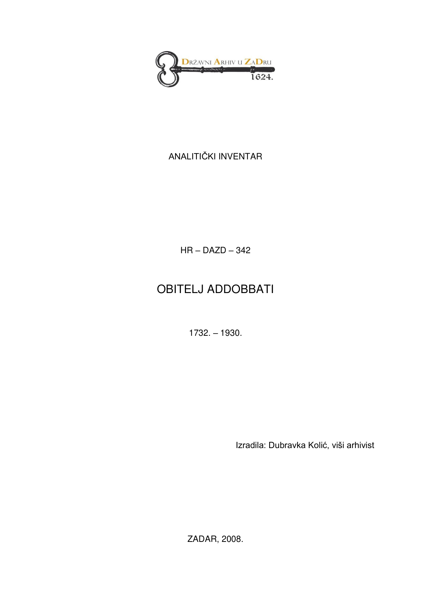

### Croatian (transcription)

**ANALITIČKI INVENTAR**  
**HR – DAZD – 342**

## OBITELJ ADDOBBATI

1732. – 1930.

Izradila: Dubravka Kolić, viši arhivist

ZADAR, 2008.

### English

**ANALYTICAL INVENTORY**  
**HR – DAZD – 342**

## THE ADDOBBATI FAMILY

1732 – 1930.

Compiled by: Dubravka Kolić, senior archivist

ZADAR, 2008.

---

## Page 2

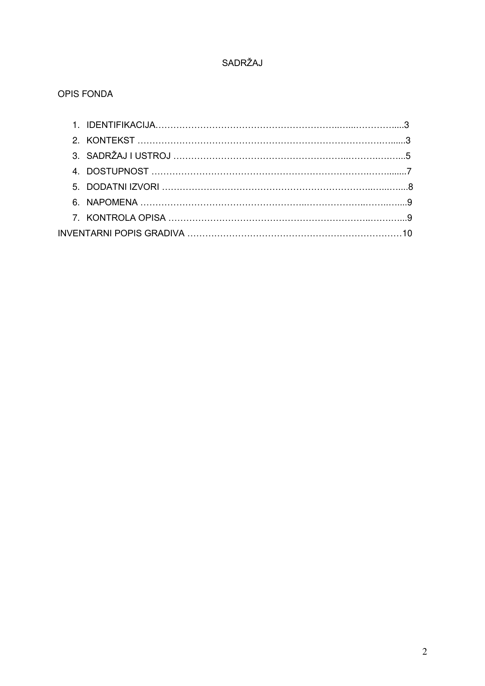

### Croatian (transcription)

## SADRŽAJ

**OPIS FONDA**

1. IDENTIFIKACIJA … 3  
2. KONTEKST … 3  
3. SADRŽAJ I USTROJ … 5  
4. DOSTUPNOST … 7  
5. DODATNI IZVORI … 8  
6. NAPOMENA … 9  
7. KONTROLA OPISA … 9  
**INVENTARNI POPIS GRADIVA** … 10  

### English

## CONTENTS

**DESCRIPTION OF THE FONDS**

1. IDENTIFICATION … 3  
2. CONTEXT … 3  
3. CONTENTS AND STRUCTURE … 5  
4. ACCESS … 7  
5. ADDITIONAL SOURCES … 8  
6. NOTE … 9  
7. DESCRIPTION CONTROL … 9  
**INVENTORY LIST OF MATERIAL** … 10  

---

## Page 3

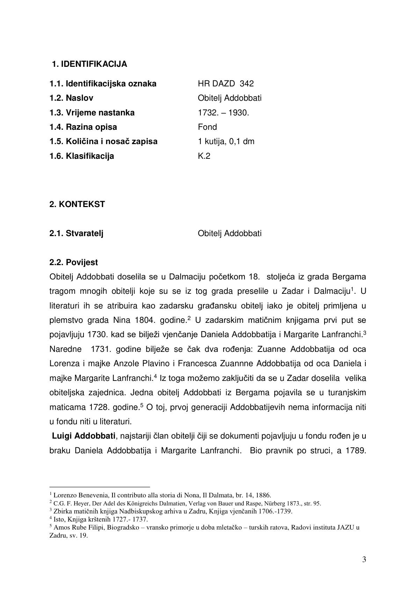

### Croatian (transcription)

## **1. IDENTIFIKACIJA**

- **1.1. Identifikacijska oznaka** — HR DAZD 342  
- **1.2. Naslov** — Obitelj Addobbati  
- **1.3. Vrijeme nastanka** — 1732. – 1930.  
- **1.4. Razina opisa** — Fond  
- **1.5. Količina i nosač zapisa** — 1 kutija, 0,1 dm *(as printed on the title page; finding aids also cite ~10 cm / 0,1 lm)*  
- **1.6. Klasifikacija** — K.2  

## **2. KONTEKST**

### **2.1. Stvaratelj**

## Obitelj Addobbati

### **2.2. Povijest**

Obitelj Addobbati doselila se u Dalmaciju početkom 18. stoljeća iz grada Bergama tragom mnogih obitelji koje su se iz tog grada preselile u Zadar i Dalmaciju.[1] U literaturi ih se atribuira kao zadarsku građansku obitelj iako je obitelj primljena u plemstvo grada Nina 1804. godine.[2] U zadarskim matičnim knjigama prvi put se pojavljuju 1730. kad se bilježi vjenčanje Daniela Addobbatija i Margarite Lanfranchi.[3] Naredne 1731. godine bilježe se čak dva rođenja: Zuanne Addobbatija od oca Lorenza i majke Anzole Plavino i Francesca Zuannne Addobbatija od oca Daniela i majke Margarite Lanfranchi.[4] Iz toga možemo zaključiti da se u Zadar doselila velika obiteljska zajednica. Jedna obitelj Addobbati iz Bergama pojavila se u turanjskim maticama 1728. godine.[5] O toj, prvoj generaciji Addobbatijevih nema informacija niti u fondu niti u literaturi.

**Luigi Addobbati**, najstariji član obitelji čiji se dokumenti pojavljuju u fondu rođen je u braku Daniela Addobbatija i Margarite Lanfranchi. Bio pravnik po struci, a 1789.

> 1 Lorenzo Benevenia, Il contributo alla storia di Nona, Il Dalmata, br. 14, 1886.  
> 2 C.G. F. Heyer, Der Adel des Königreichs Dalmatien, Verlag von Bauer und Raspe, Nürnberg 1873., str. 95.  
> 3 Zbirka matičnih knjiga Nadbiskupskog arhiva u Zadru, Knjiga vjenčanih 1706.–1739.  
> 4 Isto, Knjiga krštenih 1727.–1737.  
> 5 Amos Rube Filipi, Biogradsko–vransko primorje u doba mletačko–turskih ratova, Radovi instituta JAZU u Zadru, sv. 19.

### English

## **1. IDENTIFICATION**

- **1.1. Identifier** — HR DAZD 342  
- **1.2. Title** — Addobbati family  
- **1.3. Date range** — 1732 – 1930  
- **1.4. Level of description** — Fonds  
- **1.5. Extent and medium** — 1 box, 0.1 dm *(printed measurement; same finding aid elsewhere states ~10 cm / 0.1 linear metre shelf)*  
- **1.6. Classification** — K.2  

## **2. CONTEXT**

### **2.1. Creator**

## Addobbati family

### **2.2. History**

The Addobbati family moved to Dalmatia at the beginning of the 18th century from the city of Bergamo, following many families from that city who relocated to Zadar and Dalmatia.[1] In the literature they are described as a Zadar burgher family, although the family was admitted to the nobility of the town of Nin in 1804.[2] They first appear in Zadar parish registers in 1730, when the marriage of Daniele Addobbati and Margherita Lanfranchi is recorded.[3] In the following year, 1731, two births are registered: Zuanni Addobbati, son of Lorenzo and Anzola Plavino, and Francesca Zuanni Addobbati, daughter of Daniele and Margherita Lanfranchi.[4] We may conclude that a large family group settled in Zadar. One Addobbati family from Bergamo appears in the registers of Turanj in 1728.[5] There is no information on that first generation of Addobbati either in the fonds or in the literature.

**Luigi Addobbati**, the oldest family member whose documents appear in the fonds, was born to Daniele Addobbati and Margherita Lanfranchi. He was a lawyer by profession, and in 1789…

*(Footnotes as in Croatian.)*

---

## Page 4

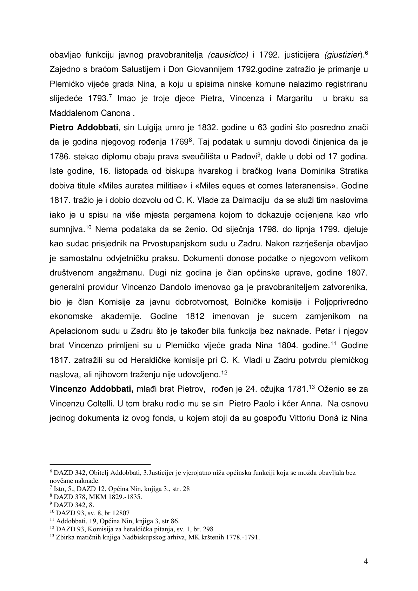

### Croatian (transcription)

… obavljao funkciju javnog pravobranitelja (*causidico*) i 1792. justicijera (*giustizier*).[6] Zajedno s braćom Salustijem i Don Giovannijem 1792. godine zatražio je primanje u Plemićko vijeće grada Nina, a koju u spisima ninske komune nalazimo registriranu slijedeće 1793.[7] Imao je troje djece: Pietra, Vincenza i Margaritu u braku s Maddalenom Canona.

**Pietro Addobbati**, sin Luigija, umro je 1832. godine u 63 godini što posredno znači da je godina njegovog rođenja 1769.[8] Taj podatak u sumnju dovodi činjenica da je 1786. stekao diplomu obaju prava sveučilišta u Padovi,[9] dakle u dobi od 17 godina. Iste godine, 16. listopada, od biskupa hvarskog i bračkog Ivana Dominika Stratika dobiva titule «Miles auratea militiae» i «Miles eques et comes lateranensis». Godine 1817. tražio je i dobio dozvolu od C. K. Vlade za Dalmaciju da se služi tim naslovima iako je u spisu na više mjesta pergament kojim to dokazuje ocijenjen kao vrlo sumnjiv.[10] Nema podataka da se ženio. Od siječnja 1798. do lipnja 1799. djeluje kao sudac prisjednik na Prvostupanjskom sudu u Zadru. Nakon razrješenja obavljao je samostalnu odvjetničku praksu. Dokumenti donose podatke o njegovom velikom društvenom angažmanu. Dugi niz godina član je općinske uprave; godine 1807. generalni providur Vincenzo Dandolo imenovao ga je pravobraniteljem zatvorenika; bio je član Komisije za javnu dobrotvornost, Bolničke komisije i Poljoprivredno-ekonomske akademije. Godine 1812. imenovan je sucem zamjenikom na Apelacionom sudu u Zadru što je također bila funkcija bez naknade. Petar i njegov brat Vincenzo primljeni su u Plemićko vijeće grada Nina 1804. godine.[11] Godine 1817. zatražili su od Heraldičke komisije pri C. K. Vladi u Zadru potvrdu plemićkog naslova, ali njihovom traženju nije udovoljeno.[12]

**Vincenzo Addobbati**, mlađi brat Pietrov, rođen je 24. ožujka 1781.[13] Oženio se za Vincenzu Coltelli. U tom braku rodio mu se sin Pietro Paolo i kći Anna. Na osnovu jednog dokumenta iz ovog fonda, u kojem stoji da su gospođu Vittoriu Donà iz Nina

> 6 DAZD 342, Obitelj Addobbati, 3. Justicijer je vjerojatno niža općinska funkcija koja se možda obavljala bez novčane naknade.  
> 7 Isto, 5.; DAZD 12, Općina Nin, knjiga 3., str. 28  
> 8 DAZD 378, MKM 1829.–1835.  
> 9 DAZD 342, 8.  
> 10 DAZD 93, sv. 8, br. 12807  
> 11 Addobbati, 19; Općina Nin, knjiga 3, str. 86.  
> 12 DAZD 93, Komisija za heraldička pitanja, sv. 1, br. 298  
> 13 Zbirka matičnih knjiga Nadbiskupskog arhiva, MK krštenih 1778.–1791.

### English

… he held the office of public advocate (*causidico*) and in 1792 that of *giustiziere*.[6] Together with his brothers Salustio and Don Giovanni, in 1792 he requested admission to the Noble Council of Nin; we find this recorded in the commune’s files the following year, 1793.[7] He had three children—Pietro, Vincenzo and Margherita—with Maddalena Canona.

**Pietro Addobbati**, Luigi’s son, died in 1832 at age 63, which implies a birth year of 1769.[8] That date is cast in doubt by his obtaining a degree *in utroque iure* from the University of Padua in 1786,[9] i.e. at age 17. The same year, on 16 October, Bishop Ivan Dominik Stratico of Hvar and Brač granted him the titles as worded on the diploma—«**Miles auratea militiae**» and «**Miles eques et comes lateranensis**» (the first phrase follows the printed inventory’s Latin spelling). In 1817 he sought and received permission from the I. R. Government for Dalmatia to use those titles, although the parchment proving this was in several places in the file judged highly dubious.[10] There is no evidence of marriage. From January 1798 to June 1799 he served as *assessore* (lay associate judge) at the Court of First Instance in Zadar. After his discharge he practised law independently. The documents attest to wide civic involvement. For many years he was a member of the municipal government; in 1807 Provveditore Generale Vincenzo Dandolo appointed him *difensore dei carcerati* (“advocate for prisoners”); he belonged to the Commission for Public Charity, the Hospital Commission, and the agricultural-economic academy. In 1812 he was appointed unpaid deputy judge at the Court of Appeal in Zadar. Pietro and his brother Vincenzo were admitted to the Noble Council of Nin in 1804.[11] In 1817 they petitioned the Heraldic Commission of the I. R. Government in Zadar for confirmation of noble title; the request was not granted.[12]

**Vincenzo Addobbati**, Pietro’s younger brother, was born on 24 March 1781.[13] He married Vincenza Coltelli; they had a son Pietro Paolo and a daughter Anna. From a document in this fonds stating that the brothers Pietro and Vincenzo Addobbati represented Donna Vittoria Donà of Nin…

---

## Page 5

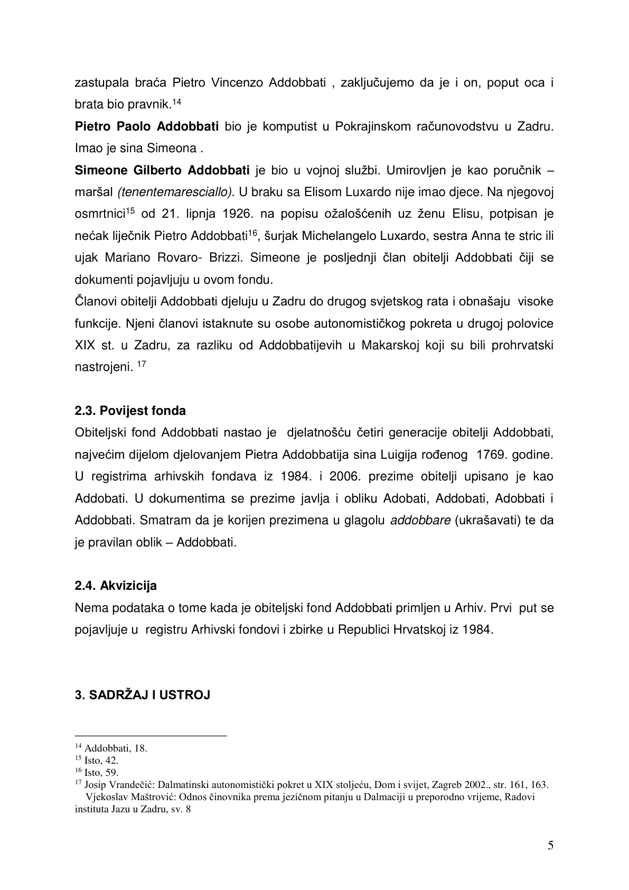

### Croatian (transcription)

zastupala braća Pietro i Vincenzo Addobbati, zaključujemo da je i on, poput oca i brata, bio pravnik.[14]

**Pietro Paolo Addobbati** bio je komputist u Pokrajinskom računovodstvu u Zadru. Imao je sina Simeona.

**Simeone Gilberto Addobbati** bio je u vojnoj službi. Umirovljen je kao poručnik–maršal (*tenente maresciallo*). U braku s Elisom Luxardo nije imao djece. Na njegovoj osmrtnici[15] od 21. lipnja 1926. na popisu ožalošćenih uz ženu Elisu potpisan je nećak, liječnik Pietro Addobbati,[16] šurjak Michelangelo Luxardo, sestra Anna te stric ili ujak Mariano Rovaro-Brizzi. Simeone je posljednji član obitelji Addobbati čiji se dokumenti pojavljuju u ovom fondu.

Članovi obitelji Addobbati djeluju u Zadru do drugog svjetskog rata i obnašaju visoke funkcije. Njeni članovi istaknute su osobe autonomističkog pokreta u drugoj polovici XIX st. u Zadru, za razliku od Addobbatijevih u Makarskoj koji su bili prohrvatski nastrojeni.[17]

### **2.3. Povijest fonda**

Obiteljski fond Addobbati nastao je djelatnošću četiri generacije obitelji Addobbati, najvećim dijelom djelovanjem Pietra Addobbatija, sina Luigija rođenog 1769. godine. U registrima arhivskih fondova iz 1984. i 2006. prezime obitelji upisano je kao Addobati. U dokumentima se prezime javlja i u obliku Adobati, Addobati, Adobbati i Addobbati. Smatram da je korijen prezimena u glagolu *addobbare* (ukrašavati) te da je pravilan oblik – Addobbati.

### **2.4. Akvizicija**

Nema podataka o tome kada je obiteljski fond Addobbati primljen u Arhiv. Prvi put se pojavljuje u *Registru arhivskih fondova i zbirki u Republici Hrvatskoj* iz 1984.

### **3. SADRŽAJ I USTROJ**

> 14 Addobbati, 18.  
> 15 Isto, 42.  
> 16 Isto, 59.  
> 17 Josip Vrandečić: Dalmatinski autonomistički pokret u XIX stoljeću, Dom i svijet, Zagreb 2002., str. 161, 163. Vjekoslav Maštrović: Odnos činovnika prema jezičnom pitanju u Dalmaciji u preporodno vrijeme, Radovi instituta JAZU u Zadru, sv. 8

### English

… we conclude that he too, like his father and brother, was a lawyer.[14]

**Pietro Paolo Addobbati** was a clerk (*computista*) in the provincial accounts office in Zadar. He had a son Simeone.

**Simeone Gilberto Addobbati** served in the military. He retired with the rank of lieutenant–field marshal (*tenente maresciallo*). His marriage to Elisa Luxardo produced no children. On his obituary notice[15] of 21 June 1926, the mourners listed beside his wife Elisa include his nephew, Dr Pietro Addobbati,[16] brother-in-law Michelangelo Luxardo, sister Anna, and uncle Mariano Rovaro-Brizzi. Simeone is the last member of the Addobbati family whose documents appear in this fonds.

Members of the Addobbati family remained active in Zadar until the Second World War, holding high office. They were prominent figures in the Dalmatian autonomist movement in Zadar in the second half of the 19th century, unlike the Addobbati of Makarska, who favoured a pro-Croat orientation.[17]

### **2.3. History of the fonds**

The Addobbati family fonds was formed through the activity of four generations of the family, chiefly through Pietro Addobbati, son of Luigi, born 1769. In the registers of archival fonds from 1984 and 2006 the surname is entered as *Addobati*. In the documents it also appears as *Adobati*, *Addobati*, *Adobbati* and *Addobbati*. The compiler considers the root of the surname to lie in the verb *addobbare* (“to adorn”) and that the correct form is **Addobbati**.

### **2.4. Acquisition**

There is no information on when the Addobbati family fonds was received by the Archive. It first appears in the *Register of archival fonds and collections in the Republic of Croatia* (1984).

### **3. CONTENTS AND STRUCTURE**

*(Footnotes as in Croatian.)*

---

## Page 6

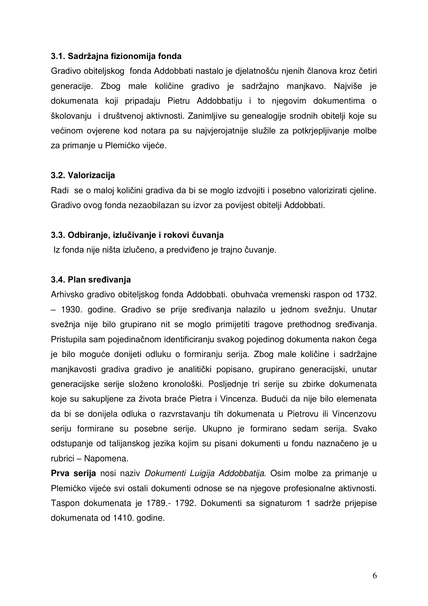

### Croatian (transcription)

## **3.1. Sadržajna fizionomija fonda**

Gradivo obiteljskog fonda Addobbati nastalo je djelatnošću njenih članova kroz četiri generacije. Zbog male količine gradivo je sadržajno manjkavo. Najviše je dokumenata koji pripadaju Pietru Addobbatiju i to njegovim dokumentima o školovanju i društvenoj aktivnosti. Zanimljive su genealogije srodnih obitelji koje su većinom ovjerene kod notara pa su najvjerojatnije služile za potkrjepljivanje molbe za primanje u Plemićko vijeće.

## **3.2. Valorizacija**

Radi se o maloj količini gradiva da bi se moglo izdvojiti i posebno valorizirati cjeline. Gradivo ovog fonda nezaobilazan je izvor za povijest obitelji Addobbati.

## **3.3. Odbiranje, izlučivanje i rokovi čuvanja**

Iz fonda nije ništa izlučeno, a predviđeno je trajno čuvanje.

## **3.4. Plan sređivanja**

Arhivsko gradivo obiteljskog fonda Addobbati obuhvaća vremenski raspon od 1732. – 1930. godine. Gradivo se prije sređivanja nalazilo u jednom svežnju. Unutar svežnja nije bilo grupirano niti se moglo primijetiti tragove prethodnog sređivanja. Pristupila sam pojedinačnom identificiranju svakog pojedinog dokumenta nakon čega je bilo moguće donijeti odluku o formiranju serija. Zbog male količine i sadržajne manjkavosti gradiva gradivo je analitički popisano, grupirano generacijski, unutar generacijske serije složeno kronološki. Posljednje tri serije su zbirke dokumenata koje su sakupljene za života braće Pietra i Vincenza. Budući da nije bilo elemenata da bi se donijela odluka o razvrstavanju tih dokumenata u Pietrovu ili Vincenzovu seriju, formirane su posebne serije. Ukupno je formirano sedam serija. Svako odstupanje od talijanskog jezika kojim su pisani dokumenti u fondu naznačeno je u rubrici – Napomena.

**Prva serija** nosi naziv *Dokumenti Luigija Addobbatija*. Osim molbe za primanje u Plemićko vijeće svi ostali dokumenti odnose se na njegove profesionalne aktivnosti. Raspon dokumenata je 1789.–1792. Dokumenti sa signaturom 1 sadrže prijepise dokumenata od 1410. godine.

### English

## **3.1. Content profile**

The material of the Addobbati family fonds was produced by family members over four generations. Given the small quantity, the content is thin. Most documents belong to Pietro Addobbati—especially on his education and public activity. The genealogies of related families, mostly authenticated before a notary, are noteworthy; they most likely supported the petition for admission to the Noble Council.

## **3.2. Appraisal**

The quantity is too small to isolate and appraise separate archival complexes separately. The material is nevertheless an essential source for the history of the Addobbati family.

## **3.3. Selection, disposal and retention**

Nothing has been weeded from the fonds; retention is permanent.

## **3.4. Arrangement plan**

The records span 1732–1930. Before arrangement they stood in a single bundle. There was no prior grouping or sign of earlier arrangement. Each item was identified individually, after which series could be formed. Because of the modest quantity and sparse content, the material was described analytically, grouped by generation, and within each generational series ordered chronologically. The last three series are collections of documents gathered during the lives of brothers Pietro and Vincenzo. Lacking grounds to assign those documents to Pietro’s or Vincenzo’s series, separate series were created. Seven series were formed in all. Any departure from Italian—the language of most documents—is noted in the *Napomena* (Note) field.

**Series I** is entitled *Documents of Luigi Addobbati*. Apart from the petition to the Noble Council, all items concern his professional activity. Date span 1789–1792. Item **sig. 1** includes copies of documents from 1410.

---

## Page 7

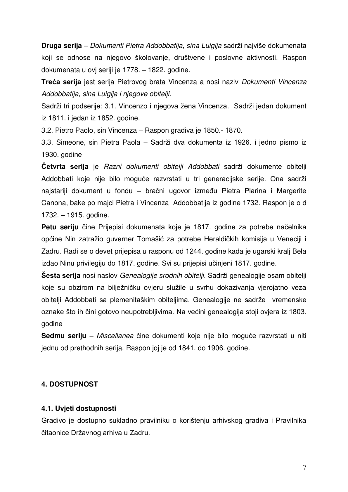

### Croatian (transcription)

**Druga serija** — *Dokumenti Pietra Addobbatija, sina Luigija* — sadrži najviše dokumenata koji se odnose na njegovo školovanje, društvene i poslovne aktivnosti. Raspon dokumenata u **ovj** seriji je 1778.–1822. *(typo in print for **ovoj**)* 

**Treća serija** jest serija Pietrovog brata Vincenza **a** nosi naziv *Dokumenti Vincenza Addobbatija, sina Luigija i njegove obitelji*.

Sadrži tri podserije:  
**3.1.** Vincenzo i njegova žena Vincenza — jedan dokument iz 1811. i jedan iz 1852.  
**3.2.** Pietro Paolo, sin Vincenza — raspon 1850.–1870.  
**3.3.** Simeone, sin Pietra Paola — dva dokumenta iz 1926. i jedno pismo iz 1930.

**Četvrta serija** je *Razni dokumenti obitelji Addobbati* sadrži dokumente obitelji Addobbati koje nije bilo moguće razvrstati u tri generacijske serije. Ona sadrži najstariji dokument u fondu – bračni ugovor između Pietra Plarina i Margerite Canona, bake po majci Pietra i Vincenza Addobbatija iz godine 1732. Raspon je **o d** 1732. – 1915. *(printed syntax/spacing as in inventory; **o d** for **od**)* 

**Petu seriju** čine prijepisi dokumenata koje je 1817. godine za potrebe načelnika općine Nin zatražio guverner Tomašić za potrebe Heraldičkih komisija u Veneciji i Zadru. Radi se o devet prijepisa u rasponu od 1244. godine, kada je ugarski kralj Bela izdao Ninu privilegiju, do 1817. Svi su prijepisi učinjeni 1817.

**Šesta serija** nosi naslov *Genealogije srodnih obitelji*. Sadrži genealogije osam obitelji koje su obzirom na bilježničku ovjeru služile u svrhu dokazivanja vjerojatno veza obitelji Addobbati sa plemenitaškim obiteljima. Genealogije ne sadrže vremenske oznake što ih čini gotovo neupotrebljivima. Na većini genealogija stoji ovjera iz 1803. godine.

**Sedmu seriju** — *Miscellanea* — čine dokumenti koje nije bilo moguće razvrstati ni u jednu od prethodnih serija. Raspon joj je od 1841. do 1906.

## **4. DOSTUPNOST**

### **4.1. Uvjeti dostupnosti**

Gradivo je dostupno sukladno pravilniku o korištenju arhivskog gradiva i Pravilnika čitaonice Državnog arhiva u Zadru.

### English

**Series II** — *Documents of Pietro Addobbati, son of Luigi* — holds the largest set of items on his schooling, public and professional life. Span 1778–1822.

**Series III** belongs to Pietro’s brother Vincenzo: *Documents of Vincenzo Addobbati, son of Luigi, and his family*.  
Subseries: **3.1** Vincenzo and his wife Vincenza — one document from 1811, one from 1852. **3.2** Pietro Paolo, Vincenzo’s son — 1850–1870. **3.3** Simeone, Pietro Paolo’s son — two documents from 1926 and one letter from 1930.

**Series IV** — *Various documents of the Addobbati family* — items that could not be placed in the three generational series. It contains the oldest item in the fonds: the marriage contract between Pietro Plarino and Margherita Canona, maternal grandmother of Pietro and Vincenzo Addobbati (1732). Span 1732–1915. *(The printed Croatian omits a comma or relative pronoun between **je** and the series title—left as in the inventory on p. 7.)*

**Series V** consists of copies of documents requested in 1817 by the mayor of Nin from Governor Tomassich for the Heraldic Commissions in Venice and Zadar—nine copies from 1244 (Bela IV’s privilege to Nin) through 1817, all made in 1817.

**Series VI** — *Genealogies of related families* — eight family genealogies, notarially authenticated, probably to prove links to noble houses. They lack dates, which limits their use. Most bear a 1803 authentication.

**Series VII** — *Miscellanea* — documents not assignable to earlier series. Span 1841–1906.

## **4. ACCESS**

### **4.1. Conditions of access**

Material is available in accordance with the regulation on use of archival holdings **and** the State Archive in Zadar reading-room regulation *(Croatian: **pravilniku** … **i Pravilnika čitaonice** …)*.

---

## Page 8

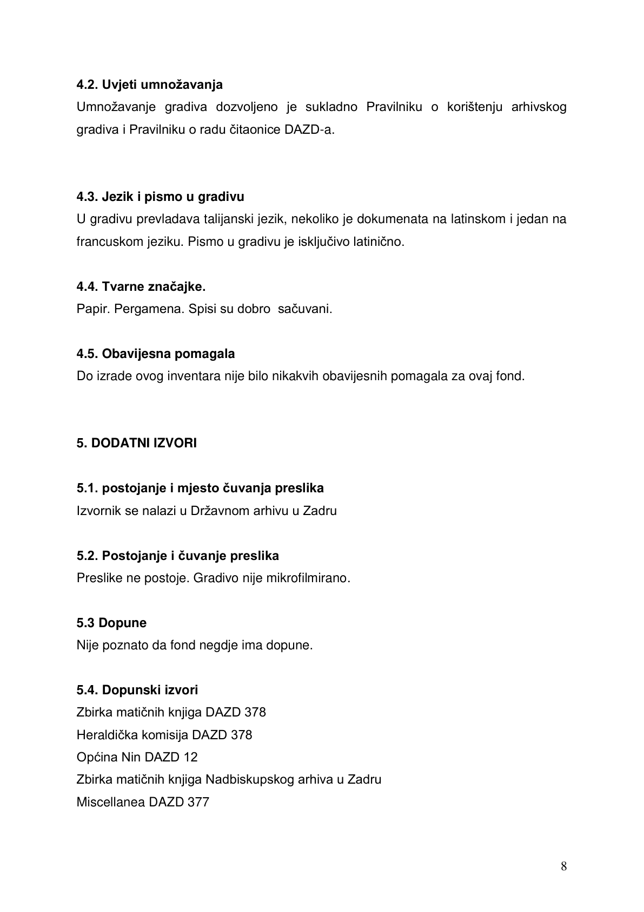

### Croatian (transcription)

## **4.2. Uvjeti umnožavanja**

Umnožavanje gradiva dozvoljeno je sukladno Pravilniku o korištenju arhivskog gradiva i Pravilniku o radu čitaonice DAZD-a.

## **4.3. Jezik i pismo u gradivu**

U gradivu prevladava talijanski jezik, nekoliko je dokumenata na latinskom i jedan na francuskom jeziku. Pismo u gradivu je isključivo latinično.

## **4.4. Tvarne značajke**

Papir. Pergament. Spisi su dobro sačuvani.

## **4.5. Obavijesna pomagala**

Do izrade ovog inventara nije bilo nikakvih obavijesnih pomagala za ovaj fond.

## **5. DODATNI IZVORI**

### **5.1. postojanje i mjesto čuvanja preslika**

Izvornik se nalazi u Državnom arhivu u Zadru.

*(Printed rubric says **preslika**; the sentence correctly refers to the **original** in Zadar.)*

### **5.2. Postojanje i čuvanje preslika**

Preslike ne postoje. Gradivo nije mikrofilmirano.

### **5.3. Dopune**

Nije poznato da fond negdje ima dopune.

### **5.4. Dopunski izvori**

- Zbirka matičnih knjiga DAZD 378  
- Heraldička komisija DAZD 378  
- Općina Nin DAZD 12  
- Zbirka matičnih knjiga Nadbiskupskog arhiva u Zadru  
- Miscellanea DAZD 377  

### English

## **4.2. Reproduction**

Copying is permitted under the Regulation on use of archival holdings and the DAZD Reading Room Regulation.

## **4.3. Language and script**

Italian predominates; several documents are in Latin and one in French. Script is Latin only.

## **4.4. Physical characteristics**

Paper and parchment. The files are well preserved.

## **4.5. Finding aids**

No finding aids existed for this fonds before this inventory.

## **5. ADDITIONAL SOURCES**

### **5.1. Existence and place of custody *(heading as printed)***

The rubric reads *postojanje i mjesto čuvanja preslika* (“copies”), but the text states the **original** is held at the State Archive in Zadar.

### **5.2. Copies**

No copies are known. The material has not been microfilmed.

### **5.3. Accruals**

No accruals are known.

### **5.4. Related sources**

Parish registers collection DAZD 378; Heraldic Commission DAZD 378; Commune of Nin DAZD 12; parish registers of the Archbishopric Archive, Zadar; Miscellanea DAZD 377.

---

## Page 9

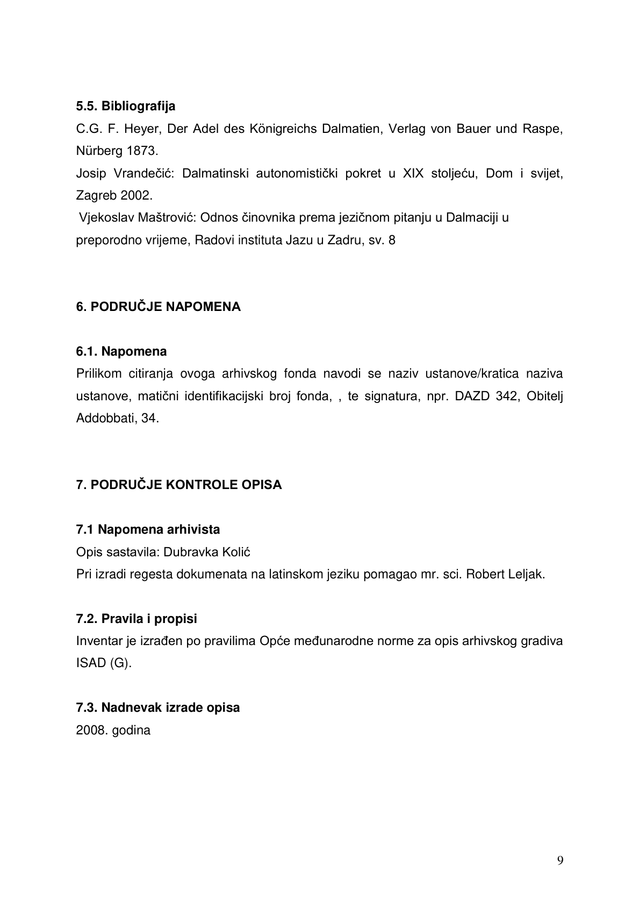

### Croatian (transcription)

## **5.5. Bibliografija**

C.G. F. Heyer, Der Adel des Königreichs Dalmatien, Verlag von Bauer und Raspe, Nürnberg 1873.  

Josip Vrandečić: Dalmatinski autonomistički pokret u XIX stoljeću, Dom i svijet, Zagreb 2002.  

Vjekoslav Maštrović: Odnos činovnika prema jezičnom pitanju u Dalmaciji u preporodno vrijeme, Radovi instituta Jazu u Zadru, sv. 8  

## **6. PODRUČJE NAPOMENA**

### **6.1. Napomena**

Prilikom citiranja ovoga arhivskog fonda navodi se naziv ustanove/kratica naziva ustanove, matični identifikacijski broj fonda, , te signatura, npr. DAZD 342, Obitelj Addobbati, 34.

## **7. PODRUČJE KONTROLE OPISA**

### **7.1. Napomena arhivista**

Opis sastavila: Dubravka Kolić  

Pri izradi regesta dokumenata na latinskom jeziku pomagao mr. sci. Robert Leljak.

### **7.2. Pravila i propisi**

Inventar je izrađen po pravilima Opće međunarodne norme za opis arhivskog gradiva ISAD (G).

### **7.3. Nadnevak izrade opisa**

2008. godina

### English

## **5.5. Bibliography**

*(Titles as in Croatian; *Nürnberg* for Nuremberg.)*

## **6. NOTES AREA**

### **6.1. Note**

When citing this fonds, the inventory asks for repository (or abbreviation), fonds ID, and signature; the typescript places a double comma after the ID (*…broj fonda, , te signatura…*). Example: **DAZD 342, Obitelj Addobbati, 34**.

## **7. DESCRIPTION CONTROL**

### **7.1. Archivist’s note**

Description compiled by Dubravka Kolić.  

Mr. sci. Robert Leljak assisted with regesta for Latin documents.

### **7.2. Rules**

Inventory prepared according to ISAD (G).

### **7.3. Date of description**

2008.

---

## Page 10 — Inventory (part 1)

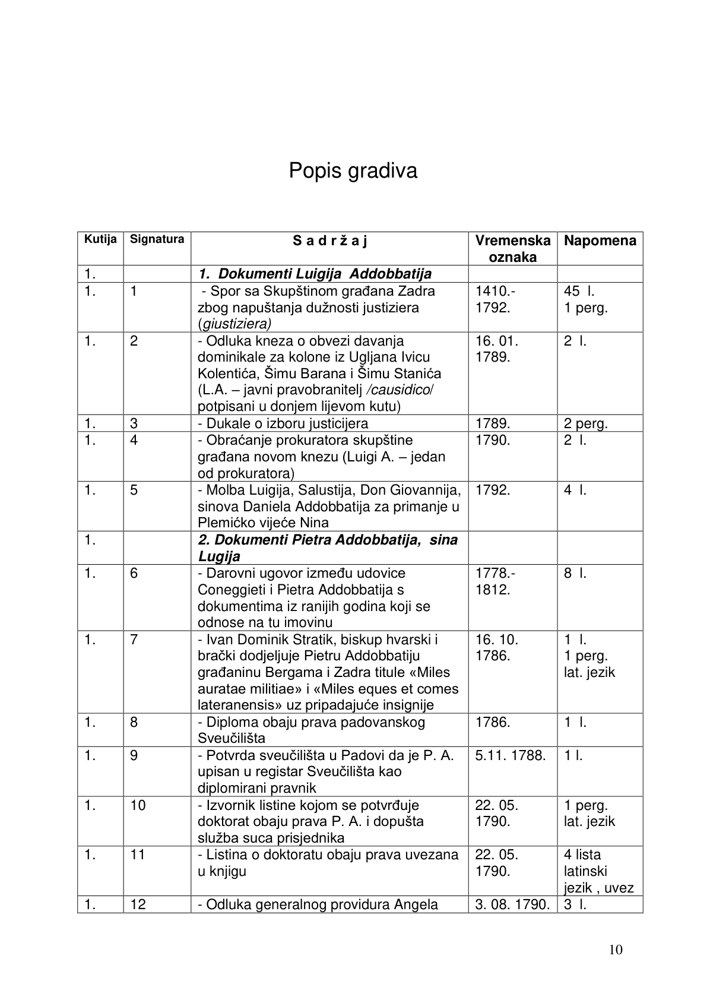

### Popis gradiva *(printed table heading)*

### Bilingual inventory table

| Box | Sig. | Content (Croatian) | Content (English) | Dates | Note |
|-----|------|--------------------|-------------------|--------|------|
| 1 | — | **1. Dokumenti Luigija Addobbatija** | **1. Documents of Luigi Addobbati** | — | — |
| 1 | 1 | Spor sa Skupštinom građana Zadra zbog napuštanja dužnosti justiziera (*giustiziera*) | Dispute with the Zadar citizen assembly over abandoning the office of *justizier* / *giustiziere* | 1410–1792 | 45 ll.; 1 parch. |
| 1 | 2 | Odluka kneza o obvezi davanja dominikale za kolone iz Ugljana: Ivicu Kolentića, Šimu Barana i Šimu Stanića (L.A. — javni pravobranitelj / *causidico* — potpisan u donjem lijevom kutu) | Prince’s decision on the obligation to pay *dominicale* for crews from Ugljan: Ivica Kolentić, Šimun Baran and Šimun Stanić (L.A. as public advocate, signed lower left) | 16 Jan 1789 | 2 ll. |
| 1 | 3 | *Dukale* o izboru justicijera | *Dukale* (Doge’s decrees) on election of the *justizier* | 1789 | 2 parch. |
| 1 | 4 | Obraćanje prokuratora skupštine građana novom knezu (Luigi A. — jedan od prokuratora) | Address of the citizens’ assembly procurators to the new prince (Luigi A. among the procurators) | 1790 | 2 ll. |
| 1 | 5 | Molba Luigija, Salustija, Don Giovannija, sinova Daniela Addobbatija za primanje u Plemićko vijeće Nina | Petition of Luigi, Salustio and Don Giovanni, sons of Daniele Addobbati, for admission to the Noble Council of Nin | 1792 | 4 ll. |
| 1 | — | **2. Dokumenti Pietra Addobbatija, sina Lugija** | **2. Documents of Pietro Addobbati, son of Luigi** *(printed **Lugija**)* | — | — |
| 1 | 6 | Darovni ugovor između udovice **Coneggietti** i Pietra Addobbatija s dokumentima iz ranijih godina koji se odnose na tu imovinu | Deed of gift between widow Coneggietti and Pietro Addobbati with earlier papers relating to that property | 1778–1812 | 8 ll. |
| 1 | 7 | Ivan Dominik Stratik, biskup hvarski i brački, dodjeljuje Pietru Addobbatiju građaninu Bergama i Zadra titule «Miles auratae militiae» i «Miles eques et comes lateranensis» uz pripadajuće insignije | Ivan Dominik Stratico, bishop of Hvar and Brač, awards Pietro Addobbati, citizen of Bergamo and Zadar, the titles «Miles auratae militiae» and «Miles eques et comes lateranensis» with insignia | 16 Oct 1786 | 1 l.; 1 parch.; Latin |
| 1 | 8 | Diploma obaju prava padovanskog Sveučilišta | Degree *in utroque iure*, University of Padua | 1786 | 1 l. |
| 1 | 9 | Potvrda Sveučilišta u Padovi da je P.A. upisan u registar kao diplomirani pravnik | Padua University certificate that P.A. is entered in the register as a graduate in law | 5 Nov 1788 | 1 l. |
| 1 | 10 | Izvornik listine kojom se potvrđuje doktorat obaju prava P.A. i dopušta služba suca prisjednika | Original patent confirming P.A.’s doctorate in both laws and permitting service as *assessore* | 22 May 1790 | 1 parch.; Latin |
| 1 | 11 | Listina o doktoratu obaju prava uvezana u knjigu | Patent on doctorate in both laws bound into a book | 22 May 1790 | 4 leaves; Latin, bound |

---

## Page 11 — Inventory (part 2)

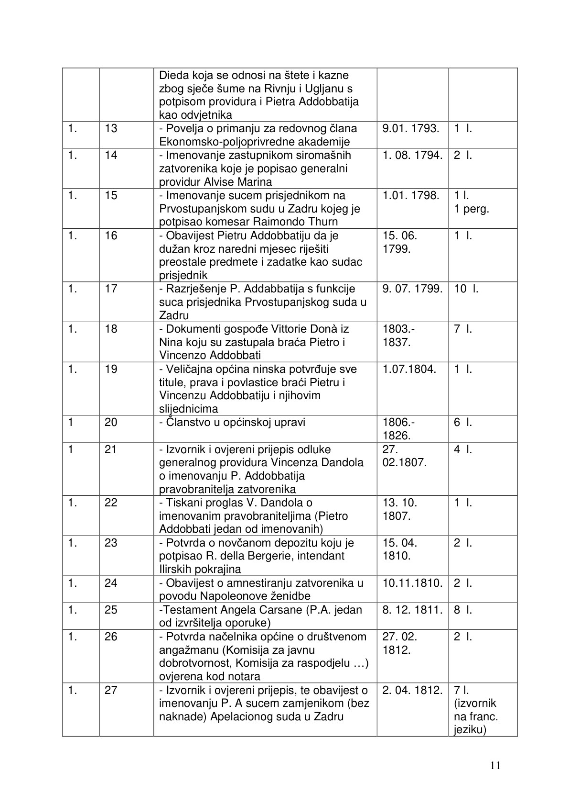

| Box | Sig. | Content (Croatian) | Content (English) | Dates | Note |
|-----|------|--------------------|-------------------|--------|------|
| 1 | 12 | Odluka generalnog providura **Angelo Diedo** koja se odnosi na štete i kazne zbog sječe šume na **Rivnju** i Ugljanu s potpisom providura i Pietra Addobbatija kao odvjetnika | Decision of Provveditore Generale **Angelo Diedo** on damages and fines for illegal felling on **Rivanj** and Ugljan, signed by the *provveditore* and Pietro Addobbati as counsel *(split awkwardly across pp. 10–11 in the table)* | 3 Aug 1790 | 3 ll. |
| 1 | 13 | Povelja o primanju za redovnog člana Ekonomsko-poljoprivredne akademije | Patent of admission as ordinary member of the agricultural and economic academy | 9 Jan 1793 | 1 l. |
| 1 | 14 | Imenovanje zastupnikom siromašnih zatvorenika koje je popisao generalni providur Alvise Marin | Appointment as advocate for the poor prisoners listed by Provveditore Generale Alvise Marin | 1 Aug 1794 | 2 ll. |
| 1 | 15 | Imenovanje sucem prisjednikom na Prvostupanjskom sudu u Zadru kojeg je potpisao komesar Raimondo Thurn | Appointment as *assessore* at the Court of First Instance in **Zadar** signed by commissioner Raimondo Thurn | 1 Jan 1798 | 1 l.; 1 parch. |
| 1 | 16 | Obavijest Pietru Addobbatiju da je dužan kroz naredni mjesec riješiti preostale predmete i zadatke kao sudac prisjednik | Notice to Pietro Addobbati to finish remaining cases and tasks as *assessore* within the coming month | 15 Jun 1799 | 1 l. |
| 1 | 17 | Razrješenje P. Addabbatija s funkcije suca prisjednika Prvostupanjskog suda u Zadru | Discharge of P. Addobbati as *assessore* of the Court of First Instance in **Zadar** | 9 Jul 1799 | 10 ll. |
| 1 | 18 | Dokumenti gospođe Vittorie Donà iz Nina koje su zastupala braća Pietro i Vincenzo Addobbati | Papers of Donna Vittoria Donà of Nin represented by brothers Pietro and Vincenzo Addobbati | 1803–1837 | 7 ll. |
| 1 | 19 | Veličajna općina ninska potvrđuje sve titule, prava i povlastice braći Pietru i Vincenzu Addobbatiju i njihovim sljednicima | The **Magnifica** Commune of Nin confirms all titles, rights and privileges to brothers Pietro and Vincenzo Addobbati and their successors | 1 Jul 1804 | 1 l. |
| 1 | 20 | Članstvo u općinskoj upravi | Membership in municipal government | 1806–1826 | 6 ll. |
| 1 | 21 | Izvornik i ovjereni prijepis odluke generalnog providura Vincenza Dandola o imenovanju P. Addobbatija pravobraniteljem zatvorenika | Original and certified copy of Provveditore Generale Vincenzo Dandolo’s order appointing P. Addobbati *defender of prisoners* | 27 Feb 1807 | 4 ll. |
| 1 | 22 | Tiskani proglas V. Dandola o imenovanim pravobraniteljima (Pietro Addobbati jedan od imenovanih) | Printed proclamation by V. Dandolo on appointed prison advocates (Pietro Addobbati among them) | 13 Oct 1807 | 1 l. |
| 1 | 23 | Potvrda o novčanom depozitu koju je potpisao R. della Bergerie, intendant Ilirskih pokrajina | Certificate of cash deposit signed by R. della Bergerie, intendant of the Illyrian provinces | 15 Apr 1810 | 2 ll. |
| 1 | 24 | Obavijest o amnestiranju zatvorenika u povodu Napoleonova vjenčanja | Notice of amnesty for prisoners on the occasion of Napoleon’s marriage | 10 Nov 1810 | 2 ll. |
| 1 | 25 | Testament Angela Carsane (P.A. jedan od izvršitelja oporuke) | Will of Angelo Carsane (P.A. one of executors) | 8 Dec 1811 | 8 ll. |
| 1 | 26 | Potvrda načelnika općine o društvenom angažmanu (Komisija za javnu dobrotvornost, Komisija za raspodjelu …) ovjerena kod notara | Mayor’s certificate of civic offices (charity commission, allocation commission, etc.) authenticated before a notary | 27 Feb 1812 | 2 ll. |
| 1 | 27 | Izvornik i ovjereni prijepis, te obavijest o imenovanju P.A. sucem zamjenikom (bez naknade) Apelacionog suda u Zadru | Original, certified copy and notice appointing P.A. unpaid deputy judge of the Court of Appeal in **Zadar** | 2 Apr 1817 | 7 ll. (original in French) |

---

## Page 12 — Inventory (part 3)

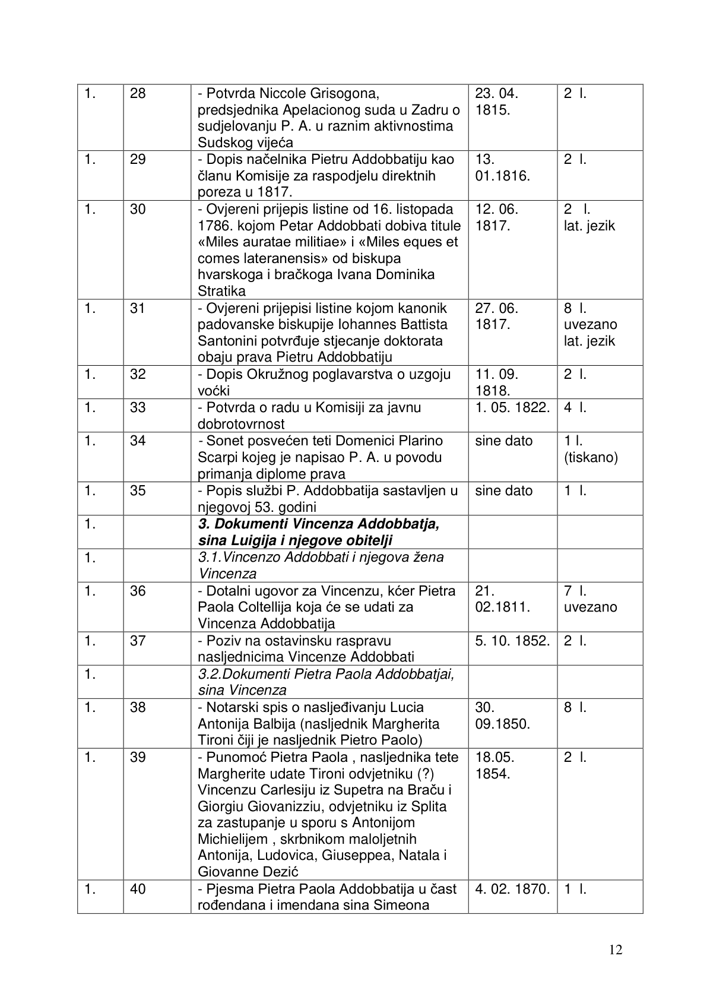

| Box | Sig. | Content (Croatian) | Content (English) | Dates | Note |
|-----|------|--------------------|-------------------|--------|------|
| 1 | 28 | Potvrda Niccole Grisogona, predsjednika Apelacionog suda u Zadru o sudjelovanju P.A. u raznim aktivnostima Sudskog vijeća | Certificate of Niccolò Grisogono, president of the Court of Appeal in **Zadar**, on P.A.’s participation in court council activities | 23 Apr 1815 | 2 ll. |
| 1 | 29 | Dopis načelnika Pietru Addobbatiju kao članu Komisije za raspodjelu direktnih poreza u 1817. | Letter from the mayor to Pietro Addobbati as member of the direct-tax allocation commission, 1817 | 13 Jan 1816 | 2 ll. |
| 1 | 30 | Ovjereni prijepis listine od 16. listopada 1786. kojom Petar Addobbati dobiva titule «Miles auratae militiae» i «Miles eques et comes lateranensis» od biskupa hvarskog i bračkog Ivana Dominika Stratika | Certified copy of the 16 Oct 1786 instrument by which Petar Addobbati received the “Miles auratae militiae” and “Miles eques et comes lateranensis” titles from Bishop Ivan Dominik Stratico of Hvar and Brač | 12 Jun 1817 | 2 ll.; Latin |
| 1 | 31 | Ovjereni prijepisi listine kojom kanonik padovanske biskupije Iohannes Battista Santonini potvrđuje stjecanje doktorata obaju prava Pietru Addobbatiju | Certified copies of the instrument by which the Paduan diocesan canon Johann Baptist Santorini confirms Pietro Addobbati’s doctorate in both laws | 27 Jun 1817 | 8 ll., bound; Latin |
| 1 | 32 | Dopis Okružnog poglavarstva o uzgoju voćki | Circular of the district government on fruit growing | 11 Sep 1818 | 2 ll. |
| 1 | 33 | Potvrda o radu u Komisiji za javnu dobrotvornost | Certificate of work on the charity commission | 1 May 1822 | 4 ll. |
| 1 | 34 | Sonet posvećen teti Domenici Plarino Scarpi koji je napisao P.A. u povodu primanja diplome prava | Sonnet to aunt Domenica Plarino Scarpi written by P.A. on receiving his law diploma | *sine dato* | 1 l. (printed) |
| 1 | 35 | Popis službi P. Addobbatija sastavljen u njegovoj 53. godini | List of P. Addobbati’s offices compiled in his 53rd year | *sine dato* | 1 l. |
| 1 | — | **3. Dokumenti Vincenza Addobbatija, sina Luigija i njegove obitelji** | **3. Documents of Vincenzo Addobbati, son of Luigi, and his family** | — | — |
| 1 | — | *3.1. Vincenzo Addobbati i njegova žena Vincenza* | *3.1. Vincenzo Addobbati and his wife Vincenza* | — | — |
| 1 | 36 | Dotalni ugovor za Vincenzu, kćer Pietra Paola Coltellija koja će se udati za Vincenza Addobbatija | Dowry contract for Vincenza, daughter of Pietro Paolo Coltelli, marrying Vincenzo Addobbati | 21 Feb 1811 | 7 ll., bound |
| 1 | 37 | Poziv na ostavinsku raspravu nasljednicima Vincenze Addobbati | Call to heirs to the estate proceedings for Vincenza Addobbati | 5 Oct 1852 | 2 ll. |
| 1 | — | *3.2. Dokumenti Pietra Paola Addobbatija, sina Vincenza* | *3.2. Documents of Pietro Paolo Addobbati, Vincenzo’s son* | — | — |
| 1 | 38 | Notarski spis o nasljeđivanju **Lucia Antonija Balbija** (nasljednik Margherita Tironi čiji je nasljednik Pietro Paolo) | Notarial file on inheritance from **Lucio Antonio Balbi** (heir Margherita Tironi, whose heir is Pietro Paolo) | 30 Sep 1850 | 8 ll. |
| 1 | 39 | Punomoć Pietra Paola, nasljednika tete Margherite udate Tironi, odvjetniku (?) Vincenzu Carlesiju iz Supetra na Braču i Giorgiu Giovanizziu, odvjetniku iz Splita, za zastupanje u sporu s Antonijom Michielijem, skrbnikom maloljetnih Antonija, Ludovica, Giuseppea, Natala i Giovanne Dezić | Power of attorney from Pietro Paolo, heir of aunt Margherita *née* Tironi, to lawyer(?) Vincenzo Carlesi of Supetar (Brač) and Giorgio Giovannizzi, lawyer of Split, in suit against Antonio Michieli as guardian of minors Antonio, Ludovico, Giuseppe, Natal and Giovanna Dezić | 18 May 1854 | 2 ll. |
| 1 | 40 | Pjesma Pietra Paola Addobbatija u čast rođendana i imendana sina Simeona | Poem by Pietro Paolo Addobbati honouring his son Simeone’s birthday and name-day | 4 Feb 1870 | 1 l. |

---

## Page 13 — Inventory (part 4)

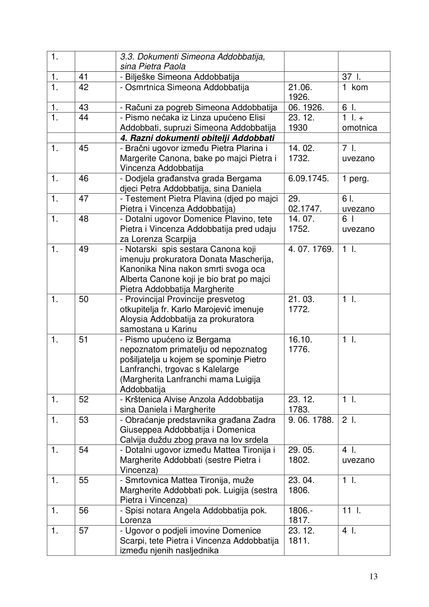

| Box | Sig. | Content (Croatian) | Content (English) | Dates | Note |
|-----|------|--------------------|-------------------|--------|------|
| 1 | — | *3.3. Dokumenti Simeona Addobbatija, sina Pietra Paola* | *3.3. Documents of Simeone Addobbati, Pietro Paolo’s son* | — | — |
| 1 | 41 | Bilješke Simeona Addobbatija | Notes of Simeone Addobbati | — | 37 ll. |
| 1 | 42 | Osmrtnica Simeona Addobbatija | Obituary of Simeone Addobbati | 21 Jun 1926 | 1 piece |
| 1 | 43 | Računi za pogreb Simeona Addobbatija | Accounts for Simeone Addobbati’s funeral | Jun 1926 | 6 ll. |
| 1 | 44 | Pismo nećaka iz Linza upućeno Elisi Addobbati, supruzi Simeona Addobbatija | Letter from a nephew in Linz to Elisa Addobbati, Simeone’s widow | 23 Dec 1930 | 1 l. + envelope |
| 1 | — | **4. Razni dokumenti obitelji Addobbati** | **4. Various documents of the Addobbati family** | — | — |
| 1 | 45 | Bračni ugovor između Pietra Plarina i Margerite Canona, bake po majci Pietra i Vincenza Addobbatija | Marriage contract of Pietro Plarino and Margherita Canona, maternal grandmother of Pietro and Vincenzo Addobbati | 14 Feb 1732 | 7 ll., bound |
| 1 | 46 | Dodjela građanstva grada Bergama djeci Petra Addobbatija, sina Daniela | Grant of Bergamo citizenship to the children of Pietro Addobbati, son of Daniele | 6 Sep 1745 | 1 parch. |
| 1 | 47 | Testament Pietra Plavina (djed po majci Pietra i Vincenza Addobbatija) | Will of Pietro Plavino (maternal grandfather of Pietro and Vincenzo Addobbati) | 29 Feb 1747 | 6 ll., bound |
| 1 | 48 | Dotalni ugovor Domenice Plavino, tete Pietra i Vincenza Addobbatija pred udaju za Lorenza Scarpija | Dowry contract of Domenica Plavino, aunt of Pietro and Vincenzo Addobbati, before marriage to Lorenzo Scarpi | 14 Jul 1752 | 6 ll., bound |
| 1 | 49 | Notarski spis sestara Canona koji imenuju prokuratora Donata Mascherija, kanonika Nina nakon smrti oca Alberta Canone, brata po majci Margherite, majke Pietra Addobbatija *(normalized; [diplomatic facsimile](#sig-49-diplomatic))* | Notarial deed of the Canona sisters appointing procurator Donato Mascheri, canon of Nin, after their father Alberto Canone’s death; Alberto was the brother of Margherita (mother of Pietro Addobbati) | 4 Jul 1769 | 1 l. |
| 1 | 50 | Provincijal Provincije **presvetog otkupitelja** fr. Karlo Marojević imenuje Aloysia Addobbatija za prokuratora samostana u Karinu | Provincial of the Order of the Holy Redeemer, Fr Karlo Marojević, appoints Aloysius Addobbati procurator of the monastery at Karin | 21 Mar 1772 | 1 l. |
| 1 | 51 | Pismo upućeno iz Bergama nepoznatom primatelju od nepoznatog pošiljatelja u kojem se spominje Pietro Lanfranchi, trgovac s Kalelarge (Margherita Lanfranchi mama Luigija Addobbatija) | Letter from Bergamo to an unknown addressee from an unknown sender mentioning Pietro Lanfranchi, merchant from *Calle Larga* (Margherita Lanfranchi, Luigi Addobbati’s mother) | 16 Oct 1776 | 1 l. |
| 1 | 52 | Krštenica Alvise Anzola Addobbatija sina Daniela i Margherite | Baptismal certificate of Alvise Anzolo Addobbati, son of Daniele and Margherita | 23 Dec 1783 | 1 l. |
| 1 | 53 | Obraćanje predstavnika građana Zadra Giuseppea Addobbatija i Domenica Calvija duždu zbog prava na lov srdela | Petition of Giuseppe Addobbati and Domenico Calvi, representatives of the citizens of **Zadar**, to the *doge* regarding the right to fish sardines (*srdela*) | 9 Jun 1788 | 2 ll. |
| 1 | 54 | Dotalni ugovor između Mattea Tironija i Margherite Addobbati (sestre Pietra i Vincenza) | Dowry contract between Matteo Tironi and Margherita Addobbati (Pietro and Vincenzo’s sister) | 29 May 1802 | 4 ll., bound |
| 1 | 55 | Smrtovnica Mattea Tironija, **muže** Margherite Addobbati pok. Luigija (sestra Pietra i Vincenza) *(printed **muže** for **muža**)* | Death notice of Matteo Tironi, **husband** of Margherita Addobbati **daughter of the late Luigi** (**sister** of Pietro and Vincenzo Addobbati) | 23 Apr 1806 | 1 l. |
| 1 | 56 | Spisi notara Angela Addobbatija **pok. Lorenza** | Files of notary **Angelo Addobbati**, **son of the late Lorenzo** | 1806–1817 | 11 ll. |
| 1 | 57 | Ugovor o podjeli imovine Domenice Scarpi, tete Pietra i Vincenza Addobbatija između **njenih** nasljednika | Agreement on division of property of Domenica Scarpi, aunt of Pietro and Vincenzo Addobbati, among **her** heirs | 23 Dec 1811 | 4 ll. |

---

## Page 14 — Inventory (part 5)

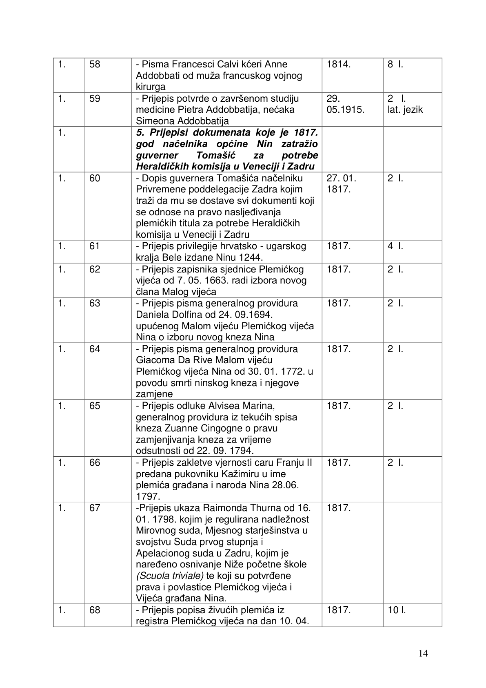

| Box | Sig. | Content (Croatian) | Content (English) | Dates | Note |
|-----|------|--------------------|-------------------|--------|------|
| 1 | 58 | Pisma Francesci Calvi, kćeri Anne Addobbati, **od** muža, francuskog vojnog kirurga | Letters **to** Francesca Calvi, daughter of Anna Addobbati, **from** her husband, a French army surgeon | 1814 | 8 ll. |
| 1 | 59 | Prijepis potvrde o završenom studiju medicine Pietra Addobbatija, nećaka Simeona Addobbatija | Copy of certificate of completion of medical studies of Pietro Addobbati, nephew of Simeone Addobbati | 29 May 1915 | 2 ll.; Latin |
| 1 | — | **5. Prijepisi dokumenata koje je 1817. god načelnika općine Nin zatražio guverner Tomašić za potrebe Heraldičkih komisija u Veneciji i Zadru** *(awkward typography for **godine / načelnik**)* | **5. Copies of documents requested in 1817 by the mayor of Nin from Governor Tomassich for the Heraldic Commissions in Venice and Zadar** | — | — |
| 1 | 60 | Dopis guvernera Tomašića načelniku Privremene poddelegacije Zadra kojim traži da mu se dostave svi dokumenti koji se odnose na pravo nasljeđivanja plemićkih titula za potrebe Heraldičkih komisija u Veneciji i Zadru | Governor Tomassich’s letter to the head of the **Zadar** provisional sub-delegation requesting all documents on inheritance of noble titles for the Heraldic Commissions in Venice and **Zadar** | 27 Jan 1817 | 2 ll. |
| 1 | 61 | Prijepis privilegije hrvatsko-ugarskog kralja Bele izdane Ninu 1244. | Copy of privilege of the Croatian-Hungarian king Bela granted to Nin in 1244 | 1817 | 4 ll. |
| 1 | 62 | Prijepis zapisnika sjednice Plemićkog vijeća od 7. 05. 1663. radi izbora novog člana Malog vijeća | Copy of minutes of the Noble Council session of 7 May 1663 on election of a new member of the Minor Council | 1817 | 2 ll. |
| 1 | 63 | Prijepis pisma generalnog providura **Daniela Delfina** od 24. 09. 1694. upućenog Malom vijeću Plemićkog vijeća Nina o izboru novog kneza Nina | Copy of Provveditore Generale **Daniele Delfino’s** letter of 24 Sep 1694 to the Minor Council of Nin’s Nobles on election of a new *prince* (podestà) of Nin | 1817 | 2 ll. |
| 1 | 64 | Prijepis pisma generalnog providura Giacoma Da Rive Malom vijeću Plemićkog vijeća Nina od 30. 01. 1772. u povodu smrti ninskog kneza i njegove zamjene | Copy of Provveditore Generale Giacomo da Riva’s letter of 30 Jan 1772 to the Minor Council of Nin’s Nobles on the death of the *prince* of Nin and his replacement | 1817 | 2 ll. |
| 1 | 65 | Prijepis odluke Alvisea Marina, generalnog providura iz tekućih spisa kneza Zuanne Cingogne o pravu zamjenjivanja kneza za vrijeme odsutnosti od 22. 09. 1794. | Copy of Alvise Marin’s decision from the current files of *prince* Zuanni Cingognè on the right to replace the *prince* during absence, 22 Sep 1794 | 1817 | 2 ll. |
| 1 | 66 | Prijepis zakletve vjernosti caru Franju II predane pukovniku Kažimiru u ime plemića, građana i naroda Nina 28. 06. 1797. | Copy of oath of loyalty to Emperor Francis II given to Colonel Casimir on behalf of nobles, citizens and people of Nin, 28 Jun 1797 | 1817 | 2 ll. |
| 1 | 67 | Prijepis ukaza Raimonda Thurna od 16. 01. 1798. kojim je regulirana nadležnost Mirovnog suda, Mjesnog starješinstva u svojstvu Suda prvog stupnja i Apelacionog suda u Zadru, kojim je naređeno osnivanje Niže početne škole (*Scuola triviale*) te **koji su potvrđene** prava i povlastice Plemićkog vijeća i Vijeća građana Nina | Copy of Raimondo Thurn’s edict of 16 Jan 1798 on the peace court, local elders as first-instance court, the Zadar Court of Appeal, foundation of the lower elementary school (*Scuola triviale*), and confirmation of rights and privileges of Nin’s Noble Council and Citizens’ Council *(printed **koji su potvrđene**; grammar would expect **kojom su potvrđene**)* | 1817 | — |
| 1 | 68 | Prijepis popisa živućih plemića iz registra Plemićkog vijeća na dan 10. 04. 1817. | Copy of list of living nobles from the register of the Noble Council, 10 Apr 1817 | 1817 | 10 ll. |

---

## Page 15 — Inventory (part 6)

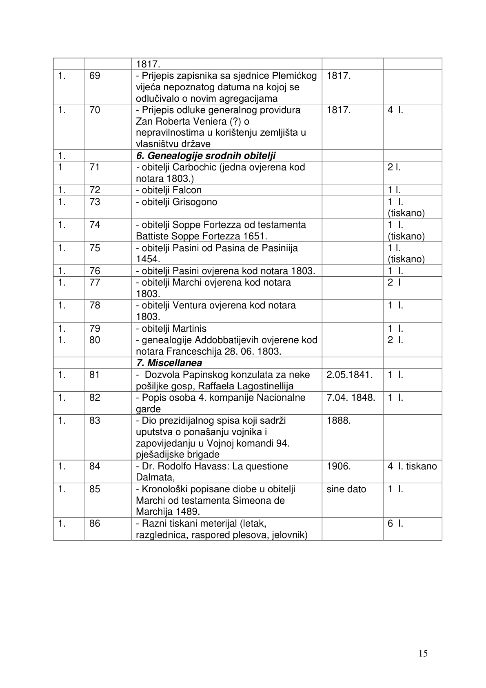

| Box | Sig. | Content (Croatian) | Content (English) | Dates | Note |
|-----|------|--------------------|-------------------|--------|------|
| 1 | 69 | Prijepis zapisnika sa sjednice Plemićkog vijeća nepoznatog datuma na kojoj se odlučivalo o novim agregacijama | Copy of minutes of a session of the Noble Council of unknown date concerning new *aggregazioni* | 1817 | — |
| 1 | 70 | Prijepis odluke generalnog providura Zan Roberta Veniera (?) o nepravilnostima u korištenju zemljišta u vlasništvu države | Copy of Provveditore Generale Zuan Roberto Venier’s(?) decision on irregularities in use of state-owned land | 1817 | 4 ll. |
| 1 | — | **6. Genealogije srodnih obitelji** | **6. Genealogies of related families** | — | — |
| 1 | 71 | Obitelji **Carbochic** (jedna ovjerena kod notara 1803.) | Carbochic family (as printed; one sheet notarised, 1803) | — | 2 ll. |
| 1 | 72 | Obitelji Falcon | Falcon family | — | 1 l. |
| 1 | 73 | Obitelji Grisogono | Grisogono family | — | 1 l. (printed) |
| 1 | 74 | Obitelji Soppe Fortezza od testamenta Battiste Soppe Fortezza 1651. | Soppe Fortezza family from the 1651 will of Battista Soppe Fortezza | — | 1 l. (printed) |
| 1 | 75 | Obitelji Pasini od Pasina de Pasinija 1454. | Pasini family from Pasino de Pasini, 1454 | — | 1 l. (printed) |
| 1 | 76 | Obitelji Pasini, ovjerena kod notara 1803. | Pasini family authenticated before notary, 1803 | — | 1 l. |
| 1 | 77 | Obitelji Marchi, ovjerena kod notara 1803. | Marchi family authenticated before notary, 1803 | — | 2 ll. |
| 1 | 78 | Obitelji Ventura, ovjerena kod notara 1803. | Ventura family authenticated before notary, 1803 | — | 1 l. |
| 1 | 79 | Obitelji Martinis | Martinis family | — | 1 l. |
| 1 | 80 | Genealogije Addobbatijevih ovjerene kod notara Franceschija 28. 06. 1803. | Addobbati genealogies authenticated before notary Franceschi, 28 Jun 1803 | — | 2 ll. |
| 1 | — | **7. Miscellanea** | **7. Miscellanea** | — | — |
| 1 | 81 | Dozvola Papinskog konzulata za neke pošiljke gosp. Raffaela Lagostinellija | Permit from the Papal consulate for some shipments of Sig. Raffaele Lagostinelli | 2 May 1841 | 1 l. |
| 1 | 82 | Popis osoba 4. kompanije Nacionalne garde | List of persons in the 4th company, National Guard | 7 Apr 1848 | 1 l. |
| 1 | 83 | Dio prezidijalnog spisa koji sadrži uputstva o ponašanju vojnika i zapovijedanju u Vojnoj komandi 94. pješačke brigade | Part of a *presidial* dossier with instructions on soldier conduct and command in Military Command of the 94th Infantry Brigade | 1888 | — |
| 1 | 84 | Dr. Rodolfo Havass: *La questione Dalmata* | Dr Rodolfo Havass, *La questione Dalmata* | 1906 | 4 ll. printed |
| 1 | 85 | Kronološki popisane diobe u obitelji Marchi od testamenta Simeona de Marchija 1489. | Chronological list of divisions in the Marchi family from the 1489 will of Simone de Marchi | *sine dato* | 1 l. |
| 1 | 86 | Razni tiskani **materijal** (letak, razglednica, raspored plesova, jelovnik) | Various printed matter (leaflet, postcard, dance programme, menu) | — | 6 ll. |

---

## Page 16


*Blank / form-only verso in the scanned PDF.*

---

## Appendix A — Inventory item 49 (diplomatic)

<a id="sig-49-diplomatic"></a>

**Facsimile:** [page-13.png](pages/page-13.png) (inventory table, signatura **49**).  
**Reference extract:** same wording and line breaks as [`extracted.pdf.md`](extracted.pdf.md) (machine extract from `original.pdf`).

Diplomatic transcription — *Sadržaj* column only, with line breaks as in the typewritten column:

```text
- Notarski  spis sestara Canona koji
imenuju prokuratora Donata Mascherija,
Kanonika Nina nakon smrti svoga oca
Alberta Canone koji je bio brat po majci
PietraAddobbatijaMargherite
```

**Diplomatic particulars**

| Feature | Reading |
|--------|---------|
| Spacing | Double space after `Notarski` (as printed). |
| `svoga` | Printed possessive before `oca`. |
| Run-in string | **`PietraAddobbatijaMargherite`** — no spaces between *Pietra*, *Addobbatija*, *Margherite* in the facsimile. |
| Syntax | No comma before the final cluster; the cluster almost certainly intends *Pietra Addobbatija* and *Margherite* (or *Margherite [Canone]*) as distinct names but was keyed without breaks. |

**Editorial sense** (for genealogy use): the sisters appoint Donato Mascheri, **canon of Nin**, as procurator after their father **Alberto Canone** died; Alberto was **brother of Margherita** in the maternal line of **Pietro Addobbati** (the jammed ending matches that interpretation). The **normalized** Croatian in the main table spells this out.

---

### Translator / transcriber note (internal)

Page PNGs were rendered at 2× from `original.pdf` (PyMuPDF). This file was proofed against those facsimiles **March 2025** (titles, inventory §§1.5 and 4.1–7, and items **1–86**). Remaining quirk: narrative footnote **DAZD 93** vs §5.4 **DAZD 378** for the Heraldic Commission—follow the **scan** when in doubt.
