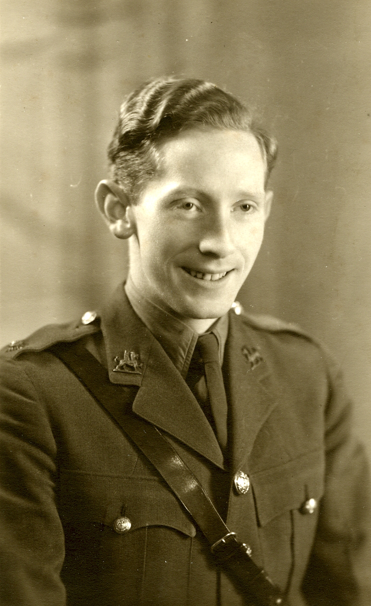
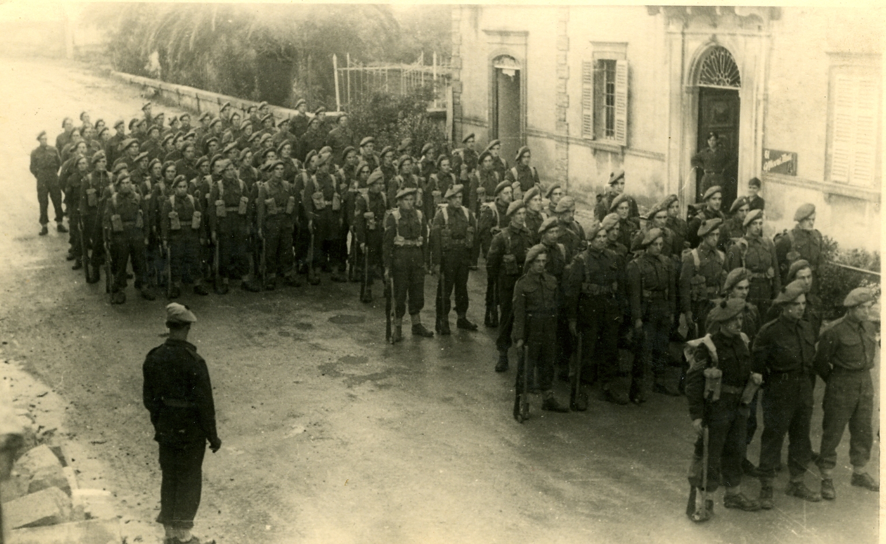

# Lewis in Aberdare and Merthyr — coalfield labour and child mortality

Multi-generation Welsh thread from an Aberavon porter's household to Aberdare deep mining and white-collar work by 1939. Centred on [Samuel Lewis](../people/samuel-lewis.md) and his parents. **Structured tree:** [Structured family tree](../family-tree.json).

---

## 1. Aberavon — a porter's family on the coast (1850s–1870s)

The line begins not in the coalfield but on the coast. [Lewis Lewis](../people/lewis-lewis.md), born about **1813** at **Briton Ferry**, worked as a **porter** at **Aberavon** — the small town near what is now Port Talbot, where docks, tinplate works, and the railway met the shore of Swansea Bay. His wife [Rachel](../people/rachel-james.md), twelve years his junior, had come from **Llanarthne** in Carmarthenshire.

The [1871 census](../sources/1871-census-aberavon-lewis-lewis.md) catches the household at its fullest: Lewis at 58, Rachel at 41, and **nine children** — every one born at Aberavon. The eldest was [David](../people/david-john-lewis-1857.md), thirteen and still a scholar, [baptised at Aberavon on 11 August 1857](../sources/aberavon-baptism-david-lewis-1857.md) (Wales Births & Baptisms batch C02533-2). Below him came Margaret (12), Jane (10), John (9), Lewis junior (8), Rachel (7), William (5), Thomas (3), and Samuel (2) — a household of eleven in a port town far from the deep shafts.

An older version of the working tree placed this family at **Gelligaer** and called Lewis Lewis a **carpenter** (census references RG09/4046, RG10/5388, RG11/5308). Those references belong to a **different Lewis Lewis**. The actual 1871 reference is **RG10/5424**, Aberavon. David himself would later report his birthplace as "Aberdare" on every census from 1891 onward — the two names, Aberavon and Aberdare, both beginning with "Aber-" and both in Glamorganshire, were evidently confused by the family or the enumerator. The baptism record and the 1871 census settle it: he was an Aberavon boy.

---

## 2. Aberdare — coast to coalfield (1870s–1925)

Sometime between 1871 and 1881, David left Aberavon and made the twenty-five-mile journey inland to the **Cynon Valley**. It was the route half of young south Wales was taking: the coastal economy of docks and porterage could not absorb nine children, but the pits could. By the early 1880s he was a coal miner at **Aberdare**.

David had a spell in the **South Wales Borderers** — service number 1082, recorded in 1884 — a coalfield youth's passage through the regiment before returning to the pits. The army record deserves a WO 97 pull when the image bundle is ingested.

He married [Catherine Griffiths](../people/catherine-griffiths.md) at Merthyr around **February 1884** (civil marriage index 11A/611). Catherine had grown up in her father's Aberdare household (1871, RG10/5405); in 1881, aged about eighteen, she was working as a **tin worker** at Aberdare (RG11/5320).

The [1891 census](../sources/1891-census-aberdare-david-lewis.md) is the first to catch David and Catherine as a married household: **Glan Road, Aberdare**, David a coal miner at 32, Catherine 28, three small children — Mary Ann (5), Samuel (3), and infant Thomas — plus two Hereford boarders labouring underground. Thomas would be dead within the decade. David died about **May 1925** at Merthyr (civil deaths 11A/814, line 110).

---

## 2.5. The 1901 census — Glen Road, Aberdare

The [1901 census](../sources/1901-census-aberdare-david-john-lewis.md) caught the household at **Glen Road, Gadlys** on 31 March 1901 — nine people in the house, seven family and two boarders:

| Person | Age | Occupation |
|--------|-----|-----------|
| David John Lewis (head) | 42 | Coal Miner |
| Catherine Lewis (wife) | 38 | — |
| Mary A Lewis (daughter) | 15 | — |
| Samuel Lewis (son) | 13 | **Coal Miner** |
| James Griffiths Lewis (son) | 7 | — |
| Elizabeth Lewis (daughter) | 3 | — |
| Rachel Lewis (daughter) | 0 | — |
| John Lewis (boarder) | 35 | Coal Miner |
| William Lewis (boarder) | 30 | Coal Miner |

Samuel was underground at thirteen — three months short of his fourteenth birthday. The two boarders, both coal miners and both named Lewis (no confirmed relation), reflect the standard coalfield arrangement: a miner’s wife supplementing the household income by taking in lodgers.

Two children from the tree are absent. **Thomas Lewis** (I336, b. 1891) should be about ten; he is not here. He had already died. **Rachel** is present as a newborn — but she too will be gone before the 1911 census. Of Catherine’s eventual twelve births, only five would survive to adulthood.

James’s full name is recorded as **James Griffiths Lewis** — his mother’s maiden name carried as a middle name, a common Welsh practice.

---

## 2.6. The 1921 lockout — Bwllfa idle

The [1921 census](../sources/1921-census-aberdare-david-john-lewis.md) was taken on **19 June 1921**, ten weeks into the coal lockout that shut every pit in South Wales. The government had returned the mines to private ownership on 31 March; the owners demanded wage cuts of up to 50 per cent; the miners refused. From 1 April to 1 July the coalfield was silent.

At **41 Glan Road, Aberdare** the household schedule — signed by Samuel, not his ageing father — records every working man as **out of work**:

| Person | Age | Occupation | Employer | Status |
|--------|-----|-----------|----------|--------|
| David John Lewis (head) | 62 | Surface Labourer, Colliery | Aberdare Bwllfa Co | **Out of Work** |
| Samuel Lewis (son) | 34 | Coal Miner | Bwllfa Co No 1 | **Out of Work** |
| Thomas John Lewis (son) | 18 | Coal Miner | Bwllfa Coy (No 1) | **Out of Work** |

**Bwllfa No. 1** was one of the principal deep mines in the Aberdare valley, sunk in the 1840s and later absorbed by **Powell Duffryn Associated Collieries**. All three generations of Lewis men drew their wages from the same company.

David John Lewis was now a **widower** — [Catherine Griffiths](../people/catherine-griffiths.md) had died sometime between the 1911 census and this date. At 62 he had moved to **surface labouring**, the common trajectory as miners aged out of underground face work. Daughter Elizabeth (23, single) and daughter-in-law Lily (34, Samuel’s wife) were both at home. Samuel’s son — another **David John Lewis**, age two years and eight months — completed the household: four rooms, six people, no income.

The lockout ended on 1 July 1921 with the miners’ defeat. Wages were cut. Within a few years Samuel had left the pit altogether, trading the coalface for insurance ledgers.

---

## 3. Twelve births, seven deaths — the 1911 census return

The 1911 household return for **41 Glen Road, Aberdare** is preserved as a scan in the vault ([schedule image](../media/docs/1911%20census%2041%20Glen%20Road%20Aberdare%20David%20J%20Lewis%20household%20schedule%2079.jpg)). It is one document, but it contains a line that distils the reality of coalfield family life into a pair of numbers.

**Catherine Lewis**, age 48, married 27 years, filled in the fertility columns unique to that census: **12 children born alive**, of whom **5 were still living** and **7 had died**. That is not a statistic. It is a mother's signed return.

The household at 41 Glen Road — seven people in four rooms:

| Person (as enumerated) | Age | Role / occupation |
|------------------------|-----|-------------------|
| David J Lewis | 52 | Head; **Coal Miner (Below Ground)** |
| Catharine Lewis | 48 | Wife |
| Mary Ann Lewis | 25 | Daughter |
| Elizabeth Lewis | 13 | Daughter |
| Samuel Lewis | 23 | Son; **Coal Miner (Below Ground)** |
| James G Lewis | 17 | Son; **Coal Miner (Below Ground)** |
| Thomas J Lewis | 8 | Son; school |

Three generations of miners underground. Samuel was 23 and already below ground. James, at 17, was following the same path. Everyone in the household was recorded as **English and Welsh**.

Samuel's age across two census nights confirms continuity: on 31 March 1901, he is 13, listed as son of the head, already marked **Coal Miner** — RG13/5035, folio 70 page 41, schedule 242. On 2 April 1911, he is 23 and still below ground.

The strict family tree under union **F87** lists seven named children (1886–1903). Only five appear on this schedule alongside the parents. Reconciling every birth with the twelve/twenty-seven-year fertility return — and with civil BMD for the seven deaths — is still open work.

---

## 4. Out of the pit — Samuel Lewis and the next generation

[Samuel Lewis](../people/samuel-lewis.md) was born **23 June 1887** in Aberdare. He married [Elizabeth Lilian Cushen](../people/elizabeth-lilian-cushen.md) in **1917** at Merthyr (union F7).

By the **1939 Register** he had left the coalface: listed as **head** at Aberdare/Merthyr with occupation **assurance agent** — in fact **district manager** for the **Scottish Legal Life Assurance Society**, a post he held until retirement in **1954**. Insurance selling, not extraction — still within the same valley economy, but above ground and in a collar. He was a deacon at **Carmel Calvinistic Methodist Church, Trecynon** from **1932** and church secretary for some 30 years; also a senior member of the **Independent Order of Oddfellows, Lily of the Valley Lodge**. He and Elizabeth lived at **32 Pendarren Street, Aberdare** for almost 40 years before moving to **Maesyffynnon**, a care home in Aberaman, around early 1966. He died there on **7 August 1967**, aged 80. Cremated at Glyntaff Crematorium on 11 August.

His son [David John Lewis](../people/david-john-lewis.md) (1918–2000) broke the Welsh pattern entirely: a student in the **1939 Register**, then the war. His commissioning portrait — taken at **Watson's Studio, Aberdare** — shows the young officer in full dress uniform before he left the valley for the Mediterranean. He served as a Major in the **1st Battalion, Welch Regiment** in Italy and was awarded the **United States Silver Star** for action at the Po bridgehead on 25 April 1945 — [the full story](david-john-lewis-italy-1945-silver-star.md). After the war: Brighton, then Sirmione. The grandson of a carpenter, the son of a miner, the father of another life altogether.

---

## Evidence quick list

- [Baptism — Aberavon, 11 August 1857](../sources/aberavon-baptism-david-lewis-1857.md) ([transcription](../sources/corpus/aberavon-baptism-david-lewis-1857/transcription.md)) — FamilySearch index, batch C02533-2; father Lewis Lewis, mother Rachael
- [1871 census — Aberavon, Lewis Lewis household](../sources/1871-census-aberavon-lewis-lewis.md) ([transcription](../sources/corpus/1871-census-aberavon-lewis-lewis-household-rg10-5424/transcription.md) · [image](../media/docs/1871-census-aberavon-lewis-lewis-household-rg10-5424.png)) — RG 10/5424, schedule 460; Lewis Lewis (58, Porter, Briton Ferry), Rachel (41, Carmarthen), David (13) + 8 siblings
- [1891 census — Glan Road, Aberdare](../sources/1891-census-aberdare-david-lewis.md) ([transcription](../sources/corpus/1891-census-aberdare-david-lewis-household-rg12-4444/transcription.md) · [image](../media/docs/1891-census-glan-road-aberdare-david-lewis-household-rg12-4444.jpg)) — RG 12/4444, page 7, schedule 41
- [1901 census — Glen Road, Aberdare](../sources/1901-census-aberdare-david-john-lewis.md) ([transcription](../sources/corpus/1901-census-aberdare-david-john-lewis-household-rg13-5035/transcription.md) · [image](../media/docs/1901-census-glen-road-aberdare-david-john-lewis-household-rg13-5035.jpg)) — RG 13/5035, folio 70, p. 41, schedule 242
- [1921 census — 41 Glan Road, Aberdare](../sources/1921-census-aberdare-david-john-lewis.md) ([transcription](../sources/corpus/1921-census-aberdare-david-john-lewis-household-rg15-26875/transcription.md) · [image](../media/docs/1921-census-41-glan-road-aberdare-david-john-lewis-household-rg15-26875.jpg)) — RG 15/26875, schedule 43
- [1911 census image — 41 Glen Road, Aberdare](../media/docs/1911%20census%2041%20Glen%20Road%20Aberdare%20David%20J%20Lewis%20household%20schedule%2079.jpg) (schedule 77 in RG14/32495)
- Some **obsolete pedigree exports** embedded census text for persons **I17**, **I173**, **I174**, **I427**, **I428** (union **F87**). **Note:** those exports attached census districts for a different **Lewis Lewis** (RG09/4046, RG10/5388, RG11/5308) — not this Aberavon line.
- [Structured family tree](../family-tree.json) — union F87, persons I17, I173, I174
