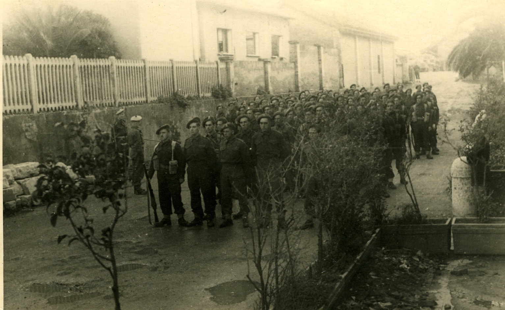

# Aberdare and the Welsh Valleys — David Lewis's Roots

The Cynon Valley runs north from Aberdare into the Brecon Beacons, a corridor of chapel, coal, and rugby that shaped South Wales for two centuries. [David John Lewis](../people/david-john-lewis.md) was born in **Merthyr Tydfil** on **2 October 1918** — the neighbouring valley town, five miles east — and grew up in **Aberdare**, where his parents [Samuel Lewis](../people/samuel-lewis.md) and [Elizabeth Lilian Cushen](../people/elizabeth-lilian-cushen.md) ("Lily") kept a home at **32 Pendarren Street**. The valley gave David his education, his Welsh identity, and the address he would write on his wedding customs declaration in Italy thirty years later — the last fixed point before he took his Italian bride to Bristol, then Africa, then Sussex, and never lived in Wales again.

## 32 Pendarren Street

Pendarren Street runs through the Trecynon ward of Aberdare, a grid of terraced houses built for the mining and ironworking families of the Cynon Valley. The Lewis household at number 32 was the family home David knew through school, university, and the war. When he signed his customs declaration at **Sirmione, 16 October 1947** — preparing to bring [Fulvia](../people/fulvia-ottilia-antonia-zerauschek.md)'s wedding trousseau to England — he gave his address as **"32 Pendarren St. Aberdare, S. Wales."** It was the natural declaration of a man who, despite six years of war across three continents, still thought of the valley as home.

An earlier address for the wider Lewis family appears in the **1911 census**: **41 Glen Road, Aberdare** — the household of David's paternal grandfather, recorded when Samuel Lewis was a young man.

## Aberdare Grammar School (1931–1937)

David attended **Aberdare Grammar School** (later Aberdare Boys' Grammar School) from 1931 to 1937. The school occupied a purpose-built Edwardian building on the hillside above the town, part of the Welsh county school system established by the Intermediate Education Act of 1889 — grammar schools that gave valley children a path to university and the professions.

The **1935 prize day** was reported in full by the *Aberdare Leader*. It was the last public appearance of headmaster **W. Charlton Cox**, who had led the school since its early years. David was school **student treasurer** and a **pianist** — the combination of administrative competence and cultural breadth that would characterise his later career.

A school reference dated **20 October 1936** survives, along with a pre-war Bristol University letter (27 Jun 1939).

## University of Bristol (1937–1939, 1947–1948)

David went up to the **University of Bristol** in 1937. The war interrupted after two years: he enlisted voluntarily in 1939, served in the Somerset Light Infantry and then the Welch Regiment, and fought across North Africa, Sicily, and Italy until VE Day. His commissioning portrait — taken at **Watson's Studio, Aberdare** — shows the young officer in full dress uniform before he left the valley for the Mediterranean.

He returned to Bristol in **1947** — now a married man, with Fulvia and the Italian trousseau — and completed his **BA Honours in Modern History** (2nd Class, 1st Division) in 1948. He also gained a **Post-Graduate Certificate in Education**. He boxed for the university and played rugby for the second team. A reference from Bristol dated **1 December 1947** confirms his post-war return.

The Bristol interval was brief: by 1948 he had been appointed to the **HM Colonial Administrative Service** and posted to Tripolitania.

## "Dafydd John"

David's Welsh identity surfaces in unexpected places. His wartime letter home from Sicily (**16 August 1943**) — typed on a captured Italian typewriter with a broken ribbon — is addressed to *"Dear Parents and Keith"* and signed **"Dafydd John"**, the Welsh form of his name. He analyses the strategic situation with clarity, saves money for his parents in Defence Bonds, and writes of his nine-year-old brother Keith: *"The more I hear of Keith the more interesting and attractive he becomes. He seems to have been a great improvement on the other red you had about the house."*

That letter, written from the front lines in Sicily, reveals a man whose roots in the valley were deep enough to sign off in Welsh even as he fought his way through Italian vineyards.

## Samuel and Lily

David's parents were **Samuel Lewis** and **Elizabeth Lilian Cushen** — known as **Lily**. Samuel came from the Lewis family of Aberdare; Lily brought the **Cushen** name from what appears to be an English or possibly Irish connection. They had two sons: David (b. 1918) and **Brynmor Keith** (b. 1934), sixteen years apart.

Lily died **suddenly** in **Merthyr** in **November 1972**. The news reached Florence through [Giuliana Zerauschek Rivolta](../people/giuliana-zerauschek-rivolta.md), who passed it to [Mario Zerauschek](../people/mario-zerauschek.md) and his wife; their condolence letter to David and Fulvia (12 Nov 1972) describes *"l'improvvisa scomparsa della Signora Lewis"* — the Italian in-laws grieving across the continent for the Welsh mother-in-law they had come to know through visits and letters.

The valley remembers Lily in chapel obituaries and studio photographs where she never quite loses her Edwardian poise.

## The valley's gift

Aberdare Grammar School, the Pendarren Street terrace, the chapel culture, the rugby pitch — these gave David the tools he carried through Italy, across Africa, and into the environmental movement. The school trained him in public speaking and administration; the valley taught him steadiness under pressure and a democratic instinct that served him well as a District Commissioner mediating between colonial authority and African communities. His personal interests, listed on his 1996 CV — **big game hunting, rugby, swimming** — reflect the physical confidence of a valley upbringing married to the opportunities of empire.

When David and Fulvia died in 2000, they were buried not in Wales but at **Sirmione** — the Italian lakeside town where they had met. But the Pendarren Street address, written in David's own hand on a customs form in 1947, remains the earliest fixed coordinate of the family's British life.

## Evidence

- **English customs declaration (16–17 Oct 1947):** [Customs171047-01.jpg](../media/docs/sirmione-villa-ester/Customs171047-01.jpg), [-02](../media/docs/sirmione-villa-ester/Customs171047-02.jpg) — "I, David J. Lewis, a British subject, at present residing at 32 Pendarren St. Aberdare, S. Wales." Signed "David J. Lewis. Major." British Consulate General, Milan.
- **1911 census — Glen Road, Aberdare:** [schedule 79](../media/docs/1911%20census%2041%20Glen%20Road%20Aberdare%20David%20J%20Lewis%20household%20schedule%2079.jpg) — grandfather's household.
- **Aberdare Grammar School prize day (1935):** [AberdareBoys-1935.doc](../media/docs/david-john-lewis-personal/education/AberdareBoys-1935.doc) — *Aberdare Leader* report.
- **School reference (20 Oct 1936):** [DJ-Ref201036.doc](../media/docs/david-john-lewis-personal/education/DJ-Ref201036.doc), [scan](../media/docs/david-john-lewis-personal/education/DJ-Ref201036.jpg).
- **Bristol University (27 Jun 1939):** [DJ-Uni270639.doc](../media/docs/david-john-lewis-personal/education/DJ-Uni270639.doc), [scan](../media/docs/david-john-lewis-personal/education/DJ-Uni270639.jpg).
- **Bristol reference (1 Dec 1947):** [BristolRef011247.doc](../media/docs/david-john-lewis-personal/education/BristolRef011247.doc), [scan](../media/docs/david-john-lewis-personal/education/BristolRef011247.jpg).
- **Wartime letter (16 Aug 1943):** [Army-Dj160843-01.jpg](../media/docs/david-john-lewis-war/letters/Army-Dj160843-01.jpg), [-02](../media/docs/david-john-lewis-war/letters/Army-Dj160843-02.jpg) — "Dear Parents and Keith." Signed "Dafydd John."
- **Elizabeth Lilian Cushen — condolence (12 Nov 1972):** [M&GZ121172-01.jpg](../media/docs/correspondence/mario-zerauschek/M%26GZ121172-01.jpg), [-02](../media/docs/correspondence/mario-zerauschek/M%26GZ121172-02.jpg) — Mario's wife: "l'improvvisa scomparsa della Signora Lewis."

## Related

- [David John Lewis](../people/david-john-lewis.md) · [Samuel Lewis](../people/samuel-lewis.md) · [Elizabeth Lilian Cushen](../people/elizabeth-lilian-cushen.md) · [Brynmor Keith Lewis](../people/brynmor-keith-lewis.md)
- [Independent Order of Odd Fellows — Manchester Unity](odd-fellows-manchester-unity.md) — Samuel Lewis as Provincial Grand Master; Aberdare lodge culture
- [Sirmione on Lake Garda](sirmione-lake-garda.md) — where the Pendarren Street address appears on the customs declaration
- [Northern Rhodesia — Colonial Service](northern-rhodesia-colonial-service.md) — the career the valley education made possible
