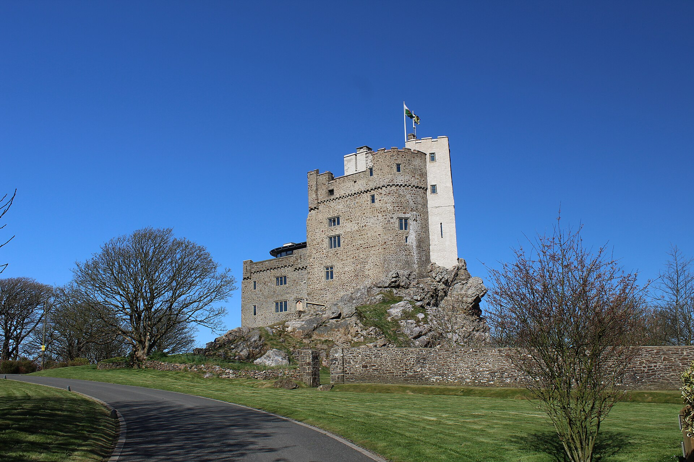
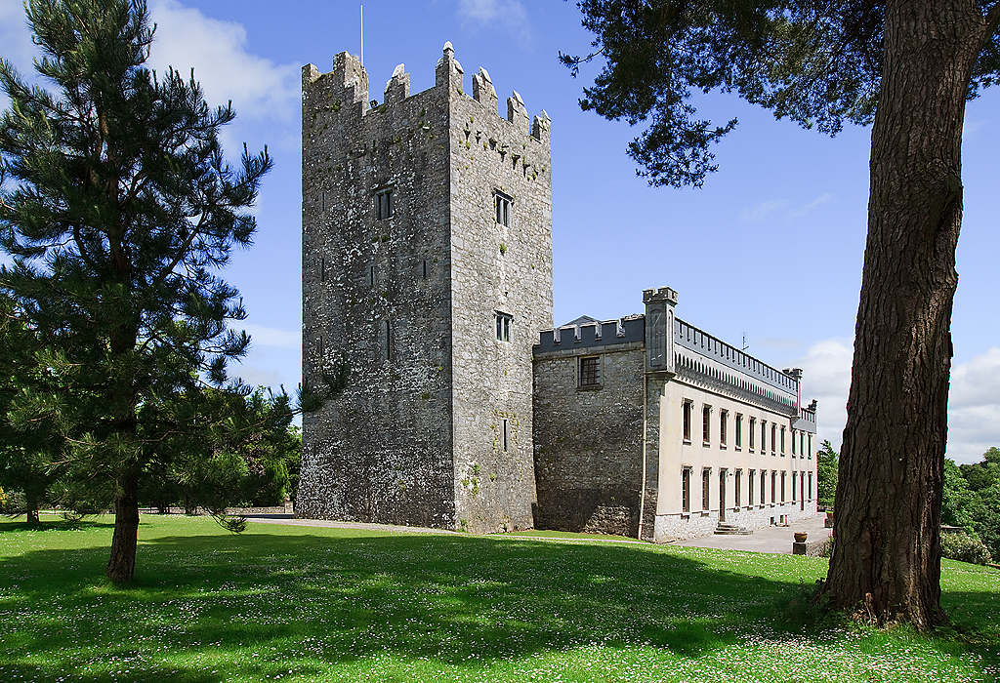

# Adam de Rupe (Adam de la Roche)

The **traditional Norman–Welsh founder** of the dynasty that became **lords of Fermoy** in north Cork and, in the peerage, **Viscounts Fermoy**. He is not a *proved* individual in parish registers; he is the **eponymous ancestor** modern reference works attach to the **Roche** surname in Munster. For this tree, he matters as the **top of the published stem** you merge into once a **cadet fork** from [John Roche of Castletown-Roche](../people/john-roche.md) is accepted on Burke’s authority.

*Roch Castle, Pembrokeshire (2018). The Monastic Wales database treats **Adam de la Rupe (Roche)** as the figure first associated with this fortress; Irish pedigrees then carry the **de la Roche / Roche** name into the lordship of Fermoy.*

*Castle Widenham, Castletownroche, County Cork — the Roche stronghold in **Roches Country**; confiscation and Widenham ownership followed the Cromwellian and Williamite settlements.*

---

## Who the sources say he was

**Welsh horizon.** The [Monastic Wales](https://www.monasticwales.org/person/88) person entry summarises **Adam de la Rupe (Roche)** as the founder of **Pill Priory** (Tironensian house in Pembrokeshire), husband of **Blandina**, and the figure **first associated with Roch Castle** in Pembrokeshire. The same entry notes a **Flemish** tradition behind the family, with **Godebert** in the **1130** Pipe Roll and a **barony of Roche** forming about **1100×1130** around the manors of **Pill** and **Roche**. Chronology and precise parentage remain **under-documented**.

**Irish horizon.** Irish peerage and biographical works (for example the [Dictionary of Irish Biography](https://www.dib.ie/) entries on later Viscounts Fermoy, echoed in standard handbooks) repeat the formula that the Cork Roches were **Old English** and **descended from Adam de Rupe**, who reached Ireland **from Wales** with **Robert FitzStephen**. **Sir Bernard Burke** (*A Genealogical History of the Dormant, Abeyant, Forfeited and Extinct Peerages*, **1866**, p. **454**), as cited in the [David Roche, 7th Viscount Fermoy](../sources/corpus/wikipedia-david-roche-7th-viscount-fermoy/extracted.web.md) article’s footnotes, put the moment this way:

> The family of Roche was established in Ireland by **Adam de Rupe** of **Roch Castle, co. Pembrokeshire**, who accompanied **Robert FitzStephen** to that country in **1196**.

So the **handbook tradition** used by Irish peerage writers is not always aligned on the **year**: **1196** (Burke 1866) sits a **generation after** the classic **1169–1171** FitzStephen narrative. Popular summaries also swap **FitzStephen** for **Strongbow** or lead with **Richard FitzGodebert** in **1167** (see [Surname: Roche](surname-roche.md)) — those are **different secondary pedigrees**, not duplicate proof of two Adams.

**What is stable:** the **Roche / de la Roche / de Rupe** identity as a **Cambro-Norman** layer, **Pembrokeshire** as the Welsh springboard, and **Fermoy** as the Munster lordship that later intersects with **Castletownroche** and the **Viscount Fermoy** title.

---

## Ancestry (charter tradition and Victorian reconstruction)

Nothing in this vault is a **primary** extract of Adam’s own charter; the following is what **Welsh antiquarian scholarship** and **Irish peerage compendia** typically stack **above** him.

| Generation (traditional) | Name / label | What sources usually claim |
|--------------------------|--------------|----------------------------|
| **I** | **Godebert** (“the Fleming,” *Godiebert* in some spellings) | Named from the **Pipe Roll of 1130** in the [Monastic Wales](https://www.monasticwales.org/person/88) summary; treated as the **dynastic founder** of the **barony of Roche** in **Rhôs / Pembrokeshire**, with a core around **Pill** and **Roche** manors, **c. 1100×1130**. Henry **I**’s **Flemish settlement** in Dyfed is often invoked as **context** (population, not proof of one man). |
| **II** | **Robert / Rodebert FitzGodebert** | Victorian charter editors and pedigree compilers (drawing on the charter corpus below) regularly insert a **son of Godebert** as father of the **next** generation; spelling **Rodebert** appears in some Irish-family summaries beside **Richard** as **brothers**. |
| **III** | **Adam** (+ often **David**, **Henry**) | **Adam**: marriage to **Blandina**; **Pill Priory**; **Roch Castle** association (Monastic Wales). **David**: a **Wexford** and **William Marshal** nexus appears repeatedly in **secondary** Irish genealogies (great estates in **Ferns / “Rochesland”** country) — useful for **context**, not automatic identification with one charter **David**. |

**Charter edition.** The standard antiquarian edition is **Joseph Hunter** and **John Montgomery Traherne**, “Copies of the original charters of the family of de la Roche,” *Archaeologia Cambrensis* (**1852**; new series — library catalogues cite different volume numbers). **Monastic Wales** points to **267–268**; other indexes give the run as **258–271**. That article is the usual **academic anchor** for saying the **Pembrokeshire Roches** are a **documented Norman–Flemish** house with a recoverable **charter chain** — distinct from later **story-book** compression into a single **Adam**.

**Cork scholarship, later rungs.** Eithne Donnelly’s **“The Roches, Lords of Fermoy”** series in the *Journal of the Cork Historical and Archaeological Society* (**1935–1937**, continued across volumes) works from **Carew MSS**, the **Book of Fermoy**, Irish **patent and close rolls**, and **Trinity College** pedigrees — naming **fourteenth- and fifteenth-century** lords (e.g. **John de la Roche**, **Maurice de Rupe**, **Milo Fitz Nicholas Roch** in **Carew**). That literature **fills the Irish middle ages** with **record-based** steps; it does **not** cancel the **Adam** origin story, but it shows where **hard evidence** actually begins for Munster.

---

## Siblings, Wexford, and Munster (how the branches are usually told)

Secondary genealogies often distribute the **Pembrokeshire** line into **southern Irish** clusters:

- **Munster / Fermoy:** **Adam** as **eponym** of the **north Cork** lordship (Burke 1866; DIB/Wikipedia formula).
- **Leinster / Wexford:** a **David de la Roche** line, sometimes described as a **brother** of Adam, linked to **Marshal** interests and **Ferns** — a separate **regional** tradition that **shares** the **Godebert / FitzGodebert** vocabulary.

Treat those **branch labels** as **synthesis**, not as if every **David de la Roche** in the indexes were the same man.

---

## Castles and geography (two poles of one story)

| Place | Role in the narrative |
|-------|------------------------|
| **Roch Castle**, Pembrokeshire | Welsh fortress tied to the **de la Roche** dynasty in Monastic Wales and related scholarship. |
| **Castletownroche** (Baile Chaisleáin an Róistigh), Co. Cork | Town and barony of **Fermoy**; named from the **Roche** family; seat of the **Viscounts Fermoy** and the castle later called **Castle Widenham** / **Blackwater Castle**. |

The **Irish castle** is the one your documented ancestor [John Roche](../people/john-roche.md) invokes when Burke calls him **“of Castletown-Roche”** and **“descended from the Viscounts Fermoy.”** The **Welsh castle** is the visual anchor for **Adam** in the same story.

---

## How this tree uses him

Burke’s *History of Commoners* (**1833**) does **not** name every generation between [John Roche](../people/john-roche.md) (~1600) and the medieval stem. The working model is:

1. **Solid line:** John → [Robert](../people/robert-roche.md) → [Stephen O’Moore Roche](../people/stephen-omoore-roche.md) → [John Lysaght Roche](../people/john-lysaght-roche.md) → … → [Catherine Mary Roche](../people/catherine-mary-roche.md).
2. **Fork (unknown man):** somewhere on the **patriline**, a **cadet** branch left the **heir line** of the Viscounts Fermoy.
3. **Above the fork:** you ride the **same father-chain** as the **canonical Viscount Fermoy pedigree** back toward **Adam de Rupe** — **if** you accept Burke’s descent.

So **Adam** is the **narrative ceiling** for the Roche line in Munster, not a man whose parentage is in this repo as a primary extract.

---

## Subjective probabilities (Viscount heir line)

These numbers are **judgment**, not DNA or deed evidence. They answer: “If our patriline is on the Fermoy Roche stem at all, how likely is **this** viscount (counted **V1…V8** down the **heir line** from the earliest holder in the usual tables through the **last** viscount before cadency matters for John’s generation) to sit **on my direct paternal line**?” They **must decrease** down the list: if **V8** is an ancestor, **V1–V7** are too.

**Conditioning premise:** Burke is right that John of Castletown is **agnatically** of the **Viscounts Fermoy** house.

| Heir-line step | Typical identification (see peerage tables) | P (subjective) |
|----------------|---------------------------------------------|----------------|
| **V1** | Earliest Viscount in the **full** Fermoy sequence used with your sources | **100%** |
| **V2** | Next | **~97%** |
| **V3** | Next | **~94%** |
| **V4** | Next | **~90%** |
| **V5** | Next | **~85%** |
| **V6** | **Maurice** “the Mad” (~1550–1600) | **~78%** |
| **V7** | **David** (d. **1635** at Castletownroche) — plausible **fork** generation for a **1641** Commons Roche | **~55%** |
| **V8** | **Maurice** (d. **1670**; peer in **1641**) | **~45%** |

If the fork is a **younger son of V6**, then **V7** and **V8** drop toward **zero** on **your** line while **V1–V6** remain at **100%**. If the fork is a **younger son of V7**, **V8** drops toward **zero**. The table is an **average** over those unknowns.

---

## Related

- [Adam de Rupe — person page](../people/adam-de-rupe.md)
- [John Roche of Castletown-Roche](../people/john-roche.md) — earliest **proved** patrilineal anchor in this vault
- [Surname: Roche](surname-roche.md) — etymology and Limerick descent
- [Roche of Limerick — Forgotten Victorians (Burke’s 1833)](../sources/roche-of-limerick-forgotten-victorians.md)
- Corpus: [Lewis, Castletown-Roche (1837)](../sources/corpus/lewis-topographical-castletown-roche-1837/extracted.web.md) · [Wikipedia — David Roche, 7th Viscount Fermoy](../sources/corpus/wikipedia-david-roche-7th-viscount-fermoy/extracted.web.md)

### External reference shelf (not duplicated in corpus)

- [Monastic Wales — Adam de la Rupe (Roche)](https://www.monasticwales.org/person/88) — Welsh priory, Roch Castle, Godebert summary.
- **Hunter & Traherne (1852)** — *Archaeologia Cambrensis* charter copies for **de la Roche of Pembrokeshire** (see “Ancestry” above).
- **Burke (1866)** — *Dormant … Peerages*, p. 454, **Adam de Rupe**, **1196**, FitzStephen (quoted via Wikipedia corpus footnote).
- [JCHAS — Donnelly, “The Roches, Lords of Fermoy” (1936 instalment PDF)](https://corkhist.ie/wp-content/uploads/jfiles/1936/b1936-005.pdf) — Munster lords on **record** (Carew, Book of Fermoy, rolls); adjacent issues continue the series.
