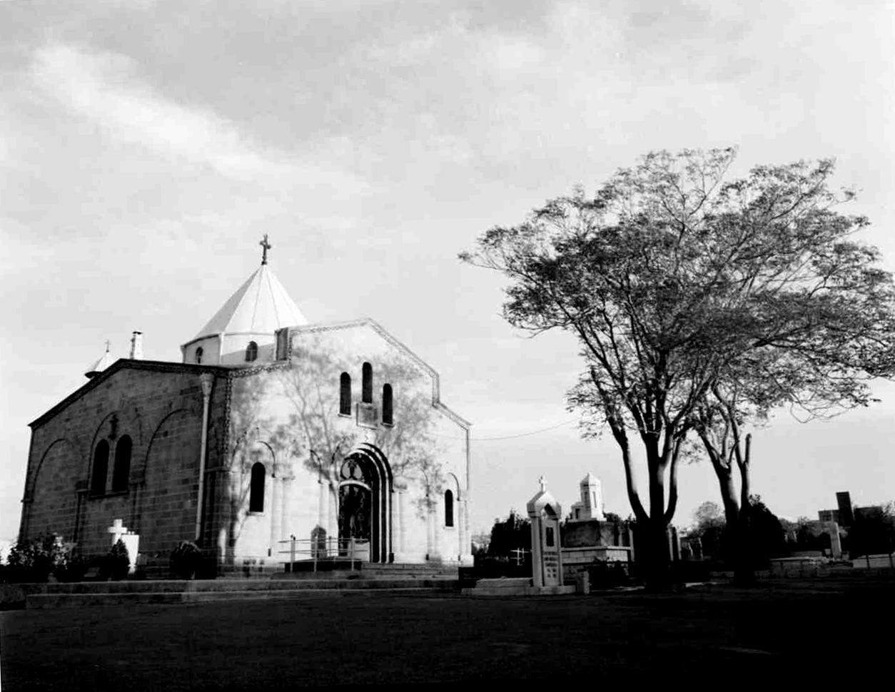
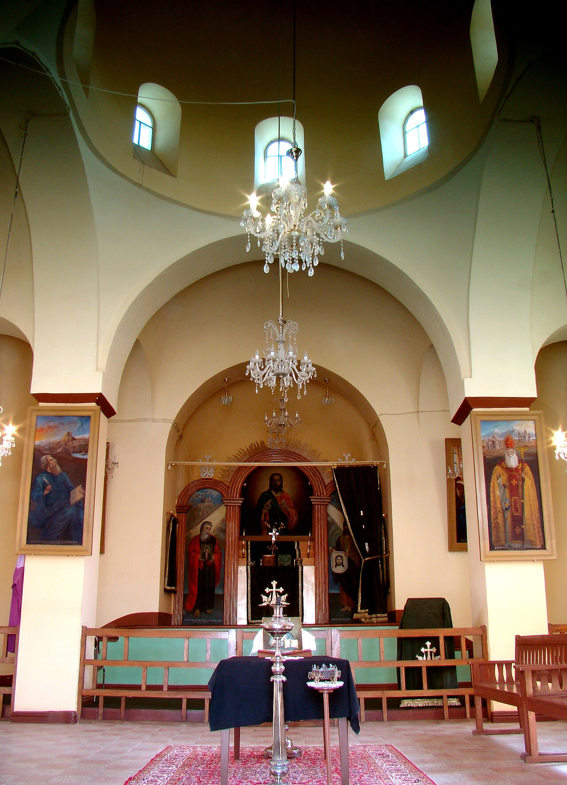
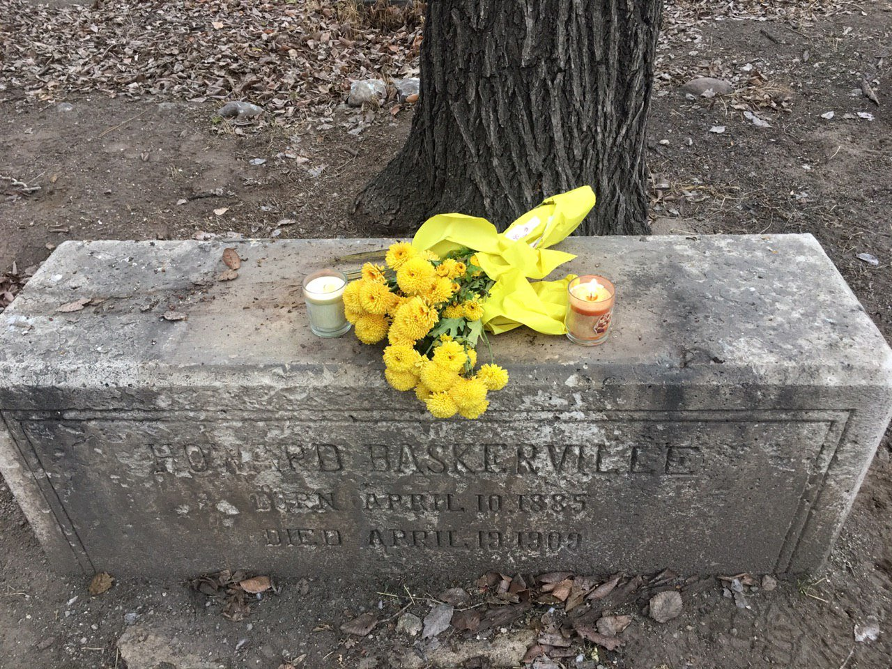

# Cemeteries in Iran

The family's dead lie scattered across Iran — in Tehran and in Tabriz, in Protestant ground and Armenian ground, across a century of burials that map the family's presence in the country from the 1850s to the 1950s. Two sites anchor the story: the **Armenian cemetery outside Tabriz**, where the earliest generation is buried, and the **Protestant cemetery at Akbarabad** near Tehran, where the last generation came to rest.

---

## Tabriz — the Armenian cemetery and Surb Astvatsatsin

The Armenian cemetery just outside the walls of Tabriz has been the burial ground for the city's Armenian community since at least the 1850s. Two distinct but overlapping complexes sit within it:

- **Surb Astvatsatsin** (Holy Mother of God / "Mary, Mother of God") — the older Armenian church and its surrounding burial ground, including the **Saginian family mausoleum**. Yaghoubian (2014, nn. 10–11) confirms that both Daoud Khan Saginian and his grandson Solayman Khan were buried here. Navasargian (2012) reproduces an 1842 *Bazmavep* engraving showing its dome rising over the old Armenian quarter, Ghala.
- **Shoghakat Church** (Surb Shoghakat, completed 1940) — a later church within the same cemetery precinct, financed by leather manufacturer Simon Manocherian and named for his mother. The land was purchased in the 1850s by the Diocese of Tabriz under Bishop Sahak Satunyan; the church itself was not built until the twentieth century.

**Note:** Wright (1998) records Edward Burgess as buried at "Church of Sourp Shoughakat" in 1855, creating a chronological conflict with the 1940 completion date. This suggests either: (1) an earlier Shoghakat church existed and was later rebuilt, (2) Wright misidentified the church, or (3) the dating needs verification.

Anna Saginian's 1880 interview treats the two as one site — "the Armenian cemetery outside the walls of Tabriz" — and so does every other family source. Whether Surb Astvatsatsin and the later Shoghakat precinct were originally separate enclosures or always parts of a single walled compound is unclear from the available evidence.

### Family burials at Tabriz

| Person | Died | Connection |
|--------|------|------------|
| **[Daoud Khan Saginian](../people/daoud-khan-saginian.md)** | 1867 | Armenian sartip (brigadier) at Isfahan; father of Anna; buried in the Saginian family mausoleum at Surb Astvatsatsin |
| **[Edward Burgess](../people/edward-burgess.md)** | Jun 1855 | British interpreter to Naser al-Din Shah; husband of Anna |
| **Solayman Khan Saginian** | 1913 | Grandson of Daoud Khan; sarhang and telegraph head in Iranian Azerbaijan; also buried at Surb Astvatsatsin |
| other Saginian relatives | — | Anna's 1880 interview: "my dear father's grave is four or five English yards from [Edward's grave]; it is among the graves of all my relations" |

Edward Burgess died in Tabriz after a nearly three-month takhteravan journey from Tehran, nursed the entire way by his wife [Anna Saginian](../people/anna-saginian.md). A small stone with English letters was placed on the grave. Years later, their daughter [Fanny](../people/fanny-burgess.md) returned to Tabriz and replaced it with a larger marble slab inscribed in both English and Armenian. By the time of Fanny's last visit in 1912–13, the graves of Edward and Daoud Khan lay within yards of each other — English diplomat and Armenian general, father-in-law and son-in-law, side by side in the same walled ground.

The cemetery is also the resting place of the American teacher Howard Baskerville (d. 1909), members of the Manocherian family, and Dr William Cormick's circle.

---

## Tehran — the Protestant cemetery at Akbarabad

The Protestant cemetery at **Akbarabad**, about two miles south-west of Tehran, was the principal burial ground for European Christians in the capital from the 1880s until 1970. Two family members — **Fanny Burgess Bottin** and **Dr Étienne Stump** — are buried there, their graves marking the end of the line that stretches back through Qajar court service to the Armenian military elite of Isfahan.

### Origins

In the early 1880s the American Protestant mission and the Armenian Evangelical Church sought separate ground for expatriate Christian burials in Tehran. In **1884** the mission purchased **6,000 zars** of land from **Mirza Ali Khan Amin al-Dawla** at **Akbarabad**. Further purchases in **1888** and **1904** brought the site to roughly **13,000 m²**.

By the 1930s the cemetery had become a walled garden used broadly for foreign nationals — British, German, American, Swiss, and others. A **1970 consular inventory** recorded **508 graves** before closure.

### The cemetery in Tehran's landscape

Wright describes Akbarabad as "a pretty garden inside high walls." For most of its life it sat on Tehran's southern fringe. As the city expanded through the twentieth century the cemetery found itself surrounded by residential development, and municipal authorities grew uneasy about Christian burials in an increasingly built-up Muslim neighbourhood.

Other Tehran burial sites for the British community included the **Armenian church of SS. Thadeus and Bartholomew** and the **Commonwealth War Graves** section within the **British Embassy compound at Gulhak**, which by 1963 consolidated **573 identified graves** from across Iran.

### The 1967 crisis and relocation

In **1967** the municipality briefly refused to permit the burial of a Swiss national at Akbarabad, precipitating a diplomatic incident. An agreement followed: the old cemetery would be surrendered but left undisturbed for **thirty years**. A new site at **'Azimabad** on the **Qum road**, roughly ten miles from the city centre, was acquired — some **14,976 m²** with water and electricity.

**'Azimabad** was **consecrated on 1 July 1970**. Bilingual gateway plaques were installed. The negotiations were led by **British Ambassador Sir Denis Wright**, with the ambassadors of Australia, Canada, Germany, the Netherlands, Norway, Sweden, Switzerland, and the United States. By 1997, **seventy-two burials** had taken place at 'Azimabad, including sixteen British nationals. Headstones from Akbarabad were moved to the new site. At the end of the century the cemetery was managed by the **Evangelische Gemeinde Deutscher Sprache** under a rotating ambassadorial committee.

### Family burials at Akbarabad

| Person | Died | Age | Marker |
|--------|------|-----|--------|
| **[Fanny Burgess Bottin](../people/fanny-burgess.md)** | 6 Nov 1938 | 84 | [Grave marker](../media/docs/Grave%20marker%20Fanny%20Burgess%20Bottin%20died%201938%20aged%2084.jpg) |
| **[Dr Étienne Stump](../people/etienne-stump.md)** | 1 Nov 1951 | 71 | [Grave marker](../media/docs/Grave%20marker%20Etienne%20Stump%201880-1951%20ICI%20REPOSE.png) |

Fanny was the daughter of **[Edward Burgess](../people/edward-burgess.md)** and **[Anna Saginian](../people/anna-saginian.md)**. She married **[Julien Bottin](../people/julien-bottin.md)**, the French arsenal engineer. Their daughter **[Henriette](../people/henriette-bottin.md)** married Étienne Stump. The two graves at Akbarabad — mother-in-law and son-in-law — close a century of the family's presence in Iran, while the earlier generation rests in Armenian ground at Tabriz.

---

## Sources

| Source | Location |
|--------|----------|
| Sir Denis Wright, "Burials and Memorials of the British in Persia," *Iran* 36/1 (1998) | [PDF](../media/publications/persia-iran/Sir%20Denis%20Wright_Burials%20and%20Memorials%20of%20the%20British%20in%20Persia.pdf) · [transcription](../sources/corpus/wright-burials-british-in-persia/transcription.md) · [extract](../sources/corpus/wright-burials-british-in-persia/extracted.pdf.md) |
| Wright, "Further Notes" | [PDF](../media/publications/persia-iran/Sir%20Denis%20Wright_Burials%20and%20Memorials%20in%20Persia%20Further%20Notes.pdf) · [extract](../sources/corpus/wright-burials-british-in-persia-further-notes/extracted.pdf.md) |
| British Library notes (reading list) | [sources/british-library-notes.md](../sources/british-library-notes.md) |
| [NYPL Burgess appendix — Anna interview (1880)](../sources/nypl-burgess-appendix-anna-interview.md) | Anna's own words on Edward's burial and Daoud Khan's grave |
| Yaghoubian, *Ethnicity, Identity, and the Development of Nationalism in Iran* (2014), Ch. 4 | [source card](../sources/yaghoubian-2014-ethnicity-identity-nationalism-iran.md) · [corpus extract](../sources/corpus/yaghoubian-2014-ethnicity-identity-nationalism-iran/extracted.pdf.md) — nn. 10–11 confirm Daoud Khan and Solayman Khan burials at Surb Astvatsatsin |

## Narrative

- [Saginian → Burgess → Bottin → Stump](../stories/saginian-burgess-bottin-stump.md)
- [The Most All-Loved Person — Edward Burgess in Qajar Persia](../stories/edward-burgess-persia.md)
