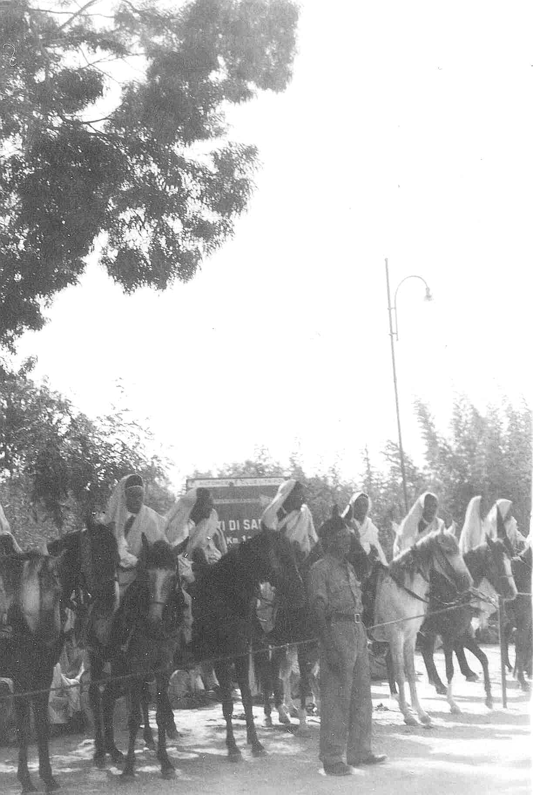
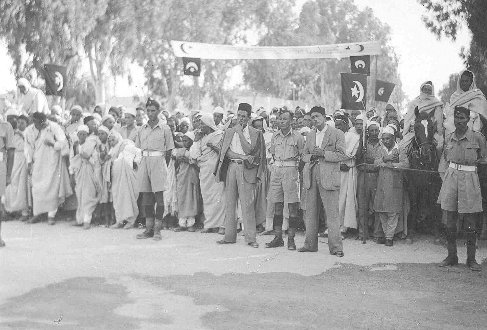
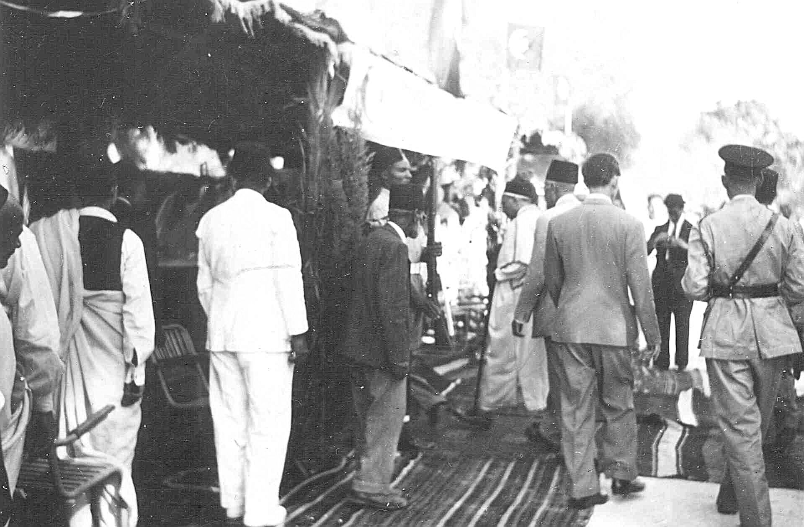
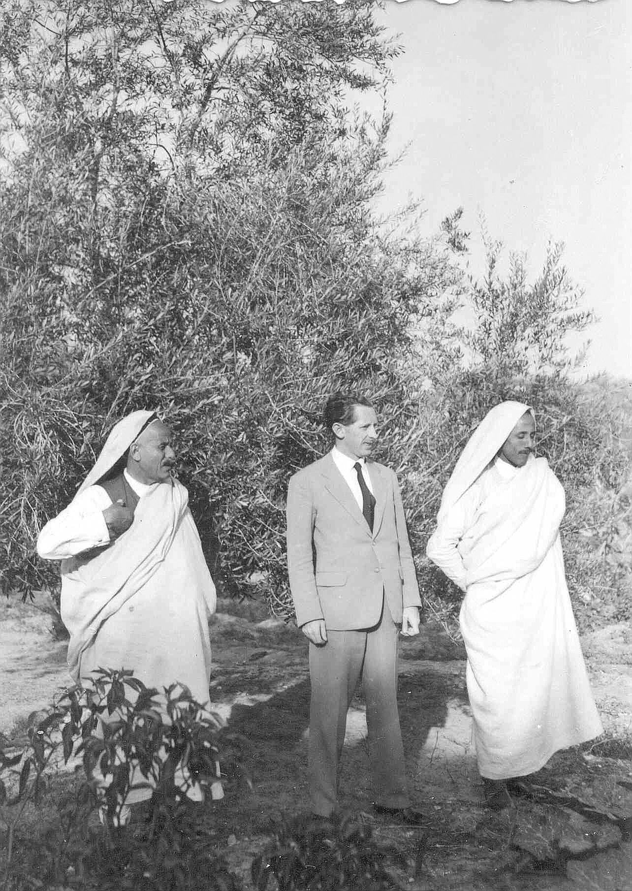
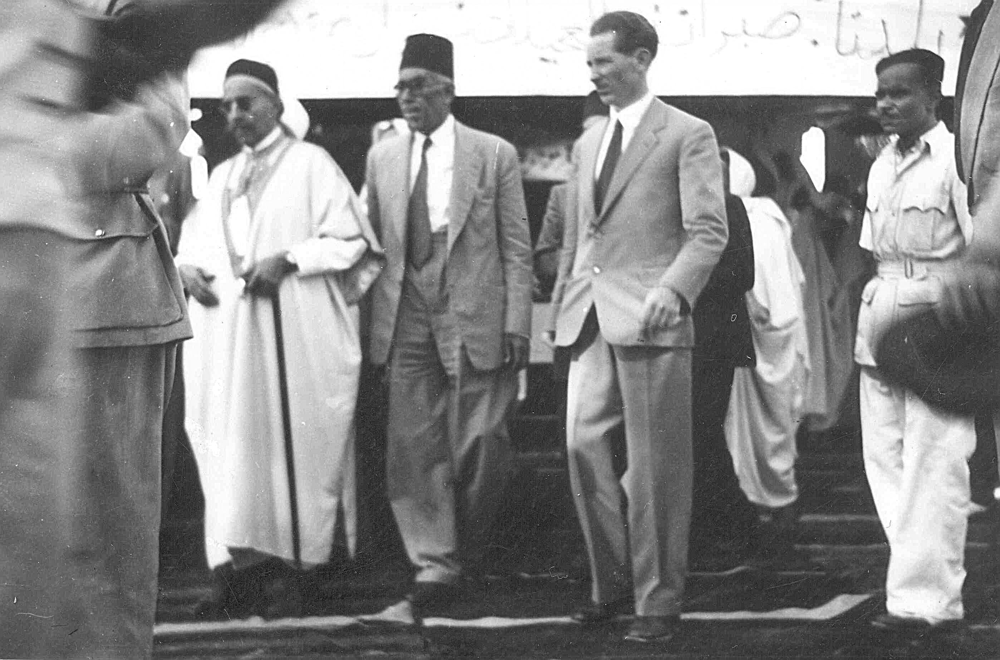
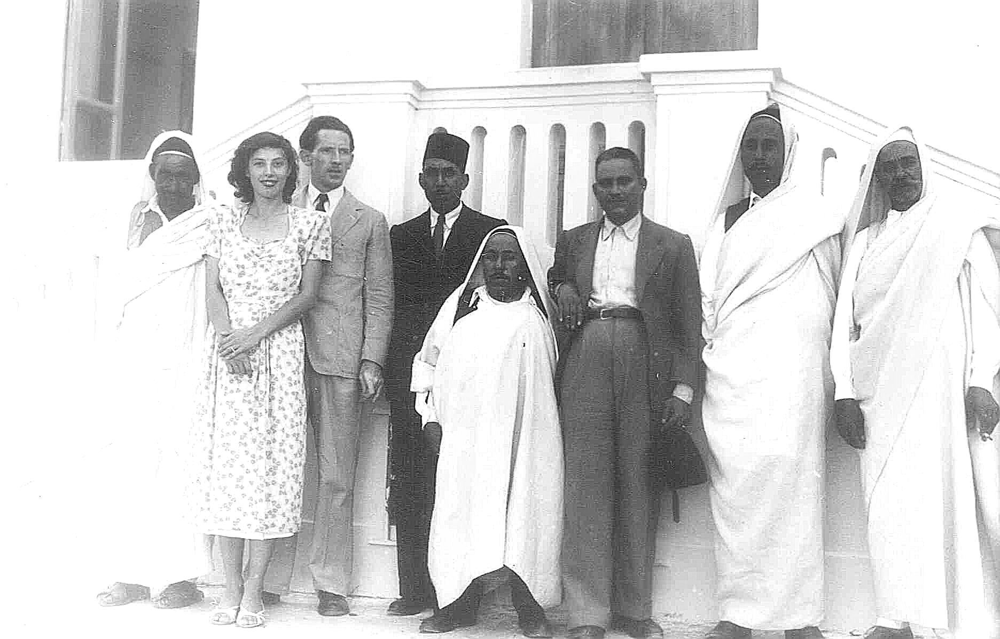
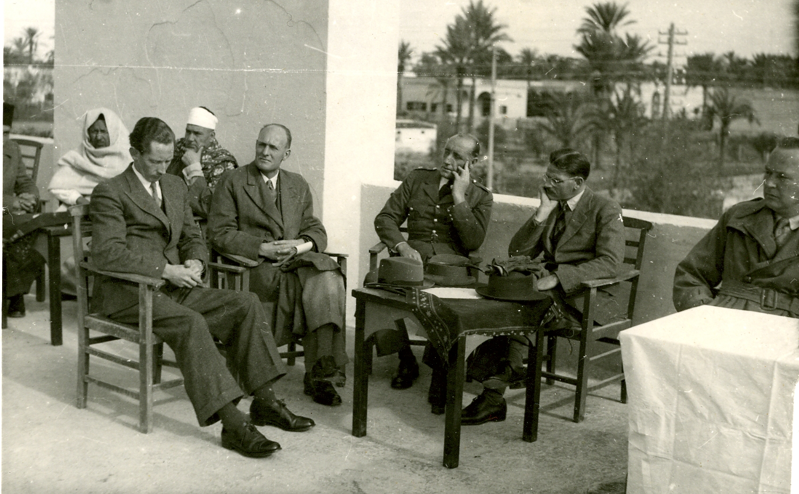
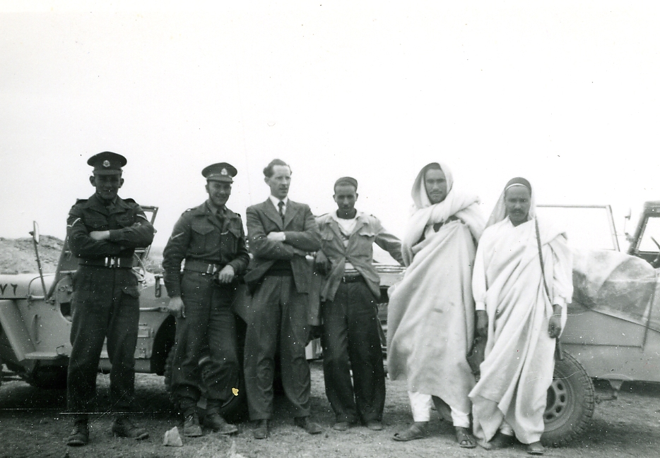

# British Administration of Tripolitania and the Rise of King Idris (1943–1951)

Between the fall of the Italian colonial empire in 1943 and Libyan independence on 24 December 1951, **Britain governed Tripolitania and Cyrenaica** — two of the three historical regions of Libya — through a military and then civil administration staffed by British officers drawn from the Colonial Administrative Service and the Foreign Office.

## The British Military Administration

The Eighth Army drove the last Axis forces from Libya in January 1943. Under international law, occupied territory required military government until a peace treaty determined its future. Britain established the **British Military Administration (BMA)** over Cyrenaica (eastern Libya) and Tripolitania (western Libya, including Tripoli), while France administered the southern Fezzan region.

**Brigadier Travers Robert Blackley** (1899–1982) served as Chief Administrator of Tripolitania throughout the entire 1943–1951 period. His papers, held in the King's College London Archives, include texts of lectures on military government in Tripolitania delivered at the University of Virginia in 1943. Administrative responsibility for the former Italian territories transferred from the War Office to the **Foreign Office** in 1949 — the year [David John Lewis](../people/david-john-lewis.md) was serving as District Officer at Sabratha.

The BMA retained the Italian provincial structure — districts headed by British officers who combined judicial, administrative, and policing functions in the manner of the colonial District Commissioner system used across British Africa. Italian law remained in force where it did not conflict with military government ordinances. Italian street signs, buildings, and infrastructure remained in daily use well into the independence era.

## The Senussi and Emir Idris

**Sayyid Muhammad Idris al-Mahdi al-Senussi** (13 March 1890, Jaghbub – 25 May 1983, Cairo) was the hereditary leader of the **Senussi** religious order, a revivalist Sunni Islamic brotherhood founded by his grandfather and centred in Cyrenaica. The family claimed descent from the Prophet Muhammad through his daughter Fatimah. In 1916 Idris became head of the order, succeeding his cousin Ahmed Sharif, and was recognised by both the British and Italians as **Emir of Cyrenaica** under the Accord of al-Rajma (October 1920).

Tripolitanian leaders first offered Idris the Emirate of Tripolitania in **July 1922**, seeking stability after the collapse of the short-lived Tripolitanian Republic. Idris accepted in November 1922 — but the rise of Mussolini forced him into exile in Egypt the following month. Italy's brutal reconquest followed: the Cyrenaican hinterland was subjugated, livestock decimated, populations interned in concentration camps, and an estimated 12,000 Cyrenaicans executed. The resistance leader **Omar Mukhtar** was hanged in September 1931.

During the Second World War, Idris supported Britain from Cairo. A **Libyan Arab Force** of five infantry battalions volunteered alongside the Allies. After the Axis defeat in North Africa, Britain's political strategy — described by historian Richard Synge as **"Operation Idris"** — prioritised the Senussi as partners for indirect rule. In 1947 Britain facilitated Idris's permanent return from Cairo to Benghazi.

## The Bevin-Sforza crisis (May 1949)

Before Libyan independence was settled, London and Rome attempted a compromise. The **Bevin-Sforza Plan**, published in May 1949, proposed returning Tripolitania to **Italian trusteeship** after the British administration ended in 1951, while Britain would retain trusteeship over Cyrenaica and France over Fezzan — with independence for a unified Libya only after ten years.

The plan provoked **violent demonstrations across Tripolitania and Cyrenaica**. For the population of Tripolitania — and for British District Officers like David Lewis who administered it — the prospect of Italy's return was explosive. Latin American states backed Italian involvement; Asian and Arab states demanded immediate independence and Libyan unity. On **17–18 May 1949**, the UN General Assembly vote failed to produce the necessary two-thirds majority for Italian trusteeship in either Tripolitania or Somaliland, killing the entire plan. The question was postponed to September 1949.

The defeat of Bevin-Sforza opened the door to full Libyan independence under Senussi leadership.

## The Emirate of Cyrenaica (1 March 1949)

On **1 March 1949**, Idris proclaimed the independent **Emirate of Cyrenaica** at a national conference in Benghazi, backed by the United Kingdom. Britain unilaterally declared that it would leave Cyrenaica and grant it independence under Idris's control, calculating that the new emirate would remain within the British sphere of influence.

**Eric Armar Vully de Candole** (1901–1989), formerly of the Sudan Political Service, served as **British Resident** from 1949 to 1951 and continued as Adviser to the King from 1951 to 1954. He received the CBE in 1950 and the CMG in 1952.

The emirate adopted a **black flag bearing a white crescent and star** — the emblem visible in the 1949 photographs from Tripolitania held in this archive. This flag later became the basis for the Libyan national flag at independence, with the addition of red and green stripes representing Tripolitania and Fezzan.

## Idris invited to rule Tripolitania (1949)

Idris had long been reluctant to extend his authority into Tripolitania, where neither he nor the Senussi order enjoyed the deep loyalty they commanded in Cyrenaica. The historian Dirk Vandewalle characterised him as "a well meaning but reluctant ruler" — "a pious, deeply religious, and self-effacing man." Yet unification was the path to internationally recognised sovereignty. With the Bevin-Sforza plan dead and the UN moving towards a single independent Libya, Tripolitanian leaders — largely united under **Selim Muntasser** and the United National Front — agreed to accept Idris as monarch rather than risk further European colonial rule.

This acceptance was marked by **public celebrations across Tripolitania** — ceremonial receptions with mounted processions, Senussi flags and Arabic banners, formal gatherings of British officials and Libyan dignitaries, and popular demonstrations of support for the Emir. The family archive contains thirteen photographs from one such event in 1949, taken during David Lewis's posting as District Officer at Sabratha — direct visual evidence of the ceremony through which Tripolitania accepted Senussi leadership.

## The UN resolution and independence

On **21 November 1949**, the UN General Assembly adopted a resolution stipulating that Libya must become a single independent state by January 1952, led by Idris as king. The Dutch diplomat **Adrian Pelt** (Adriaan Pelt) was appointed **UN Commissioner for Libya** on 10 December 1949, tasked with shepherding the three regions — each with different administrations, legal systems, and political cultures — towards unified independence. Pelt convened a National Constituent Assembly, toured Libya's towns, regions, and tribes, and visited European capitals to coordinate support.

Both the United States and the United Kingdom supported Libyan independence under Idris for **Cold War strategic reasons**: an independent Libya sympathetic to Western interests would permit military bases (Wheelus Air Base for the US, al-Adem for the UK), which would have been impossible under UN trusteeship.

A constitution was adopted in October 1951. On **24 December 1951**, Idris proclaimed the independence of the **United Kingdom of Libya** from the al-Manar Palace in Benghazi — a federal state uniting Cyrenaica, Tripolitania, and Fezzan. Three days later, on 27 December, he was formally enthroned as **King Idris I**. Libya was one of the world's poorest countries at independence — per capita income was $25–35, infant mortality 40%, illiteracy 94% — but the discovery of oil in 1959 would transform its economy within a decade.

The kingdom endured until **1 September 1969**, when Colonel Muammar Gaddafi's *Free Officers* seized power while Idris was abroad for medical treatment in Turkey. Idris was sentenced to death in absentia in 1971. He died in exile in Cairo on 25 May 1983, aged 93, and is buried at al-Baqi' Cemetery, Medina.

## British officers in the transition

The BMA transitioned to a **British Civil Administration** in 1950 before handing authority to the Libyan government at independence. Throughout the transition, British District Officers in Tripolitania — including David Lewis at Sabratha — served as the front-line administrators mediating between London, the UN Commissioner, the emerging Libyan government, and local communities. Many of these officers subsequently transferred to other colonial postings: Lewis moved to Northern Rhodesia in 1952.

## Connection to this family

[David John Lewis](../people/david-john-lewis.md) was appointed to HM Colonial Administrative Service in 1948 and seconded to the **Foreign Office Administration of African Territories**. He served as **District Officer in charge of Sabratha District, Tripolitania** from 1948 to 1950, then as **Magistrate, Western Province, Tripolitania** in 1951. He was present through the Bevin-Sforza crisis, the proclamation of the Emirate of Cyrenaica, and the pivotal 1949 events surrounding Idris's acceptance of the Tripolitanian emirate. The family album preserves [thirteen photographs](../media/docs/david-john-lewis-colonial-service/libya-idris-1949/) from a formal reception in his district — mounted horsemen, Senussi flags, Arabic banners welcoming the Emir, a ceremonial dais, and David photographed **walking alongside Emir Idris himself** and standing with him informally in a garden. David and [Fulvia](../people/fulvia-ottilia-antonia-zerauschek.md) were both photographed with Libyan dignitaries.

Sabratha itself was undergoing a remarkable parallel transformation during David's posting: the British School at Rome conducted **major archaeological excavations of the Roman city** (1948–1951) under Dame **Kathleen Kenyon** and **John Ward-Perkins**, working on the Forum, Capitolium, Theatre, Temple of Serapis, and Byzantine defences — all made possible by the same British administrative framework David operated within. As District Officer, David would have been the local authority responsible for the district in which these excavations took place.

## Sources

- Richard Synge, *Operation Idris: Inside the British Administration of Cyrenaica and Libya, 1942–52* (Silphium Press, 2015; new edition 2021) — based on the diaries of the author's father, who served in the administration. [Publisher](https://www.bilnas.org/shop/silphium-press/operation-idris-inside-the-british-administration-of-cyrenaica-and-libya-1942-52-new-edition/)
- Adrian Pelt, *Libyan Independence and the United Nations: A Case of Planned Decolonization* (Yale University Press, 1970) — the UN Commissioner's own account. [LIAS](https://liasinstitute.com/libyan-independence-and-the-united-nations-by-adrian-pelt/)
- Philip M. Kenrick, *Excavations at Sabratha 1948–1951* (Society for the Promotion of Roman Studies, 1986) — archaeological work contemporaneous with Lewis's posting. [ADS](https://archaeologydataservice.ac.uk/library/browse/issue.xhtml?recordId=1161456&recordType=MonographSeries)
- Francesco Tamburini, "The United Nations, Italian decolonization, and the 1949 Bevin-Sforza plan" in *Italy's Colonial Legacy* (Routledge) — the failed trusteeship scheme.
- [Idris of Libya — Wikipedia](https://en.wikipedia.org/wiki/Idris_of_Libya)
- [Emirate of Cyrenaica — Wikipedia](https://en.wikipedia.org/wiki/Emirate_of_Cyrenaica)
- [British Military Administration (Libya) — Wikipedia](https://en.wikipedia.org/wiki/British_Military_Administration_(Libya))
- [Allied administration of Libya — Wikipedia](https://en.wikipedia.org/wiki/Allied_administration_of_Libya)
- [Adrian Pelt — Wikipedia](https://en.wikipedia.org/wiki/Adrian_Pelt)
- [Idris I — Encyclopaedia Britannica](https://www.britannica.com/biography/Idris-I-king-of-Libya)
- **The National Archives (TNA):** [FO 1015](https://discovery.nationalarchives.gov.uk/details/r/C8314) — War Office and Foreign Office, Administration of African Territories: Registered Files (1,033 files, 1915–1952). Covers Cyrenaica, Tripolitania, Eritrea, and Somalia. Contains official correspondence, district reports, and intelligence from the British administration in which David Lewis served. [FO 1021](https://discovery.nationalarchives.gov.uk/details/r/C8320) — Foreign Office: Embassy and Residency, Libya: General Correspondence (1947–1970).
- **King's College London Archives:** papers of Brigadier Travers Robert Blackley, Chief Administrator of Tripolitania.
- Family archive: [Libya–Idris 1949 photographs](../media/docs/david-john-lewis-colonial-service/libya-idris-1949/) (13 images, Africa Album 01)
- Family archive: [Tripolitania additional photographs](../media/docs/david-john-lewis-colonial-service/tripolitania/) (6 images) — British officers with Libyan leaders, formal events, speeches with Arabic script, desert group with military vehicles, colonial events with soldiers on guard. Separate from the Idris reception series.
