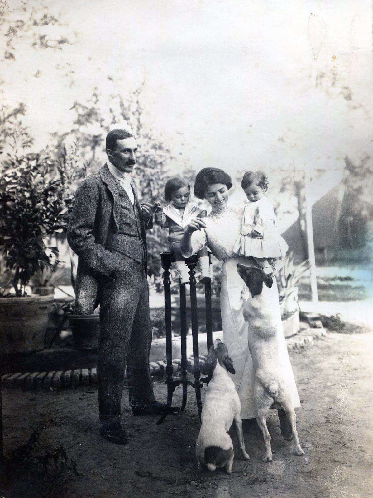
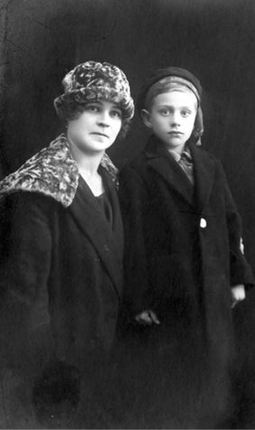

# Mahmoudieh (Tehran)

A Qajar-period **garden estate** (*Qasr-e Mohammadieh* → **Mahmoudieh**) in northern **Shemiran**, built by **Mohammad Shah Qajar** (d. 1848), passed through elite owners, acquired by **Dr. Étienne Stump** c. 1918, and subdivided after his death into the modern **Mahmoudieh neighbourhood**. The southwestern corner became the site of the **Royal Tehran Hilton** (1962, now **Hotel Esteghlal**).

---

## Geography

The estate occupied hillside land on Tehran's north slope, roughly bounded by:

- **East:** Vali-Asr Street (Valiasr)
- **West:** Chamran Expressway / Evin–Darakeh foothills
- **South:** Chaharrah Park Way (Park-Vi crossroads) — today the Hotel Esteghlal site
- **North:** rising toward Tajrish (Bagh-e Ferdows area) and Evin village

Modern **Mahmoudieh district** covers much of the original footprint at roughly **~1600 m** elevation, about **2 km southwest of Tajrish**.

**Reference coordinates** (approximate estate corridor, not a single building):

| Anchor | Lat / Lon |
|--------|-----------|
| Bagh-e Ferdows (Tajrish) — NE anchor | ~35.79° N, 51.42° E |
| Evin — NW anchor | ~35.796° N, 51.389° E |
| Hotel Esteghlal (Park Way / Vali-Asr) — SW corner | ~35.783° N, 51.409° E |

No surviving cadastral map details the exact borders. Descriptions imply the estate stretched several hundred metres from the Park Way intersection northward, covering much of the present district. By the 2020s almost all original gardens are built over.

**Published neighborhood-level sources:**

- **English Wikipedia** ([Mahmoodieh](https://en.wikipedia.org/wiki/Mahmoodieh)): south of **Zaferaniyeh**; Valiasr east; Velenjak west; Chamran south; close to Tajrish; 1950s shift to year-round wealthy residences; large plots and gardens; since the 1990s–2000s villas demolished for towers.
- **Persian Wikipedia** ([محمودیه (تهران)](https://fa.wikipedia.org/wiki/%D9%85%D8%AD%D9%85%D9%88%D8%AF%DB%8C%D9%87_(%D8%AA%D9%87%D8%B1%D8%A7%D9%86))): similar boundaries (adds Park-Ve crossroads south, Haj Mahmoud Keshtkar lands east); ~1600 m elevation; historically ~2 km southwest of Tajrish as village and gardens.

---

## Ownership timeline

| Period | Owner / Use | Sources | Confidence |
|--------|-------------|---------|------------|
| c. 1838–1848 | Built by **Mohammad Shah** as **Qasr-e Mohammadieh** (palace-garden) on land previously belonging to the **Mo'ayyer al-Mamalek** family. Shah **never lived there** (Mustowfi); Hamshahri adds death of **gout on entering** (1848). Estate left abandoned / ill-omened. | [Mustowfi vol. 1, p. 51](../sources/corpus/mustowfi-mahmoudieh-dr-stemp-dli-508037/translation.en.md) · [facsimile](../media/docs/mustowfi/mustowfi-mahmoudieh-dr-stemp-p51-facsimile.png); [Hamshahri (2022)](../sources/hamshahri-mahmoudieh-stump.md) · [translation](../sources/corpus/hamshahri-mahmoudieh-stump/translation.en.md). | High |
| 1850s–1880s | Estate sold post-1848 to **Mohammad Rahim Khan Ala-ud-Dowleh** (chamberlain under Naser al-Din Shah). His youngest son **[Mahmoud Alamir](https://en.wikipedia.org/wiki/Mahmoud_Alamir)** (*Ehtesham al-Saltana*, 27 Jan 1863 – 26 Jan 1936; Qajar diplomat, 2nd Speaker of Parliament, ambassador to the Ottoman Empire 1910–19) builds a new wing and renames it **Mahmoudieh**. | [Mustowfi p. 51](../sources/corpus/mustowfi-mahmoudieh-dr-stemp-dli-508037/translation.en.md); [Hamshahri (2022)](../sources/hamshahri-mahmoudieh-stump.md); [Iranica — Ehtesham al-Saltana](https://iranicaonline.org/articles/ehtesam-al-saltana-1); [Wikipedia](https://en.wikipedia.org/wiki/Mahmoud_Alamir). | High |
| 1880s–1910s | Alamir sells lands to **Mirza Fath'ali Khan Sahebdivan** (former court official) and others. **[Mohammad Hossein Amin al-Zarb](https://en.wikipedia.org/wiki/Haj_Mohammad_Hassan_Amin-Alzarb)** (1872–1932, son of the original financier) acquires parts. By 1920 most plots have new owners. | [Hamshahri (2022)](../sources/hamshahri-mahmoudieh-stump.md). | High |
| c. 1918–1930 | **Dr. Étienne Stump** (Swiss dentist, Ahmad Shah's dentist) buys a large portion from **Mohammad Hossein Amin al-Zarb**. Builds a villa; farms the land. | [Hamshahri (2022)](../sources/hamshahri-mahmoudieh-stump.md); [Beytoote / Sayyah](../sources/corpus/beytoote-stump-dentist-atabak-ahmadshah/translation.en.md); [TUMS dental history](https://dentistry.tums.ac.ir/uploads/438/2024/Oct/19/new%20booklet.pdf). | High |
| c. 1930s | After Stump's death, heirs subdivide and sell the estate in small lots. Mahmoudieh becomes a residential neighbourhood. | [Hamshahri](../sources/hamshahri-mahmoudieh-stump.md). | High |
| 1920s–1930s | **[Vera Obolensky](../people/vera-obolensky.md)** (née Nemtchinova, Russian émigré) managed a **40+ room guesthouse** on Stump's estate, catering to European business travelers. Later married Stump. | Georges Obolensky, *Forever Russian* (AuthorHouse, 2013); [NYT obit (1974)](../sources/corpus/vera-obolensky-death-notice-nytimes-2644e85dac/); [source card](../sources/vera-obolensky-tehran.md). | High |
| 1962 | **Royal Tehran Hilton** (now **Parsian Esteghlal Hotel**) opens on the estate's SW corner at Park Way / Vali-Asr. | [Persian Wikipedia — Hotel Esteghlal](https://fa.wikipedia.org/wiki/%D9%87%D8%AA%D9%84_%D9%BE%D8%A7%D8%B1%D8%B3%DB%8C%D8%A7%D9%86_%D8%A7%D8%B3%D8%AA%D9%82%D9%84%D8%A7%D9%84); [Shahbazi blog](https://www.darioush-shahbazi.com/articles/%D9%87%D8%AA%D9%84-%D9%87%DB%8C%D9%84%D8%AA%D9%88%D9%86-%D8%AA%D9%87%D8%B1%D8%A7%D9%86); [Wikipedia (EN)](https://en.wikipedia.org/wiki/Parsian_Esteghlal_International_Hotel). | High |
| Post-1979 | Hilton nationalized and renamed **Hotel Esteghlal** after the Revolution; remains on land originally part of Mahmoudieh. | Wikipedia; general history. | High |

---

## Disambiguation

- **Masoudieh** (palace): Built by **Mass'oud Mirza Zell-e Soltan**, **Baharestan** area, **1870s** — a different building and family entirely. See [Masoudieh Mansion](https://en.wikipedia.org/wiki/Masoudieh_Mansion).
- **Mahmoudieh / Mahmoodieh**: this page covers the north Shemiran district name and the specific Qajar estate narrative.

---

## Qajar palace lore (*Muhammadieh*) vs. naming of the district

**Persian Wikipedia** (history section) states that in Mohammad Shah's time a palace called **Muhammadieh** was built in this area; the shah **died in connection with entering it**, after which the palace stood **derelict** (*متروکه*). The area was earlier known as **ʿAbbāsiyeh**, linked to **Haj Mirza Aqasi** (Muhammad Shah's minister). The same article records alternative etymologies: a Reza Shah–era story about a resident named Mahmoudieh, and a line that **Haj Mahmoud Keshtkar**'s lands explain the name. It also notes **Amin al-Zarb** purchasing parts of Mahmoudieh lands and an **1279 AH** electric plant near **Dr. Hesabi** intersection — without tying those threads directly to Stump.

**Mustowfi, vol. 1, p. 51** ([full record](../sources/corpus/mustowfi-mahmoudieh-dr-stemp-dli-508037/) · [translation](../sources/corpus/mustowfi-mahmoudieh-dr-stemp-dli-508037/translation.en.md) · [facsimile](../media/docs/mustowfi/mustowfi-mahmoudieh-dr-stemp-p51-facsimile.png)): Mohammad Shah built **Mohammadieh** between **Bagh-e Ferdous (Tajrish)** and **Evin** and **never lived there**; each buyer met misfortune (*ناخوش‌بوم* / *بدیمن*); **Mahmoud Alamir** (*Ehtesham al-Saltana*) renamed it **Mahmoudieh**; lands **belong to Dr. Stemp the dentist** at time of writing (*فعلاً*). Printed p. 51 = PDF p. 72 in IA holder `dli.ernet.508037`.

**Hamshahri Online (2022)** ([source card](../sources/hamshahri-mahmoudieh-stump.md) · [translation](../sources/corpus/hamshahri-mahmoudieh-stump/translation.en.md)): expands this with the full ownership chain — Ala-ud-Dowleh → Mahmoud Alamir → Sahebdivan → Amin al-Zarb → Stump — shah **gout on entering** variant; pins the Hotel Esteghlal to the estate's southern edge.

**Legacy email** ([mustawfi-mahmoudieh-stump.md](../sources/mustawfi-mahmoudieh-stump.md)): Mahdavi → Henderson paraphrase — now superseded for citation by the Mustowfi source record above.

---

## Hotel Esteghlal (ex-Hilton) connection

All evidence points to the same plot at **Park Way / Vali-Asr** as the former estate's southern tip. Persian sources explicitly state "in the south of the Mahmoudieh lands (at Park Way intersection) lies the Hotel Esteghlal (ex-Hilton)." English Wikipedia confirms the hotel opened in **1962** as **Royal Tehran Hilton** and remains a landmark five-star hotel. The **1961 Abbas Sahab map** of central Tehran shows the area before the Hilton's construction; the southwest corner (Park Way / Chamran / Vali-Asr) where the hotel now stands lay on the edge of the estate.

After the 1979 Revolution the hotel was nationalized and renamed **Hotel Esteghlal** (Parsian Esteghlal International Hotel). It continues to occupy land that was originally part of the Mahmoudieh garden.

| Source | URL | Detail |
|--------|-----|--------|
| Persian Wikipedia — Hotel Esteghlal | [fa.wikipedia.org](https://fa.wikipedia.org/wiki/%D9%87%D8%AA%D9%84_%D9%BE%D8%A7%D8%B1%D8%B3%DB%8C%D8%A7%D9%86_%D8%A7%D8%B3%D8%AA%D9%82%D9%84%D8%A7%D9%84) | "on the south of Mahmoudieh" |
| English Wikipedia — Parsian Esteghlal | [en.wikipedia.org](https://en.wikipedia.org/wiki/Parsian_Esteghlal_International_Hotel) | Opened 1962 as Royal Tehran Hilton |
| Darioush Shahbazi blog | [darioush-shahbazi.com](https://www.darioush-shahbazi.com/articles/%D9%87%D8%AA%D9%84-%D9%87%DB%8C%D9%84%D8%AA%D9%88%D9%86-%D8%AA%D9%87%D8%B1%D8%A7%D9%86) | Hotel history and location |

---

## Dr. Stump's villa (memoir and newspaper accounts)

- **Abdollah Mustowfi**, *Sharh-e Zendegani-ye Man*, **vol. 1, p. 51** — [Mustowfi source record](../sources/corpus/mustowfi-mahmoudieh-dr-stemp-dli-508037/) · [Persian transcription](../sources/corpus/mustowfi-mahmoudieh-dr-stemp-dli-508037/transcription.fa.md) · [English translation](../sources/corpus/mustowfi-mahmoudieh-dr-stemp-dli-508037/translation.en.md) · [page facsimile](../media/docs/mustowfi/mustowfi-mahmoudieh-dr-stemp-p51-facsimile.png) · [full PDF](../media/docs/mustowfi/dli-508037-sharh-zendegani-vol1-text.pdf). Scholarly English: **Abdollah Mostofi**, *Administrative and Social History of the Qajar Period* (3 vol.), tr. Nayer Mostofi-Glenn, **Mazda Publishers**, **1997**, ISBN **1-56859-041-5** — [publisher page](http://www.mazdapublishers.com/book/administrative-and-social-history-of-the-qajar-period).
- **Dr. Mohsen Sayyah** (c. 1927, via Beytoote): Stump built a **magnificent villa in old Mahmoudieh between Tajrish and Evin**, with valuable antiques and precious carpets. See [Beytoote translation](../sources/corpus/beytoote-stump-dentist-atabak-ahmadshah/translation.en.md) §4.
- **Hamshahri Online (2022)** ([translation](../sources/corpus/hamshahri-mahmoudieh-stump/translation.en.md)): Stump bought a large portion from **Mohammad Hossein Amin al-Zarb** (محمدحسین امین‌الضرب, 1872–1932); built a house and farmed there.

---

## The Mahmoudieh guesthouse and Vera Obolensky

**[Vera Obolensky](../people/vera-obolensky.md)** (née Nemtchinova), a Russian émigré, managed a large European-style guesthouse (**40+ single cabins**) on the Mahmoudieh estate from the **mid-1920s** through Stump's death (**1951**). Georges Obolensky's memoir is the primary English account:

> Soon after my father's death, my mother was asked to manage a **bed-and-breakfast-type hotel with 40 plus single cabins** … She had **no problems attracting guests who were sent by their respective companies from Europe for short-term assignments** … very successful in **helping her business guests deal with the Persian bureaucracy** … an **Armenian assistant who was fluent in Farsi and Russian**.

([*Forever Russian*, ch. 1 — full transcription](../sources/corpus/forever-russian-stump-extract/transcription.md))

**Stump** owned the estate and the lodging operation; **Vera** ran and expanded it. His **clinic** remained downtown on **Lalezar** (see Beytoote §5 — Kamareh'i). The guesthouse targeted **European company men**, not the shah's court — a parallel hospitality business on the same hillside that later became a wealthy neighbourhood.

**Vera's background:** Born into Russian nobility (likely 1890s), she married **Prince Yuri Obolensky** before WWI. They fled the 1917 Revolution via the Caucasus to Tehran. Their son **Georges (Yuri) Obolensky** was born in Tehran in 1920. After Prince Yuri's death (~1925, malaria), Vera remained as widow and innkeeper. She later married Stump. **Note:** the Ancestry record for Georges lists his mother as "Vera Nemtchinova" — this is **not** the ballerina [Vera Nemtchinova](https://en.wikipedia.org/wiki/Vera_Nemtchinova) (1899–1984), who is a different person.

**Sources:** Georges Obolensky, *Forever Russian* (AuthorHouse, 2013); [NYT death notice (14 Nov 1974)](../sources/corpus/vera-obolensky-death-notice-nytimes-2644e85dac/); ["Princess Obolensky" (ProQuest)](../sources/corpus/princess-obolensky-abbcc58ed8/); [Vera person page](../people/vera-obolensky.md); [Mahmoudieh album](../media/albums/etienne-house/).

---

## Modern fate

Published descriptions (EN/FA Wikipedia) confirm: large gardens and villas in Mahmoudieh are increasingly replaced by residential towers (pattern accelerating since the 1990s). Nothing in these general articles establishes that Stump's villa survives.

---

## Further reference (encyclopedia pointer)

The **Great Tehran Encyclopedia** (*Daneshnameh-ye Tehran-e Bozorg*) has an entry **«محمدیه، قصر»** (*Mohammadieh, Palace*) by **Golareh Moradi** (گلاره مرادی), in **Vol. 2 (Shemiranat)**, p. **358** — [CGIE publication index](https://www.cgie.org.ir/fa/publication/entryview/29088) ([Wayback](https://web.archive.org/web/20171222052659/https://www.cgie.org.ir/fa/publication/entryview/29088)). Full text is behind the CGIE reader; purchase the volume or access at a library holding the set. See also [Ehtesham al-Saltana article](https://iranicaonline.org/articles/ehtesam-al-saltana-1) (Encyclopaedia Iranica) for Mahmoud Alamir's biography.

---

## Family

- [Étienne Stump](../people/etienne-stump.md)
- [Vera Obolensky](../people/vera-obolensky.md)

---

## Primary email export (2008)

- HTML/XML: [media/albums/etienne-house/Mahmoudieh - Copy.html](../media/albums/etienne-house/Mahmoudieh%20-%20Copy.html) · [Mahmoudieh.xml](../media/albums/etienne-house/Mahmoudieh.xml)
- Correspondent: **Shireen Mahdavi** (SKhistory@aol.com) to **John Henderson**; subject *Re: FW: Edward Burgess Letters* (August 2008).

---

## Sources

| Source | Location | Note |
|--------|----------|------|
| Mustowfi — vol. 1, p. 51 (DLI 508037) | [Mustowfi source record](../sources/corpus/mustowfi-mahmoudieh-dr-stemp-dli-508037/) · [source card](../sources/mustowfi-mahmoudieh-dr-stemp-dli-508037.md) | Primary Persian; facsimile + translation; legacy email [mustawfi-mahmoudieh-stump.md](../sources/mustawfi-mahmoudieh-stump.md) |
| Hamshahri Online (2022) | [source card](../sources/hamshahri-mahmoudieh-stump.md) · [full record](../sources/corpus/hamshahri-mahmoudieh-stump/) · [translation](../sources/corpus/hamshahri-mahmoudieh-stump/translation.en.md) | Ownership chain; ingested via Wayback Machine |
| Beytoote — Stump / Sayyah | [Beytoote source record](../sources/corpus/beytoote-stump-dentist-atabak-ahmadshah/) · [translation](../sources/corpus/beytoote-stump-dentist-atabak-ahmadshah/translation.en.md) | §4: villa in old Mahmoudieh |
| TUMS dental history booklet | [PDF](https://dentistry.tums.ac.ir/uploads/438/2024/Oct/19/new%20booklet.pdf) | Confirms dental school co-founding |
| Shahbazi blog | [darioush-shahbazi.com](https://www.darioush-shahbazi.com/articles/%D9%87%D8%AA%D9%84-%D9%87%DB%8C%D9%84%D8%AA%D9%88%D9%86-%D8%AA%D9%87%D8%B1%D8%A7%D9%86) | Hotel Hilton / Esteghlal history |
| NYT death notice — Vera Obolensky (14 Nov 1974) | [NYT death notice](../sources/corpus/vera-obolensky-death-notice-nytimes-2644e85dac/) | Image-only PDF; read visually |
| "Princess Obolensky" — ProQuest article | [ProQuest article](../sources/corpus/princess-obolensky-abbcc58ed8/) | Contemporaneous press; image-only PDF |
| Georges Obolensky, *Forever Russian* (AuthorHouse, 2013) | Memoir (not in repo; e-book $3.99) | Primary source for guesthouse, Vera's life |
| Portrait — Vera & Georges, c. 1920s | [media/collections/stump-etienne/vera-obolensky-and-georges.png](../media/collections/stump-etienne/vera-obolensky-and-georges.png) | Photo |
| Vera Obolensky synthesis PDF | [manual/Vera Obolensky…pdf](../manual/Vera%20Obolensky%20%E2%80%93%20Russian%20%C3%89migr%C3%A9%20in%20Tehran.pdf) | Research document |
| Wishlist — acquirables | [sources/wishlist/mahmoudieh-mustawfi-house.md](../sources/wishlist/mahmoudieh-mustawfi-house.md) | Books and archives to pursue |
| Manual synthesis PDF | [manual/Mahmoudieh…pdf](../manual/Mahmoudieh_Muhammadieh%20Estate_%20Location%2C%20Ownership%2C%20and%20Transformation.pdf) | Consolidated research document |

## Catalog

- [archive/index.md](../archive/index.md) — Mahmoudieh file table
