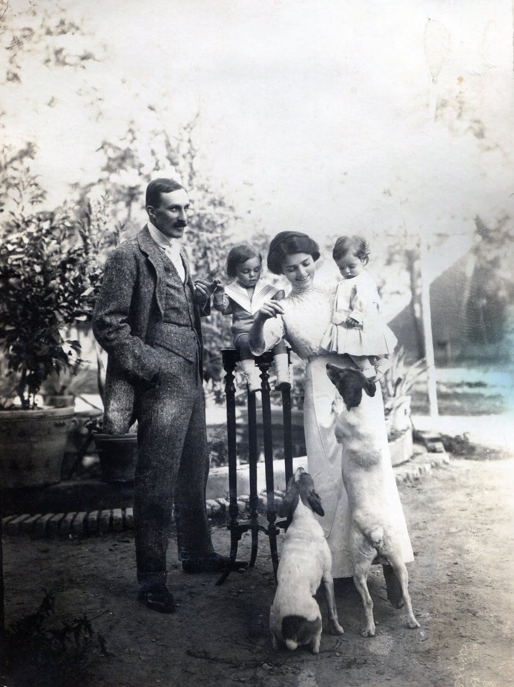

# Modern dentistry in Iran

European-trained dentists introduced Western dental practice to Iran in the second half of the nineteenth century. **Dr Étienne Stump** — Swiss-born, American-trained, recruited in New York — became Ahmad Shah's personal dentist and one of the first to teach Iranian practitioners. He spent nearly half a century in Tehran, accumulating land, a medical practice, and a complicated legacy.

---

## Three generations of foreign dentists

Persian dental history typically identifies three waves of European dentists:

| Generation | Dentist | Origin | Patron / Period |
|------------|---------|--------|-----------------|
| First | **Dr Hybenette** | Swedish | **Naser al-Din Shah** (mid-19th c.) |
| First | **Tolozan** / **"Sāpīvafor"** (Mosannen al-Saltana) | French technician | Brought by grand vizier's envoy, **1856–1860**; dentures and teaching in Tehran |
| Second | **Dr Étienne Stump** | Swiss (often misprinted as Austrian) | **Atabak-e A'zam**, then **Ahmad Shah** |
| Second | **Dr Melczarski** | Polish | Contemporary and rival of Stump |
| Second | **Dr Stepanian** | Armenian-Iranian | Trained locally; licensed 1921 |

The **Encyclopaedia Iranica** article on dentistry records: "Drs. Melczarski, a Pole, and Stump, an Austrian, arrived in Persia to treat patients and to train Persian dentists." The vault corrects the nationality: Stump was born in **[Tallinn](../stories/stump-thurgau-tallinn-baltic-line.md)** (then Reval, Russian Empire) on **7 March 1880** to a Swiss family and held **Swiss** citizenship throughout his life. The "Austrian" label likely arose from confusion with his Baltic German milieu.

## Stump's arrival and career

The **Beytoote/Sayyah** synthesis and **Najm-Abadi** provide the clearest account of Stump's recruitment:

- **1902**: Stump graduates from a dental school in **Chicago** (possibly under a *mandamus* arrangement).
- **1904**: **Atabak-e A'zam** (Amin al-Soltan) and **Mokhbar al-Saltaneh Hedayat** travel to New York; they hire Stump.
- Stump arrives in Tehran and becomes **Atabak's personal dentist**. After the **assassination of Atabak** in **1907**, he stays on and transitions to serving **Ahmad Shah**.
- His clinic stood at the intersection of **Manuchehri** and **Ferdowsi** streets; he maintained a garden at **Fisherabad–Iranshahr**.

**Elgood** credits Stump as the **first dentistry teacher at the Dar al-Fonun** — though the exact dates and curriculum are not well documented.

## The rivalry with Melczarski

**Dr Mohsen Sayyah** (writing c. **1927**) describes Stump as one of only **three qualified dentists** in Tehran at that time. The others were Melczarski and Stepanian. The relationship with **Melczarski** was competitive:

- **1916 (1334 AH)**: Stump and Stepanian jointly proposed a dental school to the **Ministry of Education** — a proposal that predates the founding of the school eventually established under Melczarski's leadership.
- Sayyah suggests Stump was **excluded from the examining board** and the founding of the formal dental school, possibly through Melczarski's influence.

The **TUMS Faculty of Dentistry** historical booklet acknowledges Stump's role in the institutional narrative.

## The Kamareh'i account (1917–1920)

**Kamareh'i** records Stump in this period as running a busy practice at the end of **Lalezar** street, near **Moshir al-Dowleh**. He employed an assistant named **Monsieur Gol**. A full set of porcelain teeth cost **35 tomans**.

## World War I incident

On **11 August 1915**, Stump was **arrested** alongside the Ottoman ambassador and an Austrian military attaché at **Vardavard** and taken to **Qazvin**. He was released after establishing his **Swiss** nationality — a distinction that saved him from internment.

## The Mahmoudieh connection

Sayyah also records that Stump built a "magnificent villa in old [Mahmoudieh](mahmoudieh-house.md) between Tajrish and Evin," with valuable antiques and carpets. He purchased a large portion of the estate from **Mohammad Hossein Amin al-Zarb** and farmed the land. After his death in **1951**, the heirs subdivided the property into the modern Mahmoudieh neighbourhood.

## Family

- **[Étienne Stump](../people/etienne-stump.md)** (1880–1951)
- First wife: **[Henriette Bottin](../people/henriette-bottin.md)**, daughter of **[Julien Bottin](../people/julien-bottin.md)** and **[Fanny Burgess](../people/fanny-burgess.md)**
- Second wife: **[Vera Obolensky](../people/vera-obolensky.md)** (née Nemtchinova), Russian émigré

## Sources

| Source | Location |
|--------|----------|
| Encyclopaedia Iranica — "Dentistry" | [source card](../sources/iranica-dentistry.md) · [corpus](../sources/corpus/iranica-dentistry-article/) |
| Beytoote / Sayyah / Najm-Abadi synthesis | [corpus](../sources/corpus/beytoote-stump-dentist-atabak-ahmadshah/) · [translation](../sources/corpus/beytoote-stump-dentist-atabak-ahmadshah/translation.en.md) |
| Hamshahri — Mahmoudieh / Stump (2022) | [source card](../sources/hamshahri-mahmoudieh-stump.md) · [translation](../sources/corpus/hamshahri-mahmoudieh-stump/translation.en.md) |
| TUMS Faculty of Dentistry history booklet | [PDF](https://dentistry.tums.ac.ir/uploads/438/2024/Oct/19/new%20booklet.pdf) |

## Narrative

- [Saginian → Burgess → Bottin → Stump](../stories/saginian-burgess-bottin-stump.md) — §4
