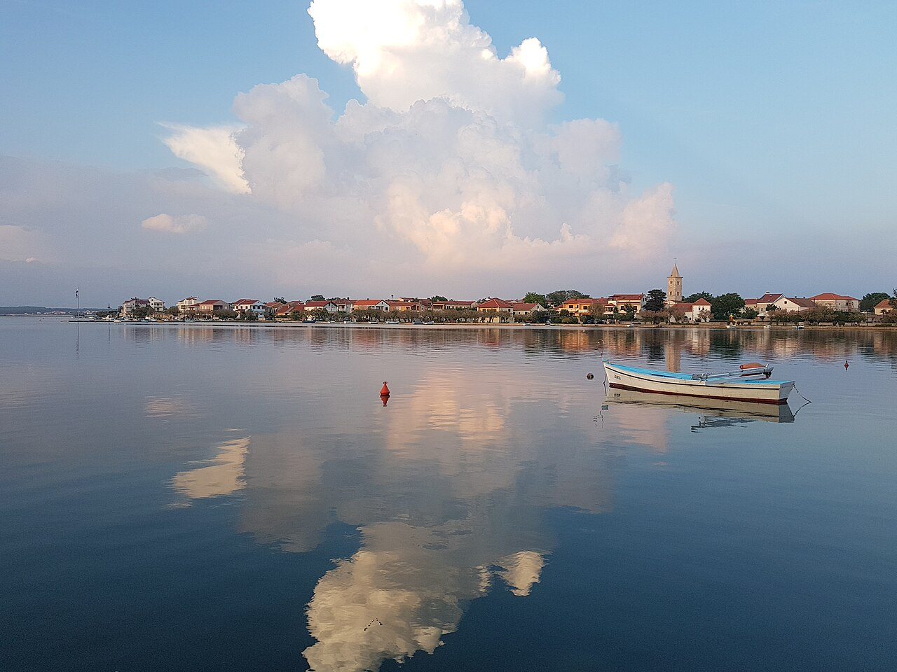
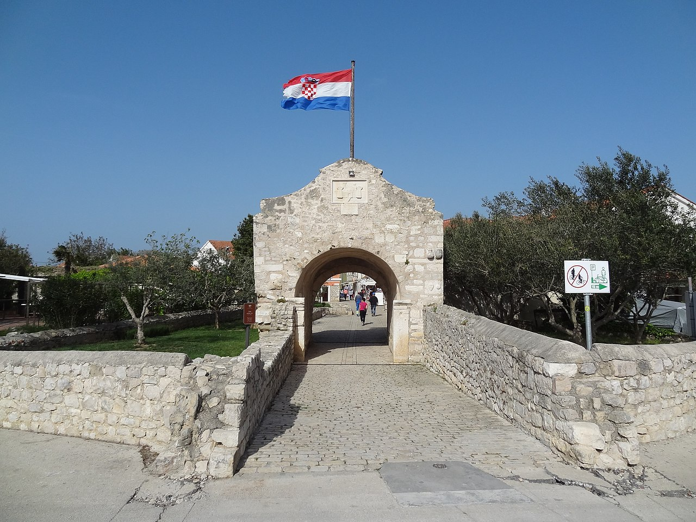
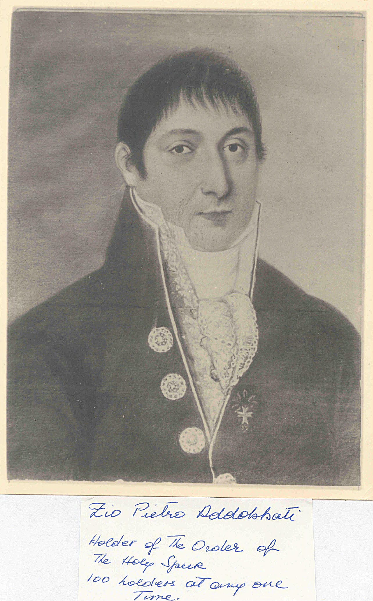
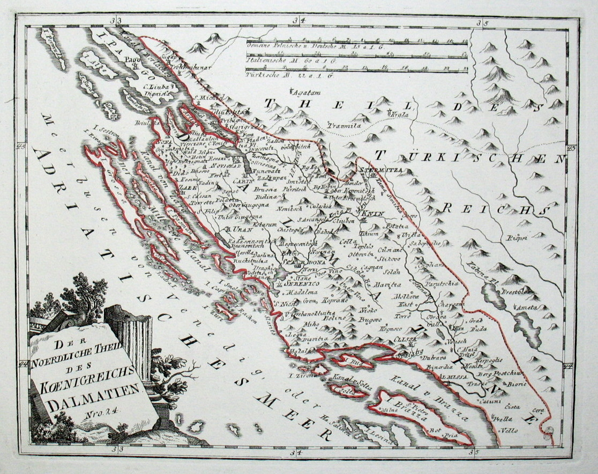
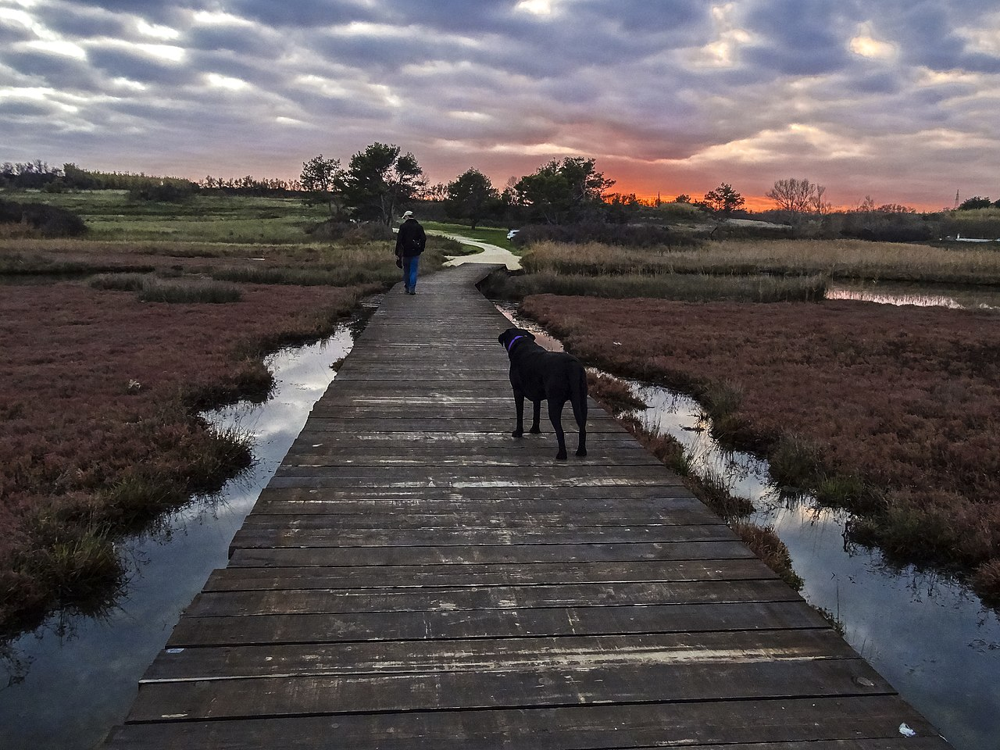

# Nin — the noble council of a Dalmatian commune

**Nin** (Italian: **Nona**) is a small fortified town on the Dalmatian coast, 15 km northwest of Zadar, built on a tiny island in a shallow lagoon and connected to the mainland by two stone bridges. Despite its size, Nin was one of the oldest Croatian royal cities — an early seat of the Croatian bishops and of the medieval Nin commune, whose noble council (*Veliko vijeće*, *Consiglio dei nobili*) carried ancient standing equal in rights and privileges to the patrician bodies of larger Dalmatian cities like Zadar, Trogir, Split, and Kotor.

The council matters to this family history because two of its members — **Dr. Petar** and **Ivan Vicko Addobbati**, sons of Luigi (Lujo) — were inscribed as nobles of Nin on **24 June 1804**, and the family's petition papers ended up in the Addobbati fonds at the Državni arhiv u Zadru, where they remain today.

*Nin seen from across the lagoon. The entire old town occupies an island 500 metres across.*

---

## Origins of the council

Nin's noble council was fully constituted by the fourteenth century as a hereditary body with defined civic duties and offices, its membership closed to outsiders except by formal vote of admission. Like other Dalmatian communal councils, it functioned as a *staleška skupština* — a corporate assembly of nobles who monopolised municipal governance.

The Ottoman-Venetian wars of the fifteenth through seventeenth centuries devastated Nin and its hinterland. By the time of the Cretan War (1645–1669) the old noble families had been so depleted that in **1656** the council met "in exile" in Zadar to reconstitute itself, admitting new families to fill the emptied seats. Admissions continued through the eighteenth century under both Venetian and First Austrian rule, with the last intake occurring during the First Austrian administration (1797–1806).

The council met for the last time on **28 October 1806**, when Napoleon's administration abolished all communal noble councils in Dalmatia.

*The Lower City Gate (*Donja gradska vrata*) — the medieval entrance to Nin across the lagoon channel, still standing.*

---

## The Addobbati and Nin

The Addobbati arrived in Zadar as **Venetian cavalry officers** in the 1730s, were admitted to the Zadar *cittadini* (citizen council) in **1733**, and maintained their standing as *cives originarios* backed by a **1745 Bergamo testimonial**. They were connected by marriage to established Nin noble families — **Marchi, Pasini, and Canova** — and through those ties petitioned the Venetian authorities in **1793** for admission to the Nin council.

On **24 June 1804**, brothers **Dr. Petar** and **Ivan Vicko Addobbati** (sons of Lujo) were formally inscribed. Luigi's brothers **Salustio** and **Don Giovanni** had already entered the council in 1793. The family submitted the 1745 Bergamo genealogy and the **1786 Golden Spur diploma** (Dr. Petar's papal knighthood, conferred by Bishop Stratico) as supporting evidence.

*Dr. Pietro Addobbati (1769–1832), Knight of the [Golden Spur](order-golden-spur.md). Photograph of the family painting, annotated by Fulvia: "Holder of the Order of the Holy Spear / 100 holders at any one time." Pietro's brother Ivan Vicko (Vincenzo) is the direct ancestor in this line.*

The **1817 catalogue** records four Addobbati:

| Name | Father | Notes |
|------|--------|-------|
| Dr. Petar Addobbati | Lujo | Lawyer; Knight of the Golden Spur 1786 |
| Ivan Vicko Addobbati | Lujo | Admitted 1804 |
| Petar Addobbati | Ivan Vicko | Second generation |
| Josip Addobbati | Ivan Vicko | Second generation |

Ivan Vicko — [Vincenzo Giovanni Domenico Valentino Addobbati](../people/vincenzo-giovanni-domenico-valentino-addobbati.md) — is the direct ancestor in this family's line. His sons Petar and Josip (Petar being [Pietro Paolo Addobbati](../people/pietro-paolo-addobbati.md)) appear in the 1817 list as second-generation Nin nobles.

---

## What "noble of Nin" meant

Nin nobility was **communal** — a civic status conferred by vote of the council, not by royal patent. It carried real privileges within the Venetian system: access to municipal offices, social standing, and marriage into the network of Dalmatian civic families. It was equal in legal form to the noble councils of Zadar, Trogir, or Split, but Nin's small size and distance from the centres of power meant its nobility carried less weight in practice.

The distinction between Nin *nobili* and Zadar *cittadini* was formal: the Addobbati were citizens (not patricians) in Zadar but nobles in Nin. This was common — families who could not crack the Zadar patriciate sought and obtained noble status in smaller communes where the barriers were lower and the marriage connections already existed.

*Northern Dalmatia in 1791 (Reilly). Nin (Nona) sits northwest of Zara on the lagoon coast — the same stretch of territory the 52 noble families called home.*

---

## The 1817 catalogue: 52 families

The 1817 catalogue lists 52 families in chronological order of admission, from the **Ponte** family (admitted 1656, the sole survivor of the reconstitution) to the **Gelpi** family (admitted 1804). The families came from across the Venetian Adriatic world — Zadar, Šibenik, Pag, Hvar, Venice, Friuli, Bergamo — reflecting the open, absorptive character of the council across the seventeenth and eighteenth centuries.

The full list, with dates of admission, ancestral origin, and 1817 domicile, is preserved in Granić's 2014 analysis of the petition.

---

## The 1817 petition

After the Congress of Vienna returned Dalmatia to the Habsburg Empire in 1814, Vienna established a **Heraldic Commission** (*Heraldička komisija*) to adjudicate claims of noble status across the newly acquired provinces. In **1817**, the Nin municipal administration submitted a petition on behalf of the council's former members, seeking formal Austrian recognition of their noble standing. The petition was accompanied by certified copies of all Nin council documents, municipal charters stretching back to the Croatian-Hungarian kings, records from the Venetian period, and genealogical dossiers from the 52 families.

The Nin petition argued that its council had been in every way equal to the noble bodies of the other cities of the province — and as Granić observes, "in this they were right." Every previous authority over Dalmatia had recognised the Nin council as a legitimate noble institution. The Habsburg government's response of **3 February 1820** took a firm position: membership of the Nin council did not constitute nobility under Austrian law. Vienna recognised the communal nobility of Zadar, Trogir, Split, and Kotor, but not Nin or most smaller Dalmatian cities. Granić notes that the reasoning behind this distinction remains unexplained — "we will probably never get an answer as to who and why at the Dalmatian government took precisely that position."

For the Addobbati, the irony was pointed. Zadar was one of the four cities whose nobility Vienna accepted — but what Vienna recognised was Zadar's *patriciate*, the Libro d'Oro families. The Addobbati were inscribed in the *cittadini* council, not the patriciate, so Zadar's recognition did not extend to them. Their noble title came from Nin, whose council was rejected. They fell between two registers: nobles of a town the Habsburgs did not recognise, and citizens of a city the Habsburgs recognised only for its patricians.

The rejection applied to all 52 Nin families, not the Addobbati specifically. Several families — including the Giustiniani, Calvi, and Addobbati — continued petitioning for years. After Italian unification, the Kingdom of Italy's *Consulta araldica* (established 1869, dissolved 1946) recognised the communal nobility of several Adriatic cities including Nin.

The returned petition documents ended up in the Addobbati family papers — which is why the **1817 Nin noble list** survives today in the DAZD Addobbati fonds (HR-DAZD-342, kut. 1, br. 68).

*The Nin lagoon at sunset. The shallow, sheltered waters that defined the medieval commune.*

---

## Sources

- **Granić (2014):** Miroslav Granić, "Popis plemića grada Nina iz 1817. godine," *Zbornik Odsjeka za povijesne znanosti*, vol. 32, Zagreb, pp. 199–244 — [sources/granic-nin-noble-list-1817.md](../sources/granic-nin-noble-list-1817.md) → [corpus/granic-nin-noble-list-1817](../sources/corpus/granic-nin-noble-list-1817/). Primary article: full analysis of the 1817 petition, all 52 families, with archival citations.
- **Granić (2014) — register PDF:** Scan of the 1817 noble register — [corpus/granic-2014-popis-plemenica-nina](../sources/corpus/granic-2014-popis-plemenica-nina/) · canonical PDF [media/publications/zadar/Granic-2014-Popis-plemenica-Nina-1817.pdf](../media/publications/zadar/Granic-2014-Popis-plemenica-Nina-1817.pdf).
- **HAZU DIZBI — Nin nobles list (1817):** Digitised list scan — [corpus/hazu-dizbi-nin-nobles-list-1817](../sources/corpus/hazu-dizbi-nin-nobles-list-1817/).
- **ARHiNET — Općina Nin:** DAZD HR-DAZD-12 — [corpus/arhinet-hr-dazd-12-opcina-nin](../sources/corpus/arhinet-hr-dazd-12-opcina-nin/).
- **DAZD Addobbati family fonds (HR-DAZD-342):** 1732–1930; includes the returned 1817 petition documents — [sources/dazd-addobbati-family-fonds.md](../sources/dazd-addobbati-family-fonds.md) → [corpus/dazd-addobbati-family-fonds](../sources/corpus/dazd-addobbati-family-fonds/).
- **Nin Libri Consiliorum:** Council minutes including the 1804 Addobbati admission — DAZd, SN, LCN, III, fol. 28r–v, 78v–79.
- **Fulvia memoir (1996):** [sources/famhist-nonna-memoir-1996.md](../sources/famhist-nonna-memoir-1996.md) — family tradition on the Nin admission and its aftermath.

## Related

- [Addobbati: Venetian-Dalmatian civic family](../stories/addobbati-dalmatian-habsburg.md) — scrollytelling narrative covering the Nin admission in context
- [Order of the Golden Spur](order-golden-spur.md) — Dr. Petar's 1786 papal knighthood, used as evidence in the Nin petition
- [Zara — Italian Dalmatia hub](zara-italy-dalmatia.md) — regional hub
- [Vincenzo Giovanni Domenico Valentino Addobbati](../people/vincenzo-giovanni-domenico-valentino-addobbati.md) — Ivan Vicko, direct ancestor, noble of Nin 1804
- [Dr. Pietro Addobbati](../people/dr-pietro-addobbati.md) — Knight of the Golden Spur, noble of Nin 1804
- [Luigi Anzolo Alloisio Addobbati](../people/luigi-anzolo-alloisio-addobbati.md) — Lujo, the original 1793 petitioner
