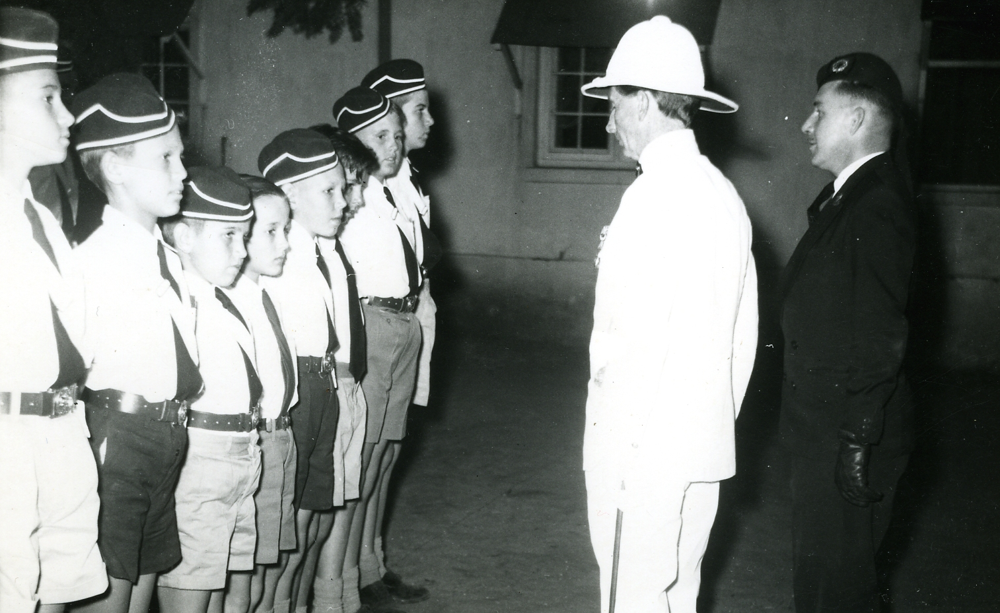
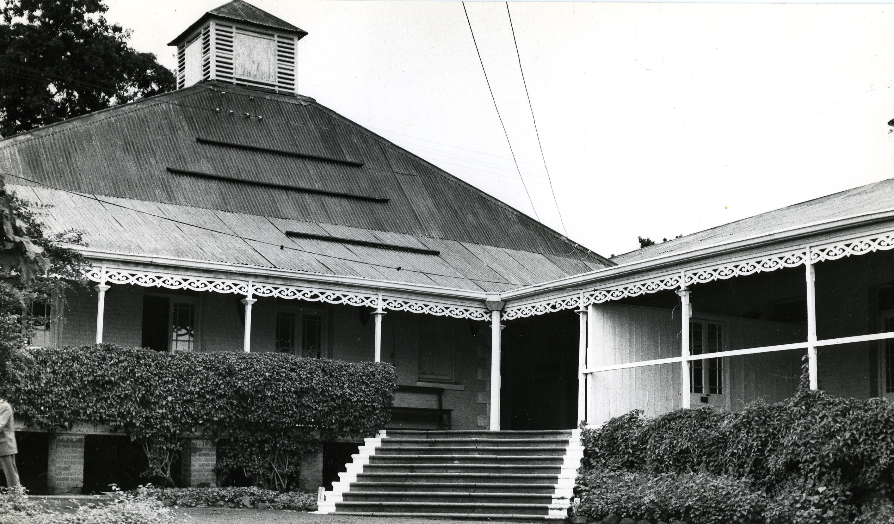

# Northern Rhodesia — District Administration and the Road to Zambia (1952–1969)

Northern Rhodesia was a British protectorate from 1924 to 1964, administered by a Governor and a hierarchy of Provincial and District Commissioners under the Colonial Office in London. The territory — landlocked, copper-rich, vast — was governed through a network of **bomas** (district headquarters) where a single British officer combined the roles of magistrate, tax collector, road builder, mediator of native disputes, and representative of the Crown. [David John Lewis](../people/david-john-lewis.md) served seventeen years in this system, arriving as a District Officer in 1952 and rising to Acting Permanent Secretary by the time Zambia achieved independence — a career that spanned the last generation of British colonial administration in Central Africa.

## The District Commissioner

The District Commissioner (DC) was the backbone of British indirect rule. Posted to a boma that might be hundreds of miles from the nearest European town, the DC administered native courts, collected taxes, supervised public works, maintained law and order, and represented the government at ceremonies and disputes. He was simultaneously judge, policeman, and local government — the last officer to see a colonial subject before a decision was made, and the first to explain it afterwards.

The system required a particular temperament: authority without arrogance, administrative precision without bureaucratic rigidity, and the ability to live in relative isolation with one's family. David and [Fulvia](../people/fulvia-ottilia-antonia-zerauschek.md) raised five children across multiple postings — the children were, as their son Ivor later wrote, *"effectively brought up there."*

## David Lewis's career in Northern Rhodesia

David joined the **HM Colonial Administrative Service** in 1948, initially serving in [Tripolitania (Libya)](libya-tripolitania-british-administration.md) before transferring to Northern Rhodesia in 1952.

| Years | Posting | Role |
|-------|---------|------|
| 1952–1955 | **Fort Jameson** | District Officer / District Commissioner |
| 1956 | **Chinsali** | District Commissioner |
| 1957–1958 | **Livingstone** | District Commissioner |
| 1958–1961 | **Ndola** | District Commissioner |
| 1961 | **Western Province (Copperbelt)** | Deputy Provincial Commissioner |
| 1962–1966 | **Lusaka** (Secretariat) | Assistant Secretary — Ministries of the Chief Secretary, Home Affairs, Information and Postal Services |
| 1966 | **Lusaka** | Acting Permanent Secretary, Ministry of Information and Postal Services |

He passed government examinations in **Law** and the **Nyanja language**. His Italian, from wartime service and marriage to Fulvia, was an additional asset in the multilingual colonial world.

Early postings took the family deep into the bush. A **Northern Rhodesia Telegraphs** form (16 Jul 1953) shows Antonio Zerauschek sending congratulations to Fulvia at **Jameson** — Fort Jameson was the administrative centre of the Eastern Province, close to the Mozambique border. At **Chinsali** in 1956, David administered a district that included the home area of the African National Congress leadership.

The family address at **Livingstone** (1957–58) placed them at the tourist gateway to Victoria Falls. A Northern Rhodesia Police event photograph (Sep 1957) shows Fulvia integrated into the social life of the colonial community.

David's wartime past was visible in the colony. He was photographed at the **Moth Hall** war memorial in Livingstone — a cairn with a tin hat mounted on top — inscribed on the back by a child: "Daddy & 'Tin Hat'." The **Memorable Order of Tin Hats** was a Southern African ex-servicemen's organisation, and David's membership connected his military service to the colonial community's own veterans' culture.

The **Boma Office** — David's administrative headquarters at Livingstone — was the former Government House, the administrative heart of the district. A photograph inscribed "Livingstone / ex Government House / Boma Office 1956–58" with a Northern Rhodesia stamp captures the building where the District Commissioner combined the roles of magistrate, tax collector, and representative of the Crown.

At **Ndola** (1958–61), on the Copperbelt, David was the senior district officer when the Belgian Congo collapsed.

## The Congo Crisis (July 1960)

On 30 June 1960, the Belgian Congo became independent. Within days, the Force Publique mutinied, European civilians were attacked, and thousands of refugees — men, women, children, a baby born in a car on a bush road — flooded across the border into Northern Rhodesia. **Katanga Province**, adjacent to the Copperbelt, seceded under Moïse Tshombe on 11 July.

As District Commissioner in Ndola, David was the senior administrative officer on the ground. He organised reception and departure centres, coordinating with the **Royal Rhodesian Air Force** (Dakotas and Pembrokes on 24-hour standby, Canadairs flying blankets and mattresses), the **Women's Voluntary Service**, the **British Empire Service League**, and local commerce.

**Andrew Gardner** — then a radio journalist with the Federal Broadcasting Corporation, later one of Britain's most recognisable faces as newscaster on *News at Ten* from its first night in 1967 — broadcast live from Ndola on **11 July 1960**. His script names David directly:

> *"In charge of the operation in Ndola is the District Commissioner, Mr David Lewis, who with his team of helpers is organizing the reception and departure centres in the town."*

Gardner's broadcast describes crying children, worried parents, harassed airport officials, piles of luggage, an urgent appeal for a doctor, and a trainload of refugees leaving south. In a personal letter (23 Jul 1960), Gardner wrote: *"no praise is too high for those who were concerned."*

The archive also contains **twelve pages of SECRET classified government documents** (Feb 1961), US Consulate correspondence, and UMHK (Union Minière du Haut-Katanga) mining company communications from the crisis period.

## From Colony to Nation (1964)

Northern Rhodesia became the **Republic of Zambia** on **24 October 1964**, with Kenneth Kaunda as President. Unlike Rhodesia to the south, the transition was negotiated rather than unilateral, and many British civil servants stayed on to serve the new government. David was among them — he continued in the Secretariat as **Assistant Secretary** and rose to **Acting Permanent Secretary, Ministry of Information and Postal Services** in 1966.

His appointments in the new Zambia reflected a man comfortable in both the colonial and post-colonial worlds: **Vice President, Northern Rhodesia European Civil Servants Association**; member, Whitley Council; **Municipal Councillor**; **Director, Zambia Television Limited** (1966); Director, Zambian Publishing Company; Chairman, National Obscene Literature Committee. He sat on the National Literature Committee, National Nutrition Committee, National Decimalisation Committee, and National Stamp Design Committee.

## President Kaunda

In September 1969, writing from his new post at the Keep Britain Tidy Group in Brighton, David wrote to **President Kenneth Kaunda** after watching Kaunda's BBC Television interview about the government's participation in the copper mining industry. David described himself as *"one of your Former Under Secretaries"* and recalled that the President had once had *"a game of table tennis with my wife"* when visiting their house as Prime Minister.

Kaunda's Private Secretary replied on 6 October 1969:

> *"I recall that you once lived in Zambia for a considerable period during which time you held a prominent and high position in the Government. I am sure that you have a fair knowledge, if not fully conversant with our problems."*

The letter concluded: *"Indeed Zambia is counting on willing hands for their services should need arise."*

## Family life in Africa

The Lewis family's African years left deep marks. Their addresses trace the postings: **Fort Jameson** (1952–55), then across the country to Livingstone, Ndola, and finally Lusaka. In **July 1962**, Fulvia's brother [Mario Zerauschek](../people/mario-zerauschek.md) flew from Florence to visit — a Rhodesia–Nyasaland Post Office telegram (18 Jul 1962) sent from Florence to **"LT LEWIS 8 PROSPECT HILL LUSAKA"** reads: **"ASPETTAMI VENERDI VENI ORE 11.40 AEROPORTO SALISBURY DIRETTI BEIRA = MARIO."**

Fulvia played tennis (a photograph dated 25 May 1963 survives), attended Lusaka Club events, and maintained the family's Italian connections from across the continent. David's 1968 aerogramme from **R.W. 38, Ridgeway**, Zambia describes judicial work (the Rachel Kalulu case), house moves, and requests for news of "Firenze, Zurich, children."

The family received a **DFID pension** (Department for International Development, successor to the Colonial Office / ODA), confirming pensionable overseas service. In later years, David and Fulvia attended the **Northern Rhodesia Society Reunion Lunch** — the bonds of the African decades endured.

## Evidence

- **Colonial Office Lists:** NR sections for [1957](../media/docs/david-john-lewis-colonial-service/colonial-office-lists/NRhodColOffList1957-01.jpg), [1961](../media/docs/david-john-lewis-colonial-service/colonial-office-lists/NRhodColOffList1961-01.jpg), [1963](../media/docs/david-john-lewis-colonial-service/colonial-office-lists/NRhodColOffList1963-01.jpg).
- **CVs:** [1968](../media/docs/david-john-lewis-colonial-service/cv/CV-Dj1968-01.jpg), [1970](../media/docs/david-john-lewis-colonial-service/cv/CV-Dj-1970.doc), [1996](../media/docs/david-john-lewis-colonial-service/cv/DJ-CV1996.doc).
- **Andrew Gardner — FBC broadcast (11 Jul 1960):** [FBC110760-01.jpg](../media/docs/david-john-lewis-colonial-service/congo-crisis/FBC110760-01.jpg), [-02](../media/docs/david-john-lewis-colonial-service/congo-crisis/FBC110760-02.jpg).
- **Andrew Gardner — personal letter (23 Jul 1960):** [FBCDjL230760.jpg](../media/docs/david-john-lewis-colonial-service/congo-crisis/FBCDjL230760.jpg).
- **SECRET classified documents (Feb 1961):** [Secret120261-01.jpg](../media/docs/david-john-lewis-colonial-service/congo-crisis/Secret120261-01.jpg) through [-12](../media/docs/david-john-lewis-colonial-service/congo-crisis/Secret120261-12.jpg).
- **Kaunda correspondence:** [David's letter (19 Sep 1969)](../media/docs/david-john-lewis-colonial-service/zambia-kaunda/KKK190969-O.jpg), [reply (6 Oct 1969)](../media/docs/david-john-lewis-colonial-service/zambia-kaunda/KKK061069-I.jpg).
- **Zambia Television directorship (1966):** [DirectorZTV1966.jpg](../media/docs/david-john-lewis-colonial-service/zambia-tv/DirectorZTV1966.jpg).
- **NR press — promotion (1 Dec 1960):** [Promo011260.jpg](../media/docs/david-john-lewis-colonial-service/nr-press/Promo011260.jpg).
- **Mario Zerauschek telegram (18 Jul 1962):** [Mario180762-001.jpg](../media/docs/correspondence/mario-zerauschek/Mario180762-001.jpg) — confirms Lusaka address.
- **NR Society condolence letters (2001):** [NRSoc290301.doc](../media/docs/david-john-lewis-personal/condolences-nr-society/NRSoc290301.doc) — Ivor: "They both had marvellous and treasured memories of the country."
- **Chalochatu — History of television in Zambia:** [Online](http://www.chalochatu.org/History_of_television_in_Zambia) — Rhodesia TV → Zambia TV; government board; integration into Zambia Broadcasting Services (Jun 1967).
- **Northern Rhodesia photographs:** [colonial-officers-bush-hats-c1955.jpg](../media/docs/david-john-lewis-colonial-service/northern-rhodesia/colonial-officers-bush-hats-c1955.jpg) · [Boys' Brigade inspection, Livingstone](../media/docs/david-john-lewis-colonial-service/northern-rhodesia/david-lewis-inspecting-boys-brigade-livingstone-1957.jpg) ([inscription](../media/docs/david-john-lewis-colonial-service/northern-rhodesia/boys-brigade-inspection-inscription-1957.jpg)) · [War memorial / Moth Hall](../media/docs/david-john-lewis-colonial-service/northern-rhodesia/war-memorial-cairn-tin-hat.jpg) ([verso](../media/docs/david-john-lewis-colonial-service/northern-rhodesia/war-memorial-moth-hall-livingstone-1957-verso.jpg)) · [Boma Office](../media/docs/david-john-lewis-colonial-service/northern-rhodesia/colonial-administrative-building-livingstone.jpg) ([verso](../media/docs/david-john-lewis-colonial-service/northern-rhodesia/boma-office-livingstone-1956-58-verso.jpg)) · [Government House group](../media/docs/david-john-lewis-colonial-service/northern-rhodesia/group-photo-government-house-livingstone.jpg) · [colonial event / Union Jack](../media/docs/david-john-lewis-colonial-service/northern-rhodesia/colonial-event-thatch-shelter-union-jack.jpg) · [Ndola 1959](../media/docs/david-john-lewis-colonial-service/northern-rhodesia/ndola-1959.jpg) · [RRAF aircraft / Ndola](../media/docs/david-john-lewis-colonial-service/northern-rhodesia/rraf-aircraft-dignitaries-ndola.jpg) · [Dalhousie visit 1960](../media/docs/david-john-lewis-colonial-service/northern-rhodesia/dalhousie-visit-ndola-1960.jpg) · [airport tarmac](../media/docs/david-john-lewis-colonial-service/northern-rhodesia/airport-tarmac-dignitaries.jpg) · [Ndola 1961](../media/docs/david-john-lewis-colonial-service/northern-rhodesia/ndola-1961-j-james-photographer.jpg) · [late colonial group](../media/docs/david-john-lewis-colonial-service/northern-rhodesia/late-colonial-group-photo.jpg) · [Legco opening, 15 Jan 1963](../media/docs/david-john-lewis-colonial-service/northern-rhodesia/legco-opening-15-january-1963.jpg).
- **Zambia photographs:** [Decimal Currency Board clipping](../media/docs/david-john-lewis-colonial-service/zambia/decimal-currency-board-newspaper-clipping.jpg) · [celebration scene, c. 1964](../media/docs/david-john-lewis-colonial-service/zambia/celebration-scene-c1964.jpg).

## Related

- [David John Lewis](../people/david-john-lewis.md) — full career and evidence
- [Fulvia Ottilia Antonia Zerauschek](../people/fulvia-ottilia-antonia-zerauschek.md) — family life in Africa
- [British Administration of Tripolitania](libya-tripolitania-british-administration.md) — David's first overseas posting
- [Keep Britain Tidy Group](keep-britain-tidy-group.md) — David's post-Africa career
- [Sirmione on Lake Garda](sirmione-lake-garda.md) — where the African years began and ended
