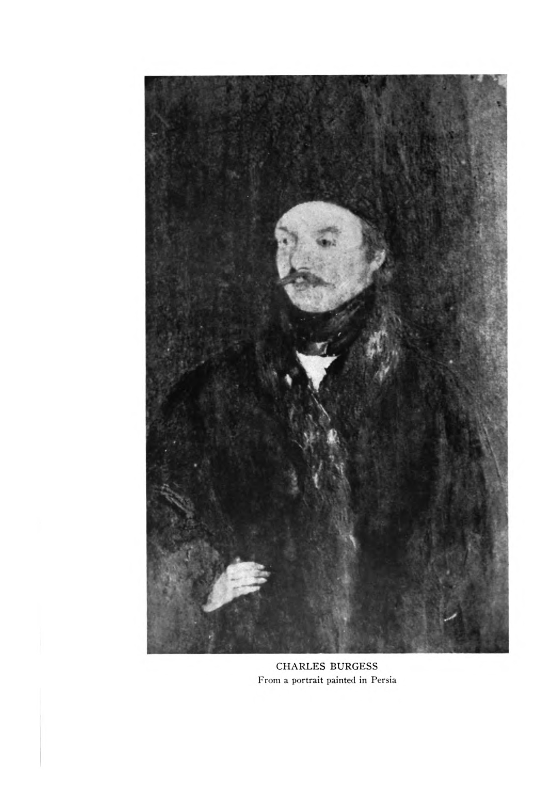
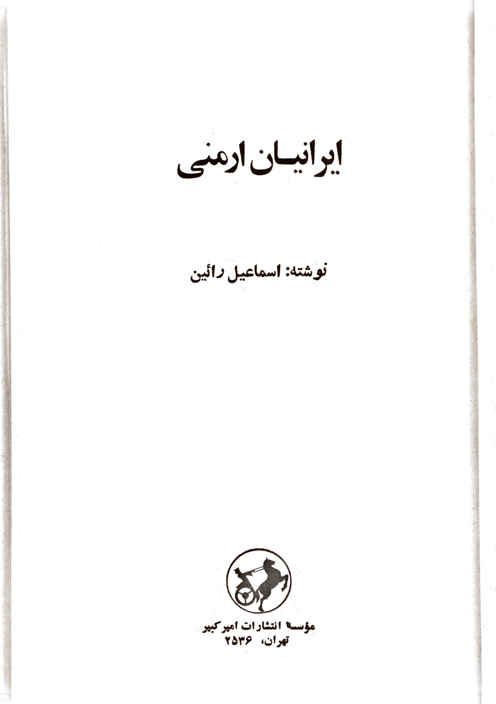

# NYPL — Burgess family papers (MSS 431)

The **New York Public Library** holds the **Burgess Family Papers**, **4.25 linear feet** of correspondence, Persian-language letters, watercolours, and genealogical material spanning **1794–1929**. The collection is the single richest primary source for the family's century in Persia, and it contains the only surviving first-person account of **Anna Saginian's** life — an 1880 interview that is extraordinary for its emotional detail and its portrait of mid-nineteenth-century Tabriz.

---

## The collection

| Detail | |
|--------|---|
| **Call number** | MSS 431 |
| **Extent** | 4.25 linear feet |
| **Dates** | 1794–1929 |
| **Donor** | Mrs Thomas F. Burgess (gifts 1938, 1956–58) |
| **Finding aid** | [archives.nypl.org/mss/431](https://archives.nypl.org/mss/431) |

The papers include:

- **Persian letters** (Boxes 5–6, available on microfilm) — correspondence in Persian script, likely relating to Edward Burgess's work as translator and gazette editor.
- **Series VII: ~70 watercolours and sketches** — unexamined in this project; may include portraits or topographical views.
- **Genealogical material** — family trees and notes compiled by later Burgess descendants.
- **Correspondence through 1929** — the last letters are from **Fanny Burgess Bottin**, writing from Tehran.
- **Schwartz appendix** — an interview with Anna Saginian conducted in Leicester in 1880, published in the *NYPL Bulletin* vol. 45.

## Anna Saginian's interview (1880)

The most remarkable document in the collection is the interview with **[Anna Saginian](../people/anna-saginian.md)** (Mrs Edward Burgess), recorded at **C. Belmont Villas, Leicester** in **March 1880** by Schwartz and preserved as an appendix to the Burgess papers.

Anna describes her father **[Daoud Khan Saginian](../people/daoud-khan-saginian.md)** as having been "always in the Shah's military service." Her mother died before her father. She had six siblings; her sister **[Tamar](../people/tamar-saginian.md)** was the widow of **Dr Cormick**, the Irish physician to the Crown Prince.

She married **[Edward Burgess](../people/edward-burgess.md)** at her father's house. Edward was superintending the printing of a government newspaper in Tehran. Their son **John** — godfather **Ronald Thompson** — died at eighteen months and was buried in the **Armenian graveyard in Tehran**. Their daughter **[Fanny](../people/fanny-burgess.md)** was born next.

The most vivid passage describes the journey from Tehran to Tabriz as Edward's health failed:

- The family travelled by **takhteravan** (sedan litter); the journey took roughly **three months**.
- Anna feared burial in Muslim villages along the road, where she worried about dogs disturbing graves.
- **Daoud Khan**, uncles, and **Dr Cormick** met them **eight days** from Tabriz.
- Edward spent **six weeks** in Tabriz. His last instructions were that Fanny must learn English.
- Fanny was **three days past her first birthday** when Edward died. They had been married **five years**.

Edward was buried in the **green Armenian cemetery outside the Tabriz walls**, by his uncle. Anna later replaced a small English stone with a **marble** marker inscribed in English and Armenian, costing about **3 tomans** for the stone and **5 tomans** for the shaping. Her father's grave was **four or five yards** away. The Cormicks and other Europeans were buried there too. "The trees very beautiful."

## Key people in the collection

| Person | Role in papers |
|--------|----------------|
| **[Edward Burgess](../people/edward-burgess.md)** | Central figure; merchant, translator, gazette editor under Nasir al-Din Shah; d. 18 Jun 1855, age 45 |
| **[Anna Saginian](../people/anna-saginian.md)** | Edward's wife; 1880 interview; daughter of Daoud Khan |
| **[Fanny Burgess Bottin](../people/fanny-burgess.md)** | Daughter; last correspondent (letters to 1929); d. Tehran 1938 |
| **Charles Burgess** | Edward's brother; first direct England–Persia exporter; Edward briefly held hostage for Charles's debts (1836) |

## Unexamined material

**Box 9** may contain photographic images — no portrait of Edward Burgess is currently known. The **~70 watercolours** in Series VII have not been examined by this project. The Persian letters (Boxes 5–6) are on microfilm but untranscribed.

## Related scans in the vault

- [media/collections/burgess-persian-letters/](../media/collections/burgess-persian-letters/) — letter images and PDFs
- Henderson: [media/albums/henderson/BurgessNYPL.pdf](../media/albums/henderson/BurgessNYPL.pdf)
- Anna interview extract: [corpus/nypl-burgess-appendix-anna-interview/extracted.pdf.md](../sources/corpus/nypl-burgess-appendix-anna-interview/extracted.pdf.md)
- Bulletin extract: [corpus/nypl-burgess-bulletin-pdf/extracted.pdf.md](../sources/corpus/nypl-burgess-bulletin-pdf/extracted.pdf.md)

## Citation card

- [sources/nypl-burgess-papers.md](../sources/nypl-burgess-papers.md)

## Narrative

- [Saginian → Burgess → Bottin → Stump](../stories/saginian-burgess-bottin-stump.md)
