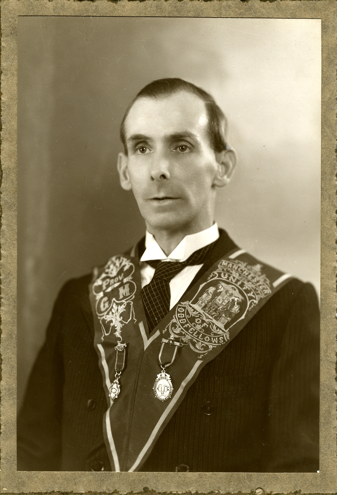

# Independent Order of Odd Fellows — Manchester Unity

The **Independent Order of Odd Fellows, Manchester Unity Friendly Society** was founded in **1810** by members who broke from the older Grand United Order, dissatisfied with centralised control. Meeting first at the **Ropemakers Arms** in Salford, the new order grew into the largest friendly society in the world by mid-century — a mutual-aid network that insured working families against sickness, injury, death, and destitution in the decades before the welfare state.

In the South Wales coalfield the Odd Fellows became part of the fabric of community life, as fundamental as chapel and rugby. **[Samuel Lewis](../people/samuel-lewis.md)** of Aberdare rose through the order's ranks to **Provincial Grand Master** — the highest degree Grand Lodge could confer — a position of genuine civic standing in the Cynon Valley.

---

## Origins and purpose

The Manchester Unity emerged from a wider Odd Fellows tradition stretching back to the eighteenth century. The name "Odd Fellows" predates the formal societies; it described loose fellowships of tradesmen in towns too small to support a guild — men of odd, unmatched trades banding together for mutual protection. By the 1790s these informal clubs had crystallised into registered friendly societies under the legislation secured by **George Rose, MP** in 1793.

The 1810 split created the Manchester Unity as an independent order with its own ritual, regalia, and district structure. Members paid weekly contributions — roughly **25 shillings a year** in the mid-nineteenth century (of which about 5 shillings covered fees, dinners, and contingencies) — and drew benefits for sickness, accident, and burial. The model was simple: pooled risk among working people who could not afford individual provision. By **1851** the Manchester Unity was the largest friendly society on earth by membership and assets.

## Structure and ranks

The order operated through **lodges** (local branches, often meeting in the long rooms of pubs), grouped into **districts** under elected officers. The hierarchy of degrees marked a member's progress:

| Degree | Role |
|--------|------|
| **Initiatory** | Entry-level membership |
| **White** | First working degree |
| **Scarlet** | Second degree |
| **Purple** | Third degree; qualified a member to hold office |
| **Noble Grand (NG)** | Branch chairman |
| **Grand** / **Past Grand** | Senior lodge offices |
| **Provincial Grand Master (PGM)** | Senior officer overseeing lodges across a district |
| **Past Provincial Grand Master (PPGM)** | The highest degree Grand Lodge could bestow |

The **Provincial Grand Master** presided over district meetings, examined candidates, and conferred degrees. The 1967 ritual book for the PPGM degree describes the conferral as a solemn ceremony in Grand Lodge, with officers examined at the door, candidates producing certificates signed by the Secretary of the Order, and an obligation taken "to maintain the honour of this Degree and at all times to promote faithfully the Unity of the Odd Fellowship wheresoever I may be."

Officers wore distinctive **silk sashes** embroidered with their rank initials and the order's coat of arms, together with metal **rank jewels** suspended from the sash. The arms incorporated symbolic devices: an hourglass (the fleeting nature of time), crossed keys (knowledge), a beehive (industry), a pascal lamb (innocence), and clasped hands (unity). The motto was **Friendship, Love, and Truth**.

## The Odd Fellows in Aberdare

Aberdare and the Cynon Valley were Odd Fellows territory. By **1855**, the Rev Thomas Price reported **59 lodges** and **5,162 members** in the Aberdare district alone — a remarkable density for a town whose population had exploded with the coal and iron boom.

The societies met in pub long rooms, paraded through the streets in full regalia, and held annual feasts and galas. An **Oddfellows Arms** once stood at 33 Commercial Place (later Victoria Square). The sashes, medals, and collars that survive from this period are displayed at the **Cynon Valley Museum** in Aberdare — one of the most striking collections in the gallery.

The most famous Aberdare Oddfellow was the **Rev Dr Thomas Price** (1820–1888), Baptist minister of Calfaria chapel. Price was a member of most local societies, but in **June 1865** the Oddfellows made him **Grand Master of all the Oddfellows of Great Britain** — the first Welshman to hold the office. On completion of his year, 15,000 Welsh Oddfellows each subscribed one penny towards a **silver epergne and candelabra** presented to Price at the Castle Hotel, Aberdare, in October 1866. Made by the Mappin Brothers (Royal silversmiths), the piece survives in the Cynon Valley Museum: a frosted-silver centrepiece surmounted by a goat (Price's crest), its triangular base bearing the arms of Manchester, the Oddfellows coat of arms, and the arms of the Principality of Wales.

The regalia, flags, and banners used by Aberdare's friendly societies were supplied by a local Jewish businessman, **Henry Solomon**, himself a Forester.

## Samuel Lewis — Provincial Grand Master

**[Samuel Lewis](../people/samuel-lewis.md)** (1887–1967) was a member of the **Lily of the Valley Lodge**, one of the Manchester Unity lodges in the Aberdare district. His *Aberdare Leader* obituary (18 August 1967) records that "apart from being a committeeman for seven years, he held some of the Order's highest offices."

A studio portrait — now in `media/images/portraits/` — shows Samuel wearing the full Provincial Grand Master's sash and rank jewels. The sash reads **"PROV. G.M."** on the left shoulder, **"MANCHESTER UNITY"** on the right, and **"ODD FELLOWS"** across the central medallion. Two metal jewels of office hang from the sash. A companion group photograph shows him among fellow provincial officers on the steps of what appears to be a civic or lodge building, several wearing chains of office.

*Samuel Lewis as Provincial Grand Master, Independent Order of Odd Fellows (Manchester Unity), c. 1930s.*

Samuel's Odd Fellows career ran alongside his chapel life — thirty-five years as deacon (*Blaenor*) at **Carmel Calvinistic Methodist, Trecynon**, and decades as chapel secretary and corresponding secretary. The combination was not unusual: in the valleys, lodge and chapel drew on the same culture of mutual obligation, democratic governance, and public service. The chapel taught moral duty; the lodge put it into actuarial practice.

## Decline and legacy

The **National Insurance Act 1911** and later the creation of the **National Health Service** in 1948 undercut the friendly societies' raison d'être. State provision replaced the pooled sixpences. Membership declined through the mid-twentieth century. The Manchester Unity survived by pivoting to social activities, convalescent homes, and supplementary insurance, but the mass working-class membership of the Victorian and Edwardian periods never returned.

The Odd Fellows' contribution was real: they provided a safety net, a civic education, and a sense of dignity to working people for over a century before the state took on those roles. In the Welsh valleys, where the chapels provided the spiritual architecture and the unions the industrial muscle, the friendly societies occupied the ground between — practical solidarity dressed in ritual and regalia.

The **Independent Order of Odd Fellows Manchester Unity Friendly Society** still exists as the **Oddfellows**, a mutual society headquartered in Manchester offering financial services, care homes, and social groups.

## Archival leads

| Archive | Holdings |
|---------|----------|
| **National Library of Wales** | Manchester Unity **Gwalia District** records; Loyal Temple of Love Lodge (Aberystwyth), 1873–1961; district minute books and financial papers |
| **Glamorgan Archives** | Loyal Lady Clive Lodge, Penarth (1851–1989, ref. DX769); Loyal Quin Lodge, St Brides Major (1875–1886, ref. DODD); district-level returns |
| **Cynon Valley Museum, Aberdare** | Regalia, sashes, medals, the Thomas Price silver epergne (1866); Church and Chapel display case |
| **The National Archives (Kew)** | Central registration files for friendly societies |

Lodge-level minute books and district officer lists from these collections would confirm Samuel Lewis's exact years as Provincial Grand Master and the district he served.

## Sources

- *Aberdare Leader*, 18 August 1967, p. 8 — Samuel Lewis obituary: [transcription](../sources/corpus/samuel-lewis-obituary-notices-1967/transcription-translation.en.md) · [source card](../sources/samuel-lewis-obituary-1967.md)
- Cynon Valley Museum Trust, "Shepherds, Foresters and Buffaloes: The Friendly Societies of Aberdare" (2021): <https://cynonvalleymuseum.wales/2021/02/17/shepherds-foresters-and-buffaloes-the-friendly-societies-of-aberdare/>
- R. Ivor Parry, "Friendly Societies at Aberdare" (Cynon Valley History Society): <https://www.cvhs.org.uk/RIP_history/friendly_socs.html>
- *Ritual for Conferring the Degree of Past Provincial Grand Master* (IOOF Manchester Unity, 1967): <https://www.stichtingargus.nl/vrijmetselarij/s/ioofmu_rppgm.html>
- Wikipedia, "Independent Order of Oddfellows Manchester Unity": <https://en.wikipedia.org/wiki/Independent_Order_of_Oddfellows_Manchester_Unity>
- Victoria Solt Dennis, *Friendly and Fraternal Societies: Their Badges and Regalia* (Shire Publications, 2005)

## Related

- [Samuel Lewis](../people/samuel-lewis.md) · [Elizabeth Lilian Cushen](../people/elizabeth-lilian-cushen.md)
- [Aberdare and the Welsh Valleys](aberdare-welsh-valleys.md)
- [Lewis · Stump · Europe hub](lewis-wales-stump-europe.md)
- [Freemasonry — Orient de Tehran](freemasonry-orient-de-tehran.md) — another fraternal order in the family tree, a generation earlier and a continent away
