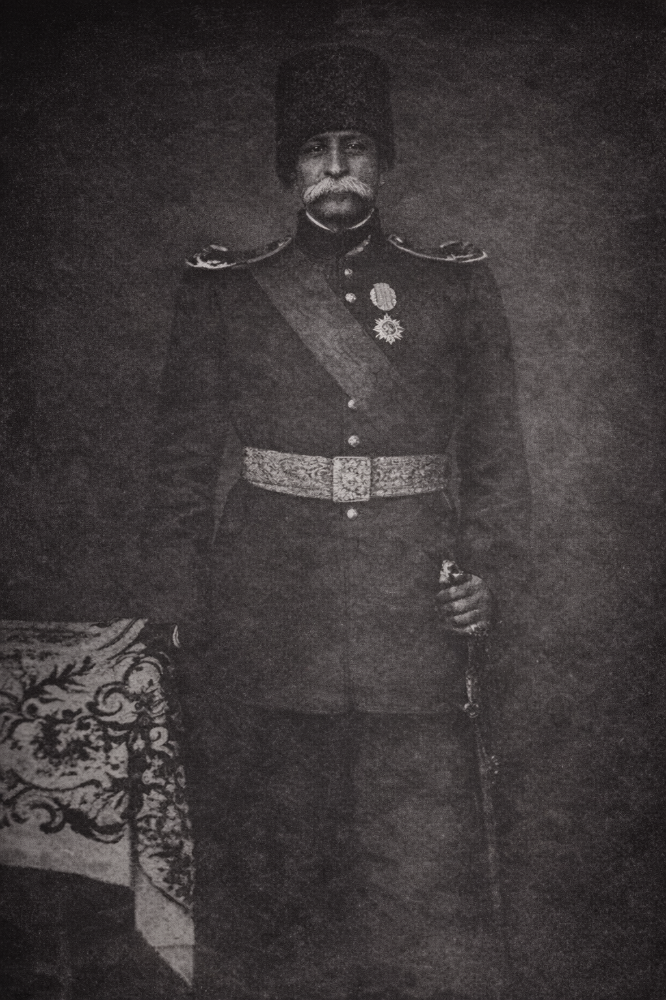
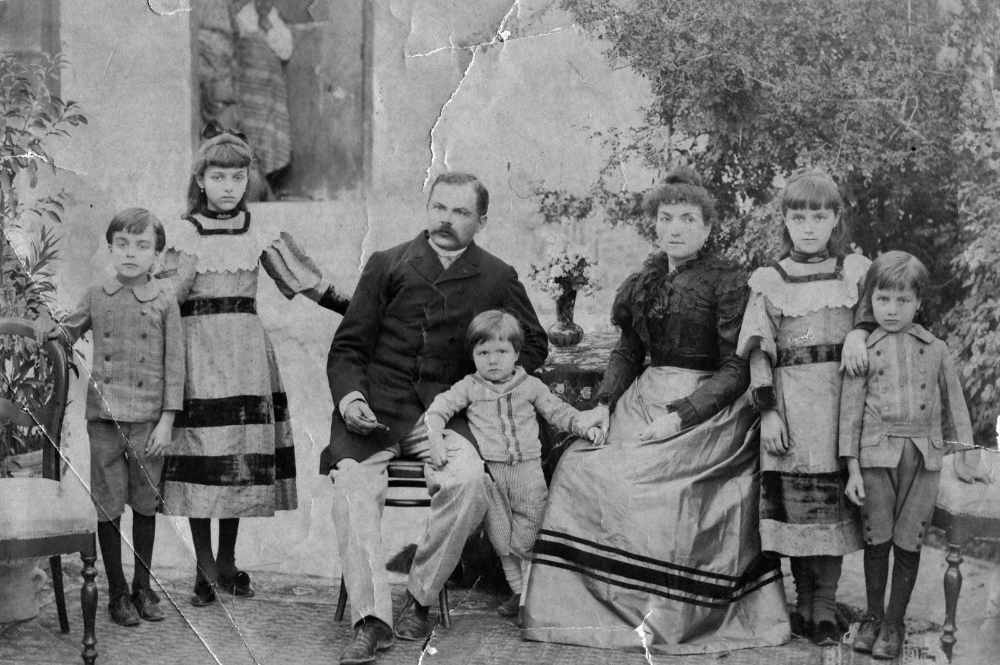
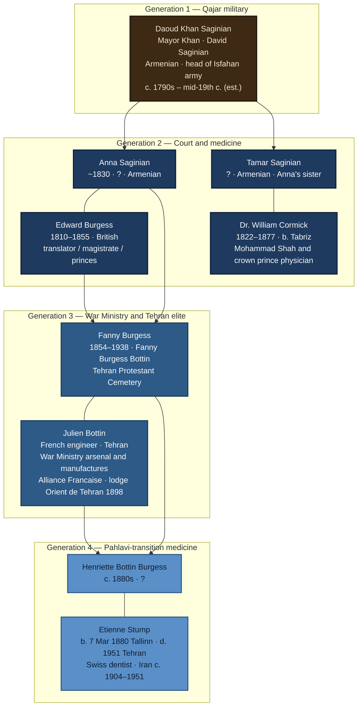

# Saginian → Burgess → Bottin → Stump

Anglo-Armenian–Persian court family, **c. 1800–1950** — continuous elite intermediary roles across **Qajar military → princely administration & royal medicine → War Ministry industrial modernization → professional medicine in the Pahlavi transition**. This file is the **canonical genealogical hub (topic)**: prose outline, **[family-tree.json](../family-tree.json)** (single master tree for the web app), one Mermaid sketch for Markdown previews, and tables. Long-form chronology: [stories/saginian-burgess-bottin-stump.md](../stories/saginian-burgess-bottin-stump.md). **Topics:** [topics/index.md](../topics/index.md). **Vault map:** [index.md](../index.md).

---

## How to read this page

| Element | Meaning |
|--------|---------|
| **Nested outline** | Full detail: vitals, institutions, sources — the narrative layer of the tree. |
| **[family-tree.json](../family-tree.json)** | **Only authoritative structured tree** for the web UI: `people`, `unions` (partners + children + optional `marriageDate`), and `graph.nodes` / `graph.edges` (`kind`: `person` \| `union`, `spouse` \| `descent`). Edit this file to change the tree; [scripts/validate_family_tree_json.py](../scripts/validate_family_tree_json.py) checks schema and references. |
| **Mermaid block below** | **Persia-line sketch only** (not the full DB); same names as the research outline. |
| **(est.)** | Approximate or inferred in research notes — see person file and [stories/saginian-burgess-bottin-stump.md](../stories/saginian-burgess-bottin-stump.md). |

---

## Master outline (rich)

### Generation 1 — Qajar military core



- **[Daoud Khan Saginian](../people/daoud-khan-saginian.md)** (“Mayor Khan”; also *David Saginian*)
  - **Life:** b. c. 1790s; d. mid-19th c. **(est.)**
  - **Identity:** Armenian; **head of the Isfahan army** under the Qajars.
  - **Court–military nexus:** Served under **Fath-Ali Shah** and his sons; commanded troops under **Sayf ol-Dowleh**; **1834 Isfahan conflict** — Sayf ol-Dowleh divided his army; one division led by David (Daoud) Saginian (Sayf ol-Dowleh page); Armenian military literature: “Davit Khan Saginian… head of the Isfahan army.”
  - **Issue:** [Anna Saginian](../people/anna-saginian.md), [Tamar Saginian](../people/tamar-saginian.md).
  - **Sources:** [connectionsbmc-saginian-interview.md](../sources/connectionsbmc-saginian-interview.md), [obrien-roche-notes.md](../sources/obrien-roche-notes.md); narrative [stories/saginian-burgess-bottin-stump.md](../stories/saginian-burgess-bottin-stump.md) (opening / Daoud Khan block).

### Generation 2 — Court, translation, and royal medicine


- **[Anna Saginian](../people/anna-saginian.md)** — **m. 1851** — **[Edward Burgess](../people/edward-burgess.md)** *(primary descent line)*
  - **Anna:** Armenian; daughter of Daoud Khan; **~1830** (approx.); death **unknown** in vault.
  - **Edward:** British; **1810–1855**; merchant, translator, official in Persia; arrived **1831** (never left); by **1844** magistrate near **Tabriz**, translator for **Prince Bahman Mirza**; later royal/intellectual circles under Qajar princes; **d. 1855** en route **Tehran ↔ Tabriz**; left **infant** [Fanny](../people/fanny-burgess.md).
  - **Institutional threads:** Princely administration & translation; British commercial-official presence in Qajar Iran.
  - **Sources:** [nypl-burgess-papers.md](../sources/nypl-burgess-papers.md), [connectionsbmc-saginian-interview.md](../sources/connectionsbmc-saginian-interview.md), [obrien-roche-notes.md](../sources/obrien-roche-notes.md).
  - **Narrative:** [The Most All-Loved Person — Edward Burgess in Qajar Persia](../stories/edward-burgess-persia.md) — full life arc (scrollytelling).

- **[Tamar Saginian](../people/tamar-saginian.md)** — **m.** **[Dr. William Cormick](../people/william-cormick.md)** *(parallel Saginian–court line, same network as Anna)*
  - **Tamar:** Sister of Anna; vitals **unknown** in vault; **not** a separate “main trunk” from Anna in narrative terms — same **Saginian family network**, different court channel.
  - **William Cormick:** Irish-Armenian physician, **b. Tabriz 1822; d. 1877**; physician to **Mohammad Shah Qajar**; personal physician to Crown Prince **Naser al-Din Shah**; direct **royal household** access; part of **modernization of medicine** in Persia.
  - **Sources:** [connectionsbmc-saginian-interview.md](../sources/connectionsbmc-saginian-interview.md), [wikipedia-william-cormick.md](../sources/wikipedia-william-cormick.md).

### Generation 3 — Late Qajar: industry, lodges, War Ministry



- **[Fanny Burgess](../people/fanny-burgess.md)** — **m.** **[Julien Bottin](../people/julien-bottin.md)**
  - **Fanny:** **1854–1938** (grave **6 Nov 1938**, age **84**, Tehran Protestant Cemetery); NYPL names **“Fanny Burgess Bottin”**; daughter of Anna + Edward.
  - **Julien:** French engineer, **Tehran**, late 19th–early 20th c.; **Alliance Française** (Tehran); Freemason lodge **“Orient de Tehran”** (1898); **Ministry of War** contract — *Ingénieur mécanicien de l’Arsenal et des manufactures militaires*; **2 years**, **2400 tomans**; arsenal machinery, **30 students** applied mechanics; attendance arsenal, powder factory, cartridge works; ties family to **Persian military-industrial** state, not peripheral expatriate role.
  - **Issue:** [Henriette Bottin Burgess](../people/henriette-bottin.md).
  - **Sources:** [nypl-burgess-papers.md](../sources/nypl-burgess-papers.md), [levantine-freemasonry-middle-east.md](../sources/levantine-freemasonry-middle-east.md), [bottin-government-contract.md](../sources/bottin-government-contract.md).

### Generation 4 — Qajar–Pahlavi transition: scientific profession


- **[Henriette Bottin Burgess](../people/henriette-bottin.md)** — **m.** **[Étienne Stump](../people/etienne-stump.md)**
  - **Henriette:** **c. 1880s** (estimated from parents); death **unknown** in vault; daughter of Fanny + Julien.
  - **Étienne:** **Swiss** dentist (often misprinted Austrian/German in sources); **1880–1951** (Tehran Protestant Cemetery); Iran practice **c. 1904–1951** per Persian scholarship; among **first modern dentists**; Iranica text says **Stump (Austrian)** — vault uses **Swiss**; overlaps **late Qajar collapse** and **Reza Shah Pahlavi** rise; **Mustawfi** memoir, **Mahmoudieh** house — [mustawfi-mahmoudieh-stump.md](../sources/mustawfi-mahmoudieh-stump.md).
  - **Correction (canonical):** Fanny did **not** marry Stump; line is **Fanny → Julien → Henriette → Étienne**.
  - **Sources:** [iranica-dentistry.md](../sources/iranica-dentistry.md), [mustawfi-mahmoudieh-stump.md](../sources/mustawfi-mahmoudieh-stump.md), [estonian-biographical-center-stump-report-2005.md](../sources/estonian-biographical-center-stump-report-2005.md) (Baltic parents: [Marc Francois Stump](../people/marc-francois-stump.md), [Olga Caroline Erbe](../people/olga-caroline-erbe.md)), [stories/stump-thurgau-tallinn-baltic-line.md](../stories/stump-thurgau-tallinn-baltic-line.md) (Europe-only Thurgau → Tallinn essay), [archive/index.md](../archive/index.md).
  - **Narrative:** [From Reval to Tehran — Étienne Stump](../stories/etienne-stump-reval-to-tehran.md) — full life arc (scrollytelling).

- **[Marc Francois Stump](../people/marc-francois-stump.md)** — Étienne’s father; **Tallinn** *Oberlehrer* of **French** (from **1868**); **Tartu** exams **1865**; d. **3 Apr 1903** **Yverdon** per **Tallinn Dome** register digest ([EBC 2005](../sources/estonian-biographical-center-stump-report-2005.md)); long-form **Europe** context [stump-thurgau-tallinn-baltic-line.md](../stories/stump-thurgau-tallinn-baltic-line.md).
- **[Olga Caroline Erbe](../people/olga-caroline-erbe.md)** — Étienne’s mother; **St. Petersburg** **1844**; m. **22 Jun 1868** Tallinn; d. **15 Oct 1894** Tallinn (same report).

---

## Master tree data (`family-tree.json`)

One file drives the **full** tree in a browser: load JSON, render `graph` (or traverse `people` + `unions`). **Unions** are marriage records: `partnerIds` (spouses), `childIds`, optional `marriageDate`.

GEDCOM and other exports under [archive/](../archive/index.md) are **legacy backups only**, not sources for the app.

**Completeness:** the JSON matches that export **in topology** (every person and family, same links). **Schema 2** adds structured fields beyond topology (vitals, aliases, `personPage`, etc.): **`family-tree.json` and `people/*.md` (`treeId`) are master**; [archive/gedcom/Upload for MyHeritage 200929.ged](../archive/gedcom/Upload%20for%20MyHeritage%20200929.ged) only **backfills** missing vitals when you run sync. See `meta.coverage` in [family-tree.json](../family-tree.json). Sync: `.venv/bin/python scripts/sync_family_tree_json.py` (use `--no-gedcom-fill` for vault/JSON only).

---

## Mermaid (Persia-line sketch)

Illustration for this Markdown page only — **not** the full 571-person tree. **`-->`** = parent → child; **`---`** = marriage or partnership (no arrowhead). Anna and Edward both link to Fanny (two-parent descent).



---

## Master register (sortable mentally by generation)

| Gen | Person | Life | Origin / identity | Primary anchor | Partner | Children in vault | Burial / key record | Person file |
|:---:|--------|------|-------------------|----------------|---------|-------------------|---------------------|-------------|
| 1 | Daoud Khan Saginian | c. 1790s – mid-19th c. (est.) | Armenian | Isfahan army; Sayf ol-Dowleh 1834 | — | Anna, Tamar | Military/chronicle refs | [daoud-khan-saginian.md](../people/daoud-khan-saginian.md) |
| 2 | Anna Saginian | ~1830 – ? | Armenian | Burgess marriage; NYPL line | Edward Burgess (m. 1851) | Fanny | Interview + NYPL | [anna-saginian.md](../people/anna-saginian.md) |
| 2 | Edward Burgess | 1810–1855 | British | Tabriz magistracy; Bahman Mirza | Anna | Fanny | NYPL biography | [edward-burgess.md](../people/edward-burgess.md) |
| 2 | Tamar Saginian | ? – ? | Armenian | Cormick marriage; sister network | William Cormick | — (none in vault) | Interview | [tamar-saginian.md](../people/tamar-saginian.md) |
| 2 | Dr. William Cormick | 1822–1877 | Irish-Armenian, b. Tabriz | Mohammad Shah; crown prince | Tamar | — | Wikipedia + interview | [william-cormick.md](../people/william-cormick.md) |
| 3 | Fanny Burgess | 1854–1938 | Anglo-Armenian line | NYPL “Fanny Burgess Bottin” | Julien Bottin | Henriette | Tehran Prot. Cem. | [fanny-burgess.md](../people/fanny-burgess.md) |
| 3 | Julien Bottin | fl. late 19th – early 20th c. | French | War Ministry contract; lodges | Fanny | Henriette | Contract PDF + Levantine Heritage | [julien-bottin.md](../people/julien-bottin.md) |
| 4 | Henriette Bottin Burgess | c. 1880s – ? | Franco-British-Armenian line | Stump marriage | Étienne Stump | — | Tree + narrative | [henriette-bottin.md](../people/henriette-bottin.md) |
| — | Marc Francois Stump | 1834–1903 | Swiss; Tallinn French teacher | Gymnasium *Oberlehrer*; Tartu 1865 | Olga Caroline Erbe | Étienne + siblings | Yverdon d. per EBC | [marc-francois-stump.md](../people/marc-francois-stump.md) |
| — | Olga Caroline Erbe | 1844–1894 | Baltic German | St Petersburg b.; Tallinn m./d. | Marc Stump | Étienne + siblings | Tallinn | [olga-caroline-erbe.md](../people/olga-caroline-erbe.md) |
| 4 | Étienne Stump | 1880–1951 | Swiss (Iranica: Austrian) | Dentistry; b. **7 Mar** Tallinn (EBC) | Henriette | — | Tehran Prot. Cem. | [etienne-stump.md](../people/etienne-stump.md) |

---

## Relationship register (explicit)

| Relation | Type | Notes |
|----------|------|--------|
| Daoud Khan → Anna, Tamar | Parentage | Two sisters; dual court vectors in gen 2. |
| Anna ↔ Edward | Marriage **1851** | Primary line to Fanny. |
| Anna → Fanny | Parentage | Infant at Edward’s death **1855**. |
| Tamar ↔ William Cormick | Marriage | Royal physician household; parallel to Anna’s princely/translation channel. |
| Fanny ↔ Julien | Marriage | War Ministry + Tehran institutional footprint. |
| Fanny → Henriette | Parentage | **Not** Stump’s spouse. |
| Julien → Henriette | Parentage | Bottin engineering line → Stump medical line. |
| Marc ↔ Olga | Marriage **22 Jun 1868** Tallinn | Stump–Erbe; Baltic household; [EBC 2005](../sources/estonian-biographical-center-stump-report-2005.md). |
| Marc / Olga → Étienne | Parentage | Parish register extract (birth **7 Mar 1880**). |
| Henriette ↔ Étienne | Marriage | Pahlavi-transition professional stratum. |

---

## Evidence map (which source supports which person)

| Person | NYPL Burgess | Connections BMC | Wikipedia Cormick | Levantine / Masonic | Bottin contract | EBC Stump 2005 | Iranica dentistry | Mustawfi / Mahmoudieh | O’Brien–Roche | Legacy index |
|--------|:---:|:---:|:---:|:---:|:---:|:---:|:---:|:---:|:---:|:---:|
| Daoud Khan | | ✓ | | | | | | | ✓ | |
| Anna | ✓ | ✓ | | | | | | | ✓ | |
| Edward | ✓ | | | | | | | | | |
| Tamar | | ✓ | ✓ | | | | | | | |
| W. Cormick | | ✓ | ✓ | | | | | | | |
| Fanny | ✓ | | | | | | | | | ✓ |
| Julien | | | | ✓ | ✓ | | | | | |
| Henriette | | | | | | | | | | ✓ |
| Marc Stump | | | | | | ✓ | | | | |
| Olga Erbe | | | | | | ✓ | | | | |
| Étienne Stump | | | | | | ✓ | ✓ | ✓ | | ✓ |

---

## Sources (vault)

| Topic | File |
|--------|------|
| NYPL Burgess papers | [sources/nypl-burgess-papers.md](../sources/nypl-burgess-papers.md) |
| NYPL / Burgess — Schwartz bulletin + letters (corpus cluster) | [sources/nypl-burgess-corpus-cluster.md](../sources/nypl-burgess-corpus-cluster.md) |
| Wright — British burials in Persia (corpus) | [sources/wright-burials-persia-corpus.md](../sources/wright-burials-persia-corpus.md) |
| Persia — modern scholarship PDFs (cluster) | [sources/persia-modern-scholarship-corpus-cluster.md](../sources/persia-modern-scholarship-corpus-cluster.md) |
| Missions / Bahá'í / Bábí books (cluster) | [sources/missions-bahai-babi-corpus-cluster.md](../sources/missions-bahai-babi-corpus-cluster.md) |
| Connections BMC (Anna, Tamar, Daoud Khan) | [sources/connectionsbmc-saginian-interview.md](../sources/connectionsbmc-saginian-interview.md) |
| Wikipedia — William Cormick | [sources/wikipedia-william-cormick.md](../sources/wikipedia-william-cormick.md) |
| Levantine Heritage — Freemasonry / Bottin | [sources/levantine-freemasonry-middle-east.md](../sources/levantine-freemasonry-middle-east.md) |
| Encyclopaedia Iranica — dentistry (Stump) | [sources/iranica-dentistry.md](../sources/iranica-dentistry.md) |
| Bottin government contract (primary) | [sources/bottin-government-contract.md](../sources/bottin-government-contract.md) |
| Estonian Biographical Center — Stump Tallinn research (2005) | [sources/estonian-biographical-center-stump-report-2005.md](../sources/estonian-biographical-center-stump-report-2005.md) |
| Mustawfi memoir / Mahmoudieh / Stump | [sources/mustawfi-mahmoudieh-stump.md](../sources/mustawfi-mahmoudieh-stump.md) |
| O’Brien / Roche notes (Tabriz, Seguinoff, interview bits) | [sources/obrien-roche-notes.md](../sources/obrien-roche-notes.md) |
| British Library notes | [sources/british-library-notes.md](../sources/british-library-notes.md) |
| **Archive** (GEDCOM, Gramps/RM, Mahmoudieh paths in catalog) | [archive/index.md](../archive/index.md) · stub [sources/legacy-index.md](../sources/legacy-index.md) |
| **Media — Assyrians / Persia** (Yonan monograph PDF in `media/docs/`) | [Gabriele Yonan — *Lest We Perish* (1996) PDF](../media/docs/Gabriele%20Yonan%20-%20Lest%20We%20Perish%20-%20Christian%20Assyrians%20Turkey%20and%20Persia%201996.pdf) |
| **Media — Central Asia context** (Eden dissertation PDF) | [Jeffrey Eden — *Slavery and Empire in Central Asia* (Harvard diss., 2016) PDF](../media/docs/Jeffrey%20Eden%20-%20Slavery%20and%20Empire%20in%20Central%20Asia%20-%20Harvard%20dissertation%202016.pdf) |
| **Offline web capture** (curl / browser tools) | Bundles under [sources/corpus/](../sources/corpus/) (`mirror.html`, `source.yaml`). **Full slug list:** [sources/corpus-bibliography.md](../sources/corpus-bibliography.md). **Inbox** for new drops: [manual/](../manual/README.md). GEDCOM-embedded profile URLs remain in [archive/gedcom/](../archive/gedcom/) only (not bulk-mirrored). |

Primary documents: [sources/documents/](../sources/documents/) · **media** (albums, scans, PDFs): [media/](../media/) — see [index.md](../index.md)

**Ancestor scope (person pages):** [people/ancestor-coverage-list.md](../people/ancestor-coverage-list.md) — father/mother chain from **Anthony Robert (Tony) Lewis** (`@I1@`) in the MyHeritage GEDCOM export; excludes collateral lines (e.g. Tamar / Cormick).

### Surname studies

- [Saginian](surname-saginian.md) — Georgian *Saginskilli* → Armenian *Saginian*; clan name transformation in Qajar Iran
- [Stump & Erbe](surname-stump-erbe.md) — the Swiss-Baltic line that married into the Bottin household

---

## Folder layout

```
family_tree/
├── index.md                 ← vault map (start here)
├── family-tree.json         ← master tree for web app (export from GEDCOM)
├── topics/
│   ├── persia.md                 ← Persia hub + tables
│   ├── zara-italy-dalmatia.md    ← Zara — Addobbati + Zerauschek + source register
│   └── lewis-wales-stump-europe.md ← Lewis (Wales) + Stump/Erbe (Europe) + Ireland cluster
├── people/                  ← one markdown file per person
├── stories/              ← multi-generation essays
├── topics/                  ← places, institutions, themes ([topics/index.md](../topics/index.md))
├── media/                   ← albums, collections, docs inbox, publications/, charts/, military/, images/
├── archive/                 ← legacy GEDCOM snapshots, Gramps/RootsMagic ([archive/index.md](../archive/index.md))
├── scripts/
│   ├── validate_family_tree_json.py ← checks family-tree.json
│   └── ingest_source.py     ← PDF/HTML → sources/corpus/
├── manual/                  ← inbox: raw files for AI/scripts to file into corpus/media/people
├── sources/                 ← citation cards, corpus bundles
│   ├── corpus/              ← extracts + source.yaml; mirror.html / original.pdf as needed
│   └── documents/           ← optional small primary uploads
```
