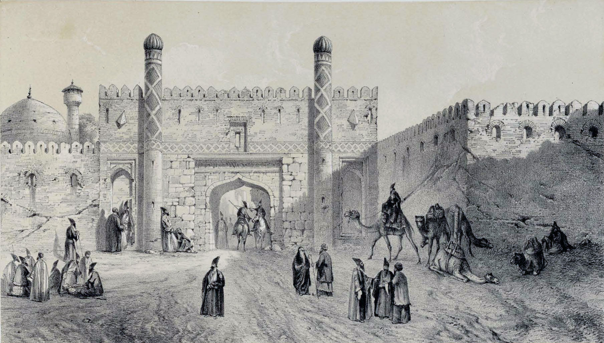

# Qajar Armenian military elite

Armenian officers held senior command positions in the Qajar army from the late eighteenth century through the mid-nineteenth century. **Daoud Khan Saginian** — head of the Isfahan army and the earliest documented ancestor in the Persia line — exemplifies a pipeline that brought Georgian and Armenian soldiers from the Caucasus into the Persian military establishment.

---

## The Caucasian officer pipeline

When **Abbas Mirza** and his father **Fath-Ali Shah** modernized the Persian army in the early 1800s, they drew on Caucasian expertise — Georgian and Armenian officers with experience in Russian or frontier service. Some came voluntarily; others arrived as captives or refugees from the shifting Russo-Persian border. These men brought European-influenced drill and logistics into a system that had traditionally relied on tribal levies.

The pipeline produced a distinct social stratum: Christian officers serving a Muslim sovereign, commanding Muslim troops, embedded in the court system through titles, land grants, and intermarriage with other Caucasian families. Their children — literate in Armenian, Persian, and often French or English — moved into translation, diplomacy, and medicine.

## Daoud Khan Saginian

**[Daoud Khan Saginian](../people/daoud-khan-saginian.md)** (also *David Saginian*, *Daoud Khan Seguinoff*) held the rank of **sartip** (brigadier-general). He commanded forces at both **Shiraz** and **Isfahan** under **Fath-Ali Shah**.

His origins are **Georgian**. He fled to Persia in **1811** with **Zaal Saginskilli** (*Zaal Saginean*) and **Solayman Khan Saham al-Dowleh**. The best-documented account in this vault: [Maeda 2019 — reference](../sources/corpus/maeda-2019-enikolopians-saginian-flight/reference.md) · [snippets](../sources/corpus/maeda-2019-enikolopians-saginian-flight/transcription.snippets.md) (Shermazanian via Maeda: religious motive, **wrestling** pretext for leave from Russian service, route **Yerevan → Akhalkalaki → Giumri → Tabriz**, adoption of **Grigorian** practice after arrival, children raised Armenian). For how that reconciles Anna’s Armenian self-description with Wolff’s “genuine Georgian,” see [Was Anna a Saginian?](was-anna-saginian.md).

Whether he had prior Russian army service is debated: the missionary **Joseph Wolff** recorded him in **1843** as "Colonel in Russian service," while other sources describe him simply as "Daoud Khan the Armenian." [Wolff (1845)](../sources/corpus/narrative-mission-bokhara/extracted.pdf.md) — Ch. XXVI.

The key military episode is the **1834 Isfahan conflict**. When **Sayf ol-Dowleh** (a Qajar prince governing Isfahan) divided his army, one division was placed under **David (Daoud) Saginian**. Armenian military literature records him as "head of the Isfahan army." A portrait caption in the family archive states he died aged **seventy-eight**.

Professional biography: [David Yaghoubian (2014)](../sources/corpus/david-yaghoubian-ethnicity-identity-and-national-00eefee0c9/extracted.pdf.md) (extract; person page cites notes) — Tbilisi birth **c. 1790**, death **1867 Tabriz**, **Surb Astvatsatsin** burial.

## Family and legacy

Daoud Khan had at least two daughters:

| Daughter | Married | Connection |
|----------|---------|------------|
| **[Anna Saginian](../people/anna-saginian.md)** | **[Edward Burgess](../people/edward-burgess.md)** (1851) | British merchant, Nasir al-Din Shah's principal translator; their daughter **[Fanny](../people/fanny-burgess.md)** married **[Julien Bottin](../people/julien-bottin.md)** |
| **[Tamar Saginian](../people/tamar-saginian.md)** | **Dr William Cormick** (19 Oct 1850) | Irish physician to the Crown Prince; eleven Cormick graves in the Armenian cemetery at Tabriz |

Both marriages placed the Saginian daughters inside the European professional community in Qajar Iran — the same milieu of translators, doctors, and engineers that would define the family for four generations.

Anna's **1880 interview** (recorded at Leicester by Schwartz, preserved in the **[NYPL Burgess papers](nypl-burgess-papers-archive.md)**) describes her father as having been "always in the Shah's military service." She recalls the Armenian cemetery outside the Tabriz walls where Edward Burgess, Daoud Khan, and the Cormick family are buried: "the trees very beautiful."

## Wider context

The Armenian military role in Qajar Persia parallels other Christian minorities in Ottoman and Persian service. **Sam Khan**, commander of the regiment that carried out the execution of the Báb in Tabriz (1850), operated in the same institutional world. The difference is that the Saginian line, through marriage, crossed into the Anglo-European community and eventually left Iran entirely.

## Sources

### Corpus quick map

| Thread | Where to read |
|--------|----------------|
| 1811 flight, Saginean brothers, wrestling, Grigorian/Armenian identity | [Maeda 2019 — reference](../sources/corpus/maeda-2019-enikolopians-saginian-flight/reference.md) · [snippets](../sources/corpus/maeda-2019-enikolopians-saginian-flight/transcription.snippets.md) |
| Wolff on Daoud Khan (Georgian / "the Armenian") | [Wolff 1845 — extract](../sources/corpus/narrative-mission-bokhara/extracted.pdf.md) |
| Vitals / Tabriz burial (descendant oral history) | [Yaghoubian 2014 — PDF extract](../sources/corpus/david-yaghoubian-ethnicity-identity-and-national-00eefee0c9/extracted.pdf.md) |
| Anna's 1880 interview (father in Shah's service) | [NYPL appendix — extract](../sources/corpus/nypl-burgess-appendix-anna-interview/extracted.pdf.md) |

| Source | Location |
|--------|----------|
| Maeda 2019 — Enikolopians / Saginean flight | [reference](../sources/corpus/maeda-2019-enikolopians-saginian-flight/reference.md) · [source card](../sources/maeda-2019-enikolopians.md) |
| Identity synthesis (Anna, Tamar, Daoud) | [Was Anna a Saginian?](was-anna-saginian.md) |
| Working note — Armenian officers essay | [research/iran-qajar/armenian-officers-qajar-military.md](../research/iran-qajar/armenian-officers-qajar-military.md) |
| Connections BMC — Saginian/Cormick interview | [source card](../sources/connectionsbmc-saginian-interview.md) · [corpus](../sources/corpus/connectionsbmc-saginian-interview/) |
| O'Brien / Roche notes | [source card](../sources/obrien-roche-notes.md) |
| NYPL Burgess appendix — Anna interview (1880) | [extract](../sources/corpus/nypl-burgess-appendix-anna-interview/extracted.pdf.md) |

## Related topics

- [Persia hub](persia.md) · [Surname: Saginian](surname-saginian.md)

## Narrative

- [Saginian → Burgess → Bottin → Stump](../stories/saginian-burgess-bottin-stump.md) — §1
