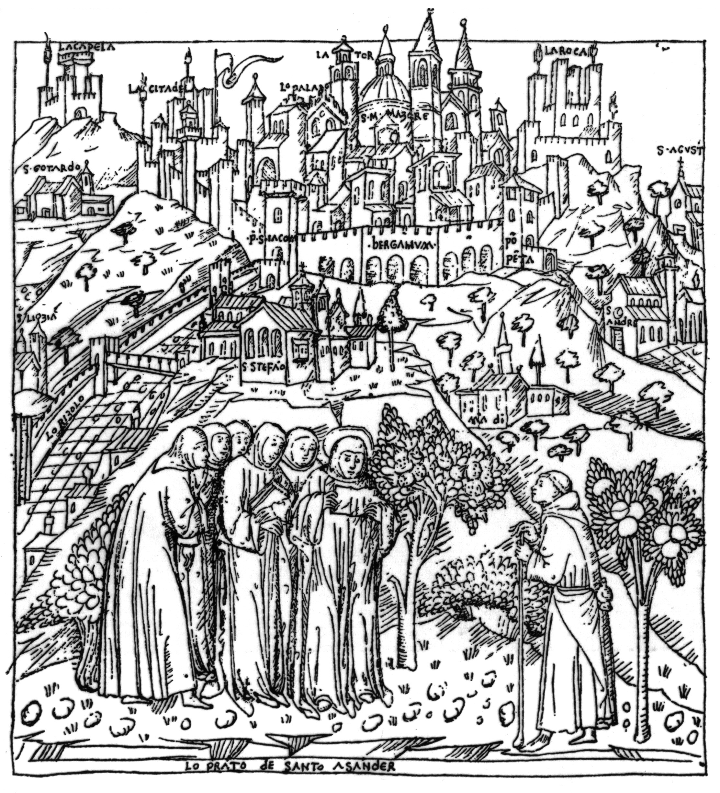

# Surname: Addobbati

One of the rarest surnames in this tree — approximately **67 bearers** on Earth, with 84% concentrated in Tuscany — and one whose etymology no public surname database has bothered to list. The word behind it, though, is rich: it traces to the medieval ceremony of knighting.

---

## Etymology

The surname derives from the Italian verb **addobbare** — "to decorate, to adorn, to dress in finery." The verb itself was borrowed from Old French **adober**, which originally meant to arm or dress a knight at investiture. The deeper root passes through Old Provençal *adobar* and Old Spanish *adubar* to a Frankish original describing the specific blow given to a new knight during the dubbing ceremony; the meaning then broadened from "to arm" → "to dress ceremonially" → "to decorate."

**Addobbati** is the past-participle plural form: literally "the adorned ones" or "the decorated ones." Whether the original bearers were associated with ceremonial decoration, with the textile or furnishing trades, or whether the name began as an epithet for a family with conspicuous dress or civic standing is not documented. The connection to knightly investiture is etymological, not necessarily biographical — but for a family that later collected a papal knighthood ([Order of the Golden Spur](order-golden-spur.md)) and noble status at [Nin](nin-noble-council.md), the resonance is hard to ignore.

**Classification:** participial nickname (from a verb of status/decoration).

---

## Variant spellings

| Form | Bearers (approx.) | Distribution |
|------|-------------------|--------------|
| **Addobbati** | 67 | 84% Tuscany, also Brazil and US |
| **Addobati** | 22 | Italy |
| **Adobati** | 729 | Concentrated in Bergamo / Lombardy |
| **Adobatti** | 6 | Italy |
| **de Adobatis** | — | Latin form; earliest attested (Bergamo, 1495) |

The most significant variant is **Adobati** (729 bearers, overwhelmingly in the province of Bergamo) — the single-*b* form that predominates in the family's place of origin on the Venetian Terraferma. The doubled *-bb-* appears to be a Dalmatian or post-migration orthographic development. The earliest documented form in this family's own records is **Pietro de Adobatis**, Bergamo, 1495, recorded in the Latin genitive plural — "of the Adobati."

*Source: Forebears.io (2014 data); DAZD HR-DAZD-342; Bergamo testimonial of 1745.*

---

## Geographic origin

The Addobbati came from **Bergamo**, one of the great walled cities of the Venetian Terraferma — the mainland territories that Venice ruled from the fifteenth century. Their 1745 genealogical testimonial, compiled by the Bergamo magistracy, traces the family to the fifteenth century and certifies their standing as *cives originarios* (hereditary citizens).

In the 1730s three brothers — **Daniele, Lorenzo, and Giuseppe**, sons of Giovanni (Ivan) Addobbati — crossed the Adriatic as **Venetian cavalry officers** and were admitted to the Zara *cittadini originari* council on **13 November 1733**. From that point the surname became anchored in Dalmatia. Over the next century the family accumulated civic standing through law, the Church, and the Habsburg postal service, culminating in a papal knighthood (1786) and noble inscription at Nin (1804).

Today the few remaining Addobbati are scattered: Tuscany (where the Zerauschek-Addobbati line resettled after the 1943–44 bombing of Zara), Brazil, and the United States. The Bergamo heartland retains the single-*b* form Adobati.

---

## Geographic distribution

| Region | Incidence | Note |
|--------|-----------|------|
| Italy | 45 | 84% in Tuscany (post-exile resettlement); 7% Friuli-Venezia Giulia |
| Brazil | 21 | Emigration |
| United States | 1 | — |

The Tuscan concentration reflects the twentieth-century exile of the Zara Italians (*esuli dalmati*), not an ancient Tuscan presence. Before 1943 the surname was virtually exclusive to **Zara (Zadar)** and its immediate Dalmatian hinterland.

*Source: Forebears.io (2,333,370th most common surname globally).*

---

## In this tree

The Addobbati are the civic backbone of the [Zara](zara-italy-dalmatia.md) side of the tree. **[Pietro Pio Addobbati](../people/pietro-pio-addobbati.md)** (1852–1919), a Habsburg postal official, married [Ottilia Boara](../people/ottilia-anna-vincenza-boara.md) and raised a large family of professionals — doctors, teachers, postal clerks, nuns. His daughter **[Ester Addobbati](../people/ester-addobbati.md)** married **[Antonio Zerauschek](../people/antonio-zerauschek.md)**, connecting the older Addobbati civic lineage to the Zerauschek commercial dynasty. Their daughter **[Fulvia](../people/fulvia-ottilia-antonia-zerauschek.md)** carried the Dalmatian story into the [Lewis](lewis-wales-stump-europe.md) line.

In Zara it was said as a compliment: *un vero Addobbati* — a real Addobbati. (Fulvia memoir, 1996.)

The Addobbati also bridged into the **[Luxardo](../people/simeone-gilberto-addobbati.md)** family (the maraschino dynasty) through Simeone Gilberto Addobbati's 1885 marriage to Elisabetta Luxardo.

---

## Related

- [Zara — Italian Dalmatia](zara-italy-dalmatia.md)
- [Nin — the noble council](nin-noble-council.md)
- [Order of the Golden Spur](order-golden-spur.md)
- Story: [Addobbati: Venetian-Dalmatian civic family](../stories/addobbati-dalmatian-habsburg.md)
- Surname: [Zerauschek](surname-zerauschek.md) — the family they married into
- Surname: [Lewis](surname-lewis.md) — the line Fulvia joined
- Archive: [DAZD Addobbati fonds (HR-DAZD-342)](../sources/dazd-addobbati-family-fonds.md)

### See also

- [Forebears — Addobbati](https://forebears.io/surnames/addobbati)
- [Forebears — Adobati](https://forebears.io/surnames/adobati) (Bergamo variant, 729 bearers)
- [Wiktionary — addobbare](https://en.wiktionary.org/wiki/addobbare)
- [Etimo.it — addobbare](https://www.etimo.it/?term=addobbare)
