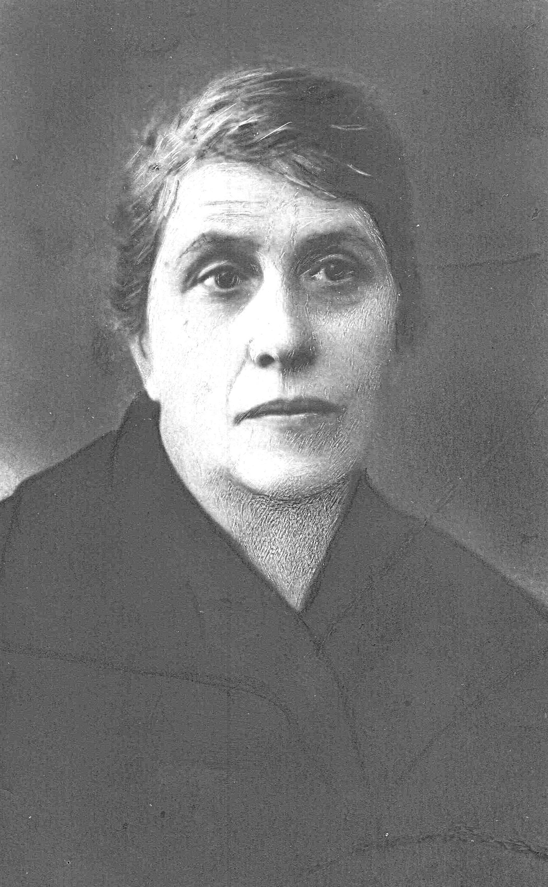

# Surname: Boara

An Italian surname from the Veneto — the name of cattle herders who became urban professionals in Dalmatia. **[Ottilia Anna Vincenza Boara](../people/ottilia-anna-vincenza-boara.md)** married [Pietro Pio Addobbati](../people/pietro-pio-addobbati.md) in 1890, connecting the Boara family to the [Addobbati](surname-addobbati.md) civic lineage and, through it, to the [Zerauschek](surname-zerauschek.md) commercial dynasty.

---

## Etymology

From Latin **bovarius** — "of or relating to oxen" — through the Italian **boaro** or **bovaro** (oxherd, cattle driver). The surname is occupational: it described someone who worked with cattle, whether as a herder, drover, or farmer. The form *Boara* (with the feminine *-a* ending) may reflect a dialectal or regional variant, or it may derive from a place name — **Boara Pisani**, a municipality in the province of Padua in the Veneto, takes its name from the same root.

**Classification:** occupational (Latin *bovarius* → Italian *boaro*).

---

## Variant spellings

| Form | Context |
|------|---------|
| **Boara** | Form used in this family; common in Veneto and Dalmatia |
| **Boaro** | Masculine form; standard in Veneto |
| **Boari** | Tuscan/Emilian variant |
| **Boaretti** / **Boaretto** | Diminutive forms; Padua |
| **Boaron** | Veneto variant |
| **Boarini** | Emilia-Romagna |
| **Bovaro** / **Bovari** | More Latinate forms |

---

## Geographic distribution

The Boara/Boaro cluster is concentrated in the **Veneto** (especially Padua and the Po plain) and in communities where Venetian families settled along the Adriatic — including Dalmatia. The municipality of **Boara Pisani** in the province of Padua may be the topographic source for some bearers, though the occupational etymology (cattle work on the flat Venetian plain) is equally plausible.

---

## In this tree

The Boara family appears in Zara as part of the Italian-speaking civic world. **Zio Casimiro Boara** and **Zia Carmela** lent money regularly to Ottilia and Pietro Pio's struggling household — and Casimiro always forgave the debt. Their house stood on **Piazza dell'Erbe** (the market square), documented in a family photograph captioned "Casa Boara / nonna Ottilia / piazza dell'Erbe."

Ottilia herself was described as **civile** in the 1890 marriage register — the term marking her social standing in the same way *cittadini* marked the Addobbati. The Boara connection brought financial support and Venetian-Dalmatian family networks to a household that combined civic standing with chronic money trouble.

Six Boara/Boaro individuals appear in the tree, all in the Zara/Dalmatia branch.

---

## Related

- [Zara — Italian Dalmatia](zara-italy-dalmatia.md)
- Surname: [Addobbati](surname-addobbati.md) — the family Ottilia married into
- Surname: [Zerauschek](surname-zerauschek.md) — connected through Ester Addobbati's marriage to Antonio
- [Pietro Pio Addobbati](../people/pietro-pio-addobbati.md) — Ottilia's husband

### See also

- [Wikipedia — Boara Pisani](https://en.wikipedia.org/wiki/Boara_Pisani) (Padua municipality)
