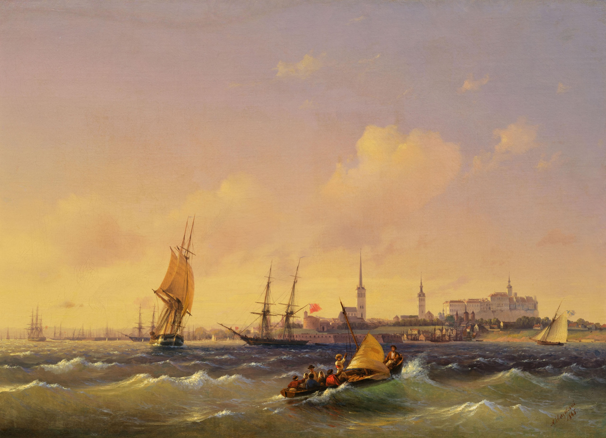

# Surname: Eylandt

The largest uncovered surname cluster in this tree — twenty-three people across several spelling variants — and a name that means, simply, "island." A Baltic German family anchored in Tallinn and its hinterland, embedded in the same institutional world of pastors, guild masters, and civic administrators that produced the [Erbe](surname-erbe.md) family they married into.

---

## Etymology

From Middle High German **eilant** or **einlant(d)** — "land lying by itself," i.e. an island. The prefix *ein-* means "solitary" or "alone" (the same root as *Einsiedler*, hermit). The word is a direct cognate of English *island* and modern German *Eiland* (a poetic/archaic term for island, now largely replaced by *Insel*).

In the Baltic context the name may also reflect Swedish-Estonian coastal geography, where the prefix *ey-* / *ö-* (Swedish for island) was used for settlements along the Estonian archipelago coast. The surname would then describe someone from or near an island — a topographic label that makes particular sense in Estonia, where the western coast and its islands (Saaremaa, Hiiumaa, Muhu) were a defining feature of the landscape.

**Classification:** topographic (Middle High German / Baltic German).

---

## Variant spellings

| Form | People in tree | Note |
|------|---------------|------|
| **Eylandt** | 15 | Principal form in this family's records |
| **Eiland** | 7 | Simplified spelling |
| **Eyland** | 1 | Intermediate form |

The spellings reflect the usual Germanic orthographic drift: *ey* → *ei*, *dt* → *d*. All three forms appear in the same family across different register entries and census records, and should be treated as the same surname.

---

## Geographic distribution

The surname (across all spellings) has its highest density in **Estonia**, consistent with the Baltic German community. In the broader world it is rare — Forebears lists *Eiland* as a surname found primarily in the United States and South Africa (likely different origin families), but the *Eylandt* form with the archaic *-dt* ending is essentially exclusive to the Baltic German population.

---

## In this tree

The Eylandt family connects to the main line through **[Emilie Ida Eylandt](../people/emilie-ida-eylandt.md)**, who was born and died in Tallinn. She married **[Hermann Eberhard Erbe](../people/hermann-eberhard-erbe.md)** (the Domschloßvogt), and their daughter [Olga Caroline Erbe](../people/olga-caroline-erbe.md) married [Marc Francois Stump](../people/marc-francois-stump.md). The Eylandt–Busse parents (Emilie's parents) married in **Viljandi** in 1799.

With twenty-three people in the tree, the Eylandt/Eiland cluster is one of the densest surname groups outside the core patrilines — a reflection of the tight, endogamous nature of Baltic German civic society, where the same families intermarried across generations within the Tallinn Dome congregation and the guild system.

---

## Related

- [Lewis (Wales) · Stump (Europe) — line hub](lewis-wales-stump-europe.md)
- Story: [Stump — Thurgau & Tallinn](../stories/stump-thurgau-tallinn-baltic-line.md)
- Surname: [Erbe](surname-erbe.md) — the family the Eylandts married into
- Surname: [Stump](surname-stump.md) — the Swiss family connected through the Erbe marriage

### See also

- [Forebears — Eiland](https://forebears.io/surnames/eiland)
- [Wikisource — Etymological Dictionary of the German Language: Eiland](https://en.wikisource.org/wiki/An_Etymological_Dictionary_of_the_German_Language/Annotated/Eiland)
