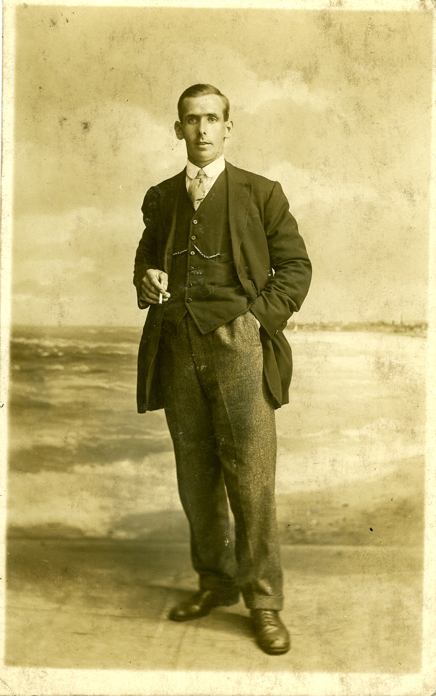

# Surname: Lewis

The surname **Lewis** is the 546th most common in the world — roughly one million bearers across six continents — and the second most common in Wales, behind only Jones. For genealogists tracing Welsh lines, this ubiquity is both a blessing and a curse: the name is everywhere, which means the records are vast, but distinguishing one Lewis family from another in a country where a handful of surnames account for half the population requires parish-level precision.

---

## Etymology

Lewis has two distinct roots that merged into a single English-language surname:

**Welsh (patronymic).** The dominant origin in Wales. *Lewis* is an anglicisation of **Llywelyn**, one of the most prestigious Welsh personal names. Anglo-Norman scribes began rendering *Llywelyn* as *Lewis* from the thirteenth century; Welsh families adopted the English spelling over the following centuries as the patronymic *ap Llewelyn* ("son of Llewelyn") was compressed into a fixed hereditary surname. The deeper etymology traces to Common Brittonic **Lugubelinos**, a compound of two Celtic deity names — Lugus and Belenus. A folk etymology connects the name to *llew* ("lion"), reinforced when Llywelyn the Great adopted a coat of arms with four lions rampant, but the scholarly consensus favours the theophoric origin.

**Norman French (Germanic).** Independently, the Normans brought the name *Lowis* or *Lodovicus* — from Frankish *Hlūdawīg* ("famous battle"), the same root that gives French *Louis* and German *Ludwig*. This strain entered England with the Conquest and later merged orthographically with the Welsh form.

In any Welsh genealogical context — and the Lewis line in this tree originates in the [Aberdare valleys](aberdare-welsh-valleys.md) — the Llywelyn derivation is overwhelmingly more probable.

**Classification:** patronymic (Welsh) / personal-name-derived (Norman).

---

## Variant spellings

| Form | Context |
|------|---------|
| **Llywelyn** / **Llewelyn** / **Llewellyn** | Original Welsh; still used as a given name and (less commonly) as a surname |
| **Lewis** | Standard anglicised form from the 13th century onward |
| **Lewes** | Older English spelling; also a Sussex place name |
| **Luis** / **Luís** | Spanish and Portuguese cognate (same Frankish root) |
| **ap Llewelyn** | Patronymic form before fixed surnames (pre-16th century) |

In Welsh parish registers before the mid-nineteenth century, the same individual might appear as both *Llewelyn* and *Lewis* depending on the clerk.

---

## Geographic distribution

Lewis is most prevalent in the **United States** (by raw count) and has the highest density in **Grenada**, reflecting Caribbean migration patterns. In the UK it is concentrated in **Wales** and the Welsh border counties, with secondary clusters in London (the result of two centuries of migration from the Welsh coalfields and agricultural districts to the capital).

| Region | Incidence | Note |
|--------|-----------|------|
| Worldwide | ~995,000 | 546th most common surname globally |
| United States | largest count | Welsh, English, and Scots-Irish immigration |
| Wales | ~1 in 50 | Second most common surname after Jones |
| England | dense in London, Midlands | Welsh migration to industrial and capital cities |
| Grenada | highest density | Caribbean diaspora |

*Source: Forebears.io (2014 data, ~4 billion name records).*

---

## The Welsh naming problem

Welsh genealogy is uniquely difficult because of the **patronymic system**. Before the sixteenth century, Welsh people did not use fixed surnames at all — a man was identified as *Dafydd ap Llewelyn ap Gruffudd* (David son of Llewelyn son of Griffith). English administrative pressure and the Acts of Union (1536–1543) forced the adoption of fixed surnames, but Welsh communities drew from a tiny pool of names. The result: by the nineteenth century, roughly **70% of the Welsh population** shared fewer than twenty surnames. Jones, Williams, Davies, Evans, Thomas, Lewis, Roberts, Hughes, Morgan, and Griffiths dominate every parish register.

For the Lewis family in this tree — rooted in [Aberdare](aberdare-welsh-valleys.md) and the Cynon Valley — this means that civil registration, chapel records, and census addresses are essential for disambiguation. The surname alone proves nothing.

---

## In this tree

The Lewis patriline runs through the South Wales coalfield: **[Samuel Lewis](../people/samuel-lewis.md)** and **[Lily Cushen](../people/lily-cushen.md)** of Aberdare; their son **[David John Lewis](../people/david-john-lewis.md)**, educated at Aberdare Grammar School, who served in Italy during the Second World War and received the **Silver Star**; and onward to **[Anthony Robert Lewis](../people/anthony-robert-lewis.md)**. Whether the line traces deeper into Glamorgan or Carmarthenshire — or whether Samuel was himself a migrant to the coalfield from agricultural west Wales — remains an open question.

### Related

- [Aberdare and the Welsh valleys](aberdare-welsh-valleys.md)
- Story: [Lewis — Aberdare & Merthyr coalfield](../stories/lewis-aberdare-merthyr-coalfield.md)
- Story: [David John Lewis — Italy 1945 & Silver Star](../stories/david-john-lewis-italy-1945-silver-star.md)
- Surname: [Evans](surname-evans.md) — the other major Welsh surname in this tree (via the London branch)

### See also

- [Behind the Name — Lewis](https://surnames.behindthename.com/name/lewis)
- [Forebears — Lewis](https://forebears.io/surnames/lewis)
- [Wikipedia — Lewis (surname)](https://en.wikipedia.org/wiki/Lewis_(surname))
- [Wikipedia — Llywelyn (name)](https://en.wikipedia.org/wiki/Llywelyn_(name))
