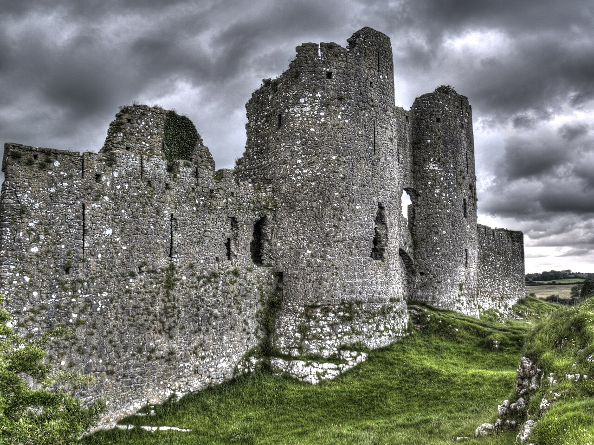

# Surname: Roche

A Norman name that crossed the Irish Sea with the first invaders and never left. The Roches are one of the great Hiberno-Norman families — arriving as conquerors in the twelfth century, becoming "more Irish than the Irish" within a few generations, forfeiting estates under Cromwell and William III, and re-emerging as Catholic merchant-gentry in Limerick and Dublin. The surname itself means nothing more than "rock," but the family it attached to left a deep mark on southern Ireland.

---

## Etymology

From Old French **roche** — "rock." Originally a topographic name for someone who lived near a prominent rock formation, or a locational name from any of numerous places in France called *La Roche*. The Norman form **de la Roche** ("of the rock") was carried to England, Wales, and Ireland by the Norman aristocracy from the twelfth century onward.

However, the first bearer of the name in Ireland — **Richard FitzGodebert de la Roche** — adopted the surname not from a French location but from **Rhos** in Pembrokeshire, Wales. The Norman colony in southwestern Wales (the "Englishry" of Pembroke) was the staging ground for the invasion of Ireland, and several of the founding Anglo-Norman families in Ireland took their names from Welsh places rather than French ones.

The heraldic arms of the Roche family play on the name: *Gules, three roaches naiant in pale* — three roach fish swimming vertically on a red field. The fish are a canting device (a visual pun on the surname), not an indication that the name derives from the fish.

**Classification:** topographic / locational (Old French *roche*, via Norman Wales).

---

## Variant spellings

| Form | Context |
|------|---------|
| **Roche** | Standard form in Ireland and France |
| **de la Roche** | Original Norman form; the *de la* dropped over time |
| **Roach** / **Roache** | Anglicised forms; common after the Cromwellian period |
| **Roch** | Shortened; also a Welsh place name (St David's peninsula) |
| **de Róiste** | Irish-language form |

The shift from *Roche* to *Roach* accelerated during the seventeenth century, when English administrative pressure and the Penal Laws encouraged (or forced) Anglicisation of Irish and Norman-Irish surnames. Many Roche families in County Cork and Wexford appear as *Roach* in civil records while retaining *Roche* in family and church usage.

---

## The Normans in Ireland

The Roche surname arrived with the **Norman invasion of Ireland** in 1169–1171. Richard FitzGodebert de la Roche was among the first wave, landing in **1167** — two years before the main invasion under Strongbow — and acquiring large tracts of southern **County Wexford**. The family rapidly established themselves across Munster:

- **County Cork:** The Roches became lords of **Fermoy**, and the area around Fermoy became known as "Roches Country." David Roche was created **1st Viscount Fermoy** in 1570.
- **County Limerick:** A major branch settled in the city and its hinterland, building a merchant-gentry dynasty that Burke's *History of Commoners* (1833) documented in detail.
- **County Wexford:** The original Norman grant; six townlands named **Rochestown** survive across counties Wexford, Cork, and Kilkenny.
- **County Kilkenny:** The family held **Granagh Castle** (Burke's 1833).

The Roches became thoroughly Gaelicised — "more Irish than the Irish themselves," in the standard phrase applied to the Old English of Ireland. They intermarried with Gaelic families (O'Moore, O'Brien, Burke, Lysaght), adopted Irish customs, and were Catholic at a time when that carried political cost. Members sat in the **Catholic Parliament** of 1641. The Williamite confiscations stripped the senior branches of their estates, but the merchant and professional class survived.

The family's prominence endured into the modern period. Edmund Burke-Roche was created **Baron Fermoy** in 1856; his descendants include **Frances Shand Kydd** (née Roche), mother of **Diana, Princess of Wales**.

---

## Geographic distribution

The Roche surname is concentrated in **southern Ireland**, with the densest clusters in Cork, Wexford, Limerick, Waterford, Kerry, and Kilkenny. Mid-nineteenth-century data shows approximately 584 Roche households in Cork and 439 in Wexford. The name is also found in England (particularly London), France, and across the Americas and Australasia through Irish emigration.

---

## In this tree

The Roche line in this tree belongs to the **Limerick Catholic merchant-gentry** branch documented in Burke's *History of Commoners* (1833). The descent runs:

| Generation | Person | Note |
|------------|--------|------|
| c. 1641 | John Roche of Castletown-Roche (Cork) | Catholic Parliament; descendants forfeited under William III |
| b. 1688 | [John Lysaght Roche](../people/john-lysaght-roche.md) m. [Anna Stackpole](../people/anna-stackpole.md) | Limerick/Rotterdam trading empire |
| b. 1724 | [Stephen John Roche](../people/stephen-john-roche.md) m. [Sarah O'Bryen](../people/sarah-obryen.md) | Limerick merchant |
| fl. early 19th c. | [Thomas Roche](../people/thomas-roche.md) m. [Hellen Ankettle](../people/hellen-ankettle.md) | "Thomas Roche of Limerick" (Burke's) |
| fl. 1830s | [William Roche](../people/william-roche.md) m. [Eliza Knight](../people/eliza-knight.md) | Solicitor in Dublin |
| b. 1841 | [Catherine Mary Roche](../people/catherine-mary-roche.md) m. [William O'Byrne White](../people/william-obyrne-white.md) | Dublin → Bombay → Tralee |

Catherine Mary Roche married a surgeon and followed him to Bombay; their son [Gerald Sebastian White](../people/gerald-sebastian-white.md) became a solicitor in Madras — repeating the legal profession that runs through the Roche line. Through the White family, the Roche surname connects to the broader [Lewis](surname-lewis.md) tree.

The allied surnames tell the same story of Hiberno-Norman gentry networks: **Stackpole** (Anna Stackpole married John Lysaght Roche), **O'Moore** ([Stephen O'Moore Roche](../people/stephen-omoore-roche.md)), **Lysaght/Lysagt** ([Anastasia Lysagt Burke](../people/anastasia-lysagt-burke.md)), **O'Bryen** ([Sarah O'Bryen](../people/sarah-obryen.md)), **Ankettle** ([Hellen Ankettle](../people/hellen-ankettle.md)), **Knight** (Eliza and her sister Catherine Knight both married Roche brothers — a tight cousin-network marriage typical of Catholic gentry).

---

## Related

- [Lewis (Wales) · Stump (Europe) — line hub](lewis-wales-stump-europe.md)
- [Roche of Limerick — Forgotten Victorians (Burke's 1833)](../sources/roche-of-limerick-forgotten-victorians.md)
- [O'Brien / Roche notes](../sources/obrien-roche-notes.md)
- [Lewis / White / Roche / Ireland corpus cluster](../sources/lewis-white-roche-ireland-corpus-cluster.md)
- Surname: [Lewis](surname-lewis.md) — the Welsh line connected through the White family

### See also

- [Wikipedia — De la Roche family](https://en.wikipedia.org/wiki/De_la_Roche)
- [Ireland Calling — Roche/Roach history](https://ireland-calling.com/irish-names-roche-roach/)
- [Burke's History of Commoners, Vol. 1 (1833), pp. 669–671](../sources/corpus/roche-of-limerick-forgotten-victorians-da2674483d/)
