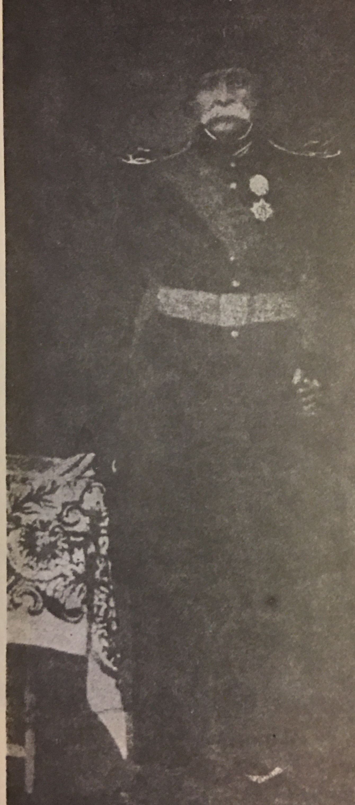

# Surname: Saginian

A surname that was born in transit. The family left Georgia under the name **Saginskilli** (also transliterated *Saginashvili*) and arrived in Qajar Iran as **Saginian** — the shift from Georgian to Armenian marking a change not just of language but of communal identity.

---

## Etymology

The Georgian original is **Saginskilli** (საგინსკილი) or the related clan name **Saginashvili** — a noble designation from the Kartvelian naming tradition. The precise root meaning is debated; the Georgian suffix *-shvili* means "child of" (as in Stalin's birth name Jughashvili), while *-skilli* is a less common variant.

The **Armenian form Saginian** adopts the standard Armenian patronymic suffix ***-ian*** ("son of" or "descendant of"), which functions identically to Georgian *-shvili* or Persian *-zadeh*. The base element ***Sagin-*** is sometimes linked in folk etymology to Armenian words for **falcon** (*saghi* and similar roots behind surnames like Saghian) — plausible as a **hearing** of the Georgian form, not an established philological equation.

**Classification:** patronymic (Georgian → Armenian transformation).

---

## The name transformation

The shift from *Saginskilli* to *Saginian* is not merely orthographic — it represents a deliberate communal re-identification. When **[Daoud Khan Saginian](../people/daoud-khan-saginian.md)** and his brother Zaal deserted the Russian army in 1811 and fled south to Qajar Iran, they were Georgian Christians entering a predominantly Shia Muslim state. They integrated into Iran's Armenian community — the established Christian minority with its own churches, schools, merchants, and social networks — rather than maintaining a separate Georgian identity. The surname change was part of that integration.

The British missionary Dr. Joseph Wolff, meeting Daoud Khan in Tabriz in 1843, called him "a genuine Georgian… Colonel in the Russian service." Four pages later in the same book, at departure, Wolff wrote "Daoud Khan the Armenian" — both identities coexisting within a single encounter. (*Narrative of a Mission to Bokhara*, 1845, Ch. XXVI.)

By the next generation — Daoud Khan's daughters [Anna](../people/anna-saginian.md) and [Tamar](../people/tamar-saginian.md) — the Armenian identity was fixed. Georgia had become an origin story, not a lived identity.

### Qajar print confirmation (1972)

For decades the vault inferred **Saginian** from Tamar’s portraits and **DAOUDIAN** patronymics while Anna’s 1880 NYPL appendix alone gave **Seguinoff** — as if the sisters wore different surnames. Footnote **(125)** in *Proche-Orient chrétien*, vol. 22 (1972), p. 404, stacks both spellings on **Daoud Khan himself**: **Saginian (ou Séguinoff)** de Tabriz, **Arménien de Géorgie**, officier de l'armée persane. His daughter **Anna (1815 – 8 janvier 1892)** is named explicitly. That is the capstone: **Seguinoff** is not a separate identity or a daughter-only mystery — it is the same Armenian-Iranian surname, once badly latinised by an English interviewer. [source card](../sources/proche-orient-chretien-1972-daoud-khan-saginian-seguinoff.md) · [full record](../sources/corpus/proche-orient-chretien-1972-daoud-khan-saginian-seguinoff/) · [EN translation](../sources/corpus/proche-orient-chretien-1972-daoud-khan-saginian-seguinoff/translation-footnote-125-daoud-khan-saginian.en.md) · full write-up: [Was Anna a Saginian?](../topics/was-anna-saginian.md).

---

## Variant forms

| Form | Language | Context |
|------|----------|---------|
| **Saginskilli** | Georgian | Original military/clan name; used in Russian army records |
| **Saginashvili** | Georgian | Alternative transliteration of the same clan |
| **Saginean** | Armenian (archaic) | Transitional transliteration |
| **Saginian** | Armenian | Standard form used in Iran and by descendants |
| **Séguinoff / Seguinoff** | French / English transcript | Alternate romanisation of **Saginian** on **Daoud Khan** (*Proche-Orient* 1972, footnote 125); Anna’s NYPL appendix spelling |
| **Saginov** / **Сагинов** | Russian (imperial) | Russified register spelling used from the mid-19th century for the same princely house |

---

## Nobiliary documentation (Saginashvili / Saginov)

Independent of whether **every** bearer named Saginashvili in Georgia belongs to the **same** line as **Daoud Khan**, there is **ordinary** Georgian and Russian-imperial documentation for **a** princely (**თავადური** / *tavadi*) house spelled **Saginashvili** (also **საგინაძეები** / *Saginadze*) — the stratum from which the **Saginskilli → Saginian** shift plausibly derives.

### Georgian reference points

- **Georgian Wikipedia — საგინაშვილები:** Princely family of eastern and south-western Georgia; connection to the **Dolengishvili** succession; **mouravi** role at **Kaikuli**; appearance among **Kakheti** nobles in the documentation attached to the **1783 Treaty of Georgievsk**; **imperial reconfirmation** of noble status on **6 June 1850** and **26 June 1856**; registration under the Russified surname **Сагинов** (*Saginov*). Secondary literature cited there includes **Dumin & Chikovani** and **Boshishvili** on **Dolengishvili**. [საგინაშვილები (Georgian)](https://ka.wikipedia.org/wiki/%E1%83%A1%E1%83%90%E1%83%92%E1%83%98%E1%83%9C%E1%83%90%E1%83%A8%E1%83%95%E1%83%98%E1%83%9A%E1%83%94%E1%83%91%E1%83%98)
- **Georgian Genealogy (Geogen):** Treats **Saginashvili** among **royal aznauri** of **Qarthli** (Kartli) and summarises documented appearances and landholding clusters in **Kakheti** (site navigation is by surname bundle). [Geogen — Saginashvili (treasurege/13/83)](http://www.geogen.ge/en/treasurege/13/83/) · [Origin — princely surnames hub](https://www.geogen.ge/en/history_surnames/origin_princes/)

### Russian imperial reference works

- **S. V. Dumin & Yu. K. Chikovani**, *Dvorianskie rody Rossiiskoi imperii. Tom 4: Kniaz'ia Tsarstva Gruzinskogo* (Moscow, 1998) — standard **“noble families / Georgian kingdom princes”** compendium; Georgian Wikipedia gives the family entry as **„Князья Сагиновы (Сагинашвили)”** with a **full bibliographic pointer** to **p. 197** in that volume. [Internet Archive — scan (fp. 197)](https://archive.org/details/4-1998_202212/page/197/mode/1up) · **Vault excerpt:** [source card](../sources/dumin-1998-georgian-princes-saginov.md) · [reference](../sources/corpus/dumin-1998-georgian-princes-saginov/) · [PDF excerpt](../../media/docs/internet-archive/saginian/dumin-chikovani-1998-vol4-saginov-pp202-205.pdf) — **David** and **Заал (№ 31)** in table 112 prose; **does not** name Daoud Khan's parents.
- **Ruwiki — master list of Georgian princely houses** includes an entry line for **„Князья Сагинашвили (Сагиновы, Сагидзе)”** (list item **29** in the table of contents — note: article body may be a stub or redlink on that wiki mirror). [Список княжеских родов Грузии (Ruwiki)](https://ru.ruwiki.ru/wiki/%D0%A1%D0%BF%D0%B8%D1%81%D0%BE%D0%BA_%D0%BA%D0%BD%D1%8F%D0%B6%D0%B5%D1%81%D0%BA%D0%B8%D1%85_%D1%80%D0%BE%D0%B4%D0%BE%D0%B2_%D0%93%D1%80%D1%83%D0%B7%D0%B8%D0%B8)

### Military service (context only)

Open-web sweeps **do not** surface **“Zaal Saginov/Saginashvili”** or **“Saginskilli”** as indexed Russian-army strings beyond Armenian/Qajar scholarship (**Maeda**, **Wolff**, etc.). What **does** surface is a **documented sibling pair** with the **Saginov (Сагинов) / Saginashvili (Сагинашвили)** double name, **Tiflis-guberniya nobility**, and **Caucasian Corps** service — the same **officer milieu** the vault assigns to **David and Zaal Saginean** before **1811**. **[Yaghoubian (2014)](../sources/yaghoubian-2014-ethnicity-identity-nationalism-iran.md)** reports family tradition that the brothers studied **Russian military sciences at an academy in Tiblisi as teens**; Russian Wikipedia assigns **Alexander D. Saginov** to the **Tiflis Noble School** (*Тифлисское благородное училище*). That is the **same city and noble-education stratum**, not proof they shared a classroom or a father **Dmitry**.

| Person | Relation / dates | Tie-in to this line |
|--------|------------------|---------------------|
| **Alexander Dmitrievich Saginov (Saginashvili)** | b. 15 Dec **1808**; Lt-Gen; **Tiflis Noble School**; entered corps **1826**; Dumin **p. 197** portrait subject | **Same house and surname pair** as the princely article; **too young** to be **Daoud** (c. **1790**). Adopted nephew **Ivan Vissarionovich Saginov** (officer; [mematiane.ge entry](http://mematiane.ge/product-details.php?id=3947)). [Ruwiki — A. D. Saginov](https://ru.wikipedia.org/wiki/%D0%A1%D0%B0%D0%B3%D0%B8%D0%BD%D0%BE%D0%B2,_%D0%90%D0%BB%D0%B5%D0%BA%D1%81%D0%B0%D0%BD%D0%B4%D1%80_%D0%94%D0%BC%D0%B8%D1%82%D1%80%D0%B8%D0%B5%D0%B2%D0%B8%D1%87) |
| **Yegor (Egor) Dmitrievich Saginov (Saginashvili)** | b. **1792 or 1800**; podpolkovnik, 13th Erivan Leib-Grenadier; d. **1844** | **Alexander’s brother** — a parallel **two-brother** officer set; but **entered service 24 Nov 1816** (*feuerwerker*, 21st Artillery Brigade), so **not** the same man as a brother who **deserted in early 1811** with **Solayman Khan** if that chronology is strict. [Ruwiki — E. D. Saginov](https://ru.wikipedia.org/wiki/%D0%A1%D0%B0%D0%B3%D0%B8%D0%BD%D0%BE%D0%B2,_%D0%95%D0%B3%D0%BE%D1%80_%D0%94%D0%BC%D0%B8%D1%82%D1%80%D0%B8%D0%B5%D0%B2%D0%B8%D1%87) |

**Next Russian-archive bait:** both carry patronymic **Dmitrievich** — i.e. father **Dmitry (Dmitri) Saginov**, who should appear in **Gogitidze**, *Gruzinskii generalitet (1699–1921)* (Kiev, 2001), **Bobrovsky**, *Istoriia 13-go leib-grenaderskogo Erivanskogo polka…* (1895; cited on the Russian articles), or the **Dumin** prose block on **p. 197**, even when **Table 112** uses other baptismal names.

Later **Saginov** officers (**Rostom Ivanovich**, **David Konstantinovich**, etc.) are listed on **ria1914.info** — useful for **descendant** lines, not for the **1811** generation.

**Peripheral:** [English Wikipedia — Solayman Khan Saham al-Dowleh](https://en.wikipedia.org/wiki/Solayman_Khan_Saham_al-Dowleh) restates **Maeda (2019)** on the flight with **David and Zaal Saginean**; it is **tertiary** — the vault still cites **[Maeda (2019)](../sources/maeda-2019-enikolopians.md)**.

### What this does **not** settle

- **Ashkanian / Arsacid / “Parthian” descent** claims (e.g. in [Armen Saginian’s memoir transcripts](../sources/corpus/armen-saginian-2022-thank-you-america-dawood-khan-chapter/transcription.md)) are **not** echoed as standard in the nobiliary literature above; treat them as **family historiography**, not as documented genealogy.
- **Prosopography:** *Proche-Orient chrétien* (1972) **names** **Daoud (ou David) Khan Saginian (ou Séguinoff)** in print — the vault’s capstone for the **Saginian / Seguinoff** equivalence on **the father**, not merely on Tamar or descendants. **Alexander / Yegor Saginov** remain a **negative partial match** for the **1811** generation (brother officers; wrong ages / enlistment date). The bridge from **documented princely Saginashvili** to **this tree’s** David and Zaal remains **[Maeda (2019)](../sources/maeda-2019-enikolopians.md)** + **[Yaghoubian (2014)](../sources/yaghoubian-2014-ethnicity-identity-nationalism-iran.md)** + **[Proche-Orient footnote (125)](../sources/proche-orient-chretien-1972-daoud-khan-saginian-seguinoff.md)** + primary interview matter — external sources **back class, country-of-origin, and Qajar surname usage**, not every biographical knot. The strongest **Georgian parentage** lead remains **patronymic *Dmitrievich* → father *Dmitry Saginov*** in **Gogitidze / Bobrovsky / Dumin** military and Dumin narrative.

---

## Geographic distribution

Saginian is not listed on Forebears or major surname databases — consistent with a very small family whose bearers were concentrated in **Iran** (Tehran, Tabriz, Isfahan) within the Armenian community, and subsequently dispersed through emigration to the Americas and Europe. The related form *Saghian* appears in Armenian diaspora communities worldwide, but Saginian as a specific variant belongs essentially to this one family line.

---

## In this tree

The Saginian surname anchors the oldest documented generation of the [Persia line](persia.md). **[Daoud Khan Saginian](../people/daoud-khan-saginian.md)** — Georgian military officer, Qajar *sartip*, head of the Isfahan army — had two daughters who married into the European circles orbiting the Qajar court:

- **[Anna Saginian](../people/anna-saginian.md)** married **[Edward Burgess](../people/edward-burgess.md)** (British merchant/translator), whose granddaughter [Fanny Burgess](../people/fanny-burgess.md) married **[Julien Bottin](../people/julien-bottin.md)** (French arsenal engineer)
- **[Tamar Saginian](../people/tamar-saginian.md)** married **[Dr. William Cormick](../people/william-cormick.md)** (physician to two Qajar shahs)

Through the Burgess → Bottin → Stump chain, the Saginian surname connects to [Étienne Stump](../people/etienne-stump.md) and onward to the [Lewis](surname-lewis.md) line. The full genealogical narrative is in the [Persia hub](persia.md) and the [Saginian-Burgess-Bottin-Stump story](../stories/saginian-burgess-bottin-stump.md).

---

## Related

- [Persia — Saginian → Burgess → Bottin → Stump](persia.md)
- [Qajar Armenian military](qajar-armenian-military.md)
- [NYPL Burgess Papers archive](nypl-burgess-papers-archive.md)
- Story: [Saginian → Burgess → Bottin → Stump](../stories/saginian-burgess-bottin-stump.md)
- Topic: [Was Anna a Saginian?](../topics/was-anna-saginian.md) — *Proche-Orient* footnote (125) as smoking gun
- Source: [*Proche-Orient chrétien* 1972 — Daoud Khan Saginian / Séguinoff](../sources/proche-orient-chretien-1972-daoud-khan-saginian-seguinoff.md)
- Surname: [Stump](surname-stump.md) — the Swiss line that married into the Bottin household
- Surname: [Bottin](surname-bottin.md) — the French family connecting Burgess to Stump

### See also

- [Armeniapedia — Dictionary of Armenian surnames (S)](https://www.armeniapedia.org/wiki/Dictionary_of_Armenian_Surnames_S)
- Maeda (2019), *The Persianate World*, Brill, pp. 189–195 — scholarly account of the 1811 flight
