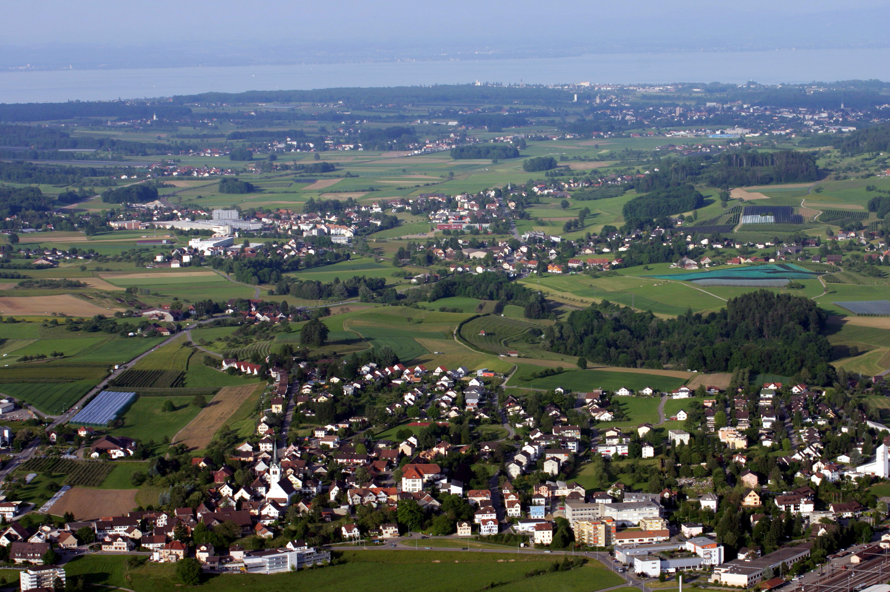

# Surname: Stump

A Swiss-German topographic surname rooted in the Reformed parishes of northeastern Thurgau, where church scribes recorded it in three different spellings across two centuries — and never settled on one.

---

## Etymology

From Middle High German **stumpf** or Middle Low German **stump** — a tree stump. The name was given to someone who lived by a prominent stump or in a clearing. An alternative derivation treats it as a nickname for a short, stocky person (Middle High German *stumpf* also carried the sense of "blunt" or "truncated"). The occupational possibility — a woodcutter — is occasionally proposed but less well attested.

**Classification:** topographic / nickname.

---

## Variant spellings

| Form | Context |
|------|---------|
| **Stump** | Standard modern Swiss-German form |
| **Stumpf** | Common variant; the *-pf* ending reflects southern German pronunciation |
| **Stumpp** | Doubled *-pp*; appears in Thurgau parish registers |
| **Stümpert** | Extended diminutive form (rare) |

In this family's own records, the three principal spellings alternate freely. The Reformed church books of northeastern Thurgau — Sulgen, Erlen, Buchackern — record **[Augustin Stumpf](../people/augustin-stumpf.md)** in the seventeenth century, **[Hans Jacob Stump](../people/hans-jacob-stump-1674.md)** in the same generation, and **Stumpp** on other entries. The scribes standardised nothing; the spellings reflect the clerk's ear on the day the register was written.

---

## Geographic distribution

Approximately **20,960** bearers worldwide. Most prevalent in the **United States** (through nineteenth-century emigration), but the highest density is in **Switzerland** — consistent with the family's documented Thurgau origin. Also found in Germany, Austria, France, and across the Americas.

| Region | Note |
|--------|------|
| Switzerland | Highest density; Thurgau is the documented canton for this line |
| United States | Largest count (German-Swiss emigration) |
| Germany | Southern and southwestern concentration |

*Source: Forebears.io (25,697th most common surname globally).*

---

## In this tree

The Stump patriline is traced through the Reformed church books of **Sulgen, Erlen, and Buchackern** in northeastern Thurgau across roughly two centuries, from [Augustin Stumpf](../people/augustin-stumpf.md) to [Marc Francois Stump](../people/marc-francois-stump.md) (b. 1834). Marc left Switzerland, passed his examinations at the University of Tartu, and became *Oberlehrer* of French at the Tallinn government gymnasium — a Swiss Protestant teaching French to Baltic German and Russian students in the capital of the Estonian governorate. He married [Olga Caroline Erbe](../people/olga-caroline-erbe.md) in 1868, joining a Swiss immigrant household to the [Baltic German Erbe](surname-erbe.md) civic world.

His son **[Étienne Stump](../people/etienne-stump.md)** carried the name to Tehran, where he practised dentistry for the Qajar and Pahlavi courts — the final leg of a journey from Swiss parish to Persian palace.

---

## Related

- [Lewis (Wales) · Stump (Europe) — line hub](lewis-wales-stump-europe.md)
- [Persia — Saginian → Burgess → Bottin → Stump](persia.md)
- Story: [Stump — Thurgau & Tallinn](../stories/stump-thurgau-tallinn-baltic-line.md)
- Story: [From Reval to Tehran — Étienne Stump](../stories/etienne-stump-reval-to-tehran.md)
- Surname: [Erbe](surname-erbe.md) — the Baltic German family Marc married into
- Surname: [Eylandt](surname-eylandt.md) — Olga Erbe's mother's family
- Surname: [Saginian](surname-saginian.md) — the Armenian line that married into the Stump household via [Bottin](surname-bottin.md) and Burgess

### See also

- [Forebears — Stump](https://forebears.io/surnames/stump)
- [Ancestry — Stump](https://www.ancestry.com/last-name-meaning/stump)
