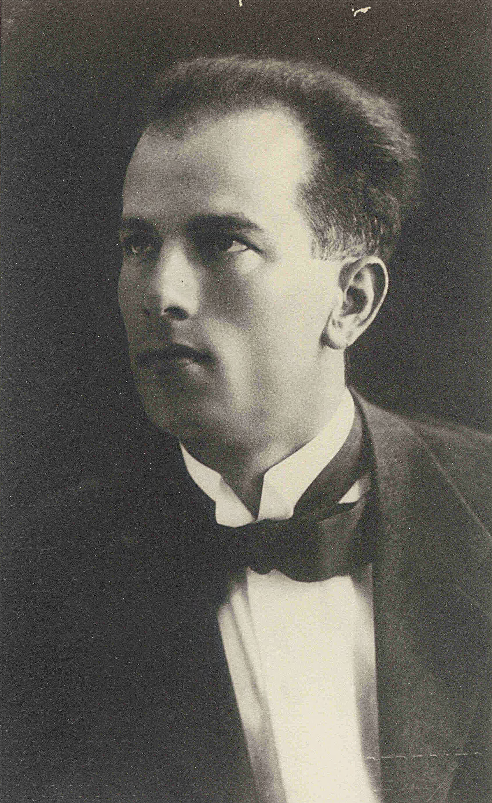

# Surname: Zerauschek

Fourteen people on Earth bear this surname. It is, by any measure, one of the rarest family names in the documented world — so rare that no surname database lists its meaning, and its phonetic neighbours on Forebears (Jirauschek, Jerouschek, Geratschek) collectively number fewer than a hundred bearers. The name exists almost exclusively because of one family, and the story it tells is one of linguistic borderlands: a Slavic root, a Germanic orthographic overlay, and an Italian life.

---

## Etymology

The surname is a **Germanised Slavic form**. The root is South Slavic ***žerav-***, meaning "ember" or "live coal" — the same root that gives the Serbo-Croatian surname *Žeravica* ("ember"). The suffix ***-šek*** is a Slovenian diminutive, comparable to Czech *-šek* or *-ček*. The compound **Žeravšek** or **Žeraušek** thus means roughly "little ember" or "ember-man's son."

The Germanised spelling **Zerauschek** replaces the Slavic diacritics (ž → z, š → sch) with standard German orthographic conventions — the kind of transformation that happened routinely across the Habsburg Empire's administrative apparatus, where Slovenian, Croatian, and Czech names were transcribed by German-speaking clerks into registers that used German spelling rules. The *au* diphthong represents the original Slavic vowel cluster (rav/rau), and the *-ek* ending preserves the Slavic diminutive in its most German-compatible form.

**Classification:** Germanised Slavic patronymic/diminutive (from a word meaning "ember").

---

## Variant spellings and phonetic relatives

| Form | Bearers | Note |
|------|---------|------|
| **Zerauschek** | 14 | The family's attested form in Italian Zara |
| **Žeravšek** | — | Reconstructed Slovenian original |
| **Žeraušek** | — | Alternate Slovenian/Croatian reconstruction |

**Phonetically similar surnames** (Forebears):

| Name | Similarity | Bearers | Probable origin |
|------|-----------|---------|-----------------|
| Jeruschek | 84% | 1 | Germanic |
| Jerouschek | 80% | 33 | German/Czech |
| Jirauschek | 80% | 12 | Czech/German |
| Geratschek | 80% | 11 | German |
| Jerausek | 78% | 19 | Czech |

The cluster of phonetically similar names sits squarely in the Czech–Austrian–Slovenian linguistic space, consistent with a Slavic name that passed through Germanic administrative systems.

---

## Geographic distribution

| Region | Incidence | Note |
|--------|-----------|------|
| Italy | 7 | 43% Tuscany, 29% Sardinia, 14% Emilia-Romagna |
| Argentina | 4 | Emigration |
| Australia | 2 | Emigration |
| United States | 1 | — |

The Italian concentration — particularly in Tuscany — reflects the post-1943 **exile of Italian Dalmatians** (*esuli dalmati*), not an original Tuscan presence. Before the Second World War, the Zerauschek family was rooted in **Zara (Zadar)**, the Italian-speaking enclave on the Dalmatian coast. Antonio Zerauschek's obituary in the *Difesa Adriatica* (1973) describes him as an "industriale zaratino, ora trasferitosi in quel di Firenze" — a Zara industrialist, now resettled in the Florence area. The Sardinian and Emilian instances likely represent further dispersal of the same exile community.

*Source: Forebears.io (5,213,395th most common surname globally — effectively a single-family name).*

---

## The name in context: Zara's multilingual elite

The Zerauschek name encodes the social world of Dalmatian port cities under successive empires. Zara's Italian-speaking elite included families whose surnames were Slavic, German, Hungarian, Greek, and Albanian in origin — all of them operating in Italian as a civic and commercial language. Antonio Zerauschek's world was Italian Zara: import-export, real estate, hospitality, the Caffè Centrale, the Hotel Excelsior, the Manifattura Tabacchi Orientali. His surname marked Central European roots — probably Slovenian or Austrian — but his identity was Italian-Dalmatian.

This was typical. Dalmatia under Venice, Austria, and Italy was a zone where surnames and spoken language often told different stories. Slavic names circulated in Italian-speaking households; Italian surnames appeared in Croatian-speaking villages. The Zerauschek form — Slavic root, German spelling, Italian bearer — is a compact history of the region.

---

## In this tree

**[Antonio Zerauschek](../people/antonio-zerauschek.md)** (1889–1973) — son of a carpenter — became one of interwar Zara's most prominent businessmen: the Caffè Centrale, Hotel Excelsior, Calypso cigarettes, Ausonia chocolate, flour imports, automobile agencies. He married **[Ester Addobbati](../people/ester-addobbati.md)**, connecting the Zerauschek commercial family to the older [Addobbati](surname-addobbati.md) civic lineage. Their daughter **[Fulvia Ottilia Antonia Zerauschek](../people/fulvia-ottilia-antonia-zerauschek.md)** grew up in this world of Italian Dalmatian bourgeois life before the Allied bombing of 1943–44 destroyed it. She married **[David John Lewis](../people/david-john-lewis.md)** in 1947, carrying the Dalmatian story into the Welsh [Lewis](surname-lewis.md) line.

Antonio's father, **[Antonio Zerauschek (senior)](../people/antonio-zerauschek-senior.md)**, was a carpenter — the trade that anchors the family in the artisan class before the son's dramatic commercial ascent.

---

## The Lewis lace collection (2006)

Fulvia Zerauschek Lewis owned one of Europe's most important antique lace collections — over 600 pieces spanning the 16th to 20th centuries. After her death in 2000, sons Ivor and Owen Michael (Michele) Lewis sold the collection to the **Provincia autonoma di Trento** for €120,000 in December 2006, destined for the planned **Museo del Tessuto** at Palazzo Taddei, Ala. The Soprintendenza declared the pieces "rare, of considerable size, and from Europe's finest manufacturers." Two articles in *L'Adige* (28 Dec 2006): [transcript + English](../sources/corpus/ladige-2006-lewis-lace-collection-trento/translation-ladige-lewis-lace-2006.en.md).

## Related

- [Zara — Italian Dalmatia](zara-italy-dalmatia.md)
- [Esuli Dalmati — Zara and exile](esuli-dalmati-zara-exile.md)
- [Zadar interwar hotels and cafés](zadar-interwar-hotels.md)
- Story: [Zara — Antonio Zerauschek](../stories/zerauschek-zadar.md)
- Story: [Villa Ester — from the Zerauscheks to Maria Callas](../stories/zerauschek-villa-callas-sirmione.md)
- Surname: [Addobbati](surname-addobbati.md) — the family they married into
- Surname: [Lewis](surname-lewis.md) — the line Fulvia joined

- Source: [L'Adige (2006) — Lewis lace collection sold to Trento](../sources/ladige-2006-lewis-lace-collection-trento.md)
- Topic: [Museo del Tessuto — Palazzo Taddei, Ala](lewis-lace-collection.md)

### See also

- [Forebears — Zerauschek](https://forebears.io/surnames/zerauschek)
- [Wikipedia — Žeravica (surname)](https://en.wikipedia.org/wiki/%C5%BDeravica_(surname)) — same *žerav-* root
