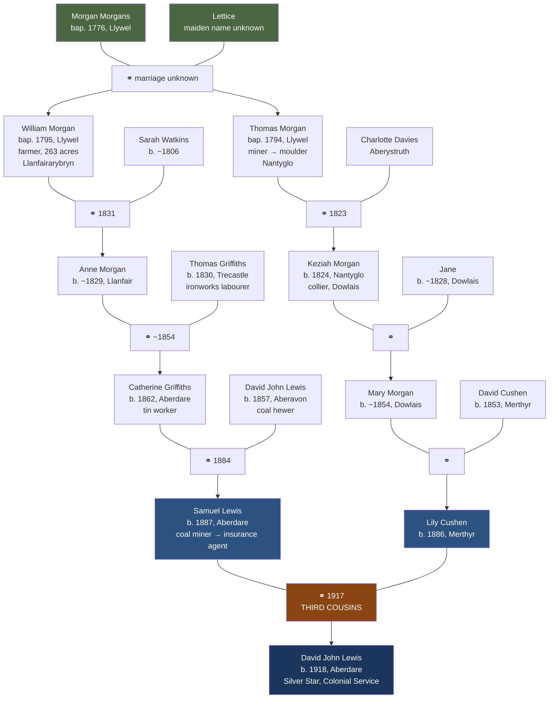

# The centiMorgan Morgans

[Thomas Morgan](../people/thomas-morgan-nantyglo.md) and [William Morgan](../people/william-morgan-llanfairarybryn.md) were **brothers**, both baptised at Llywel parish church in Breconshire — Thomas on 15 February 1794, William on 15 September 1795. Their father was [Morgan Morgans](../people/morgan-morgans-llywel.md), their mother was [Lettice](../people/lettuce-llywel.md). The brothers took entirely different paths in life: Thomas walked thirty miles south-east to the ironworks at Nantyglo and became a miner; William crossed one parish boundary to Llanfairarybryn and became a farmer on 263 acres.

Five generations later, their descendants married each other. [Samuel Lewis](../people/samuel-lewis.md) and [Lily Cushen](../people/elizabeth-lilian-cushen.md) wed in Merthyr Tydfil in 1917 without knowing they were **third cousins** — that they shared the same great-great-grandparents, **Morgan Morgans** and **Lettice** of Llywel. Their son [David John Lewis](../people/david-john-lewis.md), born in 1918 at Aberdare, carries this couple's blood from both sides of his family.

Lettice's maiden name is unknown. No marriage record for Morgan Morgans and Lettice has been found.

## The evidence

Two entries in the Llywel parish register, eighteen months apart, name the same parents:

| Child | Baptism date | Parish | Father | Mother | FMP ID |
|-------|-------------|--------|--------|--------|--------|
| **Thomas Morgan** | 15 Feb 1794 | Llywel, Breconshire | Morgan Morgans | **Lettice** | `R_732790425` |
| **William Morgan** | 15 Sep 1795 | Llywel, Breconshire | Morgan Morgans | **Lettuce** | `R_732790335` |

Same parish, same register batch (C08147-1), same FamilySearch place ID (10578868). The mother's name is spelled *Lettice* on Thomas's record and *Lettuce* on William's — the same name with normal 18th-century spelling variation.

Morgan Morgans himself was baptised at Llywel on 27 December 1776, son of **Morgan** and **Rachel** — the patronymic naming convention (Morgan son of Morgan) still in use in the Brecon Beacons at the end of the eighteenth century. He was 17 when Thomas was born and 18 when William arrived.

## How the lines descend

**Samuel's line to the brothers' parents:** Samuel → his mother Catherine Griffiths → her mother Anne Morgan → Anne's father **William Morgan** (bap. 1795) → William's parents **Morgan Morgans & Lettice**.

**Lily's line to the brothers' parents:** Lily → her mother Mary Morgan → Mary's father Keziah Morgan → Keziah's father **Thomas Morgan** (bap. 1794) → Thomas's parents **Morgan Morgans & Lettice**.

Morgan Morgans and Lettice were the **great-great-grandparents** of both Samuel and Lily. People who share great-great-grandparents are third cousins.

## How common was this?

In early-nineteenth-century rural Wales, third-cousin marriages were not just common — they were almost inevitable.

A parish like Llywel was a scattered upland community in the Brecon Beacons with perhaps 400–600 inhabitants. The pool of potential marriage partners across two or three generations was tiny. Studies of Welsh parish registers from this period consistently show that most marriages drew from a radius of 5–10 miles, and the same surnames recycle through the registers generation after generation. Morgan, Davies, Griffiths, Williams, and Jones dominate the Brecknockshire registers to such a degree that unrelated families sharing the same surname are the norm, and genuinely unrelated families sharing no common ancestor within six generations are the exception.

Every person has 64 theoretical ancestor slots at the great-great-grandparent level. In a population of a few hundred, those 64 slots cannot all be filled by distinct individuals — the lines must cross somewhere. This is **pedigree collapse**: the theoretical number of ancestor slots doubles with each generation, but the actual population is finite. For anyone with deep roots in a single region, some degree of overlap is a mathematical certainty.

Geneticists measure shared DNA in [centimorgans](https://en.wikipedia.org/wiki/Centimorgan) — a unit named after Nobel laureate [Thomas Hunt Morgan](https://en.wikipedia.org/wiki/Thomas_Hunt_Morgan). Samuel and Lily would share about 50 of them: half a *morgan* of genetic overlap, every last nucleotide traceable to the same eighteenth-century Welsh hill farmer. His name was **Morgan Morgans**.

## Why they had no idea

Thomas Morgan left Llywel for the Nantyglo ironworks around 1820. William Morgan stayed in the neighbouring parish. Within one generation their descendants had scattered across the coalfield — Nantyglo, Dowlais, Aberdare — and within two generations the original connection was invisible.

- **Geography**: Thomas went south-east to Monmouthshire (Nantyglo, Aberystruth). William stayed in Carmarthenshire (Llanfairarybryn). Different counties, different economic worlds — iron versus farming.
- **Names**: Thomas's line stayed Morgan. William's daughter Anne married a Griffiths. By the time Catherine Griffiths married David Lewis, the Morgan name was two generations buried and invisible.
- **Time**: Morgan Morgans was baptised in 1776 — 141 years before Samuel and Lily's 1917 wedding. The shared great-great-grandparents had been dead for decades.
- **Records**: Parish registers stayed in the parish. There was no centralised database. The only way to discover the connection would have been to physically visit Llywel church and read through the register page by page — something no one had any reason to do.

What makes it remarkable is that it is *discoverable* at all — because both baptism records survive in the same parish register and have now been indexed.

## Ahnentafel impact

Morgan Morgans occupies slots **268** (via the William/Griffiths line) and **280** (via the Thomas/Cushen line) in the [ancestor chart](../ancestor-tracker.md). Lettice occupies slots **269** and **281**. The total count of distinct ancestors is reduced by two.

## Sources

- [Baptism — Thomas Morgan, Llywel, 15 Feb 1794](../sources/corpus/1794-baptism-thomas-morgan-llywel/transcription.md) — FMP `R_732790425`
- [Baptism — William Morgan, Llywel, 15 Sep 1795](../sources/corpus/1795-baptism-william-morgan-llywel/transcription.md) — FMP `R_732790335`
- [Baptism — Morgan Morgans, Llywel, 27 Dec 1776](../sources/corpus/1776-baptism-morgan-morgans-llywel/transcription.md) — FMP `GBPRS/B/916017435/1`
- [Ancestor tracker](../ancestor-tracker.md) — slots 268–269 = 280–281

## Related

- [Morgan Morgans](../people/morgan-morgans-llywel.md) · [Lettice](../people/lettuce-llywel.md)
- [Thomas Morgan](../people/thomas-morgan-nantyglo.md) · [William Morgan](../people/william-morgan-llanfairarybryn.md)
- [Samuel Lewis](../people/samuel-lewis.md) · [Lily Cushen](../people/elizabeth-lilian-cushen.md)
