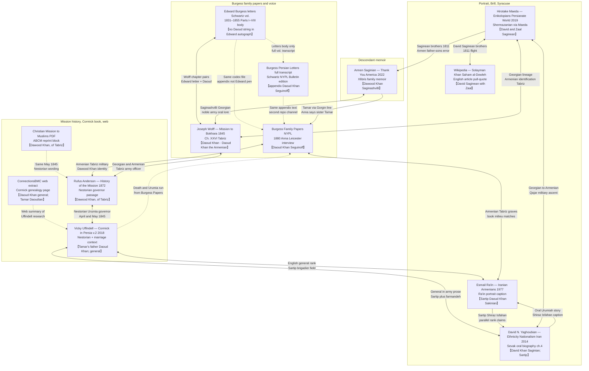

# Was Anna a Saginian?

The question of [Anna Saginian's](../people/anna-saginian.md) ethnic and family identity reveals the complex intersections of Georgian, Armenian, and Persian identities in nineteenth-century Iran. Her own testimony, corroborated by multiple sources, presents a fascinating case study in how families navigated ethnic boundaries in the multi-ethnic Qajar court society.

## Anna's Interview

In her **March 1880 oral interview** in Leicester (later transcribed and published as an appendix to the NYPL Burgess Persian Letters), Anna was unequivocal about her ancestry: *"My ancestors, on the sides of both parents, were Armenians, and I think for some time have lived in Tabriz."* She identified her father as **"Daoud Khan Seguinoff"** and described him as *"always in the military service of the Shah of Persia."*

The unusual spelling **"Seguinoff"** appears nowhere else in any historical records — it was likely the interviewer's attempt to phonetically capture Anna's pronunciation of an Armenian patronymic. This transcription artifact becomes significant when compared to other documentary evidence.

Anna positioned herself firmly within the Armenian community, noting that both her children were *"baptized in our house in Tehran, according to the Armenian rites"* and that her husband Edward was buried in the *"little lovely green Armenian cemetery just outside the walls of Tabriz."* She placed her family's graves there too: *"My dear father's grave is four or five English yards from it; it is among the graves of all my relations."*

Crucially, **Anna describes Edward's direct relationship with her father**: *"Edward Burgess asked for me of my father. I loved him even before we were married. Then we were married at my father's house."* This indicates Edward knew Daoud Khan personally and followed traditional marriage customs, asking permission from the father.

## Primary Sources

Anna's 1880 testimony forms the **cornerstone primary source** for the family's Armenian identity. In the [NYPL Burgess appendix interview](../sources/nypl-burgess-appendix-anna-interview.md), she provides a detailed family structure: six children total (two brothers, both merchants in Tabriz, both deceased by 1880; four sisters), with Anna as the eldest daughter. She confirms **Tamar** as her youngest sister: *"My youngest sister, Tamar, is the widow of Dr. Cormick."*

The family's integration into Tabriz's Armenian community appears complete. Anna describes extended family networks, Armenian marriage customs, and religious practices that suggest deep roots in that community by the 1850s.

## Then Into Tamar — Amazing!

Anna's identification of Tamar as her sister opens the door to **extraordinary corroborating evidence**. [Tamar Saginian](../people/tamar-saginian.md), widow of [Dr. William Cormick](../people/william-cormick.md) (the physician who met the Báb), appears throughout multiple independent source chains that confirm not only the sister relationship but the **Saginian surname** itself.

The [ConnectionsBMC genealogical material](../sources/corpus/connectionsbmc-saginian-interview/extracted.web.md) provides family research showing **"Tamar Daoudian, the daughter of Daoud Khan"** — the Armenian patronymic style (meaning "daughter of David") that parallels Anna's **"Seguinoff"** spelling in her transcribed interview. Both are patronymic variants attempting to render "daughter/son of David" in Latin script, not separate surnames, confirming the same father: **Daoud Khan**. The contrast between Anna's transcribed "Seguinoff" and the established **"Saginian"** found in all other documents suggests the interviewer was unfamiliar with Armenian naming conventions.

## Tamar as Saginian

The documentary evidence for Tamar's **Saginian** identity is remarkable. The renowned Armenian court painter **Hakop Hovnatanian** created an oil portrait specifically labelled **"Portrait of Tamar Saginian"** with the caption identifying her as *"the wife of Dr. McCormic the private physician of the King."* This is the same Hovnatanian who painted the Qajar royals — lending considerable weight to the attribution.

**Edward Burgess himself confirms the sister relationship** in his letter of February 21, 1854: *"Dr Cormick, with whom you were acquainted in England, and who married my wife's younger sister has been here since last October."* This contemporary testimony from Edward establishes the family connection independent of later sources.

Even more striking, **Armen Saginian's family memoir** *"Thank You, America & Americans"* (2022) — written by a great-great-grandson of Daoud Khan via the Gorgin Khan line — **explicitly identifies Tamar as Saginian** and names her as **"wife of William"**, confirming both the surname and the marriage connection. This book contains extensive genealogical charts and family photographs documenting the **Saginian lineage**.

## Then Contradictions

The contradictions emerge when we examine how **Edward Burgess described Anna** to his brother George in his letter of March 22, 1852. Edward called her *"a Georgian lady of good family and thank God she makes me a most kind agreeable and affectionate wife. She is pretty and about thirty three years old... She speaks Armenian and Turkish and writes the former so fast that to day she has written two letters for my one."*

This characterization seems to conflict directly with Anna's own 1880 testimony claiming **Armenian ancestry on both sides**. Yet Edward's description reveals he understood Anna's **linguistic fluency in Armenian** — she was writing Armenian correspondence for him.

The fact that Anna's **"Seguinoff"** appears nowhere in historical records raises additional questions: was this simply transcription error, or does it reflect how Anna herself pronounced her patronymic — perhaps indicating linguistic distance from standard Armenian or Georgian naming conventions?

The contradiction deepens when we examine testimony about **Daoud Khan himself**. The missionary **Joseph Wolff**, in *Narrative of a Mission to Bokhara* (Ch. XXVI, same volume dated 1845), worked from material gathered **in Tabriz in 1845** — Edward Burgess's letter there is dated **8 February 1845**, Mar Yohannan's from Oroomiah **27 March 1845**, and Wolff **left Tabriz on 9 December 1845** ([corpus extract](../sources/corpus/narrative-mission-bokhara/extracted.pdf.md)). In that chapter Wolff describes *"Daoud Khan, a Colonel in the Russian service. He is a genuine Georgian, and as such is not very fond of the Armenians."* Yet paradoxically, when listing the party that saw him out of the city, Wolff names **"Daoud Khan the Armenian"** beside Bonham, Osroff, and the Russian attachés.

This creates a puzzle: Anna claims Armenian ancestry on both sides, Edward calls her Georgian, and Wolff describes Daoud Khan as both a "genuine Georgian" who dislikes Armenians and simultaneously as "the Armenian."

## Daoud Khan — source overlap map

Only **sources** appear as nodes: no person bubbles, no synthetic “characteristics” hub. **Every local file or card that names him** (Daoud / Dawood / David / Seguinoff / Saginean / Sakinian / Saginashvilli / Daoudian as his daughter) is a box below. **【double brackets】** on a node = a **name chip**: the exact string or naming situation for Daoud (or explicit note when the source names him only indirectly). **Dotted** links mark **duplicate wording**, **subset / same codex**, **web précis**, or **notes clipping**. [Iranica — firearms](../sources/iranica-firearms-history.md) and [Wright burials](../sources/corpus/wright-burials-british-in-persia/transcription.md) contextualise the line but **do not name him** in the captured text, so they stay on [Daoud Khan’s person page](../people/daoud-khan-saginian.md) only. Each solid link is **one** inferential pairing; labels stay short (two lines).

**How to read it:** follow **arrows**. **【Chips】** = how that source spells or handles the name (or states that Edward’s **autograph letters** in the Schwartz transcript never type **Daoud Khan**, while the **same printed codex**’s appendix is Anna’s voice). **Double-headed solid** links = the **same trait** in both materials (two-line label). **Single-headed** arrows between Ra’in and Yaghoubian = agreement one way, tension the other. **Dotted** = duplicate channel, subset-of-volume, web précis, or notes clipping. **General ≈ Sartip:** Uffindell and ConnectionsBMC use **general**; Ra’in and Yaghoubian use **Sartip** — **Uffi ↔ Rain** and **Uffi ↔ Y14** tie that one rank field. **EdLetters ↔ Wolff:** same Tabriz season; Wolff’s published chapter juxtaposes **Daoud Khan** with **Edward Burgess** and his letter to Wolff (Edward still does not spell Daoud in the vault letter extract). The **Armen (2022)** node is **descendant memoir**; it **conflicts** with Anna and Maeda on **1811** and Tamar’s generation. Edward’s “Georgian lady” line is still **out of scope** for name chips (ethnic label for Anna, not a Daoud string).

## Then Who Daoud Khan Would Have Been

The resolution lies in understanding **Daoud Khan's actual origins and trajectory**. Maeda's 2019 Brill chapter, reading Shermazanian's Armenian history of prominent Armenians in Persia, identifies the companions of Solomon/Solayman Khan Saham al-Dowleh as the Georgian brothers **David and Zaal Saginean**. They fled to Qajar Iran around **1811**, after fear of forced relocation and conversion under Russian rule; Maeda's note preserves the memorable detail that Solomon and David secured permission to visit Tbilisi because their officer thought they wanted to take part in **wrestling**, then travelled via **Yerevan, Akhalkalaki, and Giumri** to **Tabriz**. Shermazanian says the brothers embraced the **Grigorian faith** after arriving in Tabriz and that their children became Armenians. This is the strongest source currently in the vault for the bridge from Georgian **Saginean/Saginskilli/Saginashvili** to Armenian-Iranian **Saginian**. See [Maeda 2019 corpus reference](../sources/corpus/maeda-2019-enikolopians-saginian-flight/reference.md) and [snippets](../sources/corpus/maeda-2019-enikolopians-saginian-flight/transcription.snippets.md).

The key insight is that **in Iran, the family integrated into the Armenian community**. The Georgian surname **Saginashvili/Saginskilli** became the Armenian **Saginian**, and Daoud Khan rose to the rank of **Sartip (Brigadier General)** under Fath Ali Shah while operating within Armenian social and religious networks.

**Crucially, this is confirmed by an independent American Board narrative**: Rufus Anderson's *History of the Mission* (1872) records that **"In May, 1845, the Shah... appointed Dawood Khan, of Tabriz, an Armenian from Georgia and an officer of the army, Governor of the Nestorians."** Verbatim extract, second passage on his role as **civil protector**, and Gutenberg pointer: [corpus `reference.md`](../sources/corpus/history-of-the-mission-by-rufus-anderson-5264293694/reference.md) · [source card](../sources/rufus-anderson-1872-history-missions-oriental-churches.md). This witness, compiling mission archives, describes Daoud Khan using the exact same dual identity — **"an Armenian from Georgia"** — that resolves all the apparent contradictions in our sources.

**Modern academic research confirms the complete story**: David Yaghoubian's 2014 study, based on oral interviews with Daoud Khan's great-great-great-grandson Sevak Saginian, establishes that David Khan Saginian died in **1867** and was buried in the **Saginian family mausoleum** at Surb Astvatsatsin, Tabriz — the same cemetery where Anna placed Edward's grave within yards of her father's.

This explains all the contradictions:

- **Anna was "Armenian"** in the sense that she was raised within the Armenian community of Tabriz, practicing Armenian Christianity and embedded in Armenian social networks
- **Edward called her "Georgian"** because he understood her father's ethnic origins — information that would have been more readily available to European merchants in the Iranian court circles
- **Wolff met a "genuine Georgian"** because Daoud Khan was indeed Georgian-born, but Wolff's reference to him as "the Armenian" reflects how he was **socially positioned** in Tabriz by the 1840s
- **Daoud Khan "is not very fond of the Armenians"** as an ethnic Georgian, but paradoxically **lived as an Armenian** in Iran — a tension that would not have been uncommon among Georgian refugees who found safety and advancement through Armenian community networks

The **Saginian name** is therefore **genuinely Armenian** — not by ancestry, but by **community integration and social identity**. Anna was, in the most meaningful sense, both Georgian by paternal bloodline and Armenian by upbringing, community, and practice. In the context of nineteenth-century Iran, **social and religious identity often mattered more than ethnic ancestry**.

## Daoud Khan's life: a coherent narrative

The same dual identity that made Anna's testimony confusing on first reading dissolves once Daoud Khan's life is told as a continuous story. He was born around **1790** in the Tbilisi area of Georgia (Yaghoubian 2014, n. 5; the year is recorded but no day or month survives in the vault). After the dissolution of the Georgian kingdom in 1801 he served as an officer in the **Russian army**, which is why Joseph Wolff would still describe him in 1843 as *"a Colonel in the Russian service... a genuine Georgian."* In **early 1811**, with his brother Zaal and their friend Solayman Khan Saham al-Dowleh, he obtained leave from his Russian commander on the pretext of going to Tbilisi for a wrestling match, and instead travelled south through Yerevan, Akhalkalaki, and Gyumri to **Tabriz**. Maeda's 2019 Brill chapter, drawing on Shermazanian's nineteenth-century Armenian history, gives the religious–political backdrop — fear of relocation to Russia, fear of forced conversion, the practical abolition of the Georgian Church — and Maeda's note 71 supplies the pivot: in Tabriz the brothers *"embraced the Grigorian faith… and their children became Armenians."*

Inside Iran, Daoud Khan rose through Crown Prince Abbas Mirza's military establishment to the rank of **Sartip** (Brigadier General). The Persian caption beneath his portrait in Esmail Ra'in's *Iraniyan-i Armani* records him as commander of the Iranian forces in the provinces of **Shiraz and Isfahan** under **Fath Ali Shah** (r. 1797–1834); Yaghoubian (2014) keeps the same provincial commands and adds his court titles **farmandeh** (supreme military commander) and **sarperast-e Aramane** (guardian of the Armenians). The well-known **1834 Isfahan** episode under Sayf ol-Dowleh, in which a division was placed under "David (Daoud) Saginian," sits inside this provincial period. It is not the only kind of work he did. Vicky Uffindell's *The Cormick family in Persia* (vol. 2) records that "Tamar's father, Daoud Khan… following a request by the **British and Russian consuls in Tabriz**, had been **placed in charge of the Nestorian Christians of Urumia in April 1845**" — the Assyrian/Church-of-the-East communities of the Urmia plateau in north-western Iran, geographically distinct from his earlier southern commands ([family-friends-1850s corpus](../sources/corpus/uffindell-cormick-persia-v2-family-friends-1850s/extracted.pdf.md)). Eighteen months after Wolff's Tabriz visit, Rufus Anderson's *History of the Mission* (1872) records the same event one rung higher in the diplomatic chain: *"In May, 1845, the Shah, at the instance of the English and Russian Ambassadors, appointed Dawood Khan, of Tabriz, an Armenian from Georgia and an officer of the army, **Governor of the Nestorians**,"* with the express object of protecting the Christian population. Anderson's phrase *"Armenian from Georgia"* is the missing seam — a contemporary, non-family voice describing exactly the Georgian-origin / Armenian-community man Wolff had met two years earlier and that Yaghoubian's family-line summary makes structural. The Urumia posting also explains why, when Tamar **Daoudian** married William Cormick at the British consulate in Tabriz on 19 October 1850, the officiant was the Rev. **William Stocking**, the American Presbyterian missionary based at Urumia and serving the Nestorian villages where the Cormick family held land — Stocking and Daoud Khan had a five-year working acquaintance.

His domestic life is recorded chiefly through Anna's 1880 testimony. Anna says her mother *"died some time before"* her father — so Daoud Khan was **widowed** in his last years, with no second marriage on record. His daughter **[Anna](../people/anna-saginian.md)** married **[Edward Burgess](../people/edward-burgess.md)** at her father's house in 1851; his oldest son **Goorgen Khan** died in his forties (Yaghoubian 2014), probably in the 1860s, before his father. The death itself is recorded in two evidential chains that do not align. Uffindell, drawing on the **NYPL Burgess Family Papers** transcript of Anna's interview, gives the actual scene: Daoud Khan "had been dangerously ill when Anna Burgess arrived in Tabriz with her daughter Fanny… on their way to live in **Urumia** where Fanny was to be taught English with the children of the American missionaries there. Anna nursed [her father] for several months, then as his health improved went on with Fanny to Urumia. However they had been there only a few weeks when Daoud Khan died and was buried in the Armenian cemetery." Uffindell sequences this account between **Shireen Cormick's death on 28 December 1864** and **the birth of James Ernest Cormick on 25 January 1865** — which places Daoud Khan's death in **late 1864 or very early 1865** ([epidemics-tabriz-eastwick corpus](../sources/corpus/uffindell-cormick-persia-v2-epidemics-tabriz-eastwick/extracted.pdf.md), p. 3). The standing scholarly date is **1867**, from Yaghoubian via Sevak Saginian's oral testimony, with burial in the **Saginian family mausoleum at Surb Astvatsatsin** outside the walls of Tabriz — the cemetery Anna describes in 1880, where her father's grave is *"four or five English yards"* from Edward's. The portrait caption's claim that he died aged **78** implies a death around **1868** if the birth year of c. 1790 is taken strictly. The two-to-three year gap between Uffindell (Anna's chain) and Yaghoubian (Sevak's chain) is unresolved on present evidence; Uffindell sits closest to first-hand testimony for the death itself, Yaghoubian closest to the burial-and-mausoleum record.

## Sources

### Primary documents
- **[Edward Burgess Letters (1827-1855)](../sources/corpus/burgess-persian-letters-full-volume/transcription.md)** — Edward's contemporary testimony:
  - **March 22, 1852**: *"I was married last autumn to a Georgian lady of good family... She speaks Armenian and Turkish and writes the former so fast"*
  - **February 21, 1854**: *"Dr Cormick... married my wife's younger sister"* (confirming Tamar connection)
  - **June 16, 1851**: *"she is a good horse-woman... she jumped beautifully"* (at Cheshma Ali)
- **[Anna's 1880 interview](../sources/nypl-burgess-appendix-anna-interview.md)** — Anna's own testimony:
  - *"My father, Daoud Khan Seguinoff, was always in the military service of the Shah"*
  - *"My ancestors, on the sides of both parents, were Armenians"*
  - *"Edward Burgess asked for me of my father... we were married at my father's house"*
  - *"My youngest sister, Tamar, is the widow of Dr. Cormick"*
- [Joseph Wolff, *Narrative of a Mission to Bokhara* (1845)](../sources/corpus/narrative-mission-bokhara/extracted.pdf.md) — contemporary description of Daoud Khan as Georgian who "is not very fond of the Armenians" yet later calls him "Daoud Khan the Armenian"
- [Rufus Anderson, *History of the Mission* (1872)](../sources/rufus-anderson-1872-history-missions-oriental-churches.md) — **key narrative source** (May 1845; civil protector vs patriarch/Jesuits/nobles): [corpus `reference.md`](../sources/corpus/history-of-the-mission-by-rufus-anderson-5264293694/reference.md)

### Corroborating evidence  
- [ConnectionsBMC Saginian interview material](../sources/corpus/connectionsbmc-saginian-interview/extracted.web.md) — family genealogy confirming Tamar Daoudian
- Hakop Hovnatanian portrait of **Tamar Saginian** (referenced in [Tamar's page](../people/tamar-saginian.md))
- [Armen Saginian family memoir](../sources/wishlist/saginian.md) — *Thank You, America & Americans* (2022)

### Research materials
- [Maeda 2019 — Lives of the Enikolopians: David and Zaal Saginean flight](../sources/corpus/maeda-2019-enikolopians-saginian-flight/reference.md) — Brill chapter excerpts from Shermazanian's Armenian source; names **David and Zaal Saginean**, explains the religious flight from Russian-controlled Georgia, the wrestling pretext, route to Tabriz, and post-arrival Armenian/Grigorian identity.
- [Georgian National Archives research proposal](../sources/wishlist/saginashvili-georgian-archives.md) — archival follow-up for David Saginashvili's Georgian origins
- [Yaghoubian (2014), *Ethnicity, Identity, and the Development of Nationalism in Iran*](../sources/yaghoubian-2014-ethnicity-identity-nationalism-iran.md) — **academic confirmation**: David Khan Saginian born 1790 Tbilisi, died 1867 Tabriz, buried in Saginian family mausoleum at Surb Astvatsatsin; based on oral interviews with descendant Sevak Saginian
- [Sir Denis Wright, "Burials and Memorials of the British in Persia" (1998)](../sources/corpus/wright-burials-british-in-persia/transcription.md) — records Anna's 1892 burial in Tehran Armenian church; Edward's 1855 burial at Sourp Shoughakat Church, Tabriz
- [Vicky Uffindell, *The Cormick family in Persia* (vol. 2) — family-friends-1850s corpus](../sources/corpus/uffindell-cormick-persia-v2-family-friends-1850s/extracted.pdf.md) — **April 1845**: at the request of the British and Russian consuls in Tabriz, Daoud Khan placed in charge of the Nestorian Christians of Urumia; 1850 marriage of Tamar Daoudian to William Cormick officiated by the Urumia missionary Rev. William Stocking
- [Vicky Uffindell, *The Cormick family in Persia* (vol. 2) — epidemics-tabriz-eastwick corpus](../sources/corpus/uffindell-cormick-persia-v2-epidemics-tabriz-eastwick/extracted.pdf.md) — Anna nursing her dangerously ill father in Tabriz, then continuing to Urumia with Fanny; Daoud Khan's death "a few weeks" after their arrival in Urumia; sourced from the NYPL Burgess Family Papers transcript of Anna's interview

### Corpus quick map (this thread)

| Thread | Where to read |
|--------|----------------|
| David / Zaal Saginean flight, wrestling pretext, Grigorian → Armenian identity | [Maeda 2019 — reference](../sources/corpus/maeda-2019-enikolopians-saginian-flight/reference.md) · [snippets](../sources/corpus/maeda-2019-enikolopians-saginian-flight/transcription.snippets.md) |
| Charles Burgess trade memorandum; Edward as Tabriz agent | [Brief Notice — reference](../sources/corpus/brief-notice-trade-northern-provinces-persia-villiers/reference.md) |
| Provenance of the *Brief Notice* reprint | [Abrahamian 1983 — reference](../sources/corpus/early-trade-northern-provinces-persia-document/reference.md) |
| Wright synthesis on Burgess brothers (secondary) | [Denis Wright excerpt — reference](../sources/corpus/denis-wright-english-amongst-persians-burgess/reference.md) |

## People linked
- [Anna Saginian](../people/anna-saginian.md)
- [Daoud Khan Saginian](../people/daoud-khan-saginian.md)  
- [Tamar Saginian](../people/tamar-saginian.md)
- [Edward Burgess](../people/edward-burgess.md)
- [William Cormick](../people/william-cormick.md)

## Cemetery Evidence

The burial locations of the family provide additional confirmation of the integrated Armenian identity. **Daoud Khan died in 1867** and was buried in the **Saginian family mausoleum at Surb Astvatsatsin** (Holy Mother of God church), Tabriz — the principal Armenian cemetery outside the city walls.

**Edward Burgess** was buried in the same cemetery complex in **June 1855**. Anna's 1880 interview describes the proximity: *"My dear father's grave is four or five English yards from [Edward's grave]; it is among the graves of all my relations. And old Mr. & Mrs. Cormick and the Europeans are all buried there. The trees are very beautiful."*

This burial pattern reinforces the Armenian community integration: both the Georgian-born father and his English son-in-law rest in Armenian consecrated ground, surrounded by extended Armenian family networks. The **Saginian family mausoleum** remained in use for generations — Daoud Khan's grandson **Solayman Khan Saginian** (d. 1913) was also buried at Surb Astvatsatsin, demonstrating the continuity of Armenian religious identity across the family.

**Anna herself** was later buried in **Tehran at the Armenian church of SS. Thadeus and Bartholomew** (d. 8 January 1892, aged 77), according to Wright's burial records — again, Armenian ground, not Georgian Orthodox or Protestant burial.

## Related topics
- [Cemeteries in Iran](iran-cemeteries.md) — detailed burial locations and cemetery history
- [Persia](persia.md) — broader context of multi-ethnic Qajar society
- [Qajar Armenian Military](qajar-armenian-military.md) — Daoud Khan's military career
- [Surname: Saginian](surname-saginian.md) — the family name's evolution