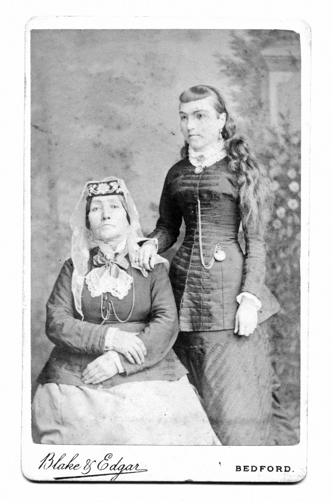
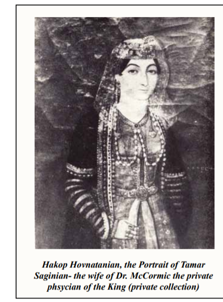

# Was Anna a Saginian?

The question of [Anna Saginian's](../people/anna-saginian.md) ethnic and family identity reveals the complex intersections of Georgian, Armenian, and Persian identities in nineteenth-century Iran. Her own testimony, corroborated by multiple sources, presents a fascinating case study in how families navigated ethnic boundaries in the multi-ethnic Qajar court society.

## Anna's Claims

In her **March 1880 oral interview** in Leicester (later transcribed and published as an appendix to the NYPL Burgess Persian Letters), Anna was unequivocal about her ancestry: *"My ancestors, on the sides of both parents, were Armenians, and I think for some time have lived in Tabriz."* She identified her father as **"Daoud Khan Seguinoff"** and described him as *"always in the military service of the Shah of Persia."*

The unusual spelling **"Seguinoff"** appears nowhere else in any historical records — it was likely the interviewer's attempt to phonetically capture Anna's pronunciation of an Armenian patronymic. This transcription artifact becomes significant when compared to other documentary evidence.

Anna positioned herself firmly within the Armenian community, noting that both her children were *"baptized in our house in Tehran, according to the Armenian rites"* and that her husband Edward was buried in the *"little lovely green Armenian cemetery just outside the walls of Tabriz."* She placed her family's graves there too: *"My dear father's grave is four or five English yards from it; it is among the graves of all my relations."*

Crucially, **Anna describes Edward's direct relationship with her father**: *"Edward Burgess asked for me of my father. I loved him even before we were married. Then we were married at my father's house."* This indicates Edward knew Daoud Khan personally and followed traditional marriage customs, asking permission from the father.

## Primary Sources

Anna's 1880 testimony forms the **cornerstone primary source** for the family's Armenian identity. In the [NYPL Burgess appendix interview](../sources/nypl-burgess-appendix-anna-interview.md), she provides a detailed family structure: six children total (two brothers, both merchants in Tabriz, both deceased by 1880; four sisters), with Anna as the eldest daughter. She confirms **Tamar** as her youngest sister: *"My youngest sister, Tamar, is the widow of Dr. Cormick."*

The family's integration into Tabriz's Armenian community appears complete. Anna describes extended family networks, Armenian marriage customs, and religious practices that suggest deep roots in that community by the 1850s.

## Then Into Tamar — Amazing!

Anna's identification of Tamar as her sister opens the door to **extraordinary corroborating evidence**. [Tamar Saginian](../people/tamar-saginian.md), widow of [Dr. William Cormick](../people/william-cormick.md) (the physician who met the Báb), appears throughout multiple independent source chains that confirm not only the sister relationship but the **Saginian surname** itself.

The [ConnectionsBMC genealogical material](../sources/corpus/connectionsbmc-saginian-interview/extracted.web.md) provides family research showing **"Tamar Daoudian, the daughter of Daoud Khan"** — the Armenian patronymic style (meaning "daughter of David") that parallels Anna's **"Seguinoff"** spelling in her transcribed interview. Both are patronymic variants attempting to render "daughter/son of David" in Latin script, not separate surnames, confirming the same father: **Daoud Khan**. The contrast between Anna's transcribed "Seguinoff" and the established **"Saginian"** found in all other documents suggests the interviewer was unfamiliar with Armenian naming conventions.

## Tamar as Saginian

The documentary evidence for Tamar's **Saginian** identity is remarkable. The renowned Armenian court painter **Hakop Hovnatanian** created an oil portrait specifically labelled **"Portrait of Tamar Saginian"** with the caption identifying her as *"the wife of Dr. McCormic the private physician of the King."* This is the same Hovnatanian who painted the Qajar royals — lending considerable weight to the attribution.

**Edward Burgess himself confirms the sister relationship** in his letter of February 21, 1854: *"Dr Cormick, with whom you were acquainted in England, and who married my wife's younger sister has been here since last October."* This contemporary testimony from Edward establishes the family connection independent of later sources.

Even more striking, **Armen Saginian's family memoir** *"Thank You, America & Americans"* (2022) — written by a great-great-grandson of Daoud Khan via the Gorgin Khan line — **explicitly identifies Tamar as Saginian** and names her as **"wife of William"**, confirming both the surname and the marriage connection. This book contains extensive genealogical charts and family photographs documenting the **Saginian lineage**.

## Then Contradictions

The contradictions emerge when we examine how **Edward Burgess described Anna** to his brother George in his letter of March 22, 1852. Edward called her *"a Georgian lady of good family and thank God she makes me a most kind agreeable and affectionate wife. She is pretty and about thirty three years old... She speaks Armenian and Turkish and writes the former so fast that to day she has written two letters for my one."*

This characterization seems to conflict directly with Anna's own 1880 testimony claiming **Armenian ancestry on both sides**. Yet Edward's description reveals he understood Anna's **linguistic fluency in Armenian** — she was writing Armenian correspondence for him.

The fact that Anna's **"Seguinoff"** appears nowhere in historical records raises additional questions: was this simply transcription error, or does it reflect how Anna herself pronounced her patronymic — perhaps indicating linguistic distance from standard Armenian or Georgian naming conventions?

The contradiction deepens when we examine testimony about **Daoud Khan himself**. The missionary **Joseph Wolff**, writing in 1845 about his 1843 encounter in Tabriz, described meeting *"Daoud Khan, a Colonel in the Russian service. He is a genuine Georgian, and as such is not very fond of the Armenians."* Yet paradoxically, in the same text, Wolff later refers to **"Daoud Khan the Armenian"** when listing his Tabriz acquaintances.

This creates a puzzle: Anna claims Armenian ancestry on both sides, Edward calls her Georgian, and Wolff describes Daoud Khan as both a "genuine Georgian" who dislikes Armenians and simultaneously as "the Armenian."

## Then Who Daoud Khan Would Have Been

The resolution lies in understanding **Daoud Khan's actual origins and trajectory**. Research documented in [saginashvili-georgian-archives.md](../sources/wishlist/saginashvili-georgian-archives.md) reveals that Daoud Khan Saginian was born **David Saginashvili** in **Tbilisi, Georgia, in 1790**. He served in the Russian army after the 1801 annexation of Georgia, then **fled to Qajar Iran around 1811** with his brother **Zaal Saginashvili** and companion Solayman Khan Saham al-Dowleh.

The key insight is that **in Iran, the family integrated into the Armenian community**. The Georgian surname **Saginashvili/Saginskilli** became the Armenian **Saginian**, and Daoud Khan rose to the rank of **Sartip (Brigadier General)** under Fath Ali Shah while operating within Armenian social and religious networks.

**Crucially, this is confirmed by a contemporary American missionary source**: Rufus Anderson's *History of the Mission* (1872) records that **"In May, 1845, the Shah... appointed Dawood Khan, of Tabriz, an Armenian from Georgia and an officer of the army, Governor of the Nestorians."** This independent witness, writing about diplomatic events, describes Daoud Khan using the exact same dual identity — **"an Armenian from Georgia"** — that resolves all the apparent contradictions in our sources.

**Modern academic research confirms the complete story**: David Yaghoubian's 2014 study, based on oral interviews with Daoud Khan's great-great-great-grandson Sevak Saginian, establishes that David Khan Saginian died in **1867** and was buried in the **Saginian family mausoleum** at Surb Astvatsatsin, Tabriz — the same cemetery where Anna placed Edward's grave within yards of her father's.

This explains all the contradictions:

- **Anna was "Armenian"** in the sense that she was raised within the Armenian community of Tabriz, practicing Armenian Christianity and embedded in Armenian social networks
- **Edward called her "Georgian"** because he understood her father's ethnic origins — information that would have been more readily available to European merchants in the Iranian court circles
- **Wolff met a "genuine Georgian"** because Daoud Khan was indeed Georgian-born, but Wolff's reference to him as "the Armenian" reflects how he was **socially positioned** in Tabriz by the 1840s
- **Daoud Khan "is not very fond of the Armenians"** as an ethnic Georgian, but paradoxically **lived as an Armenian** in Iran — a tension that would not have been uncommon among Georgian refugees who found safety and advancement through Armenian community networks

The **Saginian name** is therefore **genuinely Armenian** — not by ancestry, but by **community integration and social identity**. Anna was, in the most meaningful sense, both Georgian by paternal bloodline and Armenian by upbringing, community, and practice. In the context of nineteenth-century Iran, **social and religious identity often mattered more than ethnic ancestry**.

## Sources

### Primary documents
- **[Edward Burgess Letters (1827-1855)](../sources/corpus/burgess-persian-letters-full-volume/transcription.md)** — Edward's contemporary testimony:
  - **March 22, 1852**: *"I was married last autumn to a Georgian lady of good family... She speaks Armenian and Turkish and writes the former so fast"*
  - **February 21, 1854**: *"Dr Cormick... married my wife's younger sister"* (confirming Tamar connection)
  - **June 16, 1851**: *"she is a good horse-woman... she jumped beautifully"* (at Cheshma Ali)
- **[Anna's 1880 interview](../sources/nypl-burgess-appendix-anna-interview.md)** — Anna's own testimony:
  - *"My father, Daoud Khan Seguinoff, was always in the military service of the Shah"*
  - *"My ancestors, on the sides of both parents, were Armenians"*
  - *"Edward Burgess asked for me of my father... we were married at my father's house"*
  - *"My youngest sister, Tamar, is the widow of Dr. Cormick"*
- [Joseph Wolff, *Narrative of a Mission to Bokhara* (1845)](../sources/corpus/narrative-mission-bokhara/extracted.pdf.md) — contemporary description of Daoud Khan as Georgian who "is not very fond of the Armenians" yet later calls him "Daoud Khan the Armenian"
- [Rufus Anderson, *History of the Mission* (1872)](../sources/corpus/history-of-the-mission-by-rufus-anderson-5264293694/extracted.pdf.md) — **key contemporary source**: "Dawood Khan, of Tabriz, an Armenian from Georgia and an officer of the army"

### Corroborating evidence  
- [ConnectionsBMC Saginian interview material](../sources/corpus/connectionsbmc-saginian-interview/extracted.web.md) — family genealogy confirming Tamar Daoudian
- Hakop Hovnatanian portrait of **Tamar Saginian** (referenced in [Tamar's page](../people/tamar-saginian.md))
- [Armen Saginian family memoir](../sources/wishlist/saginian.md) — *Thank You, America & Americans* (2022)

### Research materials
- [Georgian National Archives research proposal](../sources/wishlist/saginashvili-georgian-archives.md) — documenting David Saginashvili's Georgian origins
- [Yaghoubian (2014), *Ethnicity, Identity, and the Development of Nationalism in Iran*](../sources/yaghoubian-2014-ethnicity-identity-nationalism-iran.md) — **academic confirmation**: David Khan Saginian born 1790 Tbilisi, died 1867 Tabriz, buried in Saginian family mausoleum at Surb Astvatsatsin; based on oral interviews with descendant Sevak Saginian
- [Sir Denis Wright, "Burials and Memorials of the British in Persia" (1998)](../sources/corpus/wright-burials-british-in-persia/transcription.md) — records Anna's 1892 burial in Tehran Armenian church; Edward's 1855 burial at Sourp Shoughakat Church, Tabriz

## People linked
- [Anna Saginian](../people/anna-saginian.md)
- [Daoud Khan Saginian](../people/daoud-khan-saginian.md)  
- [Tamar Saginian](../people/tamar-saginian.md)
- [Edward Burgess](../people/edward-burgess.md)
- [William Cormick](../people/william-cormick.md)

## Cemetery Evidence

The burial locations of the family provide additional confirmation of the integrated Armenian identity. **Daoud Khan died in 1867** and was buried in the **Saginian family mausoleum at Surb Astvatsatsin** (Holy Mother of God church), Tabriz — the principal Armenian cemetery outside the city walls.

**Edward Burgess** was buried in the same cemetery complex in **June 1855**. Anna's 1880 interview describes the proximity: *"My dear father's grave is four or five English yards from [Edward's grave]; it is among the graves of all my relations. And old Mr. & Mrs. Cormick and the Europeans are all buried there. The trees are very beautiful."*

This burial pattern reinforces the Armenian community integration: both the Georgian-born father and his English son-in-law rest in Armenian consecrated ground, surrounded by extended Armenian family networks. The **Saginian family mausoleum** remained in use for generations — Daoud Khan's grandson **Solayman Khan Saginian** (d. 1913) was also buried at Surb Astvatsatsin, demonstrating the continuity of Armenian religious identity across the family.

**Anna herself** was later buried in **Tehran at the Armenian church of SS. Thadeus and Bartholomew** (d. 8 January 1892, aged 77), according to Wright's burial records — again, Armenian ground, not Georgian Orthodox or Protestant burial.

## Related topics
- [Cemeteries in Iran](iran-cemeteries.md) — detailed burial locations and cemetery history
- [Persia](persia.md) — broader context of multi-ethnic Qajar society
- [Qajar Armenian Military](qajar-armenian-military.md) — Daoud Khan's military career
- [Surname: Saginian](surname-saginian.md) — the family name's evolution