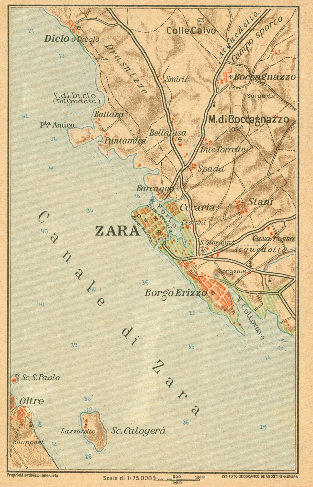

# Zara — interwar hotels, cafés, and industry

Under Italian rule (1920–1943), **Zara** (Zadar) was a free port — a sliver of Italian sovereignty on the Dalmatian coast, sustained by customs exemptions and maritime trade. **Antonio Zerauschek** built a commercial empire in this environment: hotels, cafés, a tobacco factory, a chocolate works, and import–export agencies that exploited the free-port franchise. When Allied bombing destroyed the city in 1943–44, he lost everything.

---

## The Caffè Centrale

The **Caffè Central** (later *Centrale*) opened on **14 November 1891** on the **Narodni trg** (People's Square), quickly becoming the social hub of Zara's Italian-speaking bourgeoisie.

In **1937–1938**, **Antonio Zerauschek** demolished the original building and commissioned the Trieste architect **Umberto Nordio** to design a new structure — a combined **hotel and café** on the same site. The ground-floor café reopened but, according to the Retrozadar chronicle, "never reached the old splendour" of the original. The Nordio building represented Antonio's ambition to transform Zara's hospitality trade from coffeehouse culture into modern tourism infrastructure.

## Hotel Bristol → Hotel Excelsior

The **Hotel Bristol** opened on **22 March 1902** in the **Borelli** palace. Around **1936**, Antonio Zerauschek took over the Bristol and renamed it the **Hotel Excelsior**. The **Caffè Savoja** (formerly at Donatia) later moved into the Excelsior complex.

## Other Zerauschek ventures

The hotels and cafés were only part of the picture. The **Difesa Adriatica** obituary (1973) records Antonio as a self-made man whose enterprises included:

| Venture | Detail |
|---------|--------|
| **Import–export** | Agencies covering flour to automobiles, enabled by the free-port tariff regime |
| **Manifattura Tabacchi Orientali** | Tobacco works; manufactured the **Calypso** cigarette brand |
| **Ausonia** | The first and only **chocolate factory** in Zara; provided local employment |

The obituary emphasizes the link between the free port and Antonio's ability to operate agencies that would not have been viable under standard Italian tariffs.

## The Caffè Cererija (1914)

An earlier venture: in **1914**, Zerauschek took over the **Cererija** café. The Retrozadar chronicle notes cryptically that "war misfortunes" intervened — likely a reference to World War I disruption.

## Loss and exile

Before the war, Antonio had designed a new house for the family. He never lived in it. The **Allied bombing campaign** of 1943–44 devastated Zara, and the Zerauscheks fled. The obituary describes "the anguish of leaving" under bombardment. Antonio resettled in **Florence**, where he died in the last days of **February 1973**, aged **eighty-four**, roughly eighteen months after his wife **[Ester Addobbati](../stories/addobbati-dalmatian-habsburg.md)**.

Before the war, Antonio had been active in Zara's civic life: the **Società Ginnastica** balls (where he was known as a dancer), the **Circolo Arturo Colautti**, and broader Italian irredentist patriotic circles.

## Family

- **[Antonio Zerauschek](../people/antonio-zerauschek.md)** (24 Jun 1889, Zara – Feb 1973, Florence)
- Wife: **Ester Addobbati** — connecting the Zerauschek commercial family to the [Addobbati civic lineage](../stories/addobbati-dalmatian-habsburg.md)
- Daughter: **[Fulvia Zerauschek](../people/fulvia-zerauschek.md)** — married **[David John Lewis](../people/david-john-lewis.md)**, bridging the Dalmatian and Welsh lines
- Villa Ester at Sirmione: [stories/zerauschek-villa-callas-sirmione.md](../stories/zerauschek-villa-callas-sirmione.md)

## Zara's café landscape (context)

The Retrozadar survey places the Zerauschek ventures within a rich café culture stretching back to Habsburg times:

- **Kavana Stefanija** (1890) — designed by **Marcocchije**, the same architect who built the original Central a year later
- **Grand Hotel** — Calle Larga / Papuzzeri
- **Caffè Lloyd / Italia** — on the riva
- **Caffè al Giardino** — visited by **Emperor Franz Joseph** in **1875**

## Sources

| Source | Location |
|--------|----------|
| Retrozadar — Povijest kavana u Zadru | [corpus](../sources/corpus/retrozadar-povijest-kavana-u-zadru/) · [extract](../sources/corpus/retrozadar-povijest-kavana-u-zadru/extracted.web.md) |
| *Difesa Adriatica* obituary (1973) | [scan](../media/docs/Difesa%20Adriatica%201973%20Antonio%20Zerauschek%20obituary%20Zara%20Florence.jpeg) · [Italian transcript](../sources/corpus/difesa-adriatica-1973-antonio-zerauschek-obituary/transcription-antonio-zerauschek-obituary-1973.it.md) · [English translation](../sources/corpus/difesa-adriatica-1973-antonio-zerauschek-obituary/translation-antonio-zerauschek-obituary-1973.en.md) |
| Slobodna Dalmacija — Kavane Zadar (dio 2) | [corpus](../sources/corpus/slobodna-dalmacija-kavane-zadar-dio-2-curl-mirror/) (Cloudflare-blocked; incomplete extract) |
| Zerauschek collection scans | [media/collections/zerauschek/](../media/collections/zerauschek/) |

## Narratives

- [Zara — Antonio Zerauschek (interwar)](../stories/zerauschek-zadar.md)
- [Addobbati: Venetian-Dalmatian civic family](../stories/addobbati-dalmatian-habsburg.md)
- [Villa Ester — from the Zerauscheks to Maria Callas](../stories/zerauschek-villa-callas-sirmione.md)
