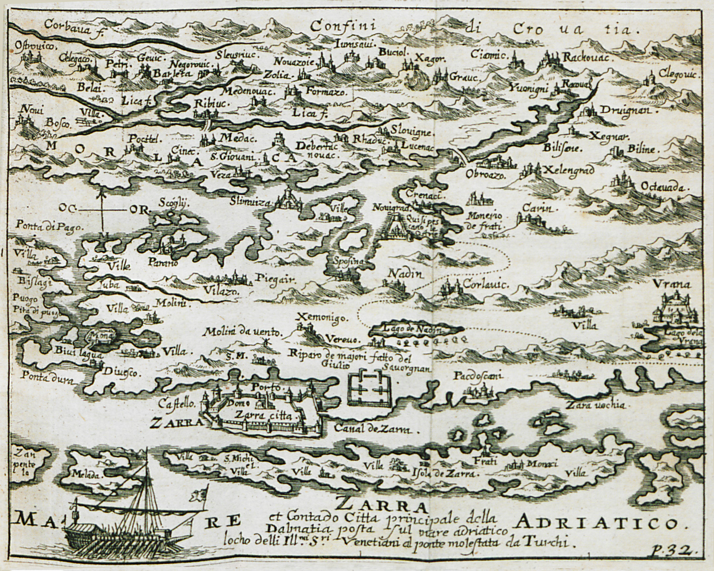
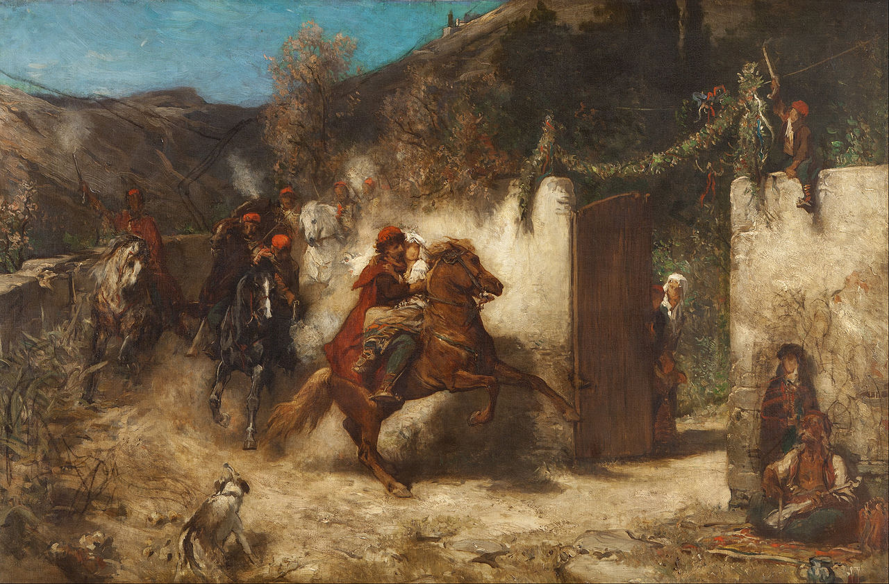
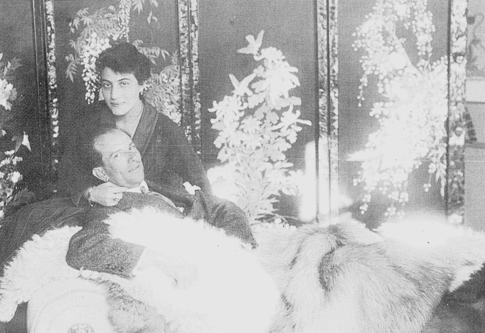

# Zara — Italian Dalmatia

**Zara** — today the Croatian city of **Zadar** — was a walled Adriatic port that passed from Venice to Austria, from Austria to France and back, and finally to Italy before being destroyed by Allied bombing in 1943–44 and ceded to Yugoslavia in 1947. Two families in this tree are embedded in that history: the **Addobbati**, Venetian-origin civic notables who arrived as cavalry officers in the 1730s and accumulated legal, ecclesiastical, and political standing across a century; and the **Zerauschek** line, whose patriarch **Antonio** built an interwar empire of hotels, cafés, and factories under Zara's Italian free-port regime — and lost it all under the bombs.

Their daughter **Fulvia Zerauschek** married **David John Lewis**, bridging the Dalmatian and Welsh lines and carrying the stories of both families into the present.

---

## A city between empires

Zara's identity was shaped by its position as the administrative capital of Dalmatia under successive rulers. Under the **Republic of Venice** (1409–1797), it served as the seat of the Venetian *provveditore generale* — the governor of the entire Dalmatian coast. The city's civic life was organised around a Venetian-style hierarchy: a **patriciate** (*Libro d'Oro*), a **citizen council** (*cittadini originari*), and a wider population of merchants, artisans, and fishermen. Italian was the language of law, administration, and culture; Croatian dominated the hinterland.

When Venice fell to Napoleon in 1797, Dalmatia passed briefly to **Austria**, then to **France** (1806–1813) under the Illyrian Provinces, then back to Austria after the Congress of Vienna. Habsburg rule lasted until 1918. Throughout these changes, the Italian-speaking urban elite — the class to which both the Addobbati and, later, the Zerauscheks belonged — maintained its social position, even as Croatian national consciousness grew in the countryside and the smaller towns.

After the First World War, the **Treaty of Rapallo (1920)** assigned Zara to Italy as a tiny enclave surrounded by the new Kingdom of Serbs, Croats, and Slovenes. The city became a **free port** — its customs exemptions the economic engine that sustained Italian sovereignty over a population of barely 20,000. This was the world Antonio Zerauschek exploited and the world the Allied bombing of 1943–44 destroyed.

---

## The Addobbati — civic family

The Addobbati came to Zara from the Venetian mainland as **cavalry officers** in the 1730s. They were admitted to the Zadar *cittadini* council in **1733** and backed their claim with a **1745 genealogical testimonial from Bergamo** tracing the family to the fifteenth century.

Over the next century the family accumulated markers of civic standing: **Dr. Petar Addobbati** received the papal **[Order of the Golden Spur](order-golden-spur.md)** in **1786**; two brothers were inscribed as **nobles of [Nin](nin-noble-council.md)** in **1804**; the family maintained a notarial register, held postal contracts, and signed petitions defending Italian language rights. Their papers — now the **Addobbati fonds (HR-DAZD-342)** at the State Archive in Zadar — preserve the 1817 Habsburg petition, the Golden Spur diploma, and genealogical documents stretching back to the fifteenth century.

The Addobbati were *cittadini*, not patricians — a distinction that mattered. In Zadar they sat below the *Libro d'Oro* families; in Nin they held noble status. When the Habsburgs adjudicated Dalmatian nobility in 1817, they recognised Zadar's patriciate but rejected Nin's communal council, leaving the Addobbati caught between two registers.

---

## The Zerauscheks — interwar Zara

**[Antonio Zerauschek](../people/antonio-zerauschek.md)** (1889–1973) was the son of a carpenter who became one of Zara's most prominent businessmen under Italian rule. He took over the **Caffè Cererija** in 1914, acquired the **Hotel Bristol** (renaming it the **Hotel Excelsior**) around 1936, and in 1937–38 demolished the historic **Caffè Centrale** on the Narodni trg to build a new Nordio-designed hotel and café. His enterprises extended beyond hospitality: the **Manifattura Tabacchi Orientali** (producing the Calypso cigarette brand), the **Ausonia** chocolate factory, and import–export agencies spanning flour to automobiles — all made possible by the free-port tariff regime.

Antonio married **[Ester Addobbati](../people/ester-addobbati.md)**, connecting the Zerauschek commercial family to the older Addobbati civic lineage. Their daughter **[Fulvia](../people/fulvia-ottilia-antonia-zerauschek.md)** grew up in this world of Italian Dalmatian bourgeois life — the Società Ginnastica balls, the Circolo Colautti, the waterfront cafés — before the war swept it all away.

---

## Destruction and exile

The **Allied bombing campaigns of 1943–44** devastated Zara. Antonio's obituary in the *Difesa Adriatica* (1973) describes "the anguish of leaving" under bombardment. The family fled to Italy; Antonio resettled in **Florence**, where he died in February 1973, eighteen months after Ester. Their son **[Riccardo](../people/riccardo-zerauschek.md)** spent years in displaced persons processing at Trieste before eventually reaching Florence. The exile community — the *esuli dalmati* — sustained itself through newspapers, mutual aid associations, and the collective memory of a city that had ceased to exist in its Italian form.

The Italian Dalmatian exodus is covered in [Esuli Dalmati — Zara and exile](esuli-dalmati-zara-exile.md).

---

## Anchor people

| Person | Note |
|--------|------|
| [Antonio Zerauschek](../people/antonio-zerauschek.md) | Interwar investor; Fulvia's father |
| [Ester Addobbati](../people/ester-addobbati.md) | Wife; links Addobbati narrative to Zerauschek |
| [Fulvia Ottilia Antonia Zerauschek](../people/fulvia-ottilia-antonia-zerauschek.md) | Bridge to [David John Lewis](../people/david-john-lewis.md) |
| [Pietro Pio Addobbati](../people/pietro-pio-addobbati.md) | Addobbati trunk |
| [Antonio Zerauschek (senior)](../people/antonio-zerauschek-senior.md) | Carpenter line; father of the hotel Antonio |
| [Tatiana Machiedo](../people/tatiana-machiedo.md) | [Riccardo](../people/riccardo-zerauschek.md)'s wife; Hvar Machiedo pedigree |

**Parish / civil images:** [media/collections/zerauschek/](../media/collections/zerauschek/)

---

## Stories

| Essay | Scope |
|--------|------|
| [Zara — Antonio Zerauschek (interwar)](../stories/zerauschek-zadar.md) | Hotels, cafés, obituary context |
| [Villa Ester — from the Zerauscheks to Maria Callas](../stories/zerauschek-villa-callas-sirmione.md) | Sirmione villa: ownership chain to Meneghini/Callas |
| [Addobbati: Venetian-Dalmatian civic family](../stories/addobbati-dalmatian-habsburg.md) | *Cittadini*, Nin, DAZD, postal/protest context |

## Topics

- [Nin — the noble council of a Dalmatian commune](nin-noble-council.md)
- [Zara interwar hotels and cafés](zadar-interwar-hotels.md)
- [*Il Signor Max* (1937) — Samos cigarettes on screen](il-signor-max-1937.md)
- [Order of the Golden Spur](order-golden-spur.md)
- [Esuli Dalmati — Zara and exile](esuli-dalmati-zara-exile.md)

### Surname studies

- [Addobbati](surname-addobbati.md) — "the adorned ones"; Bergamo to Dalmatia; 67 bearers worldwide
- [Zerauschek](surname-zerauschek.md) — Germanised Slavic "ember"; 14 bearers worldwide
- [Boara](surname-boara.md) — Italian "oxherd" (Latin *bovarius*); Veneto to Dalmatia

---

## Sources

| Source | Location |
|--------|----------|
| Fulvia Zerauschek — family history memoir (1996) | [source card](../sources/famhist-nonna-memoir-1996.md) |
| *Difesa Adriatica* — Antonio Zerauschek obituary (1973) | [source card](../sources/difesa-adriatica-1973-zerauschek-obituary.md) |
| Sabalich — *Guida archeologica di Zara* (1897) | [source card](../sources/sabalich-guida-zara.md) |
| DAZD Addobbati family fonds (HR-DAZD-342) | [source card](../sources/dazd-addobbati-family-fonds.md) |
| Granić — Nin noble list 1817 | [source card](../sources/granic-nin-noble-list-1817.md) |
| ITS/IRO — Riccardo Zerauschek displaced persons file | [source card](../sources/its-iro-riccardo-zerauschek-1951.md) |
| Venetian *cittadini originari* (Ca' Foscari) | [source card](../sources/venetian-cittadini-originari-ch3.md) |
| Kovačić 2014 — Machiedo family of Hvar | [source card](../sources/kovacic-2014-rod-machiedo-hvar.md) |

---

## Related

- [David John Lewis](../people/david-john-lewis.md) — Fulvia's husband; the Welsh line
